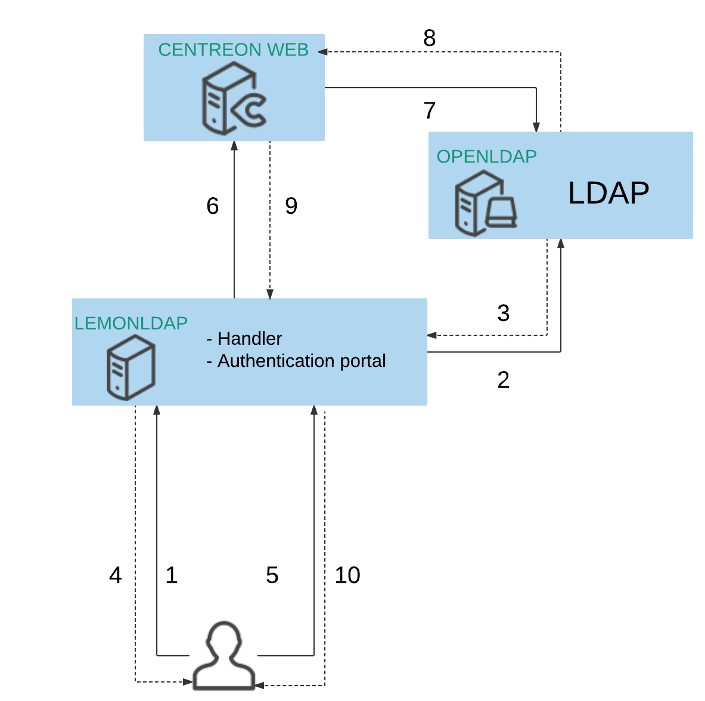

## Example of SSO architecture

Here is an example of SSO architecture with LemonLDAP :



1. The user signs in to the SSO authentication portal.

2. The authentication portal checks user access on the LDAP server.

3. The LDAP server returns user information.

4. The authentication portal creates a session to store user information and returns an SSO cookie to the user.

5. The user is redirected to Centreon Web and caught by the SSO handler which checks user access.

6. The SSO handler sends a request to Centreon Web with the login header (i.e HTTP_AUTH_USER).

7. Centreon Web checks user access on LDAP server using the login header.

8. The LDAP server returns user information.

9. Centreon Web returns information to the handler.

10. The SSO handler transfers information to the user.

## Configurer une authentification par SSO

1. SSO is managed by Apache: edit the Apache configuration to include the settings you want.

2. Fill in the following fields on page **Administration > Parameters > Centreon UI** (section **Authentication properties**).

    - **Enable SSO authentication**: enable or disable SSO authentication.
    - **SSO mode**:
        - **SSO only**: users must authenticate using SSO (users that are not trusted clients will be blocked)
        - **Mixed**: users that are not trusted clients can log in to Centreon using their login/password. You still need to fill in the **SSO trusted client addresses** field.
    - **SSO trusted client addresses**: which IPs/DNSs will be allowed to connect using SSO (for example, a reverse proxy). Use commas between addresses.
    - **SSO blacklist client addresses**: which IPs/DNSs will not be allowed to connect using SSO.
    - **SSO login header**: the variables of the header that will
    be used as a login (i.e HTTP\_AUTH\_USER).
    - **SSO pattern matching login**: a pattern to search for in
    the username. For instance, type **/@.\*/** to find the end of the email address in your login.
    - **SSO pattern replace login**: the string that will replace the string defined in the **SSO pattern matching login** field. Leave **SSO pattern replace login** blank to delete the string found by **SSO pattern matching login**.

> SSO feature is only to be enabled in a secured and dedicated environment for
> SSO. Direct access to Centreon UI from users have to be disabled.

## Configuration example

Here is an example of Apache configuration for Kerberos (from file **/etc/httpd/conf.d/10-centreon.conf**):

```
 <Location /centreon>
        AuthType Kerberos
        AuthName "Kerberos Login"
        KrbServiceName HTTP/supervision.int.centreon.com
        RequestHeader set X-Remote-User %{REMOTE_USER}s
        KrbMethodNegotiate On
        KrbMethodK5Passwd Off
        KrbSaveCredentials Off
        KrbVerifyKDC On
        KrbAuthRealms SUPERVISION.INT
        Krb5KeyTab /opt/rh/httpd24/root/etc/httpd/conf/centreon.keytab
        <RequireAny>
                # Allow this IP without auth
                Require ip xx.xx.xx.xx xx.xx.xx.xx xx.xx.xx.xx
                # Everyone else needs to authenticate
                Require valid-user
        </RequireAny>
   </Location>
   ```