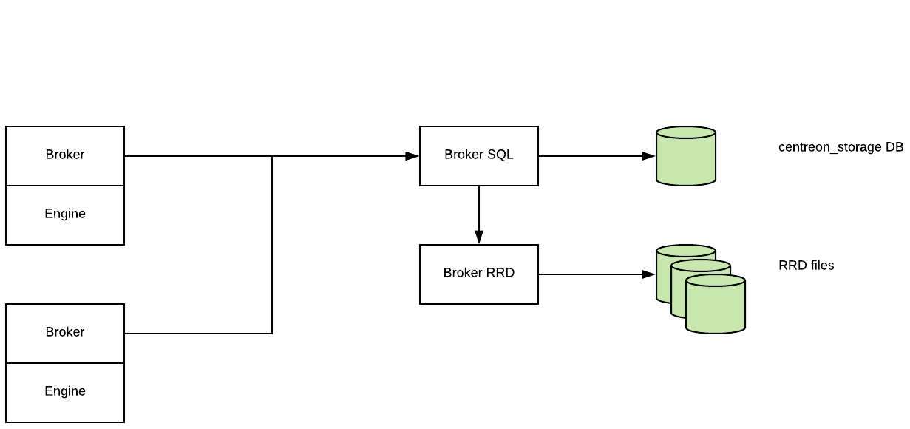
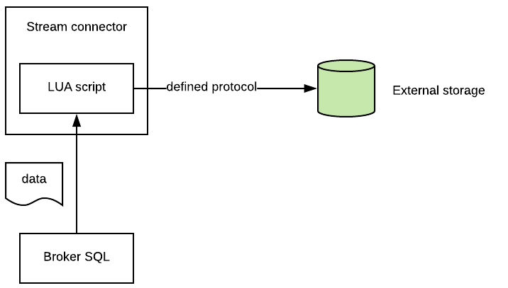
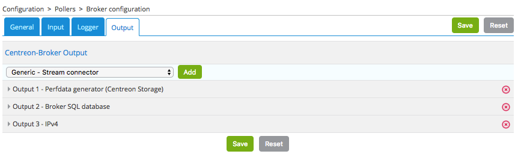
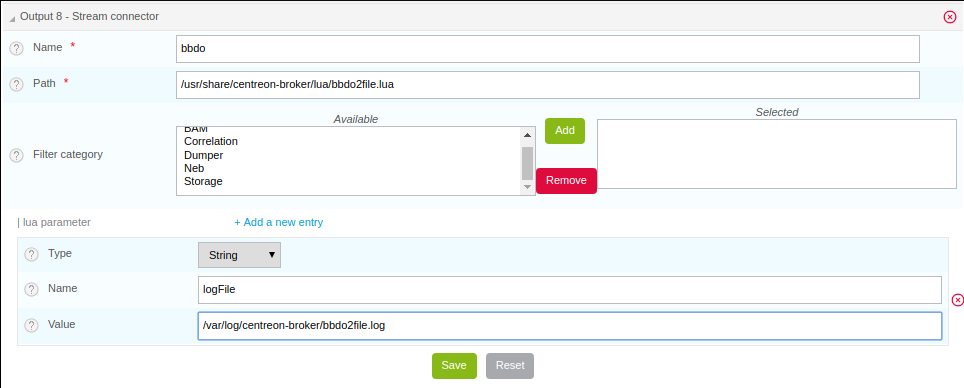

## Overview

Centreon Stream Connector is a feature introduced in Centreon 3.4.6. It allows one to export Centreon data (events and
metrics) to an external storage or application such as ElasticSearch, Splunk, InfluxDB, files, etc.

In a Centreon platform, the component that carries information between the remote pollers and the Centreon central
server is called Centreon Broker. This broker stores received data into the Centreon local storage: MariaDB and RRDtool.

The following diagram explains the transfer of collected data and insertion into storages:


The Stream Connector functionality is a new Centreon Broker output getting data from Centreon Broker Master (also known
as Centreon Broker SQL) to aggregate and forward it to external storage:



This output loads a Lua script called a Stream Connector, which job is to handle, aggregate and enrich the data before
forwarding it to the defined protocol:



Because it is an output of Centreon Broker, the principle of creating retention files upon interrupting external storage
access is retained. In the same way, it is possible to filter input on the categories of flow to handle.

## Requirements

### Software requirements

To use the Centreon Stream connector functionality you need at least the Centreon version 3.4.6:

* Centreon Web >= 2.8.18
* Centreon Broker >= 3.0.13
* Lua >= 5.1.x

> It is strongly advised to use the **last versions of Centreon software**.

### Programming language

Centreon chose the Lua programming language to let you handle, aggregate and transfer data. Lua is a lightweight programming language
that is easy to use. You can find more information with the [Lua official documentation](https://www.lua.org/docs.html).

Some hints and explanations will be given in this document, but we strongly suggest that you first follow a Lua tutorial (such as [this one](https://www.lua.org/pil/1.html)) particularly if you have little programming experience.

## Creating a basic Lua Stream Connector script

The complete technical documentation is available [here](developer-broker-stream-connector.html).
In this how-to, we will write two scripts:

* The first one, easy, that explains the basics of Stream Connectors. Its goal is to export data to a log file.
* The second one is more exigent for the reader, it exports performance data to the TSDB InfluxDB but is easily
  adaptable to export to another TSDB.

### Write data in JSON format in the log file

Let's start with the first script. Our goal is to store all events received by Broker in a log file. We will call our
stream connector `bbdo2file.lua`.

As we said previously, we will store this file into the `/usr/share/centreon-broker/lua` directory on the Centreon
central server.

#### Log functions

Centreon Broker provides several log functions to write logs, warnings or errors into a file. We will use one of these
functions `info()` to write Broker events. [See technical documentation for more information](developer-broker-stream-connector.html#the-broker_log-object)

The function `info()` makes part of the *broker_log* object. To call it, the syntax is the following:

```LUA
broker_log:info(level, text)
```

* `level` is an integer from 1 (most important) to 3 (least important).
* `text` is the text to write as log.

> Did you notice the separator between `broker_log` and `info`, yes it is a colon! Objects functions, also called
*methods* are called like this in Lua.

Let's start writing our script. The most important function in a stream connector is the `write()` function. Each time an
event is received from a poller through Broker, this function is called with the event as an argument.

> You will never have to call the `write()` function by yourself, it is always Broker's work to do so. And it would
> be a fault to make such a call. In other words, there should not be any call to the `write()` function in your script.
> [See technical documentation for more information](developer-broker-stream-connector.html#the-write-function)

#### Encoding to JSON

In order to have the highest amount of information and keep it human-readable at the same time, we are going to print the whole event object encoded as JSON in the log file. 

It can easily be done thanks to [broker table's `json_encode` function](developer-broker-stream-connector.html#the-broker-table).

Here is our first version of `bbdo2file.lua`:

```LUA
function init(conf)
  broker_log:set_parameters(3, "/var/log/centreon-broker/bbdo2file.log")
end

function write(d)
  broker_log:info(3, "Event received: " .. broker.json_encode(d))
  return true
end
```

> Information about the initialization of the Broker's log function and its parameters are given in the
> [technical documentation](developer-broker-stream-connector.html#the-broker_log-object).

> You can notice that `broker.json_encode(d)` is made of `broker` and `json_encode(d)` separated by a *dot* and not a *colon*. This is because `broker` is not a Lua object. In fact, you can see it as a functions set provided by *Centreon Broker*.

#### Explanation

Let's explain what we are doing in this script.

We must provide an `init()` function, it is described in the [technical documentation](developer-broker-stream-connector.html#the-init-function)

This function is called during the stream connector initialization. Here, we use it to initialize the `broker_log`
object. To achieve this, we call the `broker_log::set_parameters()` method that needs two parameters :

* A max level (from 1 to 3). If you give 2 here, only logs of levels 1 and 2 will be written in the log file.
* A file to write the logs in. This file must be in a writable directory for the `centreon-broker` user.

The second function is the `write()` function. We already said its argument is a Broker event. This type of object
is a collection of keys/values. For example:

```JSON
{
    "check_hosts_freshness": false,
    "active_host_checks": true,
    "category": 1,
    "event_handlers": true,
    "instance_id": 1,
    "last_command_check": 1522836592,
    "type": 65552,
    "global_service_event_handler": "",
    "obsess_over_services": false,
    "passive_service_checks": true,
    "last_alive": 1522836593,
    "active_service_checks": true,
    "check_services_freshness": true,
    "flap_detection": false,
    "global_host_event_handler": "",
    "notifications": true,
    "obsess_over_hosts": false,
    "passive_host_checks": true,
    "element": 16
}
```

In all events, you will find *category*, *element* and *type*.

* Information about the *category* can be found [here in the BBDO documentation](developer-broker-bbdo.html#event-categories.html)
* The *element* is the *sub-category* (also called *type* in the BBDO documentation).
* The *type* is a number built from the *category* and the *element* (binary concatenation).

In this example, the *category* is 1 and the *element* is 16. So, by reading the documentation, we can say this event
is a NEB (Nagios Event Broker) event with sub-category *instance-status*.

Each of these event data member can be accessed this way: `d.category`, `d.element` and so on...

Once your file `/usr/share/centreon-broker/lua/bbdo2file.lua` is ready, make sure it is readable by the
`centreon-broker` user (or the `centreon-engine` user who is the owner of the `centreon-broker` group), if it is
not the case, as root you can enter:

```Shell
chown centreon-engine:centreon-engine /usr/share/centreon-broker/lua/bbdo2file.lua
```

Then configure the new output into Centreon Web interface in **Configuration > Pollers > Broker configuration > Central Broker**.
In **Output** tab select **Generic – Stream connector** and click **Add**:



Define the name of this output and the path to the Lua connector:


Then click **Save** and go to generate the configuration and restart `cbd`.

Once the Centreon Broker will be restarted on your Centreon central server, data will appear in your
`/var/log/centreon-broker/bbdo2file.log` log file:

```text
Tue Jan 19 09:12:16 2021: INFO: Event received: {"_type":65552,"check_hosts_freshness":false,"active_host_checks":true,"category":1,"event_handlers":true,"instance_id":1,"last_command_check":1611043935,"global_service_event_handler":"","obsess_over_services":false,"passive_service_checks":true,"last_alive":1611043936,"active_service_checks":true,"check_services_freshness":true,"flap_detection":true,"global_host_event_handler":"","notifications":true,"obsess_over_hosts":false,"passive_host_checks":true,"element":16}
```

> Warning: This log file will grow very quickly, do not forget to add a log rotate or to disable it if you are only testing.

Isn't it a pretty nice outcome for only 7 lines of code?

### Writing the data in a custom file

Logs are meant to provide a history of the processing, not to store data. So we are now going to:

* Store raw events data into a separate file
* Keep track only of `element` and `category` fields of the processed events in the log file

#### Handling the custom file

Writing into a file in LUA is not much different from other languages, you will need:

* a file descriptor
* a call to an `open()` function to open the file and allocate the file descriptor
* minimal error handling to make sure the file is writable
* a call to a `write()` function
* a call to a `close()` function to close the file and free the file descriptor

> We will use a global variable (`data_file`) to store the data file name and define a `writeIntoFile` function to make it clearer in the connector's code (see code below).

The `io.open()` function returns two variables, a first variable `file` that is a *file descriptor* used to access the file and a second variable not always defined that contains the error message if any error occurs or `nil` (not defined) otherwise.

#### Formatting the log message

As we have seen earlier, the data members from the event object can be accessed with this syntax: `d.<member_name>`.

We are going to log each event with this message format: `"Event received of category " .. d.category .. " and element " .. d.element .. "."`.

Resulting in log messages looking like:

```text
Tue Jan 19 10:58:18 2021: INFO: Event received of category 1 and element 16.
```

#### Code

The LUA code corresponding to what has been stated above is:

```lua
data_file = '/var/log/centreon-broker/bbdo2file.data'

function writeIntoFile(output)
  local fd, err = io.open(data_file, 'a')
  if fd == nil then
    broker_log:error(1, "Couldn't open file: " .. err)
  else
    fd:write(broker.json_encode(output) .. "\n")
    fd:close()
  end
end

function init(conf)
  broker_log:set_parameters(3, "/var/log/centreon-broker/bbdo2file.log")
end

function write(d)
  broker_log:info(2, "Event received of category " .. d.category .. " and element " .. d.element .. ".")
  writeIntoFile(d)
  return true
end
```

### Handling parameters

Now let's assume that we want to be able to change both log and data files' paths as well as the log level without changing the LUA code every time. Centreon's Stream Connectors LUA SDK provides the ability to pass parameters from the configuration WUI.

#### Setting a parameter

These parameters are accessible from the `init()` function (see [technical documentation](developer-broker-stream-connector.html#the-init-function)).

Edit your Broker output to declare parameters:



Then click **Save** and export the central server's configuration and restart `cbd.service`.

#### Using parameters

The `conf` table, which is passed as an argument to the `init()` function, now has a `logFile` key defined from the web interface. We will be able to use it with this expression: `conf.logFile`.

> It is necessary that the name of the parameter in the web interface matches the key name of the `conf` table we are using in the LUA script.

Since the `conf` table is only given as an argument to the `init()` function, the parameters have to be stored in a global variable in order to use them. In our example we will use an *associative array* named `stored_parameters`, and the parameters will then we accessible from any function by this expression: `stored_parameters.<parameter_name>`.

#### Code 

So it is time to improve our Stream Connector:

```LUA
stored_parameters = {}

function writeIntoFile(output)
  local data_file = '/var/log/centreon-broker/bbdo2file.data'

  if stored_parameters.dataFile then
    data_file = stored_parameters.dataFile
  end
  local fd, err = io.open(data_file, 'a')
  if fd == nil then
    broker_log:error(1, "Couldn't open file: " .. err)
  else
    fd:write(broker.json_encode(output) .. "\n")
    fd:close()
  end
end

function init(conf)
  local log_file, log_level

  -- handling the log-related  parameters
  if conf.logFile then
    log_file = conf.logFile
  else
    log_file = "/var/log/centreon-broker/bbdo2file.log"
  end

  if conf.logLevel then
    log_level = conf.logLevel
  else
    log_level = 1
  end

  broker_log:set_parameters(log_level, log_file)
  broker_log:info(0, "init: Starting BBDO2FILE StreamConnector (log level: " .. log_level .. ")")

  -- storing other parameters
  for key, value in pairs(conf) do
    -- value is equal to conf.key
    broker_log:info(1, "New parameter: " .. key .. " has " .. value .. " for value.")
    stored_parameters[key] = value
  end

end

function write(d)
  broker_log:info(2, "Event received of category " .. d.category .. " and element " .. d.element .. ".")
  writeIntoFile(d)
  return true
end
```

#### Explanation

This `init()` function's behaviour is that the default log file is `/var/log/centreon-broker/bbdo2file.log` and the default log level is `1`, but if one of these parameters is defined otherwise in the WUI, then the parameters will overload the default values. 

> Applying the desired log path and log level has to be done before anything else, in order to be able to log any other execution information the way it is expected.

Once the logging options have been set, the `init()` function stores the others parameters to the global array.

### Filtering events

Here, we continue to improve our stream connector by choosing which events to export and also by improving outputs.

We will select only the NEB category and the events regarding hosts and services status.

We know that [NEB](/developer/developer-broker-bbdo.html#neb) is the category 1, also [service status](/developer/developer-broker-mapping.html#service-status) is the sub-category 24, whereas [host status](/developer/developer-broker-mapping.html#host-status) is the sub-category 14.

So, only events with the following criteria are interesting for us:

* `category` = 1 and `element` = 14 or
* `category` = 1 and `element` = 24

To filter certain types of events, we used to recommend defining a function called `filter()` but **it has revealed that its usage caused retention issues**, so we will apply our filters **at the beginning of the `write()` function**.

To skip an event, we just have to return `true` thus exiting the `write()` function.

Let's add this filter (only the `write` function needs to be modified):

```LUA
function write(d)

  -- exit as soon as possible if the event is not relevant
  if not (d.category == 1 and (d.element == 14 or d.element == 24)) then
    return true
  end

  broker_log:info(2, "Event received of category " .. d.category .. " and element " .. d.element .. ".")
  writeIntoFile(d)
  return true
end
```

If you modify the previous version of the script by just replacing the `write()` function with this new one, you will only log *host status* and *service status* events.

### Send only relevant data

Now let's say:

* only a few of the available information is relevant
* we want the objects' (hosts and services) names instead of their ids

First we'll see how we can get the objects' names, and then how to format our own JSON structure.

#### Using the broker cache functions to provide host and service names instead of IDs

NEB *host status* and *service status* events provide almost all the information we want but some of the most important are missing: **host names and service descriptions**.

To get those two information, we will have to use [the `broker_cache` object](developer-broker-stream-connector.html#the-broker_cache-object). This cache is filled when pollers are restarted or reloaded. So, do not forget to restart your pollers if you want something in your `broker_cache` object!

If the cache is correctly filled, it is easy to get a host name from the host id:

```LUA
local host = broker_cache:get_host(host_id)
local host_name = host.name
```

And it is also easy to get the service description from the host id and service id:

```LUA
local service = broker_cache:get_service(host_id, service_id)
local service_description = service.description
```

> Both `broker_cache:get_service` and `broker_cache:get_host` functions are available only since the version 2 of the broker cache API has been released. That means since centreon-broker 20.04.12 and/or 20.10.3 ([see release notes](../releases/centreon-core.html#centreon-broker-release-notes)) and it needs the following statement in the LUA script: `broker_api_version = 2`.


To make the `write()` function the leaner possible we are going to declare two intermediate functions: `get_hostname` and `get_service_description` (see below).

#### Sending data as an object with its own structure

Until now we have stored the whole event objects *as is* in the destination file. Now let's design our own event data structure, containing the following information: 

* `host`: the host's name
* `service`: the service's name if applicable, else the "HOST" string
* `state`: the numeric code of the current state (0 for *OK*, 1 for *WARNING* etc.)
* `state_type`: the type of the state (0 for *SOFT*, 1 for *HARD*)
* `message`: the output message from the plugin

We will declare an associative array named `event` and fill it with these fields.

#### Script code

Let's complete our Lua script:

```LUA
broker_api_version = 2
stored_parameters = {}

function get_hostname(host_id)
  local host = broker_cache:get_host(host_id)
  if host and host.name then
    return host.name
  else
    broker_log:warning(1, "No host name found in cache for host_id " .. host_id)
    return host_id
  end
end

function get_service_description(host_id, service_id)
  local service = broker_cache:get_service(host_id, service_id)
  if service and service.description then
    return service.description
  else
    broker_log:warning(1, "No service description found in cache for host_id/service_id " .. host_id .. "/" .. service_id)
    return service_id
  end
end

function writeIntoFile(output)

  local data_file = '/var/log/centreon-broker/bbdo2file.data'
  if stored_parameters.dataFile then
    data_file = stored_parameters.dataFile
  end
  local fd, err = io.open(data_file, 'a')
  if fd == nil then
    broker_log:error(1, "Couldn't open file: " .. err)
  else
    fd:write(broker.json_encode(output) .. "\n")
    fd:close()
  end
end

function init(conf)
  local log_file, log_level

  -- handling the log-related  parameters
  if conf.logFile then
    log_file = conf.logFile
  else
    log_file = "/var/log/centreon-broker/bbdo2file.log"
  end

  if conf.logLevel then
    log_level = conf.logLevel
  else
    log_level = 1
  end

  broker_log:set_parameters(log_level, log_file)
  broker_log:info(0, "init: Starting BBDO2FILE StreamConnector (log level: " .. log_level .. ")")

  -- storing other parameters
  for key, value in pairs(conf) do
    broker_log:info(1, "New parameter: " .. key .. " has " .. value .. " for value.")
    stored_parameters[key] = value
  end

end

function write(d)

  if not (d.category == 1 and (d.element == 14 or d.element == 24)) or not d.host_id then
    return true
  end

  local event = {}
  local host_name = ""
  local service_desc = ""
  if d.host_id then
    host_name = get_hostname(d.host_id)
    event.host = host_name
    if d.service_id then
      service_desc = get_service_description(d.host_id, d.service_id)
    else
      service_desc = "HOST"
    end
    event.service = service_desc
  end

  event.message = d.output
  event.state = d.state
  event.state_type = d.state_type

  broker_log:info(2, "Event received for host " .. host_name .. " and service " .. service_desc .. ".")
  writeIntoFile(event)

  return true
end
```

#### Explanation and results

As you can read, the `event` array has been declared with this instruction: `local event = {}` and it is simply fed by declaring `event.<key> = <value>`.

The `/var/log/centreon-broker/bbdo2file.log` file will now contain:

```text
Thu Jan 21 11:10:05 2021: INFO: Event received for host CENTREON and service Connections-Number.
Thu Jan 21 11:10:10 2021: INFO: Event received for host CENTREON and service Myisam-Keycache.
Thu Jan 21 11:10:10 2021: INFO: Event received for host CENTREON and service Queries.
Thu Jan 21 11:10:20 2021: INFO: Event received for host CENTREON and service Load.
Thu Jan 21 11:10:20 2021: INFO: Event received for host CENTREON and service proc-broker-rrd.
Thu Jan 21 11:10:25 2021: INFO: Event received for host CENTREON and service proc-centengine.
Thu Jan 21 11:10:25 2021: INFO: Event received for host CENTREON and service proc-httpd.
```

```json
{"message":"OK: Client Connection Threads Total: 151 Used: 7 (4.64%) Free: 144 (95.36%)\n","state_type":1,"service":"Connections-Number","host":"CENTREON","state":0}
{"message":"OK: myisam keycache hitrate at 100.00%\n","state_type":1,"service":"Myisam-Keycache","host":"CENTREON","state":0}
{"message":"OK: Requests Total : 3\n","state_type":1,"service":"Queries","host":"CENTREON","state":0}
{"message":"OK: Load average: 0.01, 0.13, 0.21\n","state_type":1,"service":"Load","host":"CENTREON","state":0}
{"message":"OK: Number of current processes running: 1 - Total memory usage: 6.60 MB - Average memory usage: 6.60 MB - Total CPU usage: 0.27 %\n","state_type":1,"service":"proc-broker-rrd","host":"CENTREON","state":0}
{"message":"OK: Number of current processes running: 1 - Total memory usage: 10.07 MB - Average memory usage: 10.07 MB - Total CPU usage: 0.30 %\n","state_type":1,"service":"proc-centengine","host":"CENTREON","state":0}
{"message":"OK: Number of current processes running: 11 - Total memory usage: 48.02 MB - Average memory usage: 4.37 MB - Total CPU usage: 0.29 %\n","state_type":1,"service":"proc-httpd","host":"CENTREON","state":0}
```

## Export performance data to InfluxDB

Now, you have already seen many things about stream connectors. It is time to create something more useful!

[InfluxDB](https://www.influxdata.com/) is a Time Series database. We will use this storage to insert performance data
collected by the Centreon platform. For this example, we will use the predefined [InfluxDB Docker](https://hub.docker.com/_/influxdb/).

To send data to InfluxDB, we need parameters to access to InfluxDB storage:

* `http_server_address`: IP address of the storage
* `http_server_port`: 8086 by default
* `http_server_protocol`: http or https
* `influx_database`: name of database
* `influx_user`: user to access to database if defined
* `influx_password`: password of user to access to database if defined

In order to not saturate the storage, we will add all events in a queue and once its max size is reached, we will send
data by bulk.

We need to define the size of the queue and the maximum delay before sending events:

* `max_buffer_size`
* `max_buffer_age`

To create this queue, we introduce a code a little more complicated. We construct an object `event_queue`. It is
composed of parameters such as *events*, *influx_database* and methods like `new()`, `add()`.

To understand how to create such an object in Lua, we recommend the Lua documentation
[here for classes](https://www.lua.org/pil/16.1.html) and [there for metatables](https://www.lua.org/pil/13.html)

To send data to a server, we provide a `broker_tcp_socket` object.

Its API is very simple (too simple?). This *socket* is a TCP socket, it does not support encryption and it can be
tricky to send data in http. Here is an example:

```LUA
-- Here, we create our socket
local socket = broker_tcp_socket.new()

-- We establish the connection with the server
socket:connect(address, port)

-- Now, we can send data
socket:write("This is a text to send")

-- If, we want an answer, we also have a function to read
local content = socket:read()

-- When exchanges are finished, we can close the socket
socket:close()
```

For our purpose, we do not use `broker_tcp_socket` because of its limitations. We want to be able to send data to an
https server.

A prerequisite is to install the [lua-socket library](http://w3.impa.br/~diego/software/luasocket/). This library
provides several functionalities, we need two of them:

* http socket
* ltn12

To access them, Lua provides the `require` function.

Let's introduce the beginning of our new Stream Connector.

### The queue parameters

```LUA
-- We declare the objects to import here
local http = require("socket.http")
local ltn12 = require("ltn12")

-- Here are predefined queue parameters
local event_queue = {
  __internal_ts_last_flush    = nil,
  http_server_address         = "",
  http_server_port            = 8086,
  http_server_protocol        = "http",
  events                      = {},
  influx_database             = "mydb",
  influx_user                 = "",
  influx_password             = "",
  max_buffer_size             = 5000,
  max_buffer_age              = 5
}
```

In this table, we give default values to parameters that can possibly be changed during the `init()` call. This table
will be used to store important data for the script and is also our queue object.

### A method to create the queue

To declare this table as a Lua object, we need a constructor. So, here it is:

```LUA
-- Constructor of the event_queue
function event_queue:new(o, conf)
  o = o or {}
  setmetatable(o, self)
  self.__index = self
  for i,v in pairs(conf) do
    if self[i] and i ~= "events" and string.sub(i, 1, 11) ~= "__internal_" then
    broker_log:info(1, "event_queue:new: getting parameter " .. i .. " => " .. v)
    self[i] = v
    else
    broker_log:warning(1, "event_queue:new: ignoring parameter " .. i .. " => " .. v)
    end
  end
  self.__internal_ts_last_flush = os.time()
  broker_log:info(2, "event_queue:new: setting the internal timestamp to " .. self.__internal_ts_last_flush)
  return o
end
```

> In this function, we use a Lua sugar "o = o or {}" that means *o* stays the same if it is `true`, otherwise it is
affected with an empty table `{}`.
> 
> Another point to notice is the `~=` operator that means **different from**.
> 
> And to finish on this function, the variable `self` is implicitly defined when we declare an object's method. Its
> meaning is the same as `this` in Java or in C++. It represents the object we are working on.

### A method to add event in queue

We have a queue object. It would be great to use it like this:

```LUA
-- We construct it
local queue = event_queue:new(nil, conf)

-- We add an event to it
queue:add(event)

-- When the queue is full, we would like to do something like this
queue:flush()
```

Let's do it! Below, we present an `add()` method that retrieves a host name and service description from the cache,
builds a string from the event and pushes it on its stack.

```LUA
function event_queue:add(e)
  local metric = e.name
  -- time is a reserved word in influxDB so I rename it
  if metric == "time" then
    metric = "_" .. metric
  end

  -- retrieve objects names instead of IDs
  local host_name = broker_cache:get_hostname(e.host_id)
  local service_description = broker_cache:get_service_description(e.host_id, e.service_id)

  -- what if we could not get them from cache
  if not host_name then
    broker_log:warning(1, "event_queue:add: host_name for id " .. e.host_id .. " not found. Restarting centengine should fix this.")
    host_name = e.host_id
  end
  if not service_description then
    broker_log:warning(1, "event_queue:add: service_description for id " .. e.host_id .. "." .. e.service_id .. " not found. Restarting centengine should fix this.")
    service_description = e.service_id
  else
    service_description = service_description:gsub(" ", "_")
  end

  -- we finally append the event to the events table
  metric = metric:gsub(" ", "_")
  broker_log:info(3, 'event_queue:add: adding  ' .. service_description .. ",host=" .. host_name .. " " .. metric .. "=" .. e.value .. " " .. e.ctime .. '000000000" to event list.')
  self.events[#self.events + 1] = service_description .. ",host=" .. host_name .. " " .. metric .. "=" .. e.value .. " " .. e.ctime .. "000000000\n"

  -- then we check whether it is time to send the events to the receiver and flush
  if #self.events >= self.max_buffer_size then
    broker_log:info(2, "event_queue:add: flushing because buffer size reached " .. self.max_buffer_size .. " elements.")
    self:flush()
    return true
  elseif os.time() - self.__internal_ts_last_flush >= self.max_buffer_age then
    broker_log:info(2, "event_queue:add: flushing " .. #self.events .. " elements because buffer age reached " .. (os.time() - self.__internal_ts_last_flush) .. "s and max age is " .. self.max_buffer_age .. "s.")
    self:flush()
    return true
  else
    return false
  end
end
```

### A method to flush the queue

Once the events added in the queue and the maximum size of the queue or the timeout is reached, events will be sent to
the InfluxDB storage.

This function builds data from the queue and sends them to the storage. If an error occurs, it dumps a log error.

It is here that we use the `http` and `ltn12` objects loaded at the beginning of the script.

```LUA
  function event_queue:flush()
    broker_log:info(2, "event_queue:flush: Concatenating all the events as one string")
    --  we concatenate all the events
    local http_post_data = ""
    local http_result_body = {}
    for i, raw_event in ipairs(self.events) do
      http_post_data = http_post_data .. raw_event
    end
    broker_log:info(2, 'event_queue:flush: HTTP POST request "' .. self.http_server_protocol .. "://" .. self.http_server_address .. ":" .. self.http_server_port .. "/write?db=" .. self.influx_database .. '"')
    broker_log:info(3, "event_queue:flush: HTTP POST data are: '" .. http_post_data .. "'")

    -- build url
    local influxdb_url = self.http_server_protocol .. "://" .. self.http_server_address .. ":" .. self.http_server_port .. "/write?db=" .. self.influx_database
    -- add authentication if needed
    if string.len(self.influx_user) >= 1 and string.len(self.influx_password) >= 1 then
      influxdb_url = influxdb_url .. "&u=" .. self.influx_user .. "&p="..self.influx_password
    end

    local hr_result, hr_code, hr_header, hr_s = http.request{
      url = influxdb_url,
      method = "POST",
      -- sink is where the request result's body will go
      sink = ltn12.sink.table(http_result_body),
      -- request body needs to be formatted as a LTN12 source
      source = ltn12.source.string(http_post_data),
      headers = {
        -- mandatory for POST request with body
        ["content-length"] = string.len(http_post_data)
      }
    }
    -- Handling the return code
    if hr_code == 204 then
      broker_log:info(2, "event_queue:flush: HTTP POST request successful: return code is " .. hr_code)
    else
      broker_log:error(1, "event_queue:flush: HTTP POST request FAILED: return code is " .. hr_code)
      for i, v in ipairs(http_result_body) do
        broker_log:error(1, "event_queue:flush: HTTP POST request FAILED: message line " .. i .. ' is "' .. v .. '"')
      end
    end

    -- now that the data has been sent, we empty the events array
    self.events = {}
    -- and update the timestamp
    self.__internal_ts_last_flush = os.time()
  end
```

### The init() function to get parameters and create the queue

In this case, the `init()` function creates the queue with parameters defined by users in the web interface or uses
default parameters already defined in the queue. This alternative is managed by the queue constructor.

```LUA
  function init(conf)
    broker_log:set_parameters(1, "/var/log/centreon-broker/stream-connector-influxdb.log")
    broker_log:info(2, "init: Beginning init() function")
    queue = event_queue:new(nil, conf)
    broker_log:info(2, "init: Ending init() function, Event queue created")
  end
```
> `queue` is not defined as local, this is important so that it is accessible from all the functions.

### The write() function to insert events in queue

The `write()` function is only used to insert events into the queue:

```LUA
function write(e)
  broker_log:info(3, "write: Beginning write() function")
  queue:add(e)
  broker_log:info(3, "write: Ending write() function\n")
  return true
end
```

### How to send only performance data events

To select only performance data, we need to select `category` 3 (*Storage*) and `element` 1 (*metric*):

```LUA
function write(e)
  if not (category == 3 and element == 1) then
    return true
  end
  broker_log:info(3, "write: Beginning write() function")
  queue:add(e)
  broker_log:info(3, "write: Ending write() function\n")
  return true
end
```

### Complete script

The complete script can be downloaded [here](https://github.com/centreon/centreon-stream-connector-scripts/tree/master/influxdb).

### Configure Centreon Broker

Configure the new output into Centreon Web interface in **Configuration > Pollers > Broker configuration > Central
Broker**. In **Output** tab select **Generic – Stream connector** and click **Add**:


Define the name of this output and the path to the Lua connector:


Then click **Save** and go to generate the configuration and restart `cbd`.

> Don’t forget to restart “centengine” too to create the Centreon Broker cache.

If you install the [Grafana](https://grafana.com/) dashboard, you can visualize the stored data:


## Discover other Centreon Stream Connectors

Centreon provides a Github repository to host Lua scripts developed by Centreon
and the community. Please go to the [Dedicated Github](http://github.com/centreon/centreon-stream-connector-scripts).

Need help to develop your Stream connector? You want to share your experience with
the community? Join the [Centreon community Slack channel](https://centreon.github.io/).
