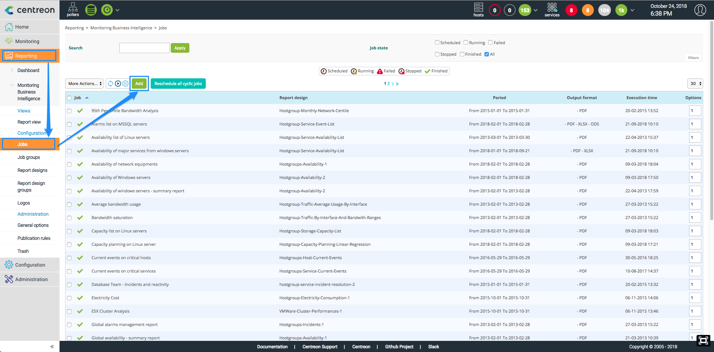
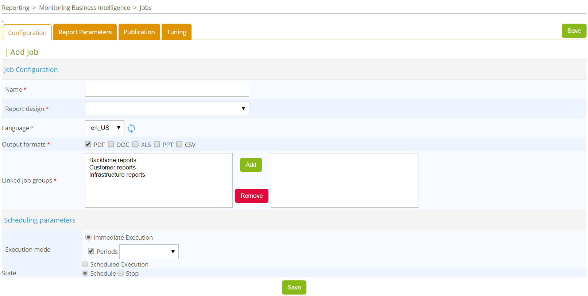
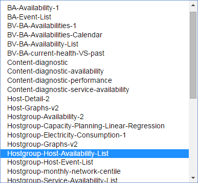
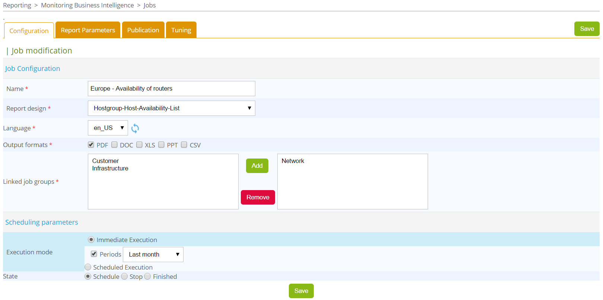
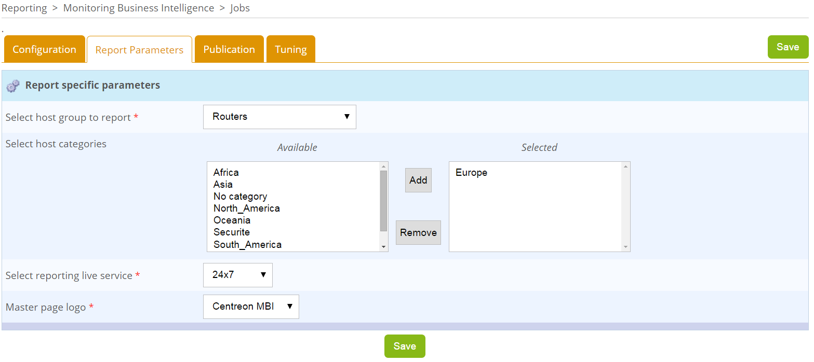
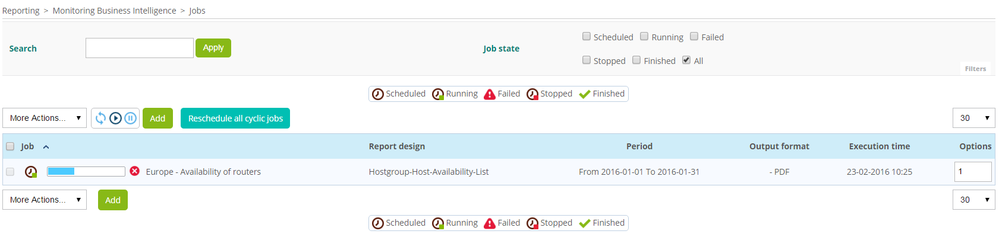
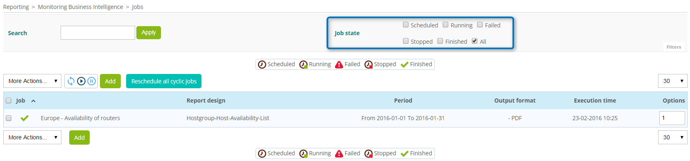
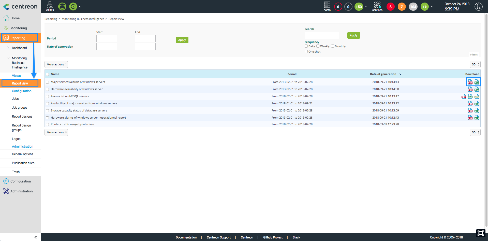
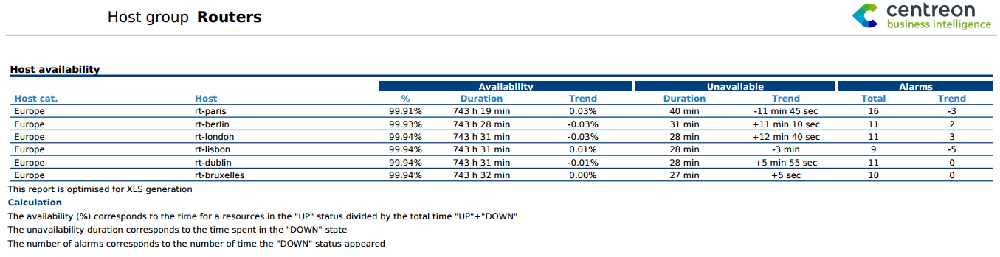

This quick start will guide through using Centreon MBI to generate your first report !

If you are using Centreon MBI extension for the first time and you want to
generate an insightful and effective statistical report, this tutorial
will help you get started.

Follow this simple procedure:

-   Define your requirement.
-   Use the documentation to help you select the report design
    (template) that best suits your analysis.
-   Configure your report by adding a job.
-   Retrieve the report by using the interface.

> Centreon MBI is a Centreon **extension** that requires a valid license key. To
> purchase one and retrieve the necessary repositories, contact
> [Centreon](mailto:sales@centreon.com).

## Define your requirement 

Here is a example based on a typical requirement for basic use of
Centreon MBI: monitoring the availability of IT resources. In this
scenario, the company\'s IT manager in charge of the European network
tells us that the routers seem at times unreachable and wants us to
analyze the problem. To respond we have to retrieve information on the
availability of the routers located in Europe.

Now that the requirement has been identified, we can proceed to the next
step.

## Select the report design 

Every report design meets a specific need. Ours is to analyse the
availability of our routers in Europe. First, we will have a look at the
list of available report design. We select
Hostgroup-Host-Availability-List. This design lists the availability of
groups' hosts. In this case, the hosts being monitored happen to be our
routers.

## Configure the report by "adding a job"

In Centreon MBI, you configure a report by creating a scheduled job. Go
to menu: Reporting → Business Intelligence → Configuraton \| Jobs / Add
(for a new one):

The job creation form opens on the first tab:

First, under *Job Configuration*, create a name for the job. This will
be the name of the report to be generated.

Note: In case you might have a large number of jobs, it is important to
define naming rules.

Then specify the following:

-   Report design: Hostgroup-Host-Availability-List
-   Language: English
-   Output format: PDF

You also have to link the job to a job group. This is mandatory for
managing user rights and profiles. In the Scheduling parameters, choose
the scheduling mode. You have a choice between immediate execution and
scheduled execution. Select immediate execution. In this configuration,
the report will be generated immediately, in English, in PDF format, and
using the last month's statistics:

Once the Configuration form is filled out correctly, we can proceed to
the "Report Parameters" tab, where we specify the conditions and scope
of the report to be generated. We list the availability of hosts stored
in the group "Routers" located in "Europe" (host category).

Note: For most report designs, you can select a time period for the
report.

We want to analyze the availability of the routers over a 24×7 time
period. To appear in the list, this time period has to be predefined in
Centreon and must be configured in Centreon MBI's general options, under
the "ETL Options" tab. Finally, we customize the report with our logo
(new logos can be added to the "Logo" menu).

Click on "Save" to schedule the report according to the selected mode:
immediately.

If the job does not appear in the list, check that the filter applied to
the page is set to "All" to display all the jobs.

## Retrieve the generated report

Once the job is finished, go to *Report view* which contains the list of
all reports generated. To visualize your report, simply download it by
clicking on the \"Output format\" icon, in this case, PDF.

You now have access to the requested report displaying the availability
of the routers in Europe:

Congratulations! You have extracted some basic statistics from the
reporting base.

Ready to generate some reports? Go back to the report list page, select
the design templates that suit your requirements, and you will be able
to generate a new report.

We hope this tutorial has proven useful to you.
