Hello & Welcome! We are excited to help you begin your Centreon journey.

You will find in this chapter how to quickly start on Centreon. It is composed of a quick start to install 
and use Centreon followed by tutorials to help you use the main capabilities of Centreon.

* [Setup your first platform](#setup-your-first-platform)
* [Request your free trial](#request-your-free-trial)
* [First login](#first-login)
* [Add your Centreon IT Edition token](#add-your-centreon-it-edition-token)
* [Basic principles of monitoring](#basic-principle-of-monitoring)
* [Start to monitor your first host](#start-to-monitor-your-first-host)
* [Deploying a configuration](#deploying-a-configuration)
* [Access to tutorials to enjoy your monitoring](introduction-tutorials.html)

## Setup your first platform

To setup your first Centreon platform, we suggest you to use a ready-to-use virtual machine.

**Prerequisites**

This virtual machine is available in OVA format for VMware environment and for
Oracle VirtualBox tool. It is based on **Linux CentOS 7** operating system
including a Centreon installation allowing to easily start your first monitoring.

The virtual machine needs:

- Processor: any recent Intel or AMD processor with at least 2 vCPUs should be enough.
- Memory: depending on your operating system, you will need at least 1 GB of RAM. To fully enjoy Centreon's experience, you need at least 2 GB of free memory.
- Hard Disk storage: The virtual machine requires at least 6.5 GB of free space on your hard disk. However, if you want keep using Centreon, it is recommended to have at least 10 GB as its size will grow over time.
- An Internet access to benefit from the IT-100 free offer.

> For a more custom installation, the complete prerequisites are available [here](../installation/prerequisites.html).

### Download

You can install Centreon:

- [Using Centreon ISO](../installation/installation-of-a-central-server/using-centreon-iso.html)
- From ready-to-use virtual machines:

The virtual machine is available on the [Centreon download web site](https://download.centreon.com).

<!--DOCUSAURUS_CODE_TABS-->

<!--VMware environment-->
\
Go to to **File > Deploy OVF Template** and select the **OVA file**. Since the
menu selections are actually linked to your specific VMWare configuration, we
are unable to provide more information. Be advised that best practice is to use
the **Thin Provision** option to save as much free space as possible on the disk.

<!--Oracle Virtualbox-->
\
Extract the contents of the archive and double-click on the **OVA file**. Follow
the instructions to import the virtual machine.
Edit your virtual machine and in the **System** tab, check the
**Hardware Clock in UTC Time**, then click on **OK**.


<!--END_DOCUSAURUS_CODE_TABS-->

Once your virtual machine is imported, you will need to **add a network card**. Edit the settings of the virtual machine and
a network card. Select the correct associated network to access to Internet.

The virtual machine can now be started.

#### First boot

Once your virtual machine has started. You must connect to it via a shell terminal and perform the requested operations.

> It is imperative that you complete the instructions, especially operations 4 and 5.

Once those operations have been carried out, you can delete this message by deleting the /etc/profile.d/centreon.sh file.

#### Default credentials

- The default Centreon web interface account is: **admin / centreon**.
- The server administration account (through SSH) is: **root / centreon**.
- The root password of the DBMS is not initialized.

> For security reasons, we highly recommend you to change those passwords after the installation completed.

You can now move to the *First login* section.

## Request your free trial

Centreon offers you the possibility to test all the features of the **Centreon IT edition** for free.
For this purpose, go to our website in the **[Try Centreon IT Edition](https://www.centreon.com/en/free-trial/)** section and
fill in the form :


You will receive an email containing your **token** to try **Centreon IT edition**.

Now it is time to move on next chapter to install your Centreon platform.

## First login

To connect to your Centreon web interface access to URL: http://IP_ADDRESS/centreon
****
> Replace ****IP_ADDRESS**** by the IP address or FQDN of your Centreon web server.

Fill in your user name and associated password and click on **Connect** button:

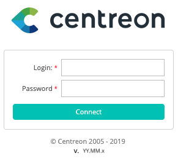

You are now connected to the Centreon web interface.

### Introduction to menus

The Centreon web interface contains several menus, each with a specific function:

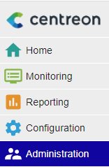

* **Home** lets you access the first home screen after logging in. It provides a summary of overall monitoring status.
  Your workspace may be blank for now. Once you configure customizable widgets, you will see data and charts according
  to your customization.
* **Monitoring** provides a combined view of the statuses of all monitored items in real and delayed time using logs and
  performance graphics.
* **Reporting** provides an intuitive view (using diagrams) of the evolution of monitoring over a given time period.
* **Configuration** allows you to configure all monitored items and the monitoring infrastructure.
* **Administration** allows you to configure the Centreon web interface and view the overall status of the servers.

### Change the user interface language

On the banner, click on the profile icon, then click on **Edit profile**:


In the language select box, choose your language:


Then click on **Save**. Your interface is now translated.

> If your language doesn't appear in the available language list, you can help the Centreon community to translate
> the web interface. For more details go to  [How to translate menu](../developer/developer-translate-centreon.html).

## Add your Centreon IT Edition token

> Your **Centreon IT Edition** test token was sent to you by email.
> [Configure the proxy](../administration/parameters/centreon-ui.html#proxy-configuration)
> to allow the Centreon server to access the Internet.

Go to the **Administration > Extensions > Manager** menu an click on **Add Token**:


A window opens, enter your token and click on the save button:


You now benefit from the **Centreon IT Edition** limited offer for a **100** resources.

Move on next chapters to start monitoring your IT.

## Basic principle of monitoring

Before starting to monitor, let's take a look at some basic concepts:

* A **host** is any device that has an IP address and that one wishes to monitor. For example, a physical server, a
  virtual machine, a temperature probe, an IP camera, a printer or a storage space.
* A **service** is a check point, or indicator, to be monitored on a host. This can be the CPU usage rate, temperature,
  motion detection, bandwidth usage rate, disk I/O, and so on.
* In order to collect each indicator value, monitoring **plugins** are used which are periodically executed by a
  collection engine called Centreon Engine.
* To be executed, a plugin needs a set of arguments that define, for example, which host to connect to or through which protocol.
  The plugin and its associated arguments form a **command**.

For example, to monitor a host with Centreon is to configure all the commands needed to measure the desired indicators,
and then deploy that configuration to the collection engine so that these commands are run periodically.

Nevertheless, to drastically simplify the configuration, we will rely on monitoring templates:

* A **host template** defines the configuration of the indicators for a given type of equipment.
* It relies on **service templates** that define the configuration of the commands needed to collect these indicators.
* Centreon provides downloadable **Plugins Packs** to install on its monitoring platform: each Plugin Pack includes host
  and services templates to configure the monitoring of a particular device in a few clicks.

This quick start guide proposes to install the monitoring templates supplied free of charge with the Centreon solution
and then to implement them to monitor your first equipment.

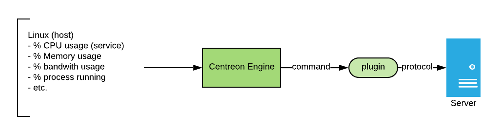

> To go further with templates, please read the [templates chapter](../monitoring/templates.html#definition).

### Installation of basic monitoring templates

Go to the **Configuration \> Plugin Packs** menu.

> [Configure the proxy](../administration/parameters/centreon-ui.html#proxy-configuration) to allow the Centreon server to access the Internet.

Install the **Base Generic** Plugin Pack by moving your cursor on it and by clicking on **+** icon (it is a prerequisite
to the installation of any other Plugin Packs):


You can also click on the Plugin Pack in order to know its content before installing it:


Install other Plugin Packs you probably need for your environment, for example **Linux SNMP** and **Windows SNMP** available
for free:


Now you have the basic templates and plugins to initial monitoring!

## Start to monitor your first host

### Monitor a Linux server with SNMP

Go to the **Configuration \> Plugin Packs** menu and install **Linux SNMP** Plugin Pack:


Go to the **Configuration \> Hosts \> Hosts** menu and click on **Add**:


Fill in the following information:

* The name of the server
* A description of the server
* The IP address
* The SNMP version and community

Click on **+ Add a new entry** button in **Templates** field, then select the **OS-Linux-SNMP-custom** template in the list.

Click on **Save**.

Your equipment has been added to the monitoring configuration:


Go to **Configuration \> Services \> Services by host** menu. A set of indicators has been automatically deployed:


Other indicators can be monitored. Click on **Add** button to add a new service as bandwidth usage for example:


In the **Description** field, enter the name of the service to create, then select the host to link this service. In
the **Template** filed, select the **OS-Linux-Traffic-Generic-Name-SNMP-custom** template.

A list of macros corresponding to the model will then appear:

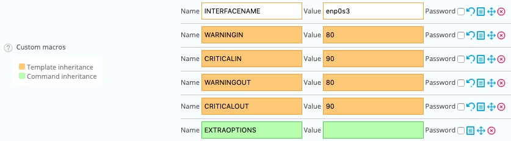

Enter the name of the network interface for the **INTERFACENAME** macro value and click on **Save** to add this
indicator into the monitoring configuration.

Do the same to add packet error monitoring:


Or for file system:


It is now time to [deploy the supervision](#deploying-a-configuration).

Then go to the **Monitoring \> Status Details \> Services** menu and select **All** value for the **Service Status**
filter. After a few minutes, the first results of the monitoring appear:

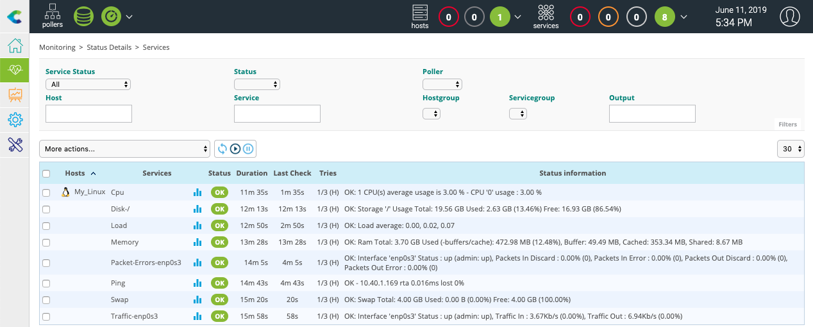

#### To go further

The **Linux SNMP** Plugin Pack provides several monitoring templates. When creating a service, it is possible to search
the available models in the selection list: 


It is also possible to access the **Configuration \> Services \> Templates** menu to know the complete list:


> With **Centreon IT Edition** you can add very quickly and very simply the monitoring of your network cards, partition,
> processes and services using the **[Service Discovery](../monitoring/discovery/services-discovery.html)** functionality.

To know manually the name of the available files system you can execute the plugin in command line:

```Shell
/usr/lib/centreon/plugins/centreon_linux_snmp.pl --plugin=os::linux::snmp::plugin \
    --hostname=10.40.1.169 --snmp-community=public --snmp-version=2c --mode=list-storages
```

You will see the result:
```Shell
List storage:
Skipping storage 'Physical memory': no type or no matching filter type
Skipping storage 'Swap space': no type or no matching filter type
Skipping storage 'Virtual memory': no type or no matching filter type
'/' [size = 21003583488B] [id = 31]
'/dev/shm' [size = 1986875392B] [id = 36]
'/run' [size = 1986875392B] [id = 38]
'/sys/fs/cgroup' [size = 1986875392B] [id = 39]
'/boot' [size = 1015308288B] [id = 57]
'/var/cache/centreon/backup' [size = 5150212096B] [id = 58]
'/var/lib/centreon-broker' [size = 5150212096B] [id = 59]
Skipping storage 'Memory buffers': no type or no matching filter type
'/var/lib/centreon' [size = 7264002048B] [id = 60]
'/var/log' [size = 10434662400B] [id = 61]
'/var/lib/mysql' [size = 16776032256B] [id = 62]
'/run/user/0' [size = 397377536B] [id = 63]
Skipping storage 'Cached memory': no type or no matching filter type
Skipping storage 'Shared memory': no type or no matching filter type
```

It is the same to know the name of the available network interfaces:

```Bash
/usr/lib/centreon/plugins/centreon_linux_snmp.pl --plugin=os::linux::snmp::plugin \
    --hostname=10.40.1.169 --snmp-community=public --snmp-version=2c --mode=list-interfaces
```
You will see the result:
```Shell
List interfaces:
'lo' [speed = 10, status = up, id = 1]
'enp0s3' [speed = 1000, status = up, id = 2]
```

### Monitor a Windows server with SNMP

Go to the **Configuration \> Plugin Packs** menu and install **Windows SNMP** Plugin Pack:


Go to the **Configuration \> Hosts \> Hosts** menu and click on **Add**:


Fill in the following information:

* The name of the server
* A description of the server
* The IP address
* The SNMP version and community

Click on **+ Add a new entry** button in **Templates** field, then select the **OS-Windows-SNMP-custom**
template in the list.

Click on **Save**.

Your equipment has been added to the monitoring configuration:


Go to **Configuration \> Services \> Services by host** menu. A set of indicators has been automatically deployed:


Other indicators can be monitored. Click on **Add** button to add a new service as file system usage for example:

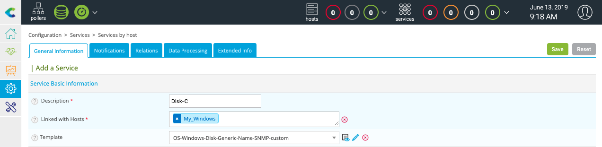

In the **Description** field, enter the name of the service to create, then select the host to link this service. In
the **Template** filed, select the **OS-Windows-Disk-Generic-Name-SNMP-custom** template.

A list of macros corresponding to the model will then appear:

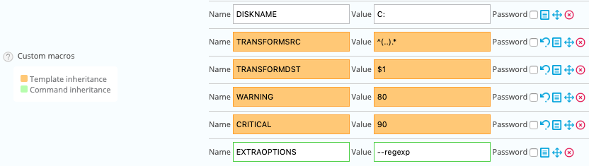

Enter the name of the file system for the **DISKNAME** macro value and add **--regexp** for the value of **EXTRAOPTIONS**
macro, then and click on **Save** to add this indicator into the monitoring configuration.

Do the same to network bandwidth usage monitoring:


It is now time to [deploy the supervision](#deploying-a-configuration).

Then go to the **Monitoring \> Status Details \> Services** menu and select **All** value for the **Service Status**
filter. After a few minutes, the first results of the monitoring appear:


#### To go further

The **Windows SNMP** Plugin Pack provides several monitoring templates. When creating a service, it is possible to
search the available models in the selection list: 


It is also possible to access the **Configuration \> Services \> Templates** menu to know the complete list:


> With **Centreon IT Edition** you can add very quickly and very simply the monitoring of your network cards, partition,
> processes and services using the **[Service Discovery](../monitoring/discovery/services-discovery.html)** functionality.

To know manually the name of the available files system you can execute the plugin in command line:

```Shell
/usr/lib/centreon/plugins/centreon_windows_snmp.pl --plugin=os::windows::snmp::plugin \
    --hostname=10.40.1.254 --snmp-version='2c' --snmp-community='public' --mode=list-storages
```
You will see the result:
```Shell
List storage:
'C:\ Label:  Serial Number 2cb607df' [size = 53317988352B] [id = 1]
Skipping storage 'Virtual Memory': no type or no matching filter type
Skipping storage 'Physical Memory': no type or no matching filter type
```

It is the same to know the name of the available network interfaces:

```Shell
/usr/lib/centreon/plugins/centreon_windows_snmp.pl --plugin=os::windows::snmp::plugin \
--hostname=10.40.1.254 --snmp-version='2c' --snmp-community='public' --mode=list-interfaces
```
You will see the result:
```Shell
List interfaces:
'loopback_0' [speed = 1073, status = up, id = 1]
'ethernet_3' [speed = , status = notPresent, id = 10]
'ppp_1' [speed = , status = notPresent, id = 11]
'ethernet_10' [speed = 1000, status = up, id = 12]
'tunnel_4' [speed = 0.1, status = down, id = 13]
'ethernet_4' [speed = , status = up, id = 14]
'ethernet_5' [speed = , status = up, id = 15]
'ethernet_6' [speed = , status = up, id = 16]
'ethernet_7' [speed = , status = up, id = 17]
'ethernet_8' [speed = , status = up, id = 18]
'ethernet_9' [speed = , status = up, id = 19]
'tunnel_0' [speed = , status = down, id = 2]
'ethernet_11' [speed = 1000, status = up, id = 20]
'ethernet_12' [speed = 1000, status = up, id = 21]
'ethernet_13' [speed = 1000, status = up, id = 22]
'tunnel_1' [speed = , status = down, id = 3]
'tunnel_2' [speed = , status = down, id = 4]
'tunnel_3' [speed = , status = down, id = 5]
'ppp_0' [speed = , status = down, id = 6]
'ethernet_0' [speed = , status = up, id = 7]
'ethernet_1' [speed = , status = up, id = 8]
'ethernet_2' [speed = , status = up, id = 9]
```

### Monitor a Cisco Router with SNMP

Go to the **Configuration \> Plugin Packs** menu and install **Cisco Standard** Plugin Pack:


Go to the **Configuration \> Hosts \> Hosts** menu and click on **Add**:


Fill in the following information:

* The name of the server
* A description of the server
* The IP address
* The SNMP version and community

Click on **+ Add a new entry** button in **Templates** field, then select the **Net-Cisco-Standard-SNMP-custom**
template in the list.

Click on **Save**.

Your equipment has been added to the monitoring configuration:


Go to **Configuration \> Services \> Services by host** menu. A set of indicators has been automatically deployed:


Other indicators can be monitored. Click on **Add** button to add a new service as bandwidth usage for example:

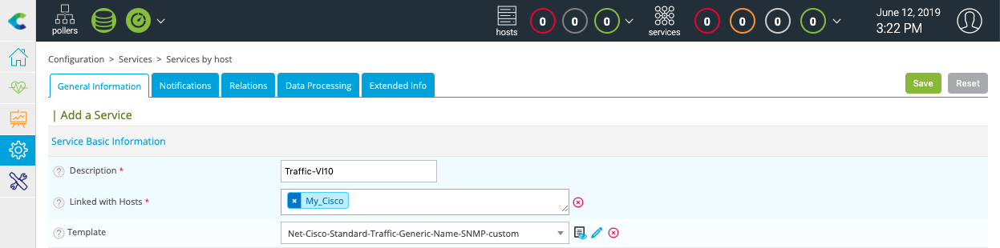

In the **Description** field, enter the name of the service to create, then select the host to link this service. In
the **Template** filed, select the **OS-Linux-Traffic-Generic-Name-SNMP-custom** template.

A list of macros corresponding to the model will then appear:


Enter the name of the network interface for the **INTERFACENAME** macro value and click on **Save** to add this indicator
into the monitoring configuration.

Do the same to add packet error monitoring:


It is now time to [deploy the supervision](#deploying-a-configuration).

Then go to the **Monitoring \> Status Details \> Services** menu and select **All** value for the **Service Status**
filter. After a few minutes, the first results of the monitoring appear:


#### To go further

The **Cisco Standard** Plugin Pack provides several monitoring templates. When creating a service, it is possible to
search the available models in the selection list: 

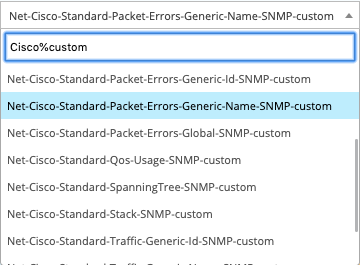

It is also possible to access the **Configuration \> Services \> Templates** menu to know the complete list:


> With **Centreon IT Edition** you can add very quickly and very simply the monitoring of your network cards, partition,
> processes and services using the **[Service Discovery](../monitoring/discovery/services-discovery.html)** functionality.

To know manually the name of the available network interfaces you can execute the plugin in command line:

```Shell
/usr/lib/centreon/plugins/centreon_cisco_standard_snmp.pl \
    --plugin=network::cisco::standard::snmp::plugin \
    --hostname=10.40.1.254 --snmp-community=public --snmp-version=2c --mode=list-interfaces
```
You will see the result:
```Shell
List interfaces:
'Gi1/0/1' [speed = 1000, status = up, id = 10101]
'Gi1/0/2' [speed = 1000, status = up, id = 10102]
'Gi1/0/3' [speed = 10, status = down, id = 10103]
'Gi1/0/4' [speed = 10, status = down, id = 10104]
'Gi1/0/5' [speed = 10, status = down, id = 10105]
'Gi1/0/6' [speed = 1000, status = up, id = 10106]
'Gi1/0/7' [speed = 10, status = down, id = 10107]
'Gi1/0/8' [speed = 10, status = down, id = 10108]
'Gi1/0/9' [speed = 10, status = down, id = 10109]
'Gi1/0/10' [speed = 10, status = down, id = 10110]
'Gi1/0/11' [speed = 10, status = down, id = 10111]
'Gi1/0/12' [speed = 10, status = down, id = 10112]
'Gi1/0/13' [speed = 10, status = down, id = 10113]
'Gi1/0/14' [speed = 10, status = down, id = 10114]
'Gi1/0/15' [speed = 10, status = down, id = 10115]
'Gi1/0/16' [speed = 10, status = down, id = 10116]
'Gi1/0/17' [speed = 1000, status = up, id = 10117]
'Gi1/0/18' [speed = 10, status = down, id = 10118]
'Gi1/0/19' [speed = 10, status = down, id = 10119]
'Gi1/0/20' [speed = 100, status = up, id = 10120]
'Gi1/0/21' [speed = 10, status = down, id = 10121]
'Gi1/0/22' [speed = 1000, status = up, id = 10122]
'Gi1/0/23' [speed = 10, status = down, id = 10123]
'Gi1/0/24' [speed = 1000, status = up, id = 10124]
'Gi1/0/25' [speed = 10, status = down, id = 10125]
'Gi1/0/26' [speed = 10, status = down, id = 10126]
'Gi1/0/27' [speed = 10, status = down, id = 10127]
'Gi1/0/28' [speed = 10, status = down, id = 10128]
```

It is the same to know the name of the spanning-tree:

```Shell
/usr/lib/centreon/plugins/centreon_cisco_standard_snmp.pl \
    --plugin=network::cisco::standard::snmp::plugin \
    --hostname=10.40.1.254 --snmp-community=public --snmp-version=2c --mode=list-spanning-trees
```
You will see the result:
```Shell
List ports with Spanning Tree Protocol:
[port = GigabitEthernet1/0/20] [state = forwarding] [op_status = up] [admin_status = up] [index = 10120]
[port = Port-channel1] [state = forwarding] [op_status = up] [admin_status = up] [index = 5001]
```

### Monitor a MySQL or MariaDB database

Go to the **Configuration \> Plugin Packs** menu and install **MySQL/MariaDB** Plugin Pack:


Go to the **Configuration \> Hosts \> Hosts** menu and click on **Add**:


Fill in the following information:

* The name of the server
* A description of the server
* The IP address

Click on **+ Add a new entry button** in **Templates** field, then select the **App-DB-MySQL-custom** template in the list.

A list of macros corresponding to the model will then appear:


Fill in the value of following macros:

* **MYSQLUSERNAME**: the username to connect to the database.
* **MYSQLPASSWORD**: the password of the user.
* **MYSQLPORT**: the TCP port to connect to the database, by default 3306.

Click on **Save**.

Your equipment has been added to the monitoring configuration:


Go to **Configuration \> Services \> Services by host** menu. A set of indicators has been automatically deployed:


It is now time to [deploy the supervision](#deploying-a-configuration).

Then go to the **Monitoring \> Status Details \> Services** menu and select **All** value for the **Service Status**
filter. After a few minutes, the first results of the monitoring appear:


#### To go further

The **MySQL/MariaDB** Plugin Pack provides several monitoring templates. When creating a service, it is possible to
search the available models in the selection list: 


It is also possible to access the **Configuration \> Services \> Templates** menu to know the complete list:


### Monitor Printer equipment with SNMP

Go to the **Configuration \> Plugin Packs** menu and install **Printer Standard** Plugin Pack:


Go to the **Configuration \> Hosts \> Hosts** menu and click on **Add**:


Fill in the following information:

* The name of the server
* A description of the server
* The IP address
* The SNMP version and community

Click on **+ Add a new entry** button in **Templates** field, then select the **HW-Printer-standard-rfc3805-custom**
template in the list.

Click on **Save**.

Your equipment has been added to the monitoring configuration:

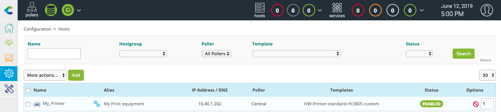

Go to **Configuration \> Services \> Services by host** menu. A set of indicators has been automatically deployed:


It is now time to [deploy the supervision](#deploying-a-configuration).

Then go to the **Monitoring \> Status Details \> Services** menu and select **All** value for the **Service Status**
filter. After a few minutes, the first results of the monitoring appear:


### Monitor UPS equipment with SNMP

Go to the **Configuration \> Plugin Packs** menu and install **UPS Standard** Plugin Pack:

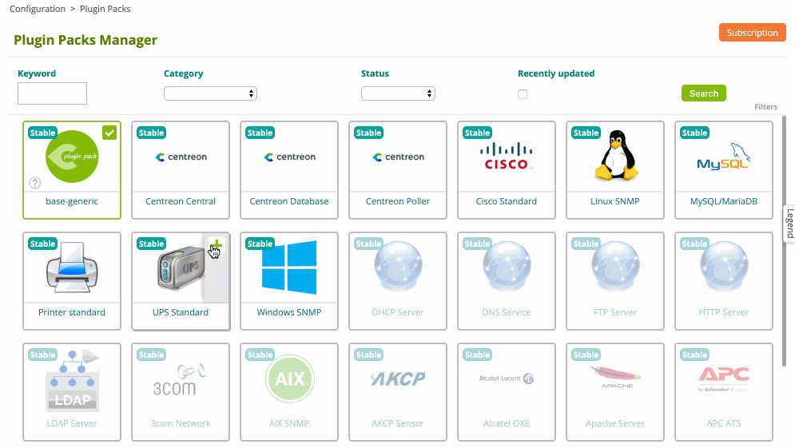

Go to the **Configuration \> Hosts \> Hosts** menu and click on **Add**:


Fill in the following information:

* The name of the server
* A description of the server
* The IP address
* The SNMP version and community

Click on **+ Add a new entry** button in **Templates** field, then select the **HW-UPS-Standard-Rfc1628-SNMP-custom**
template in the list.

Click on **Save**.

Your equipment has been added to the monitoring configuration:


Go to **Configuration \> Services \> Services by host** menu. A set of indicators has been automatically deployed:

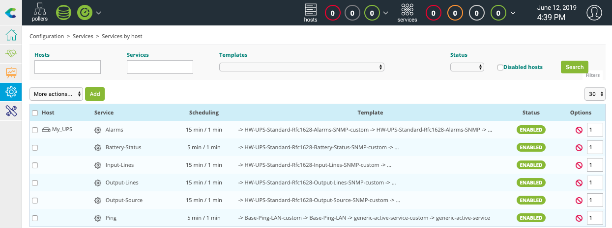

It is now time to [deploy the supervision](#deploying-a-configuration).

Then go to the **Monitoring \> Status Details \> Services** menu and select **All** value for the **Service Status**
filter. After a few minutes, the first results of the monitoring appear:


## Deploying a configuration

On creation/deletion/change of objects via the configuration interface, the changes performed are not applied
automatically to the scheduler. To apply the changes performed, it is necessary to follow the procedure below.

#### First step

1. Go to the **Configuration \> Pollers** menu
2. Choose the pollers which you want to export configuration
3. Click on **Apply configuration** button


4. Check the **Generate Configuration Files** and **Run monitoring engine debug (-v)** boxes
5. Click on **Export** button


Check that no error appears during generation.

> If there are errors, correct the errors and repeat the first step.

#### Second step

1. Uncheck the **Generate Configuration Files** and **Run monitoring engine debug (-v)** boxes
2. Then check the **Move Export Files** and **Restart Monitoring Engine** boxes
3. Click on **Export** button


