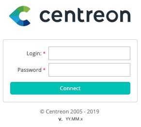
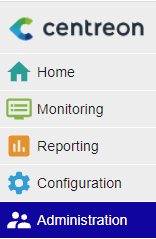
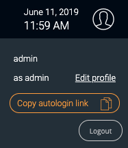
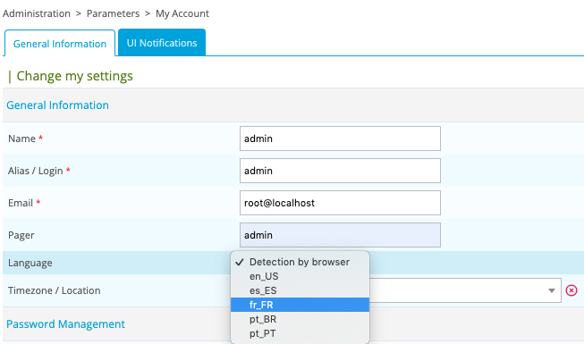

## First login

To connect to your Centreon web interface, go to URL: `http://IP_ADDRESS/centreon`. (Replace **IP_ADDRESS** by the IP address or FQDN of your Centreon web server.)

Fill in your user name and associated password and click on the **Connect** button:

>The default credentials are: `admin`/`centreon`. 

You are now connected to the Centreon web interface.

### Introduction to menus

The Centreon web interface contains several menus, each with a specific function:

* **Home** shows [custom views](create-custom-view.html).
  Your workspace may be blank for now. Once you configure customizable widgets, you will see data and charts according
  to your customization.
* **Monitoring** provides a combined view of the statuses of all monitored items in real and delayed time using logs and
  performance graphics.
* **Reporting** provides an intuitive view (using diagrams) of the evolution of monitoring over a given time period.
* **Configuration** allows you to configure all monitored items and the monitoring infrastructure.
* **Administration** allows you to configure the Centreon platform (with settings such as authentication, proxy, extensions ...) and view the overall status of the servers.

### Change the user interface language

On the banner, click on the profile icon, then click on **Edit profile**:

In the language select box, choose your language:

Then click on **Save**. Your interface is now translated.

> If your language doesn't appear in the available language list, you can help the Centreon community to translate
> the web interface. For more details go to  [How to translate Centreon](../developer/developer-translate-centreon.html).
