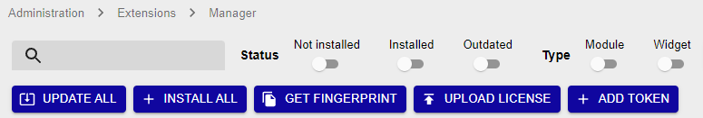

Centreon offers you the possibility to test all the features of the **Centreon IT edition** for free, with the IT-100 trial formula.

- You will be able to install up to 3 central servers, and monitor up to 100 resources. 
- You will be able to use the [autodiscovery feature](../monitoring/discovery/introduction.html) for hosts and services, and  the entire [Centreon Plugin Pack library](../integrations/plugin-packs/introduction.html).

Your Centreon platform must be able to access the internet for the IT-100 license to work.

For more information, read our [FAQ on Centreon IT-100](https://www.centreon.com/en/faq/faq-centreon-it-100/).

## Procedure

1. To request your free trial license, go to our website on page **[Try Centreon IT Edition](https://www.centreon.com/en/free-trial/)**
and fill in the following form:

    

    You will receive an email containing your token to try Centreon IT edition.

2. Install Centreon quickly using a [ready-to-use virtual machine](../installation/installation-of-a-central-server/using-virtual-machines.html).

3. Log in to the web interface, at the following address: `http://IP_ADDRESS/centreon`. (Replace **IP_ADDRESS** by the IP address or FQDN of your Centreon web server.)
      
    > The default credentials are `admin`/`centreon`.

4. Add the Centreon IT Edition token you have received by email.
    > [Configure the proxy](../administration/parameters/centreon-ui.html#proxy-configuration)
    > to allow the Centreon server to access the internet.

      1. Go to **Administration > Extensions > Manager** and click the **Add Token** button:

          

      2. A window opens. Enter your token and click on the **Save** button:

          

5. Your plateform is now ready. You can [monitor your first host](first-supervision.html).