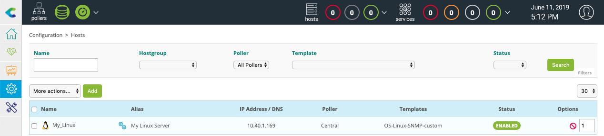
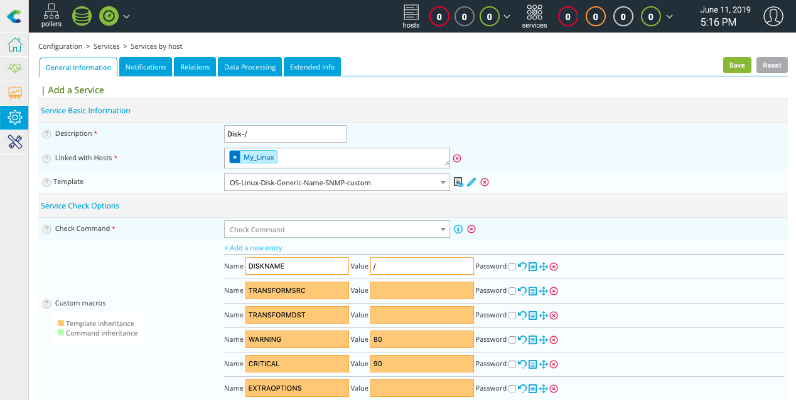

# Monitor a Linux server with SNMP

## Context

In this documentation, we consider your centreon platform is installed and running well. And we supposed you have at least a Centreon IT 100 Edition who provide centreon Plugin-Packs

## Prerequesites

### On Linux server

First step is to activate and configure SNMP agent on your monitored host.
A detailed documentation on how-to configure SNMP is available in the documentation of each Linux distribution.

Find below a minimalist snmpd.conf / net-snmp config file
  - replace my-snmp-community by the relevant value.
  - Add the line **view  centreon  included .1.3.6.1** to have access on all informations in the MIB required by plugin

```Shell
#       sec.name  source          community
com2sec notConfigUser  default       my-snmp-community

####
# Second, map the security name into a group name:

#       groupName      securityModel securityName
group   notConfigGroup v1           notConfigUser
group   notConfigGroup v2c           notConfigUser

####
# Third, create a view for us to let the group have rights to:

# Make at least  snmpwalk -v 1 localhost -c public system fast again.
#       name           incl/excl     subtree         mask(optional)
view centreon included .1.3.6.1
view    systemview    included   .1.3.6.1.2.1.1
view    systemview    included   .1.3.6.1.2.1.25.1.1

```
The SNMP server must be restarted each time the configuration is modified. Also make sure that the SNMP server is configured to automatically start on boot.
Like this for recent distributions:
```Shell
systemctl restart snmpd
systemctl enable snmpd
```

> The target server must be reachable from the Centreon Poller on the UDP/161 SNMP port.

### On poller

You need to install the Linux SNMP plugin as below (see monitoring procedure of **Linux SNMP** Plugin-Pack for more informations):

```Shell
yum install centreon-plugin-Operatingsystems-Linux-Snmp
```

## Install Linux SNMP templates, configure and deploy configuration

First, go to the **Configuration \> Plugin Packs** menu and install **Linux SNMP** Plugin Pack:


Next, go to the **Configuration \> Hosts \> Hosts** menu and click on **Add**:


Fill in the following information:

* The name of the server (1)
* A description of the server (2)
* The IP address (3)
* The SNMP version and community (4)
* Select the monitoring poller (keep "central" if no other poller) (5)

Click on **+ Add a new entry** button in **Templates** field (6), then select the **OS-Linux-SNMP-custom** template (7) in the list like this:



Click on **Save** (8).

Your equipment has been added to the monitoring configuration:


Go to **Configuration \> Services \> Services by host** menu. A set of indicators has been automatically deployed:


You can also use the shortcut beside of the host name to go directly on **Configuration \> Services \> Services by host** filtered by host-name


It is now time to [deploy the supervision](\first-supervision#deploying-a-configuration).

Then go to the **Monitoring \> Resource Status** menu and select **All** value for the **Resource status**
filter.
At start, the resources appears with the status **Pending**, which significate checks are not yet executed:



After a few minutes, the first results of the monitoring appear:


In the best case, all is OK, but if not verify causes of errors and correct it.
