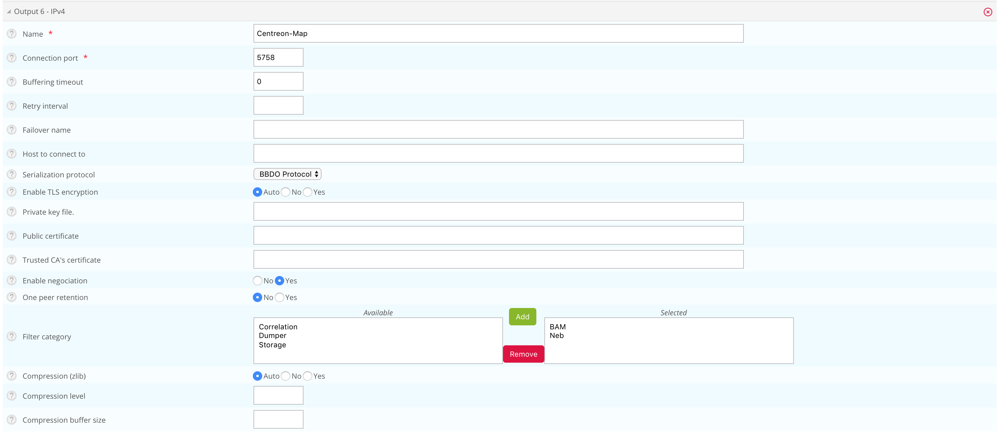
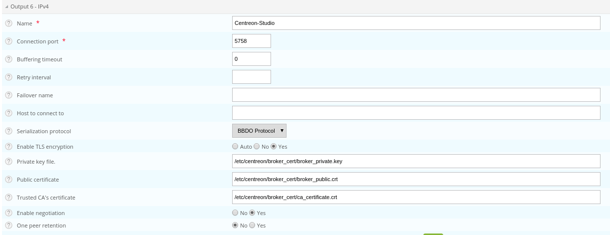

This chapter describes advanced procedures to secure your Centreon MAP
platform.

## Configure HTTPS/TLS on the web server

### HTTPS/TLS configuration with a recognized key

> This section describes how to add a **recognized key** to the Centreon
> MAP server.
>
> If you want to create an auto-signed key and add it to your server, please
> refer to the [following
> section](#httpstls-configuration-with-an-auto-signed-key)

You will require:

- A key file, referred to as *key.key*.
- A certificate file, referred to as *certificate.crt*.

Access the Centreon MAP server through SSH.

Create a PKCS12 file with the following command line:

```shell
openssl pkcs12 -inkey key.key -in certificate.crt -export -out keys.pkcs12
```

Then, import this file into a new keystore (a Java repository of security
certificates):

```shell
keytool -importkeystore -srckeystore keys.pkcs12 -srcstoretype pkcs12 -destkeystore studio.jks
```

Put above keystore file (studio.jks) to the folder "/etc/centreon-studio/",
and set below parameters inside
`/etc/centreon-studio/studio-config.properties`:

```text
centreon-map.keystore=/etc/centreon-studio/studio.jks
centreon-map.keystore-pass=xxx
```

> Replace the keystore-pass value "xxx" with the password you used for
> the keystore and adapt the path (if it was changed) to the keystore.

### HTTPS/TLS configuration with an auto-signed key

> Enabling the TLS mode with an auto-signed key will force every user to add an
> exception for the certificate before using the web interface.
>
> Enable it only if your Centreon also uses this protocol.
>
> Users will have to open the URL:
>
> ```shell
> https://<MAP_IP>:8443/centreon-studio/api/beta/actuator/health.
> ```
>
> *The solution we recommend is to use a recognized key method, as explained
> above.*

On the Centreon MAP server, create a keystore.

Go to the folder where Java is installed:

```shell
cd $JAVA_HOME/bin
```

Then generate a keystore file with the following command:

```shell
keytool -genkey -alias studio -keyalg RSA -keystore /etc/centreon-studio/studio.jks
```

The alias value "studio" and the keystore file path
`/etc/centreon-studio/studio.jks` may be changed, but unless there is a
specific reason, we advise keeping the default values.

Provide the needed information when creating the keystore.

At the end of the screen form, when the "key password" is requested, use
the same password as the one used for the keystore itself by pressing the
ENTER key.

Put above keystore file (studio.jks) to the folder "/etc/centreon-studio/",
and set below parameters inside
`/etc/centreon-studio/studio-config.properties`:

```text
centreon-map.keystore=/etc/centreon-studio/studio.jks
centreon-map.keystore-pass=xxx
```

> Replace the keystore-pass value "xxx" with the password you used for
> the keystore and adapt the path (if it was changed to the keystore).

### Activate TLS profile of Centreon MAP service

1. Stop Centreon MAP service:

    ```shell
    systemctl stop centreon-map
    ```

2. Edit the file `/etc/centreon-studio/centreon-map.conf`, adding ",tls"
   after "prod" profile:

    ```text
    RUN_ARGS="--spring.profiles.active=prod,tls"
    ```

3. Restart Centreon MAP service:

    ```shell
    systemctl start centreon-map
    ```

Centreon MAP server is now configured to respond to requests from HTTPS at
port 8443.

To change the default port, refer to the [dedicated
procedure](procedures.html#change-centreon-map-server-port).

> Don't forget to modify the URL on Centreon side in **Map server address**
> field in `Administration > Extensions > Map > Options` menu.

## Configure TLS on the Broker connection

An additional Broker output for Centreon Central (centreon-broker-master) has
been created during the installation.

You can check it in your Centreon web interface, from the `Configuration >
Pollers > Broker Configuration`, by editing the `centreon-broker-master`
configuration.

The output configuration should look like this:



### Broker configuration

You can enable TLS output and set up Broker's private key and public
certificate as described below:



> "Trusted CA's certificate" field is optional. If you activate Broker's client
> authentication by setting this "ca\_certificate.crt", then you must setup a
> [keystore for MAP server](#configure-httpstls-on-the-web-server)
>
> You MUST push the new broker configuration and restart the broker after
> configuration.

### MAP server configuration

First of all, you should [activate HTTPS/TLS on the web
server](#configure-httpstls-on-the-web-server)

Then, set the following parameters in MAP server configuration at
`/etc/centreon-studio/studio-config.properties` :

To set the communication protocol with Centreon server to HTTPS:
```text
centreon.url=https://<server-address>
```

To enable TLS socket connection with Broker :

```text
broker.tls=true
```

#### Configuration with a self signed certificate

If the Broker public certificate is self signed, you must create a trust store
containing given certificate or its CA certificate with the following command
line:

```shell
keytool -import -alias centreon-broker -file broker_public.crt -keystore truststore.jks
```

- "broker\_public.crt" is Broker public certificate or its CA certificate
  in PEM format,
- "truststore.jks" is the generated trust store in JKS format,
- a store password is required during generation.

Then, put the generated output file "truststore.jks" into
"/etc/centreon-studio" of MAP server host.

And add truststore parameters in
`/etc/centreon-studio/studio-config.properties`:

```text
centreon-map.truststore=/etc/centreon-studio/truststore.jks
centreon-map.truststore-pass=XXXX
```

> Replace the trustStorePassword value "xxx" with the password you used when
> generate the trust store.

Meanwhile, you should activate the "tls_broker" profile of Centreon MAP
service.

Edit the file `/etc/centreon-studio/centreon-map.conf`, and replace ",tls" by
",tls_broker" after "prod" profile:

```text
RUN_ARGS="--spring.profiles.active=prod,tls_broker"
```

> "tls_broker" profile implies "tls" profile. So Centreon MAP service
> serves necessarily HTTPS.

#### Configuration with a recognized CA certificate

If the broker public certificate is signed with a recognized CA, the JVM
default trust store "cacerts (/etc/pki/java/cacerts)" will be used. Nothing
to configure for Centreon MAP service
