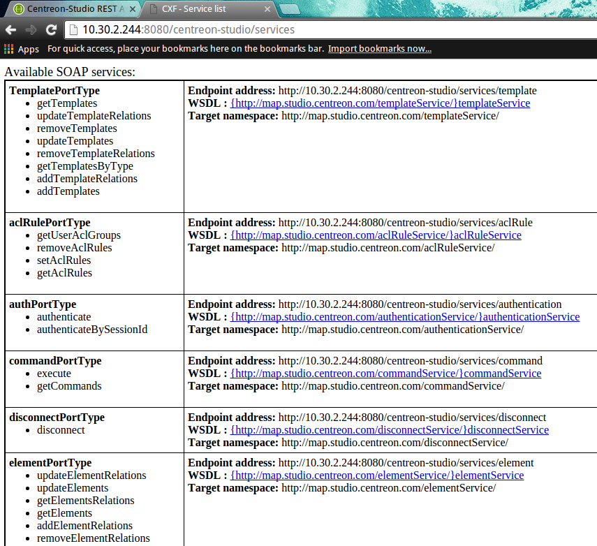
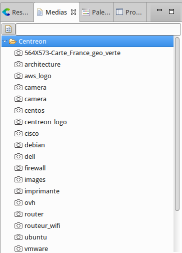
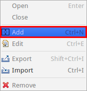
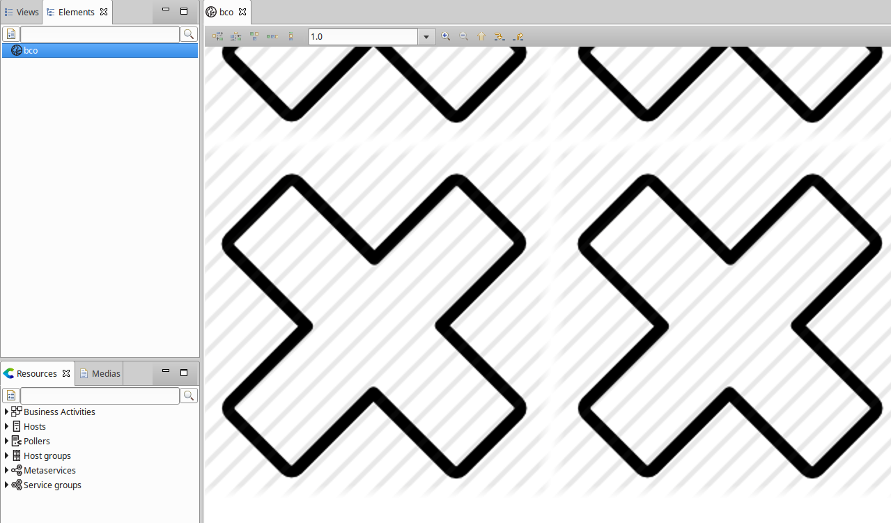
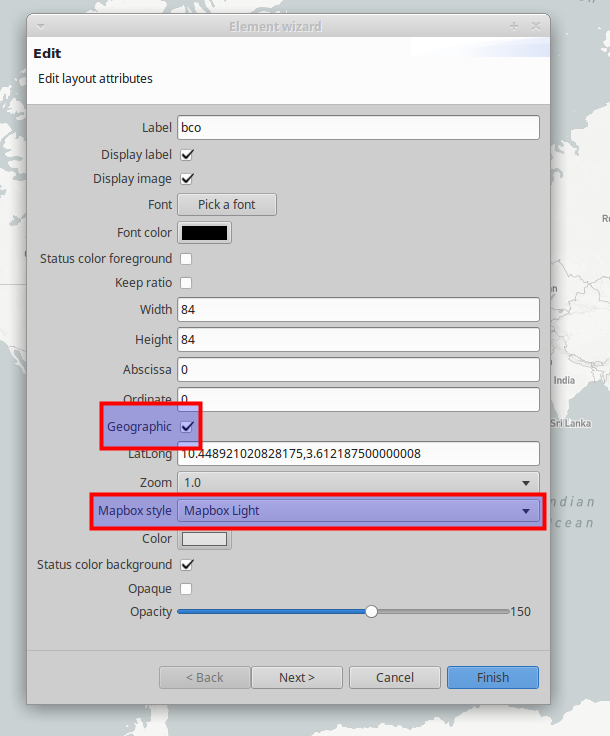
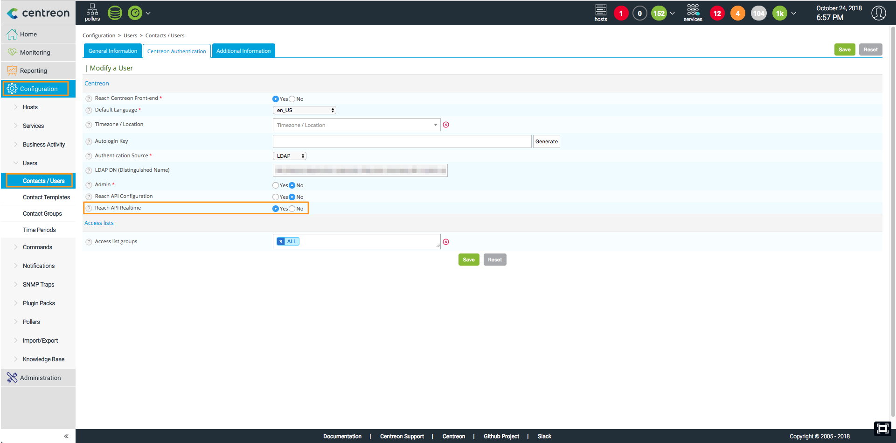
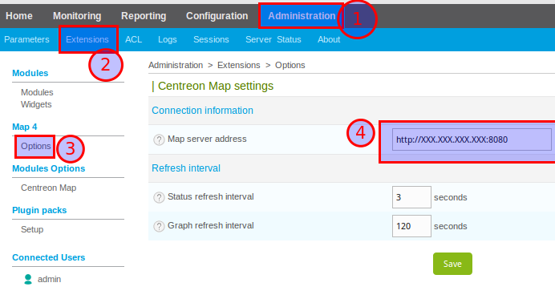
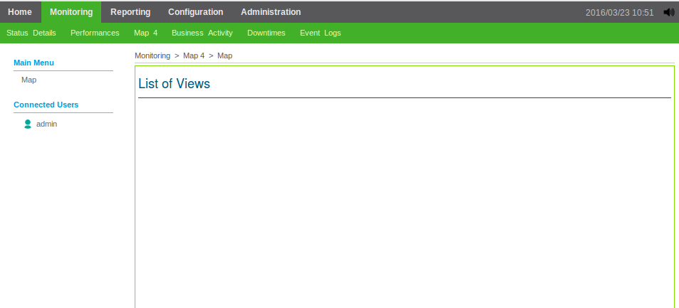

This chapter describes common errors you might encounter while using
Centreon MAP. Please read the questions and answers below before
contacting our support team.

We will continue to update this section based on your feedback.

## General

### How can I check if my Centreon MAP server is running correctly?

Their are two main ways to check if your Centreon MAP server is up and
running.

First of all, check that Centreon MAP service is running. To do so,
connect through SSH to the server hosting Centreon MAP and run the
following command:

```shell
systemctl status centreon-map
```

You should receive the following output:

```shell
centreon-map - Centreon Studio map server
Loaded: loaded (/usr/lib/systemd/system/centreon-map; disabled; vendor preset: disabled)
Active: active (running) since ...
```

If your Centreon MAP service is stopped the message will be:

```shell
centreon-map - Centreon Studio map server
Loaded: loaded (/usr/lib/systemd/system/centreon-map; disabled; vendor preset: disabled)
Active: inactive (dead)
```

In this case, start the Centreon MAP service:

```shell
sudo systemctl start centreon-map
```

Once you are sure your server is running, try to access its API through
your web browser. Check the REST API used by the web interface as
follows:

<!--DOCUSAURUS_CODE_TABS-->

<!--HTTP-->

```shell
http://<MAP_IP>:8080/centreon-studio/api/beta/actuator/health
```

<!--HTTPS-->

```shell
https://<MAP_IP>:8443/centreon-studio/api/beta/actuator/health.
```

<!--END_DOCUSAURUS_CODE_TABS-->

You can also check the SOAP API used by the desktop client:

<!--DOCUSAURUS_CODE_TABS-->

<!--HTTP-->

```shell
http://<MAP_IP>:8080/centreon-studio/services
```

<!--HTTPS-->

```shell
https://<MAP_IP>:8443/centreon-studio/services
```

<!--END_DOCUSAURUS_CODE_TABS-->



### My Centreon MAP service is running but I cannot access Centreon MAP API (/actuator/health) pages

You might want to check if the server containing Centreon MAP has a firewall
preventing it from running correctly. Run the following command:

```shell
systemctl status iptables
```

If you see this output...

```shell
iptables: Firewall is not running.
```

...then the problem is elsewhere.

If you have this output...

``` shell
Table: filter
Chain INPUT (policy ACCEPT)
num  target     prot opt source               destination
1    ACCEPT     all  --  0.0.0.0/0            0.0.0.0/0           state RELATED,ESTABLISHED
2    ACCEPT     icmp --  0.0.0.0/0            0.0.0.0/0
3    ACCEPT     all  --  0.0.0.0/0            0.0.0.0/0
4    ACCEPT     tcp  --  0.0.0.0/0            0.0.0.0/0           state NEW tcp dpt:22
5    REJECT     all  --  0.0.0.0/0            0.0.0.0/0           reject-with icmp-host-prohibited

Chain FORWARD (policy ACCEPT)
num  target     prot opt source               destination
1    REJECT     all  --  0.0.0.0/0            0.0.0.0/0           reject-with icmp-host-prohibited

Chain OUTPUT (policy ACCEPT)
num  target     prot opt source               destination
```

then your firewall is running, preventing any connection from and to your
Centreon MAP server. You must either add input and output rules for Centreon
MAP or disable your firewall.

To open the appropriate ports:

```shell
/sbin/iptables -A OUTPUT -p tcp --dport <PORT> -j ACCEPT
/sbin/iptables -A INPUT -p tcp --dport <PORT> -j ACCEPT
```

> Replace \<PORT\> by the port your Centreon MAP server is using (mostly 8080 or
> 8443 if you have configured it in SSL).

To simply disable your firewall, execute:

```shell
systemctl stop iptables
```

### My images from Centreon Web are not displayed in Centreon MAP

Centreon MAP automatically imports all images from Centreon Web into its
own database. On your desktop client, you should see all your files from
Centreon Web under the Media tab panel in the "Centreon" folder. If not,
you may want to verify the following:

On your Centreon MAP server, open the file `/etc/my.cnf` and check if the line
following line is present:

```text
max_allowed_packet = 20M
```

Then reload your MariaDB database:

```shell
sudo systemctl reload mysqld
```

Wait a few minutes for the Centreon MAP server to synchronize Centreon Web
resources. The images from Centreon Web should then appear on your desktop
client under the Media tab panel in the Centreon folder.



If you still cannot see the list of images check your Centreon MAP
configuration file.

Connect through SSH to your Centreon MAP server. Open the
studio-config.properties file:

```shell
vim /etc/centreon-studio/studio-config.properties
```

For the 'centreon.url' variable, check that there is a full path to your
Centreon Web interface:

```shell
centreon.url=http://<MAP_IP>
```

> Don't forget to replace "http" with "https" if your Centreon Web
> interface is using HTTPS.

Wait a few minutes for the Centreon MAP server to synchronize the
Centreon Web resources. The images on Centreon Web should then appear on
your desktop client in the Centreon folder.

## Centreon MAP desktop client

### The desktop can't start: "Java was started but returned exit code = 13"

The desktop client does not start and an error message "error code = 13" is
displayed.

Install a 64-bit JVM.

### Impossible to create a new view

On the desktop client, if you want to create a new view but the button is
disabled, you do not have the access rights.



A Centreon MAP administrator must authorize you to create, update or delete
views. When you first install your Centreon MAP server, only Centreon
administrators are MAP administrators. It is their job to grant administration
privileges to other "normal" Centreon users.

### Impossible to import media

When you right click on the Media panel, the Import button is disabled.

There are two facts you should know about media:

- The Centreon folder, which is created automatically, contains all the
  images from Centreon Web:

  - You cannot add or remove any image from this folder,
  - All images are at the same level (no subfolders).

- You cannot import images at the root of the media panel.

The solution is to create a new folder (e.g., *Icons*).

Then right click on this folder and select *Import*.

### I cannot see the "MAP 3 Import menu."

You want to import views from MAP 3 to Centreon MAP \>= 4.x but the
corresponding menu is missing.

Please check the following prerequisites:

- Your MAP 3 license is still valid.
- Your Centreon Desktop Client version is at least v4.0.8 (you can check it
  directly from your desktop client interface, in the Help \> About menu).
- If there is a proxy between your computer and your Centreon Web interface,
  you must define it in the Configure menu.

> The proxy must be configured with the checkbox *use for internet*.

- On the Centreon MAP server configuration file
  (/etc/centreon-studio/studio-config.properties) you entered the IP of your
  Central server.

This IP is also used by your desktop client to the access MAP 3 API. If
this IP is not reachable by your desktop client (because both your
Centreon MAP server and Centreon Central server are on a DMZ) you must
specify a new one to your desktop client. To do so, edit the file:

<!--DOCUSAURUS_CODE_TABS-->

<!--Windows-->

```shell
C:\Users\<YOUR_USERNAME>\AppData\Local\Centreon-Map4\Centreon-Map4.ini
```

<!--Linux-->

```shell
/opt/centreon-map4-desktop-client/Centreon-Map4.ini
```

<!--END_DOCUSAURUS_CODE_TABS-->

Add the following line at the end of the file on a new line, where
`<CENTREON_URL>` is the URL with which you access the web interface of
Centreon Web from your computer:

```shell
-Dcentreon.url=<CENTREON_URL>
```

### An error occured when I open a geographic view

If you open a geographic view or container and your background is composed of
gray with Xs and the following pop-up message...

"Error while retreiving Mapbox tiles. Please check your Mapbox configuration."



then you should check the following:

- Ensure that your Mapbox credentials are valid. To configure your
  Mapbox credentials. Your Mapbox secret key may have changed. Since
  you cannot see the previously created keys, you might want to create
  a new one and add it in your Centreon MAP server configuration file.
- If your computer is behind a proxy to gain internet access, please
  configure this proxy in the Centreon MAP Desktop Client.
- The Mapbox style you used on your view might have been deleted.

Try to edit your view / container and change the Mapbox style:



If you cannot select any style the issue is probably caused by one of
the above (i.e., credentials, proxy or deleted style).

### Error with special characters

If you try to use characters in labels that are not using latin1
encoding and get a pop-up error displaying "Could not execute statement"
on your desktop client, your database is probably in latin1. To change
the database to UTF-8 encoding, you need to access your Centreon MAP
server in SSH and execute the following commands:

```shell
# systemctl stop centreon-map
# mysqldump -uusername -p -h \<HOST\> centreon\_studio \> dump.sql
# cp dump.sql dump-fixed.sql
# vim dump-fixed.sql
:%s/DEFAULT CHARACTER SET latin1/DEFAULT CHARACTER SET utf8 COLLATE
utf8\_general\_ci/
:%s/DEFAULT CHARSET=latin1/DEFAULT CHARSET=utf8/
:wq
# mysql -uusername -ppassword -h \<HOST\> \< dump-fixed.sql
# systemctl start centreon-map
```

### My Desktop client is slow and I often get disconnected

Depending on your Centreon server's monitoring perimeter (the number of
services running) and the computer hardware configuration, your desktop
client might need more RAM than it uses by default. It may start to
freeze and try to free up more memory. You can check this behavior by
opening your task manager (Ctrl + Maj + Esc) and checking the memory
consumption. If it increases and seems to reach a limit while your CPU
is working hard, your desktop client requires more memory.

To increase memory, edit the .ini file:

<!--DOCUSAURUS_CODE_TABS-->

<!--Windows-->

```shell
C:\Users\<YOUR_USERNAME>\AppData\Local\Centreon-Map4\Centreon-Map4.ini
```

<!--Linux-->

```shell
/opt/centreon-map4-desktop-client/Centreon-Map4.ini
```

<!--END_DOCUSAURUS_CODE_TABS-->

And add the following line at the end of the file, on a new line:

```text
-Xmx4g
```

The "4g" means 4 GB (by default it can only use 2 GB). You can change this
number depending on your hardware (e.g., by setting "3g").

Then restart your desktop client.

### I get the error "Cannot authenticate user" on the login page

For Centreon Web \>= 2.8.6, verify that your user has checked the option
"Reach Real Time API."



### I'm using Windows Remote Desktop (RDP) and I have many errors

If you are using Centreon MAP Desktop Client through a Remote Session
(with RDP, for instance), you might encounter an error displaying a
number of pop-ups like "128" or "512" rendering your desktop client
unusable.

To prevent this from happening, you need to change a parameter in your
RDP application:

Go to *Advance > Display* and select "Highest quality (32bit)". You
can then access your remote computer and this error will no longer
occur.


> For Linux or Mac users of the application **rdesktop**, add this argument to
> your command line: \[-a 32\]

> This error may occur if you use the skin "Windows server" on your
> computer. Go to your windows parameter and change the color settings
> to use 32bit colors.

## Centreon MAP web interface

### Graphs are all shifted to the right after upgrading from Centreon MAP 4.4 to Centreon MAP 18.10

A bug affecting the web interface was shifting all the graphs to the left
compared to their position in the desktop client. This has been fixed in
Centreon MAP 18.10. If you have manually shifted the graphs to the right to
compensate in the web interface, all your graphs will be over-shifted to the
right after the upgrade.

We have provided a script that automatically unshifts all the graphs to the
left. Do not use this script if you know most of your graphs were correctly
positioned after the upgrade: you would have to manually unshift the others.

Here is the SQL script that fixes the offset manually created by a user for
correct alignment in the web interface.

To execute it:

- Make a backup of your centreon\_studio database.
- Go to /etc/centreon-studio/utils/
- Run the script:

  ```shell
  mysql centreon_studio < update-position-graph.sql
  ```

- Restart Centreon Map service:

  ```shell
  systemctl restart centreon-map
  ```

### My web interface is displaying "Authentication error."

The following error might appear on your web interface.


First, check if you have access to the Centreon MAP server APIs.

From `Administration > Extensions > MAP > Options`, check your Centreon MAP
web interface configuration:

The URL set in 'MAP server address' must include the protocol (HTTP or HTTPS)
and the port used by your Centreon MAP server (usually 8080 for a normal
connexion or 8443 for a secure connexion).



### My web interface displays an empty page

Your web interface is configured but it displays an empty page:



Either no views are created on the server or you do not have access to them.

If you are a Centreon MAP administrator, you can see all views. In this
case, no views have been created. Here are [quick start
instructions](create-standard-view.html) to create one.

Otherwise, contact the Centreon MAP administrator or create your own views if
you have sufficient privileges.
