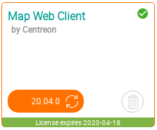

This chapter describes how to update your Centreon MAP extension. This is done
by updating the three main components:

  - Centreon MAP server
  - Centreon MAP web interface & its widget
  - Desktop client (automatically updated).

Before updating Centreon MAP server, we highly recommand performing a MariaDB
dump (backup) of your `centreon_studio` database. This will allow you easily to
roll back to the previous state if necessary.

Be sure to read the release notes for an explanation of features, fixes & custom
procedures.

## Centreon MAP Server

Run the following commands to upgrade your Centreon MAP server:

  systemctl stop centreon-map
  yum update centreon-map-server
  systemctl start centreon-map

## Centreon MAP Web interface

```shell
yum update centreon-map-web-client
```

Complete the upgrade by going to `Administration > Extensions > Manager`
(module & widget parts):



## Centreon MAP Desktop client

If the user's computer has an online connection, the desktop client is
automatically upgraded to the latest version that corresponds to the server.
Alternatively, the client can be downloaded through this link: *Monitoring \>
Map | Desktop client*.
