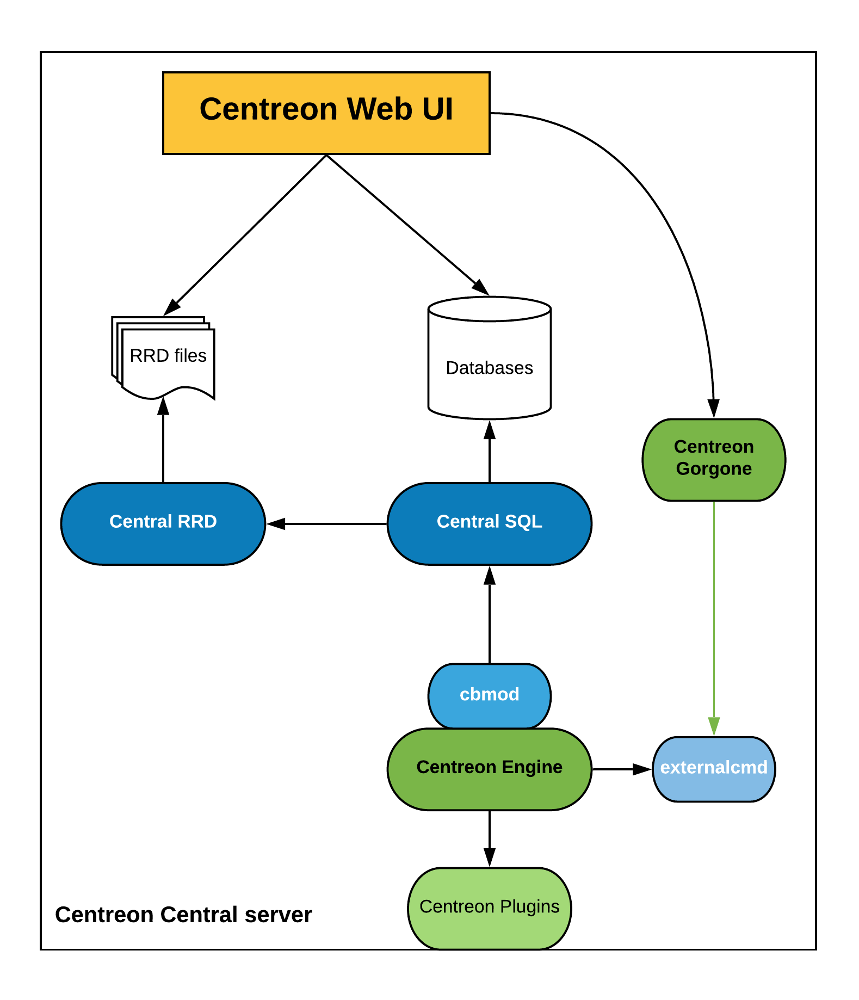
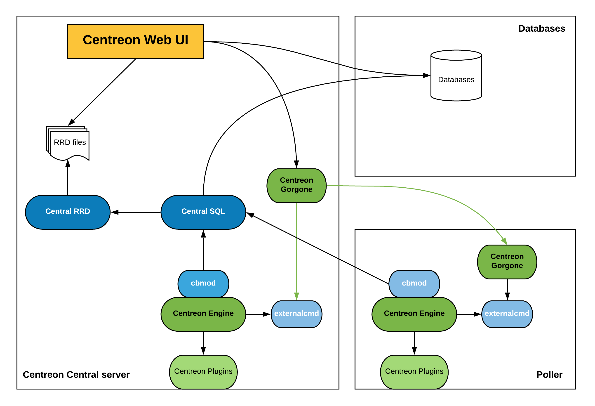

Centreon allows several choices in the composition of the architecture of your monitoring tool. In a relatively simple
architecture with a server hosting all services, the architecture can also be organized around a strategic division
that distributes the load over multiple collection servers with the establishment of collection points across multiple
continents.

## Available architectures

You will find here all architectures supported:

<!--DOCUSAURUS_CODE_TABS-->
<!--Simple architecture-->
#### Description

The simple architecture is to have all oversight entities within the same server, ie:

* Centreon web interface
* Databases (MariaDB + RRD)
* Monitoring Engine
* Broker

This architecture is the simplest a user may encounter.

#### Components

Many components are used to build this architecture:

* Apache web server for Centreon web interface
* MariaDB databases to store Centreon configuration parameters as well as monitoring and performance data
* A monitoring engine to collect data
* Collected data are sent to Centreon Broker SQL using cbmod by monitoring engine
* Centreon Broker SQL allows to store information into MariaDB databases and forward them to Centreon Broker RRD
* Centreon Broker RRD generates and updates RRD files with data in order to display performance graphs

#### Architecture

The diagram below summarizes the architecture:

<!-- Distributed-->
#### Description

The distributed architecture is to have two types of entities:

* A central Centreon server to display information
* One or more remote servers to collect data

The central Centreon server includes the following items:

* Centreon web interface
* Databases (MariaDB + RRD)
* Monitoring Engine
* Broker

The Poller includes the following items:

* Monitoring Engine
* Broker module to forward collected data to a central broker

This architecture is used for:

* Enable load balancing across multiple remote monitoring servers
* Network streams isolation: if your monitoring architecture have to monitor a DMZ area, it is easier (and safe) to place a remote server in the DMZ network

#### Components

##### Central Centreon server

Many components are used to build a central Centreon server:

* Apache web server for Centreon web interface
* MariaDB databases to store Centreon configuration parameters as well as monitoring and performance data
* The Centreon Gorgone process is used to send monitoring configuration to the remote server and to manage it
* A monitoring engine to collect data
* Collected data are sent to Centreon Broker SQL using cbmod by monitoring engine
* Centreon Broker SQL allows to store information into MariaDB databases and forward them to Centreon Broker RRD
* Centreon Broker RRD generates and updates RRD files with data in order to display performance graphs

##### Poller

Many components are used to build a poller:

* A monitoring engine to collect data
* Collected data are sent to Centreon Broker SQL using cbmod by monitoring engine

#### Architecture

The diagram below summarizes the architecture:

<!--Remote DBMS-->

#### Description

The distributed architecture with remote DBMS is to have three types of entities:

* A central Centreon server to display information
* A DBMS server to store collected data
* One or more remote servers to collect data

The central Centreon server includes the following items:

* Centreon web interface
* Monitoring Engine
* Broker
* RRD files

The DBMS server store information into MariaDB databases.

The poller includes the following items:

* Monitoring Engine
* Broker module to forward collected data to a central broker

This architecture is used for:

* Enable load balancing across multiple remote monitoring servers
* Network streams isolation: if your monitoring architecture have to monitor a DMZ area, it is easier (and safe) to place a remote server in the DMZ network
* Have a remote DBMS

#### Components

##### DBMS server

The DBMS server is used only to store Centreon configuration parameters as well as monitoring and performance data into MariaDB databases

##### Central Centreon server

Many components are used to build a central Centreon server:

* Apache web server for Centreon web interface
* The central Centreon server get configuration and collected data from DBMS server
* The Centreon Gorgone process is used to send monitoring configuration to the remote server and to manage it
* A monitoring engine to collect data
* Collected data are sent to Centreon Broker SQL using cbmod by monitoring engine
* Centreon Broker SQL allows to store information into MariaDB databases and forward them to Centreon Broker RRD
* Centreon Broker RRD generates and updates RRD files with data in order to display performance graphs

##### Poller

Many components are used to build a poller:

* A monitoring engine to collect data
* Collected data are sent to Centreon Broker SQL using cbmod by monitoring engine

#### Architecture

The diagram below summarizes the architecture:

<!--Remote Server-->
#### Description

The distributed architecture with Remote sever is to have three types of entities:

* A Centreon Central server to configure monitoring and to display & operate on collected data
* One or more Centreon Remote server to display & operate on a subset of collected data
* One or more pollers to collect data

The central Centreon server includes the following items:

* Centreon web interface(configure, display & operate)
* Monitoring Engine
* Broker
* Databases (MariaDB + RRD)

The Remote servers include the following items:

* Centreon web interface (display & operate a subset of data)
* Monitoring Engine
* Databases (MariaDB + RRD)
* Broker module to forward collected data to a central broker

This architecture is used for:

* Enable load balancing across multiple remote monitoring servers
* Network streams isolation: if your monitoring architecture has to monitor a DMZ area, it is easier (and safe) to place a remote server in the DMZ network
* Have dedicated webinterface to display & operate on a subset of data.

#### Components

##### Central Centreon server

Many components are used to build a Centreon server:

* Apache web server for Centreon web interface
* MariaDB databases to store Centreon configuration parameters as well as monitoring and performance data
* The Centreon Gorgone process is used to send monitoring configuration to the remote server and to manage it
* A monitoring engine to collect data
* Collected data are sent to Centreon Broker SQL using cbmod by monitoring engine
* Centreon Broker SQL allows to store information into MariaDB databases and forward them to Centreon Broker RRD
* Centreon Broker RRD generates and updates RRD files with data in order to display performance graphs

##### Remote monitoring server

Many components are used to build a remote server:

* Apache web server for Centreon web interface
* MariaDB databases to store monitoring and performance data
* The Centreon Gorgone process is used to operate on collected data
* A monitoring engine to collect data
* Collected data are sent to Centreon Broker SQL using cbmod by monitoring engine
* Centreon Broker SQL allows to store information into MariaDB databases and forward them to Centreon Broker RRD locally. All information are forwarded to the Centreon central server.
* Centreon Broker RRD generates and updates RRD files with data in order to display performance graphs

##### Poller

Many components are used to build a poller:

* A monitoring engine to collect data
* Collected data are sent to Centreon Broker SQL using cbmod by monitoring engine

#### Architecture

The diagram below summarizes the architecture:

<!--END_DOCUSAURUS_CODE_TABS-->

## Tables of network flows

### Tables of network flows to integrate monitoring platform to IT

#### Central server

| From           | To             | Protocol   | Port               | Application                                                                        |
|----------------|----------------|------------|--------------------|------------------------------------------------------------------------------------|
| Central server | NTP server     | NTP        | UDP 123            | Synchronization of the system clock                                                |
| Central server | DNS server     | DNS        | UDP 53             | Domain name resolution                                                             |
| Central server | SMTP server    | SMTP       | TCP 25             | Notification via email                                                             |
| Central server | LDAP(s) server | LDAP(s)    | TCP 389 (636)      | Authentication to access the Centreon web interface                                |
| Central server | DBMS server    | MySQL      | TCP 3306           | Access to Centreon databases (if deported to a dedicated server)                   |
| Central server | HTTP Proxy     | HTTP(s)    | TCP 80, 8080 (443) | If your platform needs to connect to a web proxy to access the Centreon IT Edition |
| Central server | Repository     | HTTP (FTP) | TCP 80 (FTP 20)    | Repository for system and application packages                                     |

#### Poller

| From   | To          | Protocol   | Port               | Application                                    |
|--------|-------------|------------|--------------------|------------------------------------------------|
| Poller | NTP server  | NTP        | UDP 123            | Synchronization of the system clock            |
| Poller | DNS server  | DNS        | UDP 53             | Domain name resolution                         |
| Poller | SMTP server | SMTP       | TCP 25             | Notification via email                         |
| Poller | Repository  | HTTP (FTP) | TCP 80 (FTP 20,21) | Repository for system and application packages |

#### Remote Server

| From          | To             | Protocol   | Port            | Application                                                      |
|---------------|----------------|------------|-----------------|------------------------------------------------------------------|
| Remote Server | NTP server     | NTP        | UDP 123         | Synchronization of the system clock                              |
| Remote Server | DNS server     | DNS        | UDP 53          | Domain name resolution                                           |
| Remote Server | SMTP server    | SMTP       | TCP 25          | Notification via email                                           |
| Remote Server | LDAP(s) server | LDAP(s)    | TCP 389 (636)   | Authentication to access the Centreon web interface              |
| Remote Server | DBMS server    | MySQL      | TCP 3306        | Access to Centreon databases (if deported to a dedicated server) |
| Remote Server | Repository     | HTTP (FTP) | TCP 80 (FTP 20) | Repository for system and application packages                   |

> Other flows can be necessary for Centreon web authentication (RADIUS, etc.)
> or notification system defined.

### Tables of platform flows

#### Poller

| From           | To             | Protocol     | Port         | Application                                                        |
|----------------|----------------|--------------|--------------|--------------------------------------------------------------------|
| Central server | Poller         | ZMQ          | TCP 5556     | Export of Centreon configuration (depending on communication type) |
| Central server | Poller         | SSH (legacy) | TCP 22       | Export of Centreon configuration (depending on communication type) |
| Poller         | Central server | BBDO         | TCP 5669     | Transfer of collected data                                         |
| Poller         | Central server | HTTP(S)      | TCP 80 (443) | Poller registration                                                |

#### Remote Server

| From           | To             | Protocol     | Port         | Application                                                        |
|----------------|----------------|--------------|--------------|--------------------------------------------------------------------|
| Central server | Remote Server  | ZMQ          | TCP 5556     | Export of Centreon configuration                                   |
| Remote Server  | Central server | BBDO         | TCP 5669     | Transfer of collected data                                         |
| Remote Server  | Central server | HTTP(S)      | TCP 80 (443) | Remote Server registration                                         |
| Remote Server  | Poller         | ZMQ          | TCP 5556     | Export of Centreon configuration (depending on communication type) |
| Remote Server  | Poller         | SSH (legacy) | TCP 22       | Export of Centreon configuration (depending on communication type) |
| Poller         | Remote Server  | BBDO         | TCP 5669     | Transfer of collected data                                         |
| Poller         | Remote Server  | HTTP(S)      | TCP 80 (443) | Poller registration                                                |

> If Remote Server is not used as proxy for a Poller, Poller network flows
> apply.

#### Monitoring

| From              | To                               | Protocol   | Port      | Application |
|-------------------|----------------------------------|------------|-----------|-------------|
| Poller            | Network equipment, servers, etc. | SNMP       | UDP 161   | Monitoring  |
| Network equipment | Poller                           | Trap SNMP  | UDP 162   | Monitoring  |
| Poller            | Servers                          | NRPE       | TCP 5666  | Monitoring  |
| Poller            | Servers                          | NSClient++ | TCP 12489 | Monitoring  |

> If the Centreon server is a poller too, do not forget to open monitoring
> flows.

> Other flows can be necessary to monitor databases, access to API, or
> application ports.