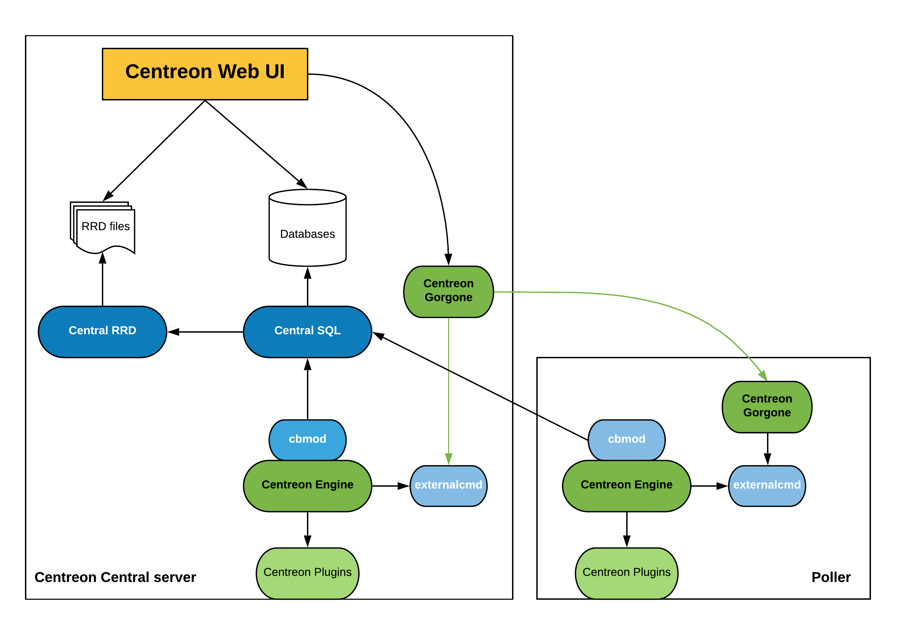
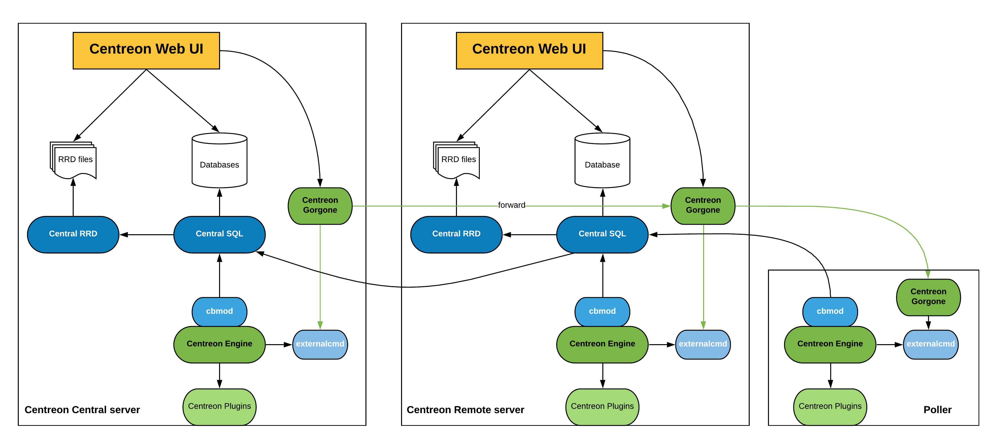

Centreon allows several choices in the composition of the architecture of your monitoring tool. In a relatively simple
architecture with a server hosting all services, the architecture can also be organized around a strategic division
that distributes the load over multiple collection servers with the establishment of collection points across multiple
continents.

You will find here all architectures supported:

<!--DOCUSAURUS_CODE_TABS-->
<!--Simple architecture-->
#### Description

The simple architecture is to have all oversight entities within the same server, ie:

* Centreon web interface
* Databases (MariaDB + RRD)
* Monitoring Engine
* Broker

This architecture is the simplest a user may encounter.

#### Components

Many components are used to build this architecture:

* Apache web server for Centreon web interface
* MariaDB databases to store Centreon configuration parameters as well as monitoring and performance data
* A monitoring engine to collect data
* Collected data are sent to Centreon Broker SQL using cbmod by monitoring engine
* Centreon Broker SQL allows to store information into MariaDB databases and forward them to Centreon Broker RRD
* Centreon Broker RRD generates and updates RRD files with data in order to display performance graphs

#### Architecture

The diagram below summarizes the architecture:

<!-- Distributed-->
#### Description

The distributed architecture is to have two types of entities:

* A central Centreon server to display information
* One or more remote servers to collect data

The central Centreon server includes the following items:

* Centreon web interface
* Databases (MariaDB + RRD)
* Monitoring Engine
* Broker

The Poller includes the following items:

* Monitoring Engine
* Broker module to forward collected data to a central broker

This architecture is used for:

* Enable load balancing across multiple remote monitoring servers
* Network streams isolation: if your monitoring architecture have to monitor a DMZ area, it is easier (and safe) to place a remote server in the DMZ network

#### Components

##### Central Centreon server

Many components are used to build a central Centreon server:

* Apache web server for Centreon web interface
* MariaDB databases to store Centreon configuration parameters as well as monitoring and performance data
* The Centreon Gorgone process is used to send monitoring configuration to the remote server and to manage it
* A monitoring engine to collect data
* Collected data are sent to Centreon Broker SQL using cbmod by monitoring engine
* Centreon Broker SQL allows to store information into MariaDB databases and forward them to Centreon Broker RRD
* Centreon Broker RRD generates and updates RRD files with data in order to display performance graphs

##### Poller

Many components are used to build a poller:

* A monitoring engine to collect data
* Collected data are sent to Centreon Broker SQL using cbmod by monitoring engine

#### Architecture

The diagram below summarizes the architecture:

<!--Deported DBMS-->
#### Description

The distributed architecture with remote DBMS is to have three types of entities:

* A central Centreon server to display information
* A DBMS server to store collected data
* One or more remote servers to collect data

The central Centreon server includes the following items:

* Centreon web interface
* Monitoring Engine
* Broker
* RRD files

The DBMS server store information into MariaDB databases.

The poller includes the following items:

* Monitoring Engine
* Broker module to forward collected data to a central broker

This architecture is used for:

* Enable load balancing across multiple remote monitoring servers
* Network streams isolation: if your monitoring architecture have to monitor a DMZ area, it is easier (and safe) to place a remote server in the DMZ network
* Have a remote DBMS

#### Components

##### DBMS server

The DBMS server is used only to store Centreon configuration parameters as well as monitoring and performance data into MariaDB databases

##### Central Centreon server

Many components are used to build a central Centreon server:

* Apache web server for Centreon web interface
* The central Centreon server get configuration and collected data from DBMS server
* The Centreon Gorgone process is used to send monitoring configuration to the remote server and to manage it
* A monitoring engine to collect data
* Collected data are sent to Centreon Broker SQL using cbmod by monitoring engine
* Centreon Broker SQL allows to store information into MariaDB databases and forward them to Centreon Broker RRD
* Centreon Broker RRD generates and updates RRD files with data in order to display performance graphs

##### Poller

Many components are used to build a poller:

* A monitoring engine to collect data
* Collected data are sent to Centreon Broker SQL using cbmod by monitoring engine

#### Architecture

The diagram below summarizes the architecture:

<!--Remote Server-->
#### Description

The distributed architecture with Remote sever is to have three types of entities:

* A Centreon Central server to configure monitoring and to display & operate on collected data
* One or more Centreon Remote server to display & operate on a subset of collected data
* One or more pollers to collect data

The central Centreon server includes the following items:

* Centreon web interface(configure, display & operate)
* Monitoring Engine
* Broker
* Databases (MariaDB + RRD)

The Remote servers include the following items:

* Centreon web interface (display & operate a subset of data)
* Monitoring Engine
* Databases (MariaDB + RRD)
* Broker module to forward collected data to a central broker

This architecture is used for:

* Enable load balancing across multiple remote monitoring servers
* Network streams isolation: if your monitoring architecture has to monitor a DMZ area, it is easier (and safe) to place a remote server in the DMZ network
* Have dedicated webinterface to display & operate on a subset of data.

#### Components

##### Central Centreon server

Many components are used to build a Centreon server:

* Apache web server for Centreon web interface
* MariaDB databases to store Centreon configuration parameters as well as monitoring and performance data
* The Centreon Gorgone process is used to send monitoring configuration to the remote server and to manage it
* A monitoring engine to collect data
* Collected data are sent to Centreon Broker SQL using cbmod by monitoring engine
* Centreon Broker SQL allows to store information into MariaDB databases and forward them to Centreon Broker RRD
* Centreon Broker RRD generates and updates RRD files with data in order to display performance graphs

##### Remote monitoring server

Many components are used to build a remote server:

* Apache web server for Centreon web interface
* MariaDB databases to store monitoring and performance data
* The Centreon Gorgone process is used to operate on collected data
* A monitoring engine to collect data
* Collected data are sent to Centreon Broker SQL using cbmod by monitoring engine
* Centreon Broker SQL allows to store information into MariaDB databases and forward them to Centreon Broker RRD locally. All information are forwarded to the Centreon central server.
* Centreon Broker RRD generates and updates RRD files with data in order to display performance graphs

##### Poller

Many components are used to build a poller:

* A monitoring engine to collect data
* Collected data are sent to Centreon Broker SQL using cbmod by monitoring engine

#### Architecture

The diagram below summarizes the architecture:

<!--END_DOCUSAURUS_CODE_TABS-->