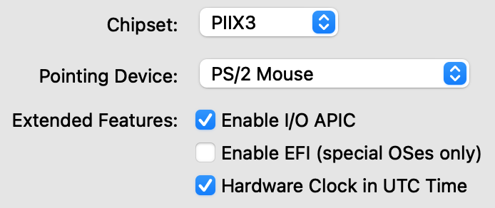

> If you want to install Centreon on CentOS / Oracle Linux / RHEL distribution
> in version 8, you must [use RPM packages](./using-packages.html)

**Prerequisites**

This virtual machine is available in OVA format for VMware environment and for
Oracle VirtualBox tool. It is based on **Linux CentOS 7** operating system
including a Centreon installation allowing to easily start your first monitoring.

The virtual machine needs:

- Processor: any recent Intel or AMD processor with at least 2 vCPUs should be enough.
- Memory: depending on your operating system, you will need at least 1 GB of RAM. To fully enjoy Centreon's experience, you need at least 2 GB of free memory.
- Hard Disk storage: The virtual machine requires at least 6.5 GB of free space on your hard disk. However, if you want keep using Centreon, it is recommended to have at least 10 GB as its size will grow over time.

## Download

The virtual machine is available on the [Centreon download web site](https://download.centreon.com).

> The virtual machine may not have a network adapter configured. If so, you will
> have to configure a network adapter in your virtual machine before you proceed.

## Importing

<!--DOCUSAURUS_CODE_TABS-->

<!--VMware environment-->
\
Go to to **File > Deploy OVF Template** and select the **OVA file**. Since the
menu selections are actually linked to your specific VMWare configuration, we
are unable to provide more information. Be advised that best practice is to use
the **Thin Provision** option to save as much free space as possible on the disk.

<!--Oracle Virtualbox-->
\
Extract the contents of the archive and double-click on the **OVA file**. Follow
the instructions to import the virtual machine.
Edit your virtual machine and in the **System** tab, check the
**Hardware Clock in UTC Time** box, then click on **OK**.

<!--END_DOCUSAURUS_CODE_TABS-->

Once your virtual machine is imported, you will need to **add a network card**. Edit the settings of the virtual machine and
a network card. Select the correct associated network to access to Internet.

The virtual machine can now be started.

## First boot

Once your virtual machine has started. You must connect to it via a shell terminal and perform the requested operations.

> It is imperative that you complete the instructions, especially operations 4 and 5.

Once those operations have been carried out, you can delete this message by deleting the /etc/profile.d/centreon.sh file.

## Default credentials

- The default Centreon web interface account is: **admin / centreon**.
- The server administration account (through SSH) is: **root / centreon**.
- The root password of the DBMS is not initialized.

> For security reasons, we highly recommend you to change those passwords after the installation completed.

You can now move to the *First login* section.

## First login

To connect to your Centreon web interface access to URL: http://IP_ADDRESS/centreon
****
> Replace ****IP_ADDRESS**** by the IP address or FQDN of your Centreon web server.

Fill in your user name and associated password and click on **Connect** button:

You are now connected to the Centreon web interface.

## Secure your platform

Don't forget to secure your Centreon platform following our
[recommendations](../../administration/secure-platform.html)

## Getting started

Go to the [Getting Started](../../getting-started/installation-first-steps.html)
chapter to configure your first monitoring.