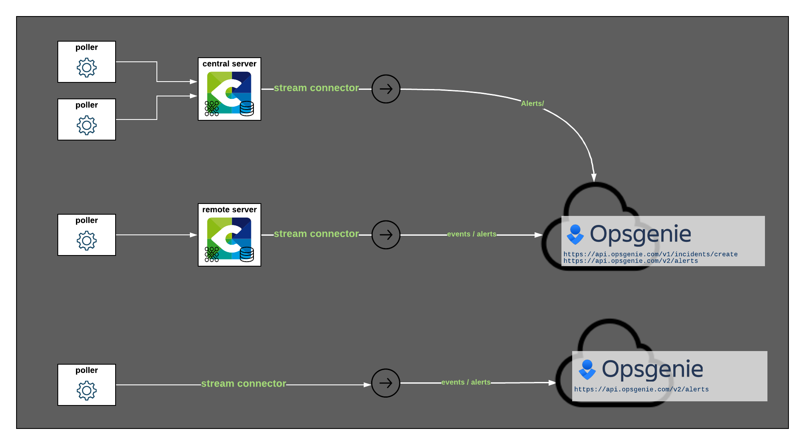

## Opsgenie + Centreon Integration Benefits

* Manage your notifications when an alert is detected by Centreon.
* Deduplicate your alerts from Centreon
* Distinguish alerts from incidents using Centreon BAM and Opsgenie
* Create reporting based on your notifications from Centreon

## How it Works

* Every time a service, a host or a BA state is checked, the event passes through Centreon Broker, which loads the Stream Connector to send state changes.
* State changes can occur in case of an anomaly detection.
* An alias is generated for each alert to make use of Opsgenie deduplication:



## Requirements

* Opsgenie integration requires two different API key. The first one is an integration API key coming from the **Rest API HTTPS over JSON** integration. This integration must have the **Create and Update Access**. The second access is an API key coming from the **APP Settings**. This key must have the **Create and Update** access right. 
* It is also necessary to use a Centreon account with either **admin privileges** or **Export configuration** and **Broker configuration** menu access in the WUI, as well as a **`root` access in command-line interface**.

## Support

If you need help with this integration, depending on how you are using Centreon, you can:

* **Commercial Edition customers**: please contact the [Centreon Support team](mailto:support@centreon.com).
* **Open Source Edition users** or **Centreon IT-100 users** (free versions): please reach our [Community Slack](https://centreon.github.io) where our users and staff will try to help you.

## Integration Walkthrough

### In Opsgenie

> Warning, this documentation was written in February 2021, it is possible that certain elements described below became obsoletes due to changes on Opsgenie.

#### Opsgenie integration: alerts

1. From the **Settings** menu, select **Integration list**.
2. In the integration list, add an **API** integration (Rest API HTTPS over JSON).
3. Head over the **Configured integrations** menu and edit your **API** integration to enable it if it is not. You also must to give it a **Create and Update Access**. Save your configuration and the **API Key** that is mandatory to send alerts from Centreon to Opsgenie. This **API key** is referred as **integration_api_token** in the Centreon configuration.

#### Opsgenie integration: incidents

1. Before starting, this integration will only work if you are using the Centreon BAM module.
2. From the **Settings** menu, select **API key management** in the subcategory **APP SETTINGS**.
3. In the **API key management** menu, add a new API key with **Create and Update** access
4. Save your configuration and your **Api key** that is mandatory to send incidents from Centreon to Opsgenie. This **API key** is referred as **app_api_token** in the Centreon configuration.

### In Centreon

#### Installation 

Login as `root` on the Centreon central server using your favorite SSH client.

In case your Centreon central server must use a proxy server to reach the Internet, you will have to export the `https_proxy` environment variable and configure `yum` to be able to install everything.

```bash
export https_proxy=http://my.proxy.server:3128
echo "proxy=http://my.proxy.server:3128" >> /etc/yum.conf
```

Now that your Centreon central server is able to reach the Internet, you can run:

```bash
yum install -y lua-curl epel-release
```

These packages are necessary for the script to run. Now let's download the script:

```bash
wget -O /usr/share/centreon-broker/lua/opsgenie.lua https://raw.githubusercontent.com/centreon/centreon-stream-connector-scripts/master/centreon-certified/opsgenie/opsgenie-apiv1.lua
chmod 644 /usr/share/centreon-broker/lua/opsgenie.lua
```

The Opsgenie Stream Connnector is now installed on your Centreon central server!

#### Broker configuration

1. Login to the Centreon WUI using an administrator account.
2. Navigate to the **Configuration** > **Pollers** menu and select **Broker configuration**.
3. Click on the **central-broker-master** broker configuration object and navigate to the **Output** tab.
4. Add a new **Generic - Stream connector** output.
5. Name it as you want (eg. **Opsgenie**) and set the right path for the LUA script: `/usr/share/centreon-broker/lua/opsgenie.lua`.
6. Add at least one string parameter. That parameter is a key that must be configured. The parameter name *must be* `app_api_token` (for the alerts) or `integration_api_token` (for the incidents, requires the Centreon BAM module). If you want to use both aspects then you need to add both parameters in your configuration

| Name                      | Type   | Value                   |
| ------------------------- | ------ | ----------------------- |
| `app_api_token`           | String | `<paste your key here>` |
| `integration_api_token`   | String | `<paste your key here>` |

7. Save your configuration, then navigate to the **Configuration** > **Pollers** menu and select **Pollers**.
8. Select the **Central** poller and click on **Export configuration**.
9. Keep **Generate Configuration Files** and **Run monitoring engine debug (-v)** checked and select **Move Export Files** and then click on the **Export** button.
10. Restart the `cbd` service:

```bash
systemctl restart cbd
```

Now your central server has loaded the Opsgenie Stream Connector and has started to send data!

To make sure that everything goes fine, you should have a look at `central-broker-master.log` and `connector-opsgenie.log`, both located in `/var/log/centreon-broker`.

#### Advanced configuration

**Parameters table**

| Name                        | Type   | Default value                                                           | Description                                    |
| --------------------------- | ------ | ----------------------------------------------------------------------- | ---------------------------------------------- |
| `api_url`                   | String | `https://api.opsgenie.com`                                              | Opsgenie api address. Use https://api.eu.opsgenie.com if your instance is in Europe |               
| `proxy_address`             | String |                                                                         | If needed, the address of the proxy server (requires proxy_port option) |
| `proxy_port`                | String |                                                                         | The port of the proxy server |                 
| `proxy_username`            | String |                                                                         | If needed, the proxy user (requires proxy_password option) |                 
| `proxy_password`            | String |                                                                         | the proxy user password |                  
| `logfile`                   | String | `/var/log/centreon-broker/connector-opsgenie.log`                       | logfile for the stream connector |     
| `host_status`               | String | `0,1,2`                                                                 | send event for up, down and unreachable hosts |               
| `service_status`            | String | `0,1,2,3`                                                               | send event for ok, warning, critical, unknown services |               
| `ba_status`                 | String | `0,1,2`                                                                 | send event for ok, warning, critical business activities |
| `hard_only`                 | Number | `1`                                                                     | Only send events in hard state |               
| `acknowledged`              | Number | `0`                                                                     | Only send events that are not acknowledged |               
| `element_type`              | String | `host_status,service_status,ba_status`                                  | Send host, service, BA centreon status event |               
| `category_type`             | String | `neb,bam`                                                               | Filter out non neb or bam events |               
| `in_downtime`               | Number | `0`                                                                     | Only send events that are not in downtime |               
| `max_buffer_size`           | Number | `1`                                                                     | Send events one at a time |               
| `max_buffer_age`            | Number | `5`                                                                     | Store events for 5 second before sending them unless max_buffer_size is reached before  |               
| `max_stored_events`         | Number | `10`                                                                    | Keep event in cache to avoid sending duplicated events, change with caution |               
| `skip_anon_events`          | Number | `1`                                                                     | Do not send events from hosts or services that are not found in the broker cache |               
| `skip_nil_id`               | Number | `1`                                                                     | Do not send events from objects that do not have an ID (meta services most of the time) |               
| `accepted_hostgroups`       | String |                                                                         | List of hostgroups in which the host must be (coma separeted eg: grp1,grp2,grp3) |               
| `date_format`               | String | `%Y-%m-%d %H:%M:%S`                                                     | The default date format for converted timestamps (https://www.lua.org/pil/22.1.html) |               
| `host_alert_message`        | String | `{last_update_date} {hostname} is {state}`                              | The default message for host alerts. See [host event macros](./opsgenie.html#host-event-macros) for more details about macros |
| `host_alert_description`    | String |                                                                         | The default description of a host alert. See [host event macros](./opsgenie.html#host-event-macros) for more details about macros |
| `host_alert_alias`          | String | `{hostname}_{state}`                                                    | The default alias for a host alert, useful for alert deduplication. See [host event macros](./opsgenie.html#host-event-macros) for more details about macros  |
| `service_alert_message`     | String | `{last_update_date} {hostname} // {serviceDescription} is {state}`      | The default message for service alerts. See [service event macros](./opsgenie.html#service-event-macros) for more details about macros |
| `service_alert_description` | String |                                                                         | The default description of a service alert. See [service event macros](./opsgenie.html#service-event-macros) for more details about macros |
| `service_alert_alias`       | String | `{hostname}_{serviceDescription}_{state}`                               | The default alias for a service alert, useful for alert deduplication. See [service event macros](./opsgenie.html#service-event-macros) for more details about macros  |
| `ba_incident_message`       | String | `{baName} is {state}, health level reached {level_nominal}`             | The default message for a ba incident. See [BA event macros](./opsgenie.html#ba-event-macros) for more details about macros |
| `ba_incident_description`   | String |                                                                         | The default description of a ba incident. See [BA event macros](./opsgenie.html#ba-event-macros) for more details about macros |
| `enable_incident_tags`      | Number | `1`                                                                     | Add tags to incidents |
| `get_bv`                    | Number | `1`                                                                      | Add BV names as tags if `enable_incident_tags` is set to `1`
| `ba_incident_tags`          | String | `centreon,applications`                                                 | List of tags for an incident. must be coma separeted. It will automatically add all the BV related to the BA as tags |
| `enable_severity`           | Number | `0`                                                                     | If set to 1, tries to match a Centreon severity value to an Opsgenie priority. |
| `priority_must_be_set`      | Number | `0`                                                                     | Will drop the alert if set to 1 and it can't match the severity with a priority according to the relation set in the `priority_matching` parameter |
| `priority_matching`         | String | `P1=1,P2=2,P3=3,P4=4,P5=5`                                              | Links priorities to severities with the following syntax: priority_name=severity_value,priority_name=severity_value. |
| `opsgenie_priorities`       | String | `P1,P2,P3,P4,P5`                                                        | Coma separeted list of Opsgenie priorities |

**Remarks**

* A value of 2 for `log_level` is fine for initial troubleshooting, but can generate a huge amount of logs if you monitor a lot of hosts. In order to get less log messages, you should keep it a 1.

---------------

## How to Uninstall

1. Login to the Centreon WUI using an administrator account.
2. Navigate to the **Configuration** > **Pollers** menu and select **Broker configuration**.
3. Click on the **central-broker-master** broker configuration object and navigate to the **Output** tab.
4. Delete the **Generic - Stream connector** output by clicking on the red circled cross at the end of the line.
5. Save your configuration, then navigate to the **Configuration** > **Pollers** menu and select **Pollers**.
6. Select the **Central** poller and click on **Export configuration**.
7. Keep **Generate Configuration Files** and **Run monitoring engine debug (-v)** checked and select **Move Export Files** and then click on the **Export** button.
8. Restart the `cbd` service:

```bash
systemctl restart cbd
```

The Stream Connector is not loaded anymore!

9. Optionally, you can even delete the script file:

```bash
rm -f /usr/share/centreon-broker/lua/opsgenie.lua
```

## Macros

Macros are a tool to create dynamic messages depending on the event you want to send. They must be enclosed by {} (eg: {hostname}). If a macro is a time type macro then you will be able to use **\_date suffix** to convert it to a human readable format. You can Change this format using the string parameter `date_format` (eg: {last_update} is a timestamp macro. You can use {last_update_date} to have it converted)

#### Host event macros

| Macro name |
| ---------- |
| hostname   |

All the Properties in the [Host status](../../developer/developer-broker-mapping.html#host-status) table are also usable

#### Service event macros

| Macro name           |
| -------------------- |
| hostname             |
| serviceDescription   |

All the Properties in the [Service status](../../developer/developer-broker-mapping.html#service-status) table are also usable

#### BA event macros

| Macro name    |
| ------------- |
| baName        |
| baDescription |

All the Properties in the [Ba status event](../../developer/developer-broker-mapping.html#ba-status-event) table are also usable