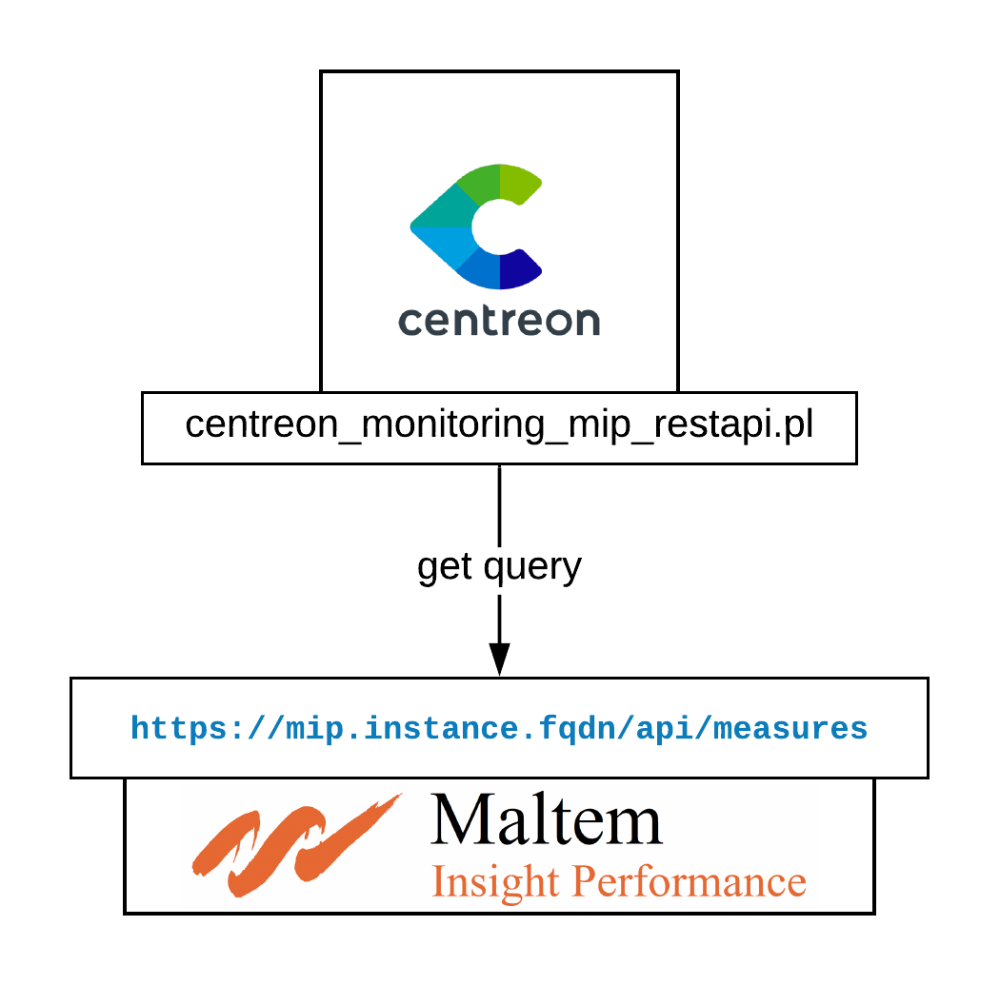
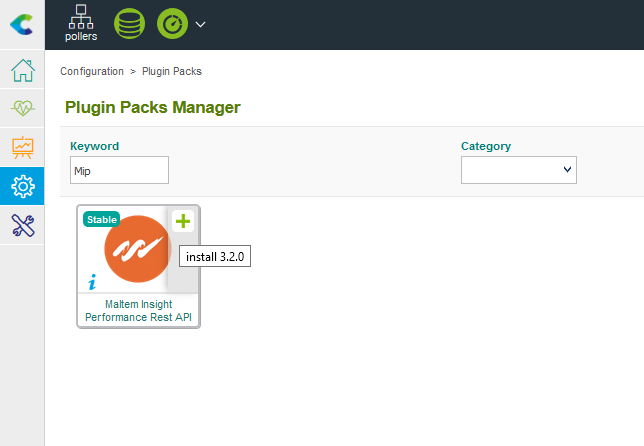

## Overview 

Maltem Insight Performance (MIP) provides solutions to measure performance of web applications and thick clients through custom scenarios. It provides an API to gather metrics and status associated to the end-user experience from various locations.

## How it works

The MIP instance exposes a JSON based RestAPI. Centreon connector uses this endpoint to fetch relevant data about Digital Experience Monitoring Scenarios 



## Compatibility

The connector has been tested with MIP v 6.4.90 and its API. 

## Requirements

### MIP

To be able to get data from MIP API, you must have a valid API key. Contact MIP support or sales representative to get one. 

### Centreon

<!--DOCUSAURUS_CODE_TABS-->

<!--Online IMP Licence & IT-100 Editions-->

1. Install the MIP plugin on each poller monitoring MIP endpoints:

```bash
yum install -y centreon-plugin-Applications-Monitoring-Mip-Restapi`
```

2. Install the Plugin-Pack RPM on your Central Server:

<!--Offline IMP License-->

1. Install the MIP plugin on each poller monitoring MIP endpoints:

```bash
yum install -y centreon-plugin-Applications-Monitoring-Mip-Restapi`
```

2. Install the Plugin-Pack RPM on your Central Server: 

```bash
yum install -y centreon-pack-applications-monitoring-mip-restapi`
```

3. Install the Plugin-Pack through "Configuration \> Plugin-Packs \> Manager" menu:



<!--END_DOCUSAURUS_CODE_TABS-->

## Configuration

### Hosts

You can now add a new host based on the **App-Monitoring-Mip-Restapi-custom** host template. The host macros marked hereafter as "mandatory" need to be configured:


| Mandatory   | Name                 | Description                                              |
| :---------- | :------------------- | :------------------------------------------------------- |
|     x       | MIPAPIPROTO          | Protocol used to connect to MIP API. Default: https      |
|     x       | MIPAPIPORT           | Port used to connect to MIP API. Default: 443            |
|     x       | MIPAPIHOSTNAME       | MIP Instance FQDN                                        |
|     x       | MIPAPIKEY            | MIP API Key                                              |
|             | MIPAPIEXTRAOPTIONS   | Any relevant extraoptions (proxy, http-backend, etc.)    |
|     x       | MIPAPITIMEOUT        | Timeout to use during API requests                       |

Set the 'Create service linked to template" option to 'No' and save your configuration. 

### Services

A discovery rule is available to get all your scenarios and quickly configure them as Centreon services. Here is a step-by-step guide: 

 
* Go to "Configuration > Services" and click "Scan" in the Discovery sub menu
* Fill the Host box with the hostname configured in the previous section
* Select 'App-Monitoring-Mip-Scenarios' in the rule drop-down list on the left

* Click Scan to launch the discovery process

* Check the boxes associated to the scenario you want to monitor 

* Save and then go to the 'Configuration > Pollers' menu to export your configuration
