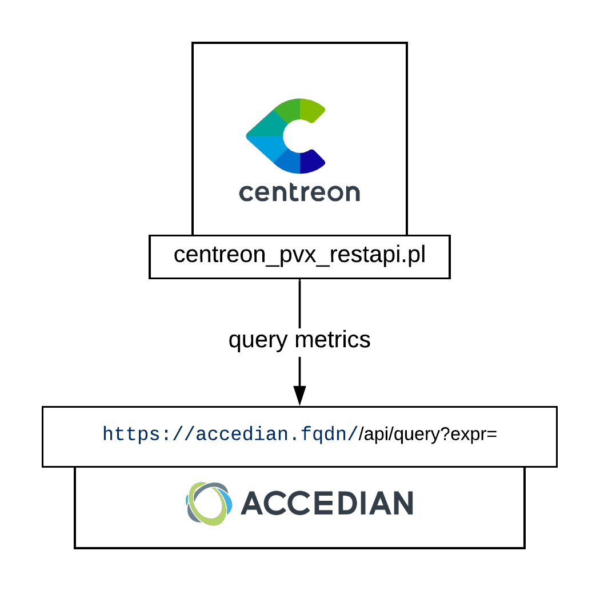
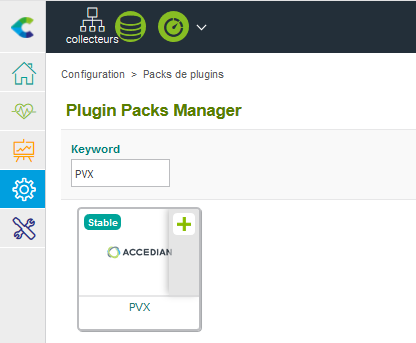

## How it works

Every PVX-Skylight instance provides XML API endpoints allowing Centreon to
perform queries against it.



## Compatibility

The connector has been tested with the following versions: \* PVX version 5.1.1

## Requirements

### PVX

To query PVX API, you need to generate an access key. This key will never expire
and the procedure below is an extract from the official documentation
<http://docs.performancevision.com/api_use.html>.

Follow these steps to get your API key. In each step replace the value of the
macros enclosed by '\< \>' with yours.

Command: `curl -k
'https://**<pvxapihost>**/api/login?user=**<user>**&password=**<password>**'`

Result:

``` json
{
    "type": "result",
    "result": "**session:91554086-842b-4b73-9028-c51d20d91b94**"
}
```

Thanks to the obtained session ID, execute the command below get a secret key

Command: `curl -k
'https://<pvxapihost>/api/create-api-key?name=**<keyname>**&_session=session:91554086-842b-4b73-9028-c51d20d91b94'`

Result:

``` json
{
    "type": "result",
    "result": "**secret:e40b1cc6-f629-43a4-8be6-14a9c9f036e0**"
}
```

In this example the API key is "secret:e40b1cc6-f629-43a4-8be6-14a9c9f036e0".

### Centreon

On each poller connecting to a PVX host, install the plugin:

`[root@cps-demo-central ~]# yum install -y
centreon-plugin-Applications-Pvx-Restapi.noarch`

On your central server, install the plugin-pack through "Configuration \>
Plugin-Packs \> Manager" menu:



> :warning: **If you are using an offline IMP license**: Make sure to install
> the package RPM first with command below

`[root@cps-demo-central ~]# yum install -y
centreon-pack-applications-pvx-restapi.noarch`

## Getting started

You can now deploy hosts based upon the **App-Pvx-Application-Restapi-custom**.
