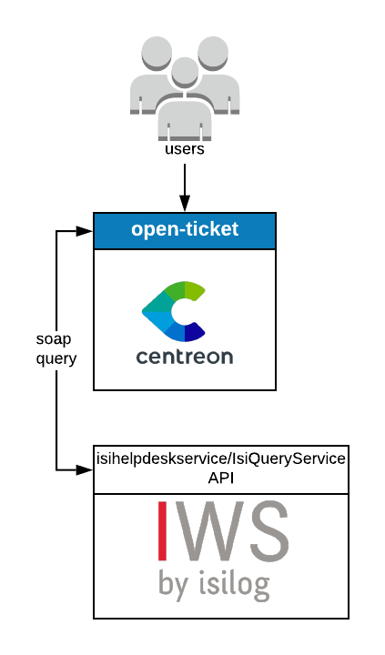

## How it works

The IWS Isilog provider uses the SOAP API of Isilog to retrieve data in order to
open a ticket. Since it gathers a lot of configurations objects from Isilog, it
puts them in cache. Loging out or waiting 10 hours will flush the cache.

## Compatibility

This connector is compatibile with at least the following versions of Isilog:

| Component   | Version             |
| ----------- | ------------------- |
| Product     | IWS Infinity V4.1.0 |
| Referential | 3.0.0               |
| Framework   | 4.0.0.0             |

## Requirements

Before going any further, make sure that you correctly setup
[centreon-open-ticket](https://documentation.centreon.com/docs/centreon-open-tickets/en/latest/installation/index.html)
into your Centreon instance

Our provider requires the following parameters:

| Parameter     | Example of value                 |
| ------------- | -------------------------------- |
| Address       | demo.iws-saas.fr/isilogwebsystem |
| Username      | MyAccount                        |
| Password      | MyPassword                       |
| Database name | MyDatabase                       |
| Protocol      | https                            |
| Timeout       | 60                               |

## Possibilities

As of now you'll only be able to open a ticket and close it from Centreon. In
the near future you'll be able to fill the following parameters when opening a
ticket

  - Origin
  - Impact
  - Urgency
  - Service
  - Category
  - Team
  - Element
