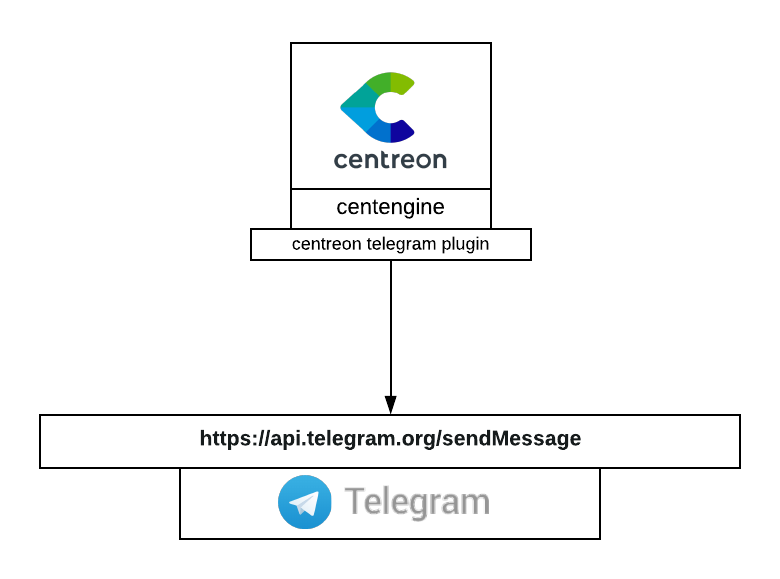
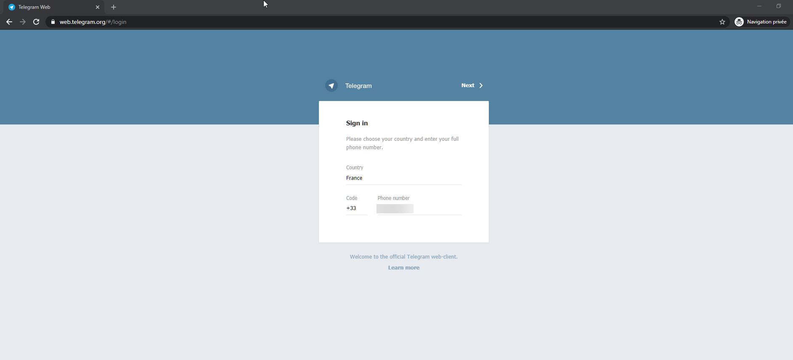
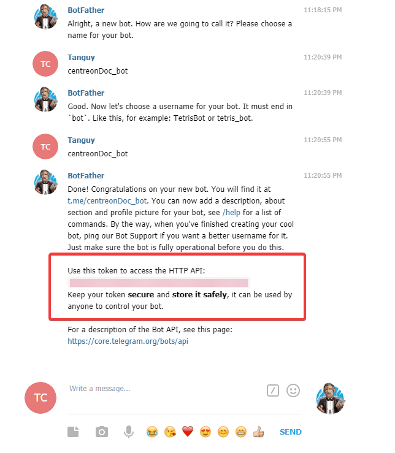
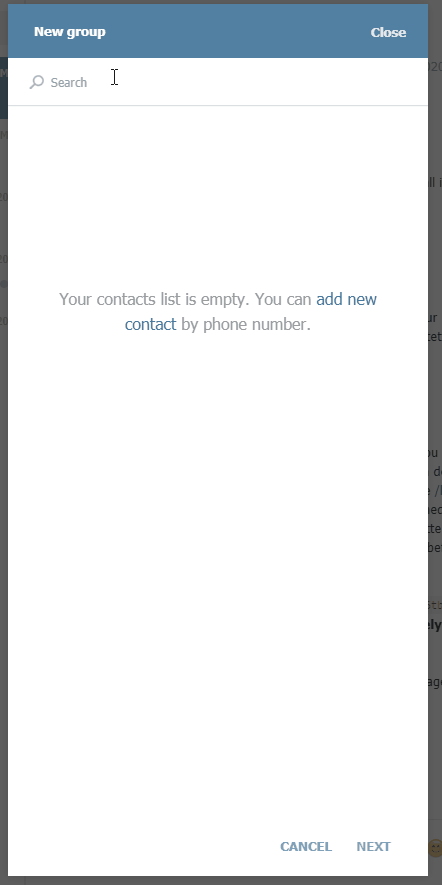
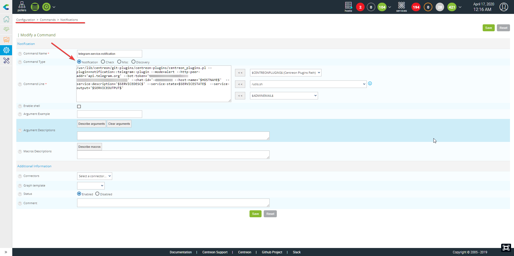
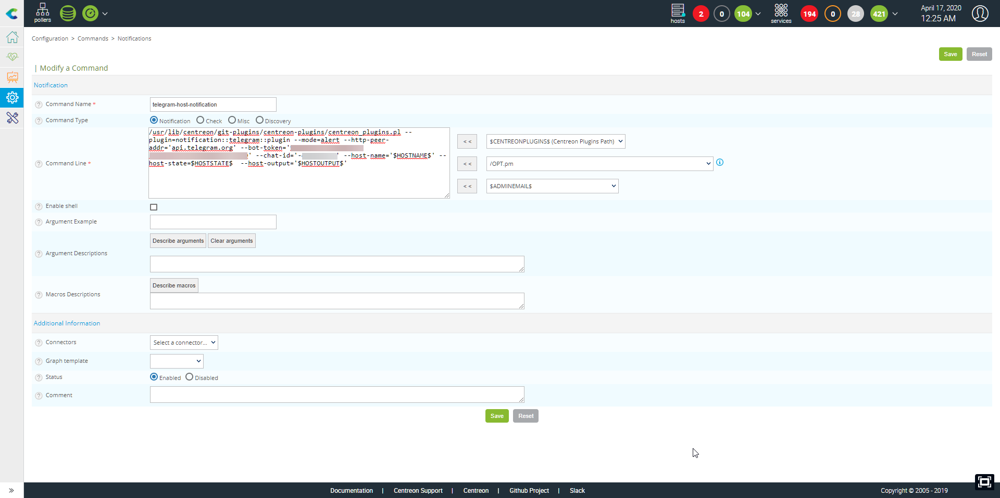
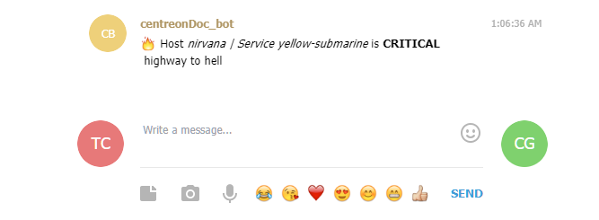
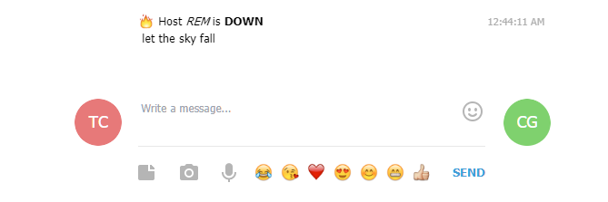

## Introduction

This documentation is brought to you thanks to our partner PILPRE Yann from

## How it works
Telegram notifications connector uses the perl Centreon plugin to send notification through Telegram using their REST API

## Installation

### centreon plugin with telegram

First of all, you need the Centreon Telegram plugin to be installed on your Centreon server

`
yum install git
mkdir /usr/lib/centreon/git-plugins
cd /usr/lib/centreon/git-plugins
git clone https://github.com/centreon/centreon-plugins.git
chown -R centreon-engine. /usr/lib/centreon/git-plugins
`

### Telegram configuration

First of all, reach https://web.telegram.org and sign in

Then, proceed to talk to the BotFather and tell him the following command

`/newbot`

As asked by the BotFather, you need to give your bot a name and a username for your bot. This one must end with **_bot**.
To avoid confusion, you can use the same name for both like shown in the picture below.

Like said by the BotFather, it is very important that you **save your token**. We are going to need it to send notifications later on.

Now we need to create a new group. To do so, use the telegram menu as follow

When creating your group, add your bot to it

## Configuration

### Get your chat-id from telegram
On the telegram webapp page, click on the group you created earlier and get your chat-id from the url

for example, if the url is as follow: **https://web.telegram.org/#/im?p=g123456** then, your chat-id is **123456**.

> Note that while 123456 is your chat-id, you'll need to use **-123456** in your configuration  otherwise it won't work

### Command creation in Centreon

#### Service notification command

`
/usr/lib/centreon/git-plugins/centreon-plugins/centreon_plugins.pl --plugin=notification::telegram::plugin --mode=alert
--http-peer-addr='api.telegram.org' --bot-token='xxxxxxxxxxxxxxxxxxxxxxxxxxxxxxxxxxx'
--chat-id='-xxxxxxxxxx' --host-name='$HOSTNAME$'  --service-description='$SERVICEDESC$' --service-state=$SERVICESTATE$  
--service-output='$SERVICEOUTPUT$'
`

#### Host notification command

`
/usr/lib/centreon/git-plugins/centreon-plugins/centreon_plugins.pl --plugin=notification::telegram::plugin --mode=alert
--http-peer-addr='api.telegram.org' --bot-token='xxxxxxxxxxxxxxxxxxxxxxxxxxxxxxxxxxxxxxx'
--chat-id='-xxxxxxx' --host-name='$HOSTNAME$' --host-state=$HOSTSTATE$  --host-output='$HOSTOUTPUT$'
`

## Exemple

`
/usr/lib/centreon/git-plugins/centreon-plugins/centreon_plugins.pl --plugin=notification::telegram::plugin --mode=alert
--http-peer-addr='api.telegram.org' --bot-token='xxxxxxxxxxxxxxxxxxxxxxxxxxxxxxxxxxx' --chat-id='-xxxxxxxx'
--host-name='nirvana'  --service-description='yellow-submarine' --service-state=CRITICAL  --service-output='highway to hell'
`

`
/usr/lib/centreon/git-plugins/centreon-plugins/centreon_plugins.pl --plugin=notification::telegram::plugin --mode=alert
--http-peer-addr='api.telegram.org' --bot-token='xxxxxxxxxxxxxxxxxxxxxxxxxxxxxxxxxxx' --chat-id='-xxxxxxx'
--host-name='REM' --host-state=DOWN  --host-output='let the sky fall'
`

## Message options

When sending your notification you can add various options that you can list using the `--help` option of the Centreon plugin
Below are some of the available options

| Options | Explanation | Example |
| ------- | ----------- | ------- |
| --centreon-token | an autologin token from centreon ||
| --centreon-url | the centreon url ||
| --graph-url | graph url. You can use the above options as macro here | **%{centreon_url}**/include/views/graphs/generateGraphs/generateImage.php?username=myuser&token=**%{centreon_token}**&hostname=**%{host_name}**&service=**%{service_description}**|
| --link-url | a link url | **%{centreon_url}**/main.php?p=20201&o=svc&host_search=**%{host_name}**&svc_search=**%{service_description}** |
| --proxyurl | the url to your proxy if needed ||

all options can be displayed with the following command:
`/usr/lib/centreon/git-plugins/centreon-plugins/centreon_plugins.pl --plugin=notification::telegram::plugin --mode=alert --help`
