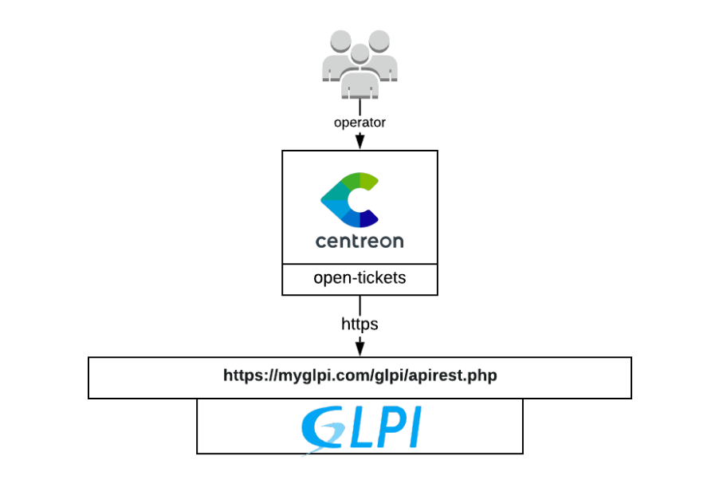
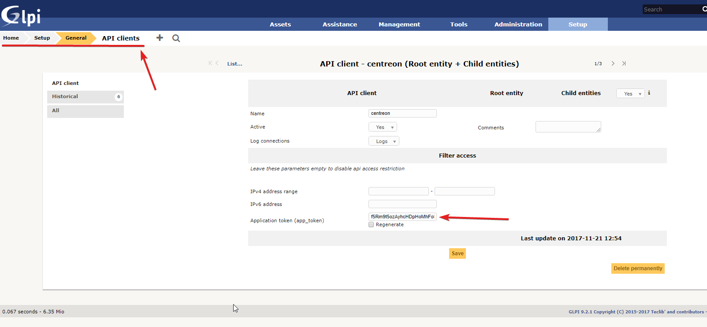

## How it works

The GlpiRestApi provider uses the REST API of Glpi to retrieve data in order to
open a ticket. Since it gathers a lot of configurations objects from Glpi, it
puts them in cache. Loging out or waiting 10 hours will flush the cache.

## Compatibility

This connector is (at least) compatible with the following Glpi versions:

  - 9.4
  - 9.3
  - 9.2
  - 9.1 (Glpi REST API birth)

You can’t use this provider with Glpi \< 9.1. From the 8.5 to 9.0 version, you
should use the old Glpi provider that uses the Glpi plugin called “webservice”

## Requirements

Before going any further, make sure that you correctly setup
[centreon-open-ticket](https://documentation.centreon.com/docs/centreon-open-tickets/en/latest/installation/index.html)
into your Centreon instance

Our provider requires the following parameters:

| Parameter    | Example of value                         |
| ------------ | ---------------------------------------- |
| Address      | 10.30.2.46                               |
| User token   | cYpJTf0SAPHHGP561chJJxoGV2kivhDv3nFYxQbl |
| App token    | f5Rm9t5ozAyhcHDpHoMhFoPapi49TAVsXBZwulMR |
| REST API url | /glpi/apirest.php                        |
| Protocol     | https                                    |
| Timeout      | 60                                       |

## Possibilities

As of now, the provider is able to retrieve the following objects from Glpi:

  - Entities
  - Itil categories
  - Requesters
  - Users
  - Groups
  - Suppliers

It will also fill the following parameters from a predefined list in Centreon.
You can extend those lists inside the provider configuration since they are
custom lists
<https://documentation.centreon.com/docs/centreon-open-tickets/en/latest/configuration_guide/index.html#advanced-configuration>

  - User role
  - Group role
  - Urgency
  - Impact
  - Priority

## Configuration

You'll find the required **app token** in the following menu:

You'll find the **user token** in the following menu:

