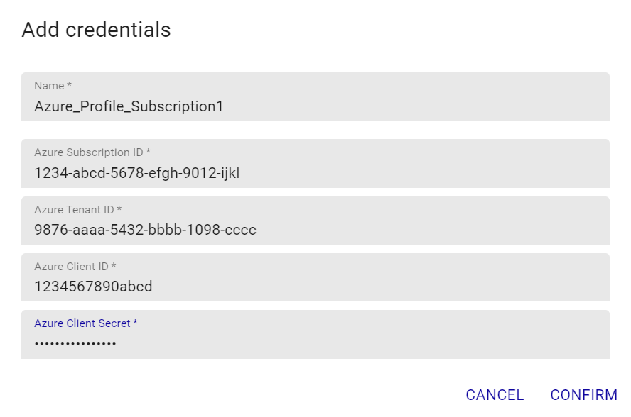

## Overview

The Centreon Plugin Pack *Azure Discover* is a *super* Pack allowing to discover a whole Azure infrastructure for a given
subscription.
This Pack relies on the Azure Monitor API to fetch the resources of the Azure infrastructure and on all of the Centreon Plugin Packs
for Azure to set templates and proper monitoring indicators for each type of resource.

> This Plugin Pack is only compatible with the 'api' custom-mode. 'azcli' is not supported for this usage.

## Pack Assets

> The Centreon Plugin Pack *Azure Discover* is only a *discovery* pack. It doesn't natively provide any templates nor
> indicators to monitor Azure resources

### Discovery rules

The Centreon Plugin Pack *Azure Discover* includes a Host Discovery *provider* to automatically discover all of the Azure resources
of a given subscription and add them to the Centreon configuration using the dedicated Host Templates.
This provider is named **Microsoft Azure Management Discover**:


> This discovery feature is only compatible with the 'api' custom mode.

More information about the Host Discovery module is available in the Centreon documentation:
[Host Discovery](../../../monitoring/discovery/hosts-discovery.html)

## Prerequisites

### Azure credentials

To use the 'api' custom mode, make sure to obtain the required information using the 
how-to below. Keep it safe until including it in the Autodiscovery job settings form.

* Create an *application* in Azure Active Directory:
    - Log in to your Azure account.
    - Select *Azure Active directory* in the left sidebar.
    - Click on *App registrations*.
    - Click on *+ Add*.
    - Enter Centreon as the application name (or any name of your choice), select application type(api) and sign-on-url.
    - Click on the *Create* button.

* Get *Subscription ID*
    - Log in to your Azure account.
    - Select *Subscriptions* in the left sidebar.
    - Select whichever subscription is needed.
    - Click on *Overview*.
    - **Copy the Subscription ID.**

* Get *Tenant ID*
    - Log in to your Azure account.
    - Select *Azure Active directory* in the left sidebar.
    - Click on *Properties*.
    - **Copy the directory ID.**

* Get *Client ID*
    - Log in to your Azure account.
    - Select *Azure Active directory* in the left sidebar.
    - Click on *Enterprise applications*.
    - Click on *All applications*.
    - Select the application previously created.
    - Click on *Properties*.
    - **Copy the Application ID.**

* Get *Client secret*
    - Log in to your Azure account.
    - Select *Azure Active directory* in the left sidebar.
    - Click on *App registrations*.
    - Select the application previously created.
    - Click on *All settings*.
    - Click on *Keys*.
    - Enter the key description and select the duration.
    - Click on *Save*.
    - **Copy and store the key value. You won't be able to retrieve it after you leave this page.**

## Setup 

<!--DOCUSAURUS_CODE_TABS-->

<!--Online IMP Licence & IT-100 Editions-->

1. Install the Plugin on every Centreon Poller expected to discover Azure resources:

```bash
yum install centreon-plugin-Cloud-Azure-Management-Discover-Api
```

2. On the Centreon Web interface, install the *Azure Discover* Centreon Plugin Pack on the "Configuration > Plugin Packs > Manager" page
You'll be prompted to install several other Azure Plugin Packs as dependencies (they will be used to set the proper templates/indicators
on the discovered elements).

<!--Offline IMP License-->

1. Install the Plugin on every Centreon Poller expected to discover Azure resources:

```bash
yum install centreon-plugin-Cloud-Azure-Management-Discover-Api
```

2. Install the Centreon Plugin Pack RPM on the Centreon Central server, install all of the Centreon Plugin Packs for Azure, in order
to make all the dependencies available:

```bash
yum install centreon-pack-cloud-azure\*
```

3. On the Centreon Web interface, install the *Azure Discover* Centreon Plugin Pack on the "Configuration > Plugin Packs > Manager" page
You'll be prompted to install several other Azure Plugin Packs as dependencies (they will be used to set the proper templates/indicators
on the discovered elements).

<!--END_DOCUSAURUS_CODE_TABS-->

## Set up a discovery job

> The general specifications and mechanics of the *Host Discovery* feature is available [here](../../../monitoring/discovery/hosts-discovery.html)

### Access parameters

Create a new discovery job and select **Azure Management Discover** as the provider. Click on *next* and set the authentication parameters
as well as optional access parameters:

[image](../../../assets/integrations/plugin-packs/procedures/cloud-azure-management-discover-accessparameters.png)

- Select the **Centreon Poller** from where the discovery job will be launched
- If necessary, add an entreprise **proxy URL and port** to use to reach the Azure API
- Select the **Azure credentials profile** linked to the subscription to be used

The first time, a new credentials profile has to be created. You can do so by clicking the '+' button and set the proper Azure
authentication parameters:



> All of the fields of the *credentials* form must be filled.

Click on *confirm* then *next* to go to the next step of the wizard and adjust the discovery parameters.

### Discovery parameters

If necessary, adjust the following settings:

[image](../../../assets/integrations/plugin-packs/procedures/cloud-azure-management-discover-discoparameters.png)

> All the fields of this form are optional

- Azure Location/Resource Group: allows to filter the discovery on a specific *Location* or *Resource Group*
- Filter on namespace/type: only discovers elements of a given namespace/type relative to Azure resources, for example:
    - *Resource namepsace*: 'Microsoft.Compute'
    - *Resource type*: 'virtualMachines'
    > ** Warning ** To use this filter, it's mandatory to fill **both** *Resource namespace* and *Resource type* fields

### Run the discovery job and display results

The next steps (4,5 & 6) of the wizard allow to set the **mappers** and to define the discovery policy. You may want to modify the
predefined configuration by checking the [module documentation](../../../monitoring/discovery/hosts-discovery.html).

A typical discovery job doesn't need these settings to be altered.

Once the discovery job launched and complete, you can display the results by clicking on *job results*. All the available Host Templates
corresponding to the discovered Azure resources will be automatically set.
Select the elements you want to add to the Centreon configuration and click on *save*. And... you're done !

## Troubleshooting

### The Azure credentials have changed and the Plugin does not work anymore

The Plugin is using a cache file to keep connection information and avoid an authentication at each call. 
If some of the authentication parameters change, you must delete the cache file. 

The cache file can be found within  ```/var/lib/centreon/centplugins/``` folder with a name similar to azure_api_<md5>_<md5>_<md5>_<md5>.

### ```UNKNOWN: Login endpoint API returns error code 'ERROR_NAME' (add --debug option for detailed message)```

When I run my command I obtain the following error message:
```UNKNOWN: Login endpoint API returns error code 'ERROR_NAME' (add --debug option for detailed message)```.

It means that some parameters used to authenticate the API request are wrong. The 'ERROR_NAME' string gives 
some hints about where the problem stands. 

### ```UNKNOWN: 500 Can't connect to login.microsoftonline.com:443```

This error message means that the Centreon Plugin couldn't successfully connect to the Azure Login API. Check that no third party
device (such as a firewall) is blocking the request. A proxy connection may also be necessary to connect to the API.
