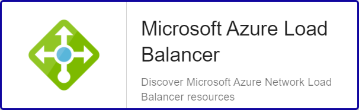

## Overview

Azure Load Balancer operates at layer four of the Open Systems Interconnection (OSI) model. It's the single point of contact for
clients. Load Balancer distributes inbound flows that arrive at the load balancer's front end to backend pool instances.
These flows are according to configured load balancing rules and health probes. The backend pool instances can be Azure Virtual
Machines or instances in a virtual machine scale set.

The Centreon Plugin-Pack *Azure Load Balancer* can rely on Azure API or Azure CLI to collect the metrics related to the
Load Balancer service.

## Plugin Pack Assets

### Monitored Objects

* Azure *Load Balancer* instances

### Discovery rules

The Centreon Plugin-Pack *Azure Load Balancer* includes a Host Discovery *provider* to automatically discover the Azure instancesof a given
subscription and add them to the Centreon configuration.
This provider is named **Microsoft Azure Load Balancer**:



> This discovery feature is only compatible with the 'api' custom mode. 'azcli' is not supported yet.

More information about the Host Discovery module is available in the Centreon documentation:
[Host Discovery](../../../monitoring/discovery/hosts-discovery.html)

### Collected Metrics

<!--DOCUSAURUS_CODE_TABS-->

<!--Datapath-->

| Metric name                                   | Description           | Unit |
|:----------------------------------------------|:----------------------|:-----|
| loadbalancer.datapath.availability.percentage | Datapath availability | %    |

<!--Healthprobe-->

| Metric name                                      | Description              | Unit |
|:-------------------------------------------------|:-------------------------|:-----|
| loadbalancer.healthprobe.availability.percentage | Healthprobe availability | %    |

<!--Snat-->

| Metric name                             | Description                        | Unit  |
|:----------------------------------------|:-----------------------------------|:------|
| loadbalancer.snat.ports.allocated.count | Number of allocated SNAT ports     | Count |
| loadbalancer.snat.ports.used.count      | Number of used SNAT ports          | Count |
| loadbalancer.snat.connection.count      | Number of current SNAT connections | Count |

<!--Throughput-->

| Metric name                   | Description                  | Unit |
|:------------------------------|:-----------------------------|:-----|
| loadbalancer.throughput.bytes | Processed data throughput    | B    |
| loadbalancer.packets.count    | Processed packets throughput | %    |

<!--END_DOCUSAURUS_CODE_TABS-->

## Prerequisites

To get data from Azure Services, following methods are available:
    * Azure API ('api') 
    * Azure CLI ('azcli')

Centreon recommends to use the API instead of the CLI for the following reasons:
    * API is much more efficient by avoiding CLI binary execution
    * API supports application authentication while CLI does not (yet)

<!--DOCUSAURUS_CODE_TABS-->

<!--Azure Monitor API-->

To use the 'api' custom mode, make sure to obtain the required information using the 
how-to below. Keep it safe until including it in a Host or Host Template definition.

* Create an *application* in Azure Active Directory:
    - Log in to your Azure account.
    - Select *Azure Active directory* in the left sidebar.
    - Click on *App registrations*.
    - Click on *+ Add*.
    - Enter Centreon as the application name (or any name of your choice), select application type(api) and sign-on-url.
    - Click on the *Create* button.

* Get *Subscription ID*
    - Log in to your Azure account.
    - Select *Subscriptions* in the left sidebar.
    - Select whichever subscription is needed.
    - Click on *Overview*.
    - **Copy the Subscription ID.**

* Get *Tenant ID*
    - Log in to your Azure account.
    - Select *Azure Active directory* in the left sidebar.
    - Click on *Properties*.
    - **Copy the directory ID.**

* Get *Client ID*
    - Log in to your Azure account.
    - Select *Azure Active directory* in the left sidebar.
    - Click on *Enterprise applications*.
    - Click on *All applications*.
    - Select the application previously created.
    - Click on *Properties*.
    - **Copy the Application ID.**

* Get *Client secret*
    - Log in to your Azure account.
    - Select *Azure Active directory* in the left sidebar.
    - Click on *App registrations*.
    - Select the application previously created.
    - Click on *All settings*.
    - Click on *Keys*.
    - Enter the key description and select the duration.
    - Click on *Save*.
    - **Copy and store the key value. You won't be able to retrieve it after you leave this page.**

<!--Azure AZ CLI-->

To use the 'azcli' custom mode, install the required packages on every Centreon poller expected to 
monitor Azure Resources using CLI:

- The CLI needs at least Python version 2.7
(<https://github.com/Azure/azure-cli/blob/dev/doc/install_linux_prerequisites.md>).

On RPM-Based distributions, use the command below to install it using *root* or 'sudo':

```shell
sudo rpm --import https://packages.microsoft.com/keys/microsoft.asc
sudo echo -e "[azure-cli]\nname=Azure CLI\nbaseurl=https://packages.microsoft.com/yumrepos/azure-cli\nenabled=1\ngpgcheck=1\ngpgkey=https://packages.microsoft.com/keys/microsoft.asc" > /etc/yum.repos.d/azure-cli.repo
sudo yum install azure-cli
```

Then, use the *centreon-engine* account to obtain a token using command below: 

```shell
su - centreon-engine
az login
```

The shell will output this message including an authentication code:

    *To sign in, use a web browser to open the page https://microsoft.com/devicelogin* 
    *and enter the code CWT4WQZAD to authenticate.*

Go to <https://microsoft.com/devicelogin> and enter the code. 

Connect using a monitoring service account, as a result, the shell should prompt
information below:

```shell
    [
      {
        "cloudName": "AzureCloud",
        "id": "0ef83f3a-d83e-2039-d930-309df93acd93d",
        "isDefault": true,
        "name": "N/A(tenant level account)",
        "state": "Enabled",
        "tenantId": "0ef83f3a-03cd-2039-d930-90fd39ecd048",
        "user": {
          "name": "email@mycompany.onmicrosoft.com",
          "type": "user"
        }
      }
    ]
```

Credentials are now stored locally in the .accessTokens.json file so the Plugin 
can use it. 

<!--END_DOCUSAURUS_CODE_TABS-->

## Setup 

<!--DOCUSAURUS_CODE_TABS-->

<!--Online IMP Licence & IT-100 Editions-->

1.  Install the Centreon Plugin package on every Centreon poller expected to monitor Azure Load Balancer resources:

```bash
yum install centreon-plugin-Cloud-Azure-Network-LoadBalancer-Api
```

2. On the Centreon Web interface, install the *Azure Load Balancer* Centreon Plugin-Pack on the "Configuration > Plugin Packs > Manager" page

<!--Offline IMP License-->

1. Install the Centreon Plugin package on every Centreon poller expected to monitor Azure Load Balancer resources:

```bash
yum install centreon-plugin-Cloud-Azure-Network-LoadBalancer-Api
```

2. Install the Centreon Plugin-Pack RPM on the Centreon Central server:

```bash
yum install centreon-pack-cloud-azure-network-loadbalancer.noarch
```

3. On the Centreon Web interface, install the *Azure Load Balancer* Centreon Plugin-Pack on the "Configuration > Plugin Packs > Manager" page

<!--END_DOCUSAURUS_CODE_TABS-->

## Configuration

### Host

* Log into Centreon and add a new Host through "Configuration > Hosts".
* In the *IP Address/FQDN* field, set the following IP address: '127.0.0.1'.

* Select the *Cloud-Azure-Network-LoadBalancer-custom* template to apply to the Host.
* Once the template applied, some Macros marked as 'Mandatory' hereafter have to be configured.
These mandatory Macros differ regarding the custom mode used:

<!--DOCUSAURUS_CODE_TABS-->

<!--Azure Monitor API-->

| Mandatory | Nom               | Description                      |
|:----------|:------------------|:---------------------------------|
| X         | AZURECUSTOMMODE   | Custom mode 'api'                |
| X         | AZURESUBSCRIPTION | Subscription ID                  |
| X         | AZURETENANT       | Tenant ID                        |
| X         | AZURECLIENTID     | Client ID                        |
| X         | AZURECLIENTSECRET | Client secret                    |
| X         | AZURERESOURCE     | Id of the Load Balancer instance |

<!--Azure AZ CLI-->

| Mandatory | Nom               | Description                      |
|:----------|:------------------|:---------------------------------|
| X         | AZURECUSTOMMODE   | Custom mode 'azcli'              |
| X         | AZURESUBSCRIPTION | Subscription ID                  |
| X         | AZURERESOURCE     | Id of the Load Balancer instance |

<!--END_DOCUSAURUS_CODE_TABS-->

## FAQ

### How to check in the CLI that the configuration is OK and what are the main options for ?

Once the Plugin installed, log into your Centreon Poller CLI using the *centreon-engine* 
user account and test the Plugin by running the following command:

```bash
/usr/lib/centreon/plugins/centreon_azure_network_loadbalancer_api.pl \
    --plugin=cloud::azure::network::loadbalancer::plugin \
    --mode=datapath \
    --custommode=api \
    --subscription='xxxxxxxxx' \
    --tenant='xxxxxxxxx' \
    --client-id='xxxxxxxxx' \
    --client-secret='xxxxxxxxx' \
    --resource='LBA001ABCD' \
    --timeframe='900' \
    --interval='PT5M' \
    --aggregation='average' \
    --warning-datapath-availability-percentage='95:' \
    --critical-datapath-availability-percentage='50:' \
    --verbose
```

Expected command output is shown below:

```bash
OK: Instance 'LBA001ABCD' Statistic 'average' Metrics Data Path (VIP) Availability: 100.00% |
'LBA001ABCD~average#loadbalancer.datapath.availability.percentage'=100.00%;;;0;100
```

The command collects the *datapath* availability rate of a Azure Load Balancer instance using the 'api' custom-mode
(```--plugin=cloud::azure::network::loadbalancer::plugin --mode=datapath --custommode=api```).
This Load Balancer is identified by its id (```--resource='LBA001ABCD'```) and the authentication parameters
to be used with the custom mode are specified in the options (```--subscription='xxxxxxxxx' --tenant='xxxxxxx'
--client-id='xxxxxxxx' --client-secret='xxxxxxxxxx'```).

The calculated metrics are an average (```--aggregation='average'```) of values on a 900 secondes / 15 min period (```--timeframe='900'```)
with one sample per 5 minutes (```--interval='PT5M'```).

This command would trigger a WARNING alarm if the reported availability rate during the period is below 95%
(```--warning-datapath-availability-percentage='95:'```) and a CRITICAL alarm below 50% (```--critical-datapath-availability-percentage='50:'```).

All the available options for a given mode can be displayed by adding the ```--help``` parameter to the command:

```bash
/usr/lib/centreon/plugins/centreon_azure_network_loadbalancer_api.pl \
    --plugin=cloud::azure::network::loadbalancer::plugin \
    --mode=datapath \
    --help
```

### Troubleshooting

#### ```UNKNOWN: Login endpoint API returns error code 'ERROR_NAME' (add --debug option for detailed message)```

When I run my command I obtain the following error message:
```UNKNOWN: Login endpoint API returns error code 'ERROR_NAME' (add --debug option for detailed message)```.

It means that some parameters used to authenticate the API request are wrong. The 'ERROR_NAME' string gives 
some hints about where the problem stands. 

As an example, if my Client ID or Client Secret are wrong, 'ERROR_DESC' value will be 'invalid_client'. 

#### The Azure credentials have changed and the Plugin does not work anymore

The Plugin is using a cache file to keep connection information and avoid an authentication at each call. 
If some of the authentication parameters change, you must delete the cache file. 

The cache file can be found within  ```/var/lib/centreon/centplugins/``` folder with a name similar to azure_api_<md5>_<md5>_<md5>_<md5>.

#### UNKNOWN: 500 Can't connect to login.microsoftonline.com:443 

This error message means that the Centreon Plugin couldn't successfully connect to the Azure Login API. Check that no third party
device (such as a firewall) is blocking the request. A proxy connection may also be necessary to connect to the API.
This can be done by using this option in the command: ```--proxyurl='http://proxy.mycompany:8080'```.
