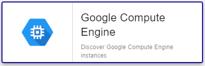

## Plugin-Pack Assets

### Monitored Objects

The Plugin-Pack Google Compute Engine collects metrics for:
* Cpu
* Diskio
* Network

### Discovery rules

The Centreon Plugin-Pack *Google Compute Engine* includes a Host Discovery *provider* to automatically discover virtual machines
for a given Google Cloud Project.

This provider is named **Google Compute Engine**:



> Note that the key file must be deployed on the Poller(s) expected to discover GCP assets.

More information about the Host Discovery module is available in the Centreon documentation:
[Host Discovery](../../../monitoring/discovery/hosts-discovery.html)

### Collected Metrics

For all collected metrics, we can choose the *aggregation*: _average_, _minimum_, _maximum_ and _total_.

<!--DOCUSAURUS_CODE_TABS-->

<!--Cpu-->

| Metric name                                                            | Description                                          | Unit  |
| :--------------------------------------------------------------------- | :--------------------------------------------------- | :---- |
| *instance_name*~*aggregation*#computeengine.cpu.utilization.percentage | Utilization of allocated CPU                         | %     |
| *instance_name*~*aggregation*#computeengine.cpu.reserved_cores.count   | Number of vCPUs reserved on the host of the instance |       |

<!--Diskio-->

| Metric name                                                                            | Description                                              | Unit  |
| :------------------------------------------------------------------------------------- | :------------------------------------------------------- | :---- |
| *instance_name*~*aggregation*#computeengine.disk.read.volume.bytes                     | Count of bytes read from disk                            | B     |
| *instance_name*~*aggregation*#computeengine.disk.read.volume.bytespersecond            | Count of bytes read per seconds from disk                | B/s   |
| *instance_name*~*aggregation*#computeengine.disk.throttled.read.volume.bytes           | Count of bytes in throttled read operations              | B     |
| *instance_name*~*aggregation*#computeengine.disk.throttled.read.volume.bytespersecond  | Count of bytes per seconds in throttled read operations  | B/s   |
| *instance_name*~*aggregation*#computeengine.disk.write.volume.bytes                    | Count of bytes write from disk                           | B     |
| *instance_name*~*aggregation*#computeengine.disk.write.volume.bytespersecond           | Count of bytes write per seconds from disk               | B/s   |
| *instance_name*~*aggregation*#computeengine.disk.throttled.write.volume.bytes          | Count of bytes in throttled write operations             | B     |
| *instance_name*~*aggregation*#computeengine.disk.throttled.write.volume.bytespersecond | Count of bytes per seconds in throttled write operations | B/s   |
| *instance_name*~*aggregation*#computeengine.disk.read.ops.count                        | Count of data disk read IO operations                    |       |
| *instance_name*~*aggregation*#computeengine.disk.read.ops.persecond                    | Count of data disk read IOPs operations                  |       |
| *instance_name*~*aggregation*#computeengine.disk.write.ops.persecond                   | Count of data disk write IO operations                   |       |
| *instance_name*~*aggregation*#computeengine.disk.write.ops.persecond                   | Count of data disk write IOPs operations                 |       |

<!--Network-->

| Metric name                                                                        | Description                                            | Unit  |
| :--------------------------------------------------------------------------------- | :----------------------------------------------------- | :---- |
| *instance_name*~*aggregation*#computeengine.network.received.volume.bytes          | Count of bytes received from the network               | B     |
| *instance_name*~*aggregation*#computeengine.network.received.volume.bytespersecond | Count of bytes received per seconds from the network   | B/s   |
| *instance_name*~*aggregation*#computeengine.network.sent.volume.bytes              | Count of bytes sent over the network                   | B     |
| *instance_name*~*aggregation*#computeengine.network.sent.volume.bytespersecond     | Count of bytes sent per seconds over the network       | B/s   |
| *instance_name*~*aggregation*#computeengine.network.received.packets.count         | Count of packets received from the network             |       |
| *instance_name*~*aggregation*#computeengine.network.received.packets.persecond     | Count of packets received per seconds from the network |       |
| *instance_name*~*aggregation*#computeengine.network.sent.packets.count             | Count of packets sent over the network                 |       |
| *instance_name*~*aggregation*#computeengine.network.sent.packets.persecond         | Count of packets sent per seconds over the network     |       |

<!--END_DOCUSAURUS_CODE_TABS-->

## Prerequisites

### Google Cloud Configuration

Configure a service account key (download its private key as a JSON file) for which the following privileges have to be granted:

| Google Scope                                     | Description                                                     |
| :----------------------------------------------- | :-------------------------------------------------------------- |
| https://www.googleapis.com/auth/cloud-platform   | View and manage your data across Google Cloud Platform services |

How to create a service account key: https://developers.google.com/identity/protocols/oauth2/service-account

## Setup

<!--DOCUSAURUS_CODE_TABS-->

<!--Online IMP Licence & IT-100 Editions-->

1. Install the Centreon Plugin on every Poller:

```bash
yum install centreon-plugin-Cloud-Gcp-Compute-ComputeEngine-Api
```

2. On the Centreon Web interface in "Configuration > Plugin packs > Manager", install the *Google Compute Engine* Plugin-Pack

<!--Offline IMP License-->

1. Install the Centreon Plugin on every Poller:

```bash
yum install centreon-plugin-Cloud-Gcp-Compute-ComputeEngine-Api
```

2. On the Centreon Central server, install the Centreon Plugin-Pack from the RPM:

```bash
yum install centreon-pack-cloud-gcp-compute-computeengine
```

3. On the Centreon Web interface in "Configuration > Plugin packs > Manager", install the *Google Compute Engine* Plugin-Pack

<!--END_DOCUSAURUS_CODE_TABS-->

## Host configuration

* Add a new Host and apply the *Cloud-Gcp-Compute-ComputeEngine-custom* Host Template

> Once the template applied, some Macros have to be configured:

| Mandatory   | Name                 | Description                                                                                 |
| :---------- | :------------------- | :------------------------------------------------------------------------------------------ |
| X           | GCPKEYFILEPATH       | Service account key json file                                                               |
| X           | GCPSCOPEENDPOINT     | Google Scope. Default: https://www.googleapis.com/auth/cloud-platform                       |
| X           | GCPDIMENSIONNAME     | The name of the dimension to filter on. Default: resource.labels.instance_id                |
| X           | GCPDIMENSIONOPERATOR | Define the type of filter match to use. Default: equals                                     |
| X           | GCPDIMENSIONVALUE    | ID of the instance you want to monitor.                                                     |
|             | PROXYURL             | Configure proxy URL                                                                         |
|             | GCPEXTRAOPTIONS      | Any extra option you may want to add to every command_line (eg. a --verbose flag)           |
|             | DUMMYSTATUS          | Host state. Default is OK, do not modify it until you know what you are doing               |
|             | DUMMYOUTPUT          | Host check output. Default is 'This is a dummy check'. Customize it with your own if needed |

> **WARNING**: Service account key file must be stored on Centreon Poller. *centreon-engine* user account must have read privileges on that file. 

## FAQ

### How to test the Plugin and what are the main options for?

Once the plugin installed, log into your Centreon Poller CLI using the *centreon-engine* user account
and test the Plugin by running the following command:

```bash
/usr/lib/centreon/plugins/centreon_gcp_compute_computeengine_api.pl \
    --plugin=cloud::google::gcp::compute::computeengine::plugin \
    --mode=cpu \
    --key-file=/var/lib/centreon-engine/centreon-dev-6e5531fc9e82.json \
    --dimension-name='metric.labels.instance_name' \
    --dimension-operator='equals' \
    --dimension-value='instance-centreon1-drb5' \
    --aggregation='average' \
    --warning-utilization='90' \
    --critical-utilization='95' \
    --verbose
```

Expected command output is shown below:

```bash
OK: Instance 'instance-centreon1-drb5' aggregation 'average' metrics cpu utilization: 1.04 %, cpu reserved cores: 0.20 | 'instance-centreon1-drb5~average#computeengine.cpu.utilization.percentage'=1.04%;0:90;0:95;0;100 'instance-centreon1-drb5~average#computeengine.cpu.reserved_cores.count'=0.20;;;;
Checking 'instance-centreon1-drb5'
    aggregation 'average' metrics cpu utilization: 1.04 %, cpu reserved cores: 0.20
```

The command above monitors cpu usage of a Google Compute Engine instance (```--plugin=cloud::google::gcp::compute::computeengine::plugin --mode=cpu```) identified
by the name *instance-centreon1-drb5* (```--dimension-name='metric.labels.instance_name' --dimension-operator='equals' --dimension-value='instance-centreon1-drb5'```).

This command would trigger a WARNING alarm if cpu utilization is more than 90% 
(```--warning-utilization='90'```) and a CRITICAL alarm for more than 95% (```--critical-utilization='95'```).

All the options as well as all the available thresholds can be displayed by adding the  ```--help```
parameter to the command:

```bash
/usr/lib/centreon/plugins/centreon_gcp_compute_computeengine_api.pl \
    --plugin=cloud::google::gcp::compute::computeengine::plugin \
    --mode=cpu \
    --help
```

### Why do I get the following result ```UNKNOWN: No metrics. Check your options or use --zeroed option to set 0 on undefined values``` ?

This command result means that Google Cloud does not have any value for the requested period.

This result can be overriden by adding the ```--zeroed``` option in the command. This will force a value of 0 when no metric 
has been collected and will prevent the UNKNOWN error message. 
