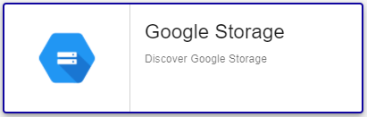

## Plugin-Pack Assets

### Monitored Objects

The Plugin-Pack Google Storage collects metrics for:
* Bucket

### Discovery rules

The Centreon Plugin-Pack *Google Storage* includes a Host Discovery *provider* to automatically discover storages
for a given Google Cloud Project.

This provider is named **Google Storage**:



> Note that the key file must be deployed on the Poller(s) expected to discover GCP assets.

More information about the Host Discovery module is available in the Centreon documentation:
[Host Discovery](../../../monitoring/discovery/hosts-discovery.html)

### Collected Metrics

For all collected metrics, we can choose the *aggregation*: _average_, _minimum_, _maximum_ and _total_.

<!--DOCUSAURUS_CODE_TABS-->

<!--Bucket-->

| Metric name                                                                | Description                                         | Unit  |
| :------------------------------------------------------------------------- | :-------------------------------------------------- | :---- |
| *bucket_name*~*aggregation*#storage.bucket.objects.count                   | Number of objects                                   |       |
| *bucket_name*~*aggregation*#storage.network.received.volume.bytes          | Count of bytes received over the network            | B     |
| *bucket_name*~*aggregation*#storage.network.received.volume.bytespersecond | Count of bytes received per second over the network | B/s   |
| *bucket_name*~*aggregation*#storage.network.sent.volume.bytes              | Count of bytes sent over the network                | B     |
| *bucket_name*~*aggregation*#storage.network.sent.volume.bytespersecond     | Count of bytes sent per second over the network     | B/s   |

<!--END_DOCUSAURUS_CODE_TABS-->

## Prerequisites

### Google Cloud Configuration

Configure a service account key (download its private key as a JSON file) for which the following privileges have to be granted:

| Google Scope                                     | Description                                                     |
| :----------------------------------------------- | :-------------------------------------------------------------- |
| https://www.googleapis.com/auth/cloud-platform   | View and manage your data across Google Cloud Platform services |

How to create a service account key: https://developers.google.com/identity/protocols/oauth2/service-account

## Setup

<!--DOCUSAURUS_CODE_TABS-->

<!--Online IMP Licence & IT-100 Editions-->

1. Install the Centreon Plugin on every Poller:

```bash
yum install centreon-plugin-Cloud-Gcp-Storage-Api
```

2. On the Centreon Web interface in "Configuration > Plugin packs > Manager", install the *Google Storage* Plugin-Pack

<!--Offline IMP License-->

1. Install the Centreon Plugin on every Poller:

```bash
yum install centreon-plugin-Cloud-Gcp-Storage-Api
```

2. On the Centreon Central server, install the Centreon Plugin-Pack from the RPM:

```bash
yum install centreon-pack-cloud-gcp-storage
```

3. On the Centreon Web interface in "Configuration > Plugin packs > Manager", install the *Google Storage* Plugin-Pack

<!--END_DOCUSAURUS_CODE_TABS-->

## Host configuration

* Add a new Host and apply the *Cloud-Gcp-Storage-custom* Host Template

> Once the template applied, some Macros have to be configured:

| Mandatory   | Name                 | Description                                                                                 |
| :---------- | :------------------- | :------------------------------------------------------------------------------------------ |
| X           | GCPKEYFILEPATH       | Service account key json file                                                               |
| X           | GCPSCOPEENDPOINT     | Google Scope. Default: https://www.googleapis.com/auth/cloud-platform                       |
| X           | GCPDIMENSIONNAME     | The name of the dimension to filter on. Default: resource.labels.bucket_name                |
| X           | GCPDIMENSIONOPERATOR | Define the type of filter match to use. Default: equals                                     |
| X           | GCPDIMENSIONVALUE    | Name of the bucket you want to monitor.                                                     |
|             | PROXYURL             | Configure proxy URL                                                                         |
|             | GCPEXTRAOPTIONS      | Any extra option you may want to add to every command_line (eg. a --verbose flag)           |
|             | DUMMYSTATUS          | Host state. Default is OK, do not modify it until you know what you are doing               |
|             | DUMMYOUTPUT          | Host check output. Default is 'This is a dummy check'. Customize it with your own if needed |

> **WARNING**: Service account key file must be stored on Centreon Poller. *centreon-engine* user account must have read privileges on that file. 

## FAQ

### How to test the Plugin and what are the main options for?

Once the plugin installed, log into your Centreon Poller CLI using the *centreon-engine* user account
and test the Plugin by running the following command:

```bash
/usr/lib/centreon/plugins/centreon_gcp_storage_api.pl \
    --plugin=cloud::google::gcp::storage::plugin \
    --mode=bucket \
    --key-file=/var/lib/centreon-engine/centreon-dev-6e5531fc9e82.json \
    --dimension-name='resource.labels.bucket_name' \
    --dimension-operator='equals' \
    --dimension-value='centreon-dev.appspot.com' \
    --aggregation='average' \
    --warning-bucket-objects='1000' \
    --critical-bucket-objects='2000' \
    --verbose
```

Expected command output is shown below:

```bash
OK: Instance 'centreon-dev.appspot.com' aggregation 'average' metrics objects: 0.00, received: 0.00 B, sent: 382.00 B | 'centreon-dev.appspot.com~average#storage.bucket.objects.count'=0.00;0:1000;0:2000;0; 'centreon-dev.appspot.com~average#storage.network.received.volume.bytes'=0.00B;;;0; 'centreon-dev.appspot.com~average#storage.network.sent.volume.bytes'=382.00B;;;0;
Checking 'centreon-dev.appspot.com'
    aggregation 'average' metrics objects: 0.00, received: 0.00 B, sent: 382.00 B
```

The command above monitors bucket usage of a Google Storage (```--plugin=cloud::google::gcp::storage::plugin --mode=bucket```) identified
by the name *centreon-dev.appspot.com* (```--dimension-name='resource.labels.bucket_name' --dimension-operator='equals' --dimension-value='centreon-dev.appspot.com'```).

This command would trigger a WARNING alarm if number of objects is more than 1000 
(```--warning-bucket-objects='1000'```) and a CRITICAL alarm for more than 2000 (```--critical-bucket-objects='2000'```).

All the options as well as all the available thresholds can be displayed by adding the  ```--help```
parameter to the command:

```bash
/usr/lib/centreon/plugins/centreon_gcp_storage_api.pl \
    --plugin=cloud::google::gcp::storage::plugin \
    --mode=bucket \
    --help
```

### Why do I get the following result ```UNKNOWN: No metrics. Check your options or use --zeroed option to set 0 on undefined values``` ?

This command result means that Google Cloud does not have any value for the requested period.

This result can be overriden by adding the ```--zeroed``` option in the command. This will force a value of 0 when no metric 
has been collected and will prevent the UNKNOWN error message. 
