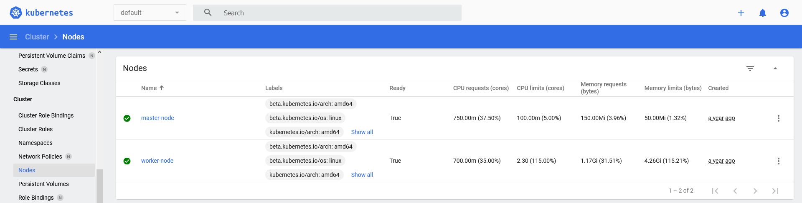

## Overview

Kubernetes is an open-source container-orchestration system for automating
computer application deployment, scaling, and management.

This Pack aims to monitor both infrastructure layer (nodes) and cluster
services (deployments, daemonsets, etc).

## Pack assets

The Kubernetes API Pack gives multiple choices regarding the way you can
arrange a cluster monitoring.

There is mainly three ways:

- Gather all metrics on only one Centreon host with a service per Kubernetes
  unit (i.e. deployments, daemonsets, etc) - apply
  [manual creation](manual-creation) procedure,
- Gather all metrics on only one Centreon host with a service for each
  instances of each Kubernetes units - apply [manual creation](manual-creation)
  and [service discovery](service-discovery) procedures,
- Collect infrastructural metrics (master and worker nodes) with a Centreon
  host per Kubernetes node, and keep orchestration/application metrics
  on a unique host (using one of the 2 previous scenarii) - apply
  [host discovery](host-discovery) procedure.

For all those scenarii, discovery and classic templating will be used.

You just need to choose which flavor you like the most: communicating with
the RestAPI exposed by the Kubernetes cluster, or using the CLI tool kubectl
to communicate with the cluster's control plane.

### Discovery

The Kubernetes API Pack comes with several discovery providers and rules.

Here is the list of the Host Discovery providers:

| Provider                   | Description                                                              |
|----------------------------|--------------------------------------------------------------------------|
| Kubernetes Nodes (RestAPI) | Discover Kubernetes nodes by requesting Kubernetes RestAPI               |
| Kubernetes Nodes (Kubectl) | Discover Kubernetes nodes by requesting Kubernetes cluster using kubectl |

Both providers will search for Kubernetes nodes, and link them to a minimal
host template to monitor the node usage in terms of pods allocation, cpu and
memory requets/limits.

In parallele to this discovery, unitary services can be created thanks to
the Service Discovery rules:

| Rule                                    | Description                                             |
|-----------------------------------------|---------------------------------------------------------|
| Cloud-Kubernetes-Api-Daemonsets-Status  | Discover Kubernetes daemonsets to monitor their status  |
| Cloud-Kubernetes-Api-Deployments-Status | Discover Kubernetes deployments to monitor their status |
| Cloud-Kubernetes-Api-Nodes-Usage        | Discover Kubernetes nodes to monitor their usage        |
| Cloud-Kubernetes-Api-Pods-Status        | Discover Kubernetes pods to monitor their status        |

### Templates

The Kubernetes API Pack brings 2 different host templates to be used depending
on the scenarii mentioned earlier:

- All in one host template that will gather checks and metrics with a
  service per Kubernetes unit:

    | Cloud-Kubernetes-Api |
    |----------------------|
    | Daemonset Status     |
    | Deployment Status    |
    | Node Usage           |
    | Pod Status           |

- A minimal host template that will only collect metrics for the Kubernetes
  nodes:

    | Cloud-Kubernetes-Node-Api |
    |---------------------------|
    | Node Usage                |

## Monitored metrics and indicators

### Daemonsets status

This indicator will ensure that daemonsets are within defined bounds by
looking at the number of available and/or up-to-date pods compared to
the desired count, like the `kubectl get daemonsets` can provide:

```text
NAMESPACE     NAME                    DESIRED   CURRENT   READY   UP-TO-DATE   AVAILABLE   NODE SELECTOR                   AGE
kube-system   kube-flannel-ds-amd64   3         3         3       3            3           beta.kubernetes.io/arch=amd64   624d
kube-system   kube-proxy              3         3         3       3            3           kubernetes.io/os=linux          624d
```

The resulting output in Centreon could look like:

```text
Daemonset 'kube-flannel-ds-amd64' Pods Desired: 3, Current: 3, Available: 3, Up-to-date: 3, Ready: 3, Misscheduled: 0
Daemonset 'kube-proxy' Pods Desired: 3, Current: 3, Available: 3, Up-to-date: 3, Ready: 3, Misscheduled: 0
```

The collected metrics for each deployment will be:

| Metric         | Metric (v2 format)                  | Kubernetes metric        |
|----------------|-------------------------------------|--------------------------|
| `desired`      | `daemonset.pods.desired.count`      | `desiredNumberScheduled` |
| `current`      | `daemonset.pods.current.count`      | `currentNumberScheduled` |
| `available`    | `daemonset.pods.available.count`    | `numberAvailable`        |
| `up_to_date`   | `daemonset.pods.uptodate.count`     | `updatedNumberScheduled` |
| `ready`        | `daemonset.pods.ready.count`        | `numberReady`            |
| `misscheduled` | `daemonset.pods.misscheduled.count` | `numberMisscheduled`     |

If the service collects metrics of several daemonsets (depending on the
chosen scenario), daemonset's name will be happened to the metric name:

| Metric               | Metric (v2 format)                        |
|----------------------|-------------------------------------------|
| `desired_kube-proxy` | `kube-proxy#daemonset.pods.desired.count` |

It is then possible to place thresholds using the following special variables:

- %{desired}
- %{current}
- %{available}
- %{up\_to\_date}
- %{ready}
- %{misscheduled}

The defaults values are the following:

| Threshold | Value                        | Description                                                                                  |
|-----------|------------------------------|----------------------------------------------------------------------------------------------|
| Warning   | `%{up_to_date} < %{desired}` | Will raise a warning alert if the number of up-to-date pods is lower than the desired number |
| Critical  | `%{available} < %{desired}`  | Will raise a critical alert if the number of available pods is lower than the desired number |

Refer to the
[official documentation](https://kubernetes.io/docs/concepts/workloads/controllers/daemonset/)
for more information about collected metrics and how to fine tune your
thresholds.

### Deployments status

This indicator will ensure that deployments are within defined bounds by
looking at the number of available and/or up-to-date replicas compared to
the desired count, like the `kubectl get deployments` can provide:

```text
NAMESPACE              NAME                        READY   UP-TO-DATE   AVAILABLE   AGE
kube-system            coredns                     2/2     2            2           624d
kube-system            tiller-deploy               1/1     1            1           624d
kubernetes-dashboard   dashboard-metrics-scraper   1/1     1            1           37d
kubernetes-dashboard   kubernetes-dashboard        1/1     1            1           37d
```

The resulting output in Centreon could look like:

```text
Deployment 'coredns' Replicas Desired: 2, Current: 2, Available: 2, Ready: 2, Up-to-date: 2
Deployment 'tiller-deploy' Replicas Desired: 1, Current: 1, Available: 1, Ready: 1, Up-to-date: 1
Deployment 'dashboard-metrics-scraper' Replicas Desired: 1, Current: 1, Available: 1, Ready: 1, Up-to-date: 1
Deployment 'kubernetes-dashboard' Replicas Desired: 1, Current: 1, Available: 1, Ready: 1, Up-to-date: 1
```

The collected metrics for each deployment will be:

| Metric       | Metric (v2 format)                    | Kubernetes metric              |
|--------------|---------------------------------------|--------------------------------|
| `desired`    | `deployment.replicas.desired.count`   | `replicas` (in `spec` entry)   |
| `current`    | `deployment.replicas.current.count`   | `replicas` (in `status` entry) |
| `available`  | `deployment.replicas.available.count` | `availableReplicas`            |
| `ready`      | `deployment.replicas.ready.count`     | `readyReplicas`                |
| `up_to_date` | `deployment.replicas.uptodate.count`  | `updatedReplicas`              |

If the service collects metrics of several deployments (depending on the
chosen scenario), deployment's name will be happened to the metric name:

| Metric                  | Metric (v2 format)                                |
|-------------------------|---------------------------------------------------|
| `desired_tiller-deploy` | `tiller-deploy#deployment.replicas.desired.count` |

It is then possible to place thresholds using the following special variables:

- %{desired}
- %{current}
- %{available}
- %{ready}
- %{up\_to\_date}

The defaults values are the following:

| Threshold | Value                        | Description                                                                                      |
|-----------|------------------------------|--------------------------------------------------------------------------------------------------|
| Warning   | `%{up_to_date} < %{desired}` | Will raise a warning alert if the number of up-to-date replicas is lower than the desired number |
| Critical  | `%{available} < %{desired}`  | Will raise a critical alert if the number of available replicas is lower than the desired number |

Refer to the
[official documentation](https://kubernetes.io/docs/concepts/workloads/controllers/deployment/)
for more information about collected metrics and how to fine tune your
thresholds.

### Nodes usage

This indicator will gather metrics about nodes usage like pods allocation,
requests for CPU and memory made by those pods, and limits for CPU and
memory allowed to those same pods.

Using Kubernetes command line tool, it could look like the following:

- Nodes capacity:

    ```shell
    kubectl get nodes -o=custom-columns="NODE:.metadata.name,PODS ALLOCATABLE:.status.allocatable.pods,CPU ALLOCATABLE:.status.allocatable.cpu,MEMORY ALLOCATABLE:.status.allocatable.memory"
    NODE          PODS ALLOCATABLE   CPU ALLOCATABLE   MEMORY ALLOCATABLE
    master-node   110                2                 3778172Ki
    worker-node   110                2                 3778184Ki
    ```

- Running pods:

    ```shell
    kubectl get pods -o=custom-columns="NODE:.spec.nodeName,POD:.metadata.name,CPU REQUESTS:.spec.containers[*].resources.requests.cpu,CPU LIMITS:.spec.containers[*].resources.limits.cpu,MEMORY REQUESTS:.spec.containers[*].resources.requests.memory,MEMORY LIMITS:.spec.containers[*].resources.limits.memory"
    NODE          POD                                     CPU REQUESTS   CPU LIMITS   MEMORY REQUESTS   MEMORY LIMITS
    worker-node   coredns-74ff55c5b-g4hmt                 100m           <none>       70Mi              170Mi
    master-node   etcd-master-node                        100m           <none>       100Mi             <none>
    master-node   kube-apiserver-master-node              250m           <none>       <none>            <none>
    master-node   kube-controller-manager-master-node     200m           <none>       <none>            <none>
    master-node   kube-flannel-ds-amd64-fk59g             100m           100m         50Mi              50Mi
    worker-node   kube-flannel-ds-amd64-jwzms             100m           100m         50Mi              50Mi
    master-node   kube-proxy-kkwmb                        <none>         <none>       <none>            <none>
    worker-node   kube-proxy-vprs8                        <none>         <none>       <none>            <none>
    master-node   kube-scheduler-master-node              100m           <none>       <none>            <none>
    master-node   kubernetes-dashboard-7d75c474bb-7zc5j   <none>         <none>       <none>            <none>
    ```

From the Kubernetes dashboard, the metrics can be found in the
`Cluser > Nodes` menu:

- Listing from `Cluser > Nodes`:

    

- Allocation detail for a node:

    

The resulting output in Centreon could look like:

```text
Node 'master-node' CPU requests: 37.50% (0.75/2), CPU limits: 5.00% (0.1/2), Memory requests: 3.96% (150.00MB/3.70GB), Memory limits: 1.32% (50.00MB/3.70GB), Pods allocation: 7.27% (8/110)
Node 'worker-node' CPU requests: 35.00% (0.7/2), CPU limits: 115.00% (2.3/2), Memory requests: 31.51% (1.17GB/3.70GB), Memory limits: 115.21% (4.26GB/3.70GB), Pods allocation: 9.09% (10/110)
```

The collected metrics for each node will be:

| Metric            | Metric (v2 format)           |
|-------------------|------------------------------|
| `cpu_requests`    | `cpu.requests.percentage`    |
| `cpu_limits`      | `cpu.limits.percentage`      |
| `memory_requests` | `memory.requests.percentage` |
| `memory_limits`   | `memory.limits.percentage`   |
| `allocated_pods`  | `pods.allocation.percentage` |

If the service collects metrics of several nodes (depending on the
chosen scenario), node's name will be happened to the metric name:

| Metric                       | Metric (v2 format)                       |
|------------------------------|------------------------------------------|
| `allocated_pods_worker-node` | `worker-node#pods.allocation.percentage` |

Thresholds expressed in percentage can be put for all metrics, for warning
and critical alerts.

### Pods status

This indicator will ensure that pods and their containers are within defined
bounds by looking at the number of ready containers compared to
the desired count, like the `kubectl get pods` can provide:

```text
NAMESPACE              NAME                                                     READY   STATUS        RESTARTS   AGE
kube-system            kube-proxy-65zhn                                         1/1     Running       0          37d
kube-system            kube-proxy-kkwmb                                         1/1     Running       0          37d
kube-system            kube-proxy-vprs8                                         1/1     Running       0          37d
kube-system            tiller-deploy-7bf78cdbf7-z5n24                           1/1     Running       5          550d
kubernetes-dashboard   dashboard-metrics-scraper-79c5968bdc-vncxc               1/1     Running       0          37d
kubernetes-dashboard   kubernetes-dashboard-7448ffc97b-42rps                    1/1     Running       0          37d
```

The resulting output in Centreon could look like:

```text
Checking pod 'kube-proxy-65zhn'
    Containers Ready: 1/1 (100.00%), Status is 'Running', Restarts: 0
    Container 'kube-proxy' Status is 'running', State is 'ready', Restarts: 0
Checking pod 'kube-proxy-kkwmb'
    Containers Ready: 1/1 (100.00%), Status is 'Running', Restarts: 0
    Container 'kube-proxy' Status is 'running', State is 'ready', Restarts: 0
Checking pod 'kube-proxy-vprs8'
    Containers Ready: 1/1 (100.00%), Status is 'Running', Restarts: 0
    Container 'kube-proxy' Status is 'running', State is 'ready', Restarts: 0
Checking pod 'tiller-deploy-7bf78cdbf7-z5n24'
    Containers Ready: 1/1 (100.00%), Status is 'Running', Restarts: 5
    Container 'tiller' Status is 'running', State is 'ready', Restarts: 5
Checking pod 'dashboard-metrics-scraper-79c5968bdc-vncxc'
    Containers Ready: 1/1 (100.00%), Status is 'Running', Restarts: 0
    Container 'dashboard-metrics-scraper' Status is 'running', State is 'ready', Restarts: 0
Checking pod 'kubernetes-dashboard-7448ffc97b-42rps'
    Containers Ready: 1/1 (100.00%), Status is 'Running', Restarts: 0
    Container 'kubernetes-dashboard' Status is 'running', State is 'ready', Restarts: 0
```

The collected metrics for each deployment will be:

| Metric             | Metric (v2 format)          |
|--------------------|-----------------------------|
| `containers_ready` | `containers.ready.count`    |
| `restarts_count`   | `restarts.total.count`      |
| `restarts_count`   | `containers.restarts.count` |

If the service collects metrics of several pods (depending on the
chosen scenario), pod's name and container's name will be happened to the
metric name:

| Metric                                           | Metric (v2 format)                                          |
|--------------------------------------------------|-------------------------------------------------------------|
| `containers_ready_coredns-74ff55c5b-g4hmt`       | `coredns-74ff55c5b-g4hmt#containers.ready.count`            |
| `restarts_count_coredns-74ff55c5b-g4hmt`         | `coredns-74ff55c5b-g4hmt#restarts.total.count`              |
| `restarts_count_coredns-74ff55c5b-g4hmt_coredns` | `coredns-74ff55c5b-g4hmt_coredns#containers.restarts.count` |

It is then possible to place thresholds using the following special variables:

- %{display}
- %{status}
- %{state} (containers only)

The defaults values are the following:

| Threshold            | Value                                              | Description                                                                                   |
|----------------------|----------------------------------------------------|-----------------------------------------------------------------------------------------------|
| Warning (pod)        | none                                               |                                                                                               |
| Critical (pod)       | `%{status} !~ /running/i`                          | Will raise a critical alert if a pod is not in a running status                               |
| Warning (container)  | none                                               |                                                                                               |
| Critical (container) | `%{status} !~ /running/i || %{state} !~ /^ready$/` | Will raise a critical alert if a container is not in a running status or not in a ready state |

Refer to the
[official documentation](https://kubernetes.io/docs/concepts/workloads/pods/)
for more information about collected metrics and how to fine tune your
thresholds.

## Prerequisites

### Centreon Plugin

Install this Plugin on each needed Poller:

```shell
yum install centreon-plugin-Cloud-Kubernetes-Api
```

### Kubernetes

As mentioned in the introduction, two ways of communication are available:

- the RestAPI exposed by the Kubernetes cluster,
- the CLI tool kubectl to communicate with the cluster's control plane.

For better performances, we recommand to use the RestAPI.

#### Create a service account

Both flavors can use a service account with sufficient rights to access
Kubernetes API.

Create a dedicated service account `centreon-service-account` in the
`kube-system` namespace to access the API:

```shell
kubectl create serviceaccount centreon-service-account --namespace kube-system
```

Create a cluster role `api-access` with needed privileges for the Plugin,
and bind it to the newly created service account:

```shell
cat <<EOF | kubectl create -f -
apiVersion: rbac.authorization.k8s.io/v1
kind: ClusterRole
metadata:
  name: api-access
rules:
  - apiGroups:
      - ""
      - apps
    resources:
      - daemonsets
      - deployments
      - namespaces
      - nodes
      - pods
    verbs:
      - get
      - list
---
apiVersion: rbac.authorization.k8s.io/v1
kind: ClusterRoleBinding
metadata:
  name: api-access
roleRef:
  apiGroup: rbac.authorization.k8s.io
  kind: ClusterRole
  name: api-access
subjects:
- kind: ServiceAccount
  name: centreon-service-account
  namespace: kube-system
EOF
```

Refer to the official documentation for
[service account creation](https://kubernetes.io/docs/reference/access-authn-authz/authentication/#service-account-tokens)
or information about
[secret concept](https://kubernetes.io/docs/concepts/configuration/secret/).

#### Using RestAPI

If you chose to communicate with your Kubernetes platform's RestAPI, the
following prerequisites need to be matched:

- Expose the API with TLS,
- Retrieve token from service account.

##### Expose the API

As the API is using HTTPS, you will need a certificate.

You can make an auto-signed key/certificate couple with the following
command:

```shell
openssl req -x509 -nodes -days 365 -newkey rsa:2048 -keyout /etc/ssl/private/kubernetesapi.key -out /etc/ssl/certs/kubernetesapi.crt
```

Then load it as `api-certificate` into the cluster, from the master node:

```shell
kubectl create secret tls api-certificate --key /etc/ssl/private/kubernetesapi.key --cert /etc/ssl/certs/kubernetesapi.crt
```

The ingress can now be created:

```shell
cat <<EOF | kubectl create -f -
apiVersion: extensions/v1beta1
kind: Ingress
metadata:
  name: kubernetesapi-ingress
  namespace: default
  annotations:
    kubernetes.io/ingress.class: "nginx"
    nginx.ingress.kubernetes.io/backend-protocol: HTTPS
spec:
  tls:
    - hosts:
      - kubernetesapi.local.domain
      secretName: api-certificate
  rules:
  - host: kubernetesapi.local.domain
    http:
      paths:
      - backend:
          serviceName: kubernetes
          servicePort: 443
        path: /
EOF
```

Adapt the host entry to your needs.

Refer to the official documentation for
[ingresses management](https://kubernetes.io/docs/concepts/services-networking/ingress/).

##### Retrieve token from service account

Retrieve the secret name from the previously created service account:

```shell
kubectl get serviceaccount centreon-service-account --namespace kube-system --output jsonpath='{.secrets[].name}'
```

Then retrieve the token from the service account secret:

```shell
kubectl get secrets centreon-service-account-token-xqw7m --namespace kube-system --output jsonpath='{.data.token}' | base64 --decode
```

This token will be used later for Centreon host configuration.

#### Using kubectl

If you chose to communicate with the cluster's control plane with kubectl, the
following prerequisites need to be matched:

- Install the kubectl tool,
- Create a kubectl configuration.

Those actions are needed on all Pollers that will do Kubernetes monitoring.

##### Install kubectl

Download the latest release with the following command:

```shell
curl -LO "https://dl.k8s.io/release/$(curl -L -s https://dl.k8s.io/release/stable.txt)/bin/linux/amd64/kubectl"
```

> Be sure to download a version within one minor version difference of
> your cluster. To download a specific version, change the embedded curl by
> the version like `v1.20.0`.

Install the tool in the binaries directory:

```shell
sudo install -o root -g root -m 0755 kubectl /usr/local/bin/kubectl
```

Refer to the
[official documentation](https://kubernetes.io/docs/tasks/tools/install-kubectl-linux/)
for more details.

##### Create a kubectl configuration

To access the cluster, kubectl needs a configuration file with all needed
information.

Here is an example of a configuration file creation based on a service
account (created in [previous chapter](create-a-service-account)).

You will need to fill the following information and execute the commands
on the master node:

```shell
ip=<master node ip>
port=<api port>
account=centreon-service-account
namespace=kube-system
clustername=my-kube-cluster
context=my-kube-cluster
secret=$(kubectl get serviceaccount $account --namespace $namespace --output jsonpath='{.secrets[].name}')
ca=$(kubectl get secret $secret --namespace $namespace --output jsonpath='{.data.ca\.crt}')
token=$(kubectl get secret $secret --namespace $namespace --output jsonpath='{.data.token}' | base64 --decode)
```

> The account name and namespace must match with the account created earlier.
> All others need to be adapted.

Then execute this command to generate the config file

```shell
cat <<EOF >> config
apiVersion: v1
kind: Config
clusters:
- name: ${clustername}
  cluster:
    certificate-authority-data: ${ca}
    server: https://${ip}:${port}
contexts:
- name: ${context}
  context:
    cluster: ${clustername}
    namespace: ${namespace}
    user: ${account}
current-context: ${context}
users:
- name: ${account}
  user: ${token}
EOF
```

This will create a `centreon-account-config` file. This file must be copied
to the Pollers Engine user's home, usually in a `.kube` directory
(i.e. `/var/lib/centreon-engine/.kube/config`).

This path will be used later in Centreon host configuration.

> You may also want to copy the configuration to Gorgone user's home
> if using Host Discovery.

Refer to the
[official documentation](https://kubernetes.io/docs/concepts/configuration/organize-cluster-access-kubeconfig/)
for more details.

## Monitoring configuration

### Manual creation

Add a host from `Configuration > Hosts` menu and choose a template
between `Cloud-Kubernetes-Api` (global monitoring, scenarii 1 and 2) and
`Cloud-Kubernetes-Node-Api` (unitary monitoring, scenario 3) from the list.

In both cases, fill the following fields:

| Field          | Description              |
|----------------|--------------------------|
| Host name      | Name of the host         |
| Alias          | Host description         |
| IP             | Host IP Address          |
| Monitored from | Monitoring Poller to use |

> IP address can either be the Kubernetes IP (node master) or the IP of each
> nodes if choosing `Cloud-Kubernetes-Node-Api` template.

Then set the values for each needed macros:

- If using RestAPI:

    | Macro                     | Description                                       | Example value               |
    |---------------------------|---------------------------------------------------|-----------------------------|
    | `KUBERNETESAPICUSTOMMODE` | Plugin custom mode                                | `api`                       |
    | `KUBERNETESAPIHOSTNAME`   | Hostname or address of the Kubernetes API service | `kubenetesapi.local.domain` |
    | `KUBERNETESAPIPORT`       | Port of the API                                   | `443`                       |
    | `KUBERNETESAPIPROTO`      | Protocol used by API                              | `https`                     |
    | `KUBERNETESAPITOKEN`      | Token retrieved from service account              | `eyJhbG...KEw`              |

- If using kubectl:

    | Macro                     | Description                    | Example value    |
    |---------------------------|--------------------------------|------------------|
    | `KUBERNETESAPICUSTOMMODE` | Plugin custom mode             | `kubectl`        |
    | `KUBECTLCONFIGFILE`       | Path to the configuration file | `~/.kube/config` |

Optional macros values can be set:

| Macro          | Description                                | Default value |
|----------------|--------------------------------------------|---------------|
| `PROXYURL`     | URL of the proxy (if needed)               | none          |
| `TIMEOUT`      | Time in seconds before the query times out | `10`          |
| `EXTRAOPTIONS` | Extra options (if needed)                  | none          |

If choosing `Cloud-Kubernetes-Api`, host will be added with all services to
check each Kubernetes unit (scenario 1).

If choosing `Cloud-Kubernetes-Node-Api`, host will be added with only one
service to check node usage (scenario 3).

Click on the **Save** button and you're good to push the configuration to
the Engines.

### Automatic discovery

#### Host discovery

Add a job from `Configuration > Discovery` menu and choose a provided
between `Kubernetes Nodes (RestAPI)` and `Kubernetes Nodes (Kubectl)`
from the list.

Set credentials to access the Kubernetes API depending on the chosen flavor:

- If using RestAPI: set the token
  [retrieved ealier](retrieve-token-from-service-account) from the service
  account,
- If using kubectl: set the path to the
  [created configuration file](create-a-kubectl-configuration) (prefer using
  relative path to make it work for both discovery and monitoring,
  i.e. `~/.kube/config`).

For RestAPI: hostname/address, port and protocol are needed to access
the Kubernetes API.

By default, discovery will add hosts with a minimal host template that will
only collect metrics for the Kubernetes nodes usage. It will then add a
special `KUBERNETESNODENAME` macro with node name as value (scenario 3).

If scheduled, job will add new nodes added to the cluster automatically.

#### Service discovery

In addition to [manual creation](manual-creation), it is possible to add a
service for each instances of each Kubernetes units (scenario 2). It is then
recommended to disable the previously created services when adding host.

Launch a scan on the added host from `Configuration > Service > Scan` menu,
and add all wanted services.

If enabled, service discovery rule will add new instances created in the
cluster automatically.

## Troubleshooting

Here are some common errors and their description. You will often want to use
the `--debug` option to get the root error.

| Error                                                                                                  | Description                                                                                                                                                                                                                                                                                               |
|--------------------------------------------------------------------------------------------------------|-----------------------------------------------------------------------------------------------------------------------------------------------------------------------------------------------------------------------------------------------------------------------------------------------------------|
| `UNKNOWN: Cannot decode json response: Can't connect to <hostname>:<port> (certificate verify failed)` | This error may appear if the TLS cetificate in self-signed. Use the option `--ssl-opt="SSL_verify_mode => SSL_VERIFY_NONE"` to omit the certificate validity.                                                                                                                                             |
| `UNKNOWN: API return error code '401' (add --debug option for detailed message)`                       | If adding `--debug` option, API response message says `Unauthorized`. It generally means that the provided token is not valid.                                                                                                                                                                            |
| `UNKNOWN: API return error code '403' (add --debug option for detailed message)`                       | If adding `--debug` option, API response message says `nodes is forbidden: User "system:serviceaccount:<namespace>:<account>" cannot list resource "nodes" in API group "" at the cluster scope`. It means that the cluster role RBAC bound to the service account does not have the necessary privileges |
| `UNKNOWN: CLI return error code '1' (add --debug option for detailed message)`                         | If adding `--debug` option, CLI response message says `error: stat ~/.kube/config:: no such file or directory`. The provided configuration file cannot be found.                                                                                                                                          |
| `UNKNOWN: CLI return error code '1' (add --debug option for detailed message)`                         | If adding `--debug` option, CLI response message says `error: error loading config file "/root/.kube/config": open /root/.kube/config: permission denied`. The provided configuration file cannot be read by current user.                                                                                |
| `UNKNOWN: CLI return error code '1' (add --debug option for detailed message)`                         | If adding `--debug` option, CLI response message says `error: error loading config file "/root/.kube/config": v1.Config.AuthInfos: []v1.NamedAuthInfo: v1.NamedAuthInfo.AuthInfo: v1.AuthInfo.ClientKeyData: decode base64: illegal base64...`. The provided configuration file is not valid.             |
| `UNKNOWN: CLI return error code '1' (add --debug option for detailed message)`                         | If adding `--debug` option, CLI response message says `The connection to the server <hostname>:<port> was refused - did you specify the right host or port?`. The provided configuration file is not valid.             |
