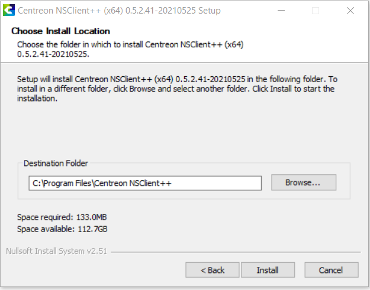
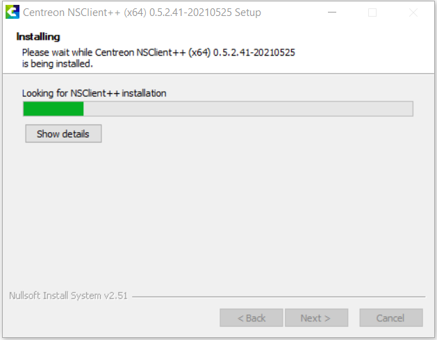
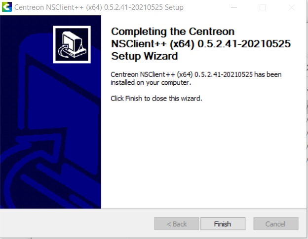
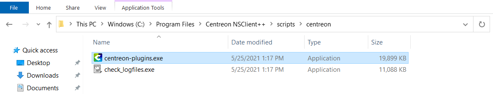
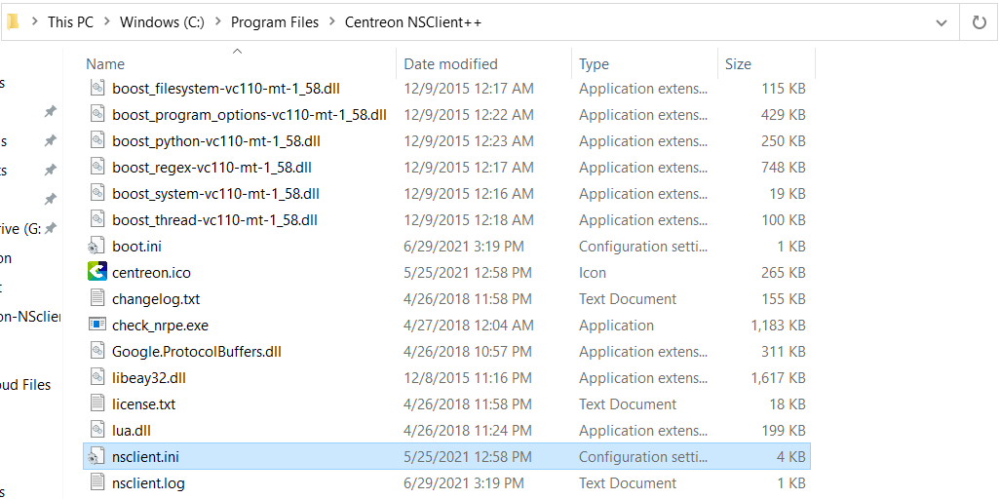
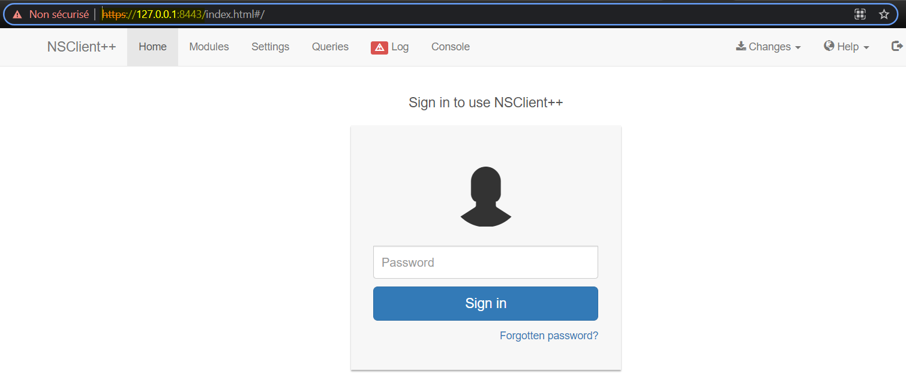

## Introduction

NSClient++ (also known as NSCP) aims to be a simple yet powerful and secure monitoring daemon. It can be used in many scenarios where you want to
receive/distribute check metrics.

The daemon has some basic features:

* Allow a remote machine (monitoring server) to request commands to be run on this machine (the monitored machine) which return the status of the machine.
* Submit the same results to a remote (monitoring server)
* Take action and perform tasks
* Submit metrics and real-time data to a central repository

Centreon provides a fully custom and re-packaged version of the NSClient++ agent, named **centreon-nsclient**.
Additionally to the agent native features, it allows to monitor applicative indicators such as Hyper-V, Active Directory, WSUS, SCCM, Microsoft Exchange,
Veeam and many others, thanks to the usage of a specific release of the Centreon Plugins for Windows.

These Plugins, parts of the [centreon-plugins project](https://github.com/centreon/centreon-plugins) are provided as a standalone and Windows compatible
package named *centreon_plugins.exe*. This executable file is automatically deployed during the agent installation and ready to use afterwards.

> The list of the Plugin Packs that can be used with the *centreon-nsclient* agent is avaiblable on the 
> official [Centreon Plugin Packs catalog](https://www.centreon.com/catalogue-plugins-packs/)

The following tutorial will help you to understand how to use the **centreon-nsclient** agent on your Windows servers.

## Support policy and release cycle

Centreon only supports the custom Centreon Plugins package provided through the **centreon-nsclient** agent. For any issue related to NSClient++ itself,
please refer to the [official documentation](https://docs.nsclient.org/).

Centreon will publish a new release of the custom Plugins (*centreon_plugins.exe* and *check_logfiles.exe*) including new monitoring capabilities as
well as bugfixes every month. 
An updated version of the **centreon-nsclient** installer (for new installations) including the last versions of the Plugins will also be available on
a montlhy basis.

> On existing installations, you will only have to update the Plugins, not the agent itself.
> To do so, read the [Update](#Update) chapter of this tutorial.

## Download

Both the installer and the packaged Centreon Plugins are available on the [centreon-nsclient](https://github.com/centreon/centreon-nsclient-build/releases)
Github project page. Look for the latest release and download the relevant files according to the target server environment (x86 or x64):

* For new installations: download the `Centreon-NSClient-0.5.x.xx-YYYYMMDD` installer
* To update an existing agent: download the `centreon_plugins_YYYYMMDD_*\*\*_.exe` & `check_logfiles_x.x.x_\*\*\*.exe` binaries

## Installation

> This chapter is related to a fresh installation of the **centreon-nsclient** agent.

On the Windows server, launch the installation and follow the wizard:

* The first step gives some information about the NSClient++ version you're about to install. Click on *Next* to go on:


* Choose the installation folder and click on *Next*:



* Wait until the installation process is completed:



* Once the installation performed, click on *Next* once more:


* The installation wizard should confirm that NSClient++ is installed and ready to rumble. Click on *Finish*:



## Update

> This chapter is related to the update of the custom packaged Plugins *centreon_plugins.exe* and *check_logfiles* on a server where 
> **centreon-nsclient** is already installed.

When the new monthly version of **centreon-nsclient** is released, you don't have to fully reinstall the agent on your Windows server, only the
packaged Plugins can be updated.

To do so, go to the directory where the *centreon_plugins.exe* and *check_logfiles.exe* binaries are stored (usually `C:\Program Files\Centreon NSClient++\scripts\centreon`)
and replace the two existing files with the new ones you downloaded from Github  (see the [Installation](#installation) chapter).



> Be careful to rename the new files with the exact same names of the former ones (remove the *versioning* part of the files names so the files will
> be named *centreon_plugins.exe* and *check_logfiles.exe*).

## Configuration

The general configuration, of the agent, its modules and the custom scripts to be used is stored in the `nsclient.ini`file, usually stored
in the `C:\Program Files\Centreon NSClient++\` folder:



The default configuration comes with most of the features and options already enabled and ready-to-use. Nevertheless, Centreon recommends to
adjust and/or set some additional parameters (mostly for safety purposes).

### NRPE

In the `[/modules]` section, check that the NRPE server is enabled:

```csv
NRPEServer = 1
```

In the `[/settings/NRPE/server]` section:

* Set the IP addresses of the Centreon Pollers allowed to monitor the server:

```csv
allowed hosts = @IP_Poller1, @IP_Poller2
```

* Check that the TCP port to be used is 5666:

```csv
port = 5666
```

* Centreon recommends to secure the connections using the SSL/TLS protocols.
To do so, check that the following option is enabled:

```csv
use ssl = true
```

* Check that the packet payload size is set to 8192:

```csv
payload length = 8192
```

* Finally, restart the NSClient++ service from a command line prompt:

```bash
net stop nscp
net start nscp
```

(This can also be done from the *Services* management console).

### Webserver / RestAPI

NSClient++ does natively provide a Web Server, allowing to monitor the target Windows Server using the HTTPS protocol. Centreon recommends to use this
method rather than the 'old' NRPE & NSCLIENT protocols, including the following benefits:

* This protocol comes secured by default
* Custom certificates can be used
* No compatibility issues between NRPE v2/v3 versions

#### Prerequisites

* The HTTPS port used by the Webserver (by default TCP/8443) must be open and reachable from the Centreon Poller.
* As for the NRPE protocol, the *port* and *allowed hosts* setting of the `nsclient.ini` file (section `/settings/WEB/server`) must be set (the
recommended port to be used is 8443 but you can use any custom ports >1024).
 
#### Enabling RestAPI and configuring credentials

To use the RestAPI feature of NSCLient++, you first have to enable the Webserver service:

* From a Windows command prompt launched **as an administrator**, run the following command:

```bash
nscp web install
```

* Then, configure a password to be used to access the API data:

```bash
nscp web -- password --set new-password
Password updated successfully, please restart nsclient++ for changes to affect.
```

You can also display the password you previously set if needed by running:

```bash
nscp web -- password --display
Current password: centreon
```

* Finally, still in the Windows command prompt interface, restart the NSCP service:

```bash
net stop nscp
net start nscp
```

* To check that the Webserver is properly configured and running, open a web browser on the Windows server and access the Webserver interface:

`https://127.0.0.1:8443/`



## Troubleshooting

Any issue related to the configuration of the agent and its usage, please refer to the wholesome [official FAQ](https://docs.nsclient.org/faq/) of
NSClient++ that will help you to solve the most common issues.

Any concern or question about the **centreon-nsclient** packaging and the usage of the Centreon Plugins, feel free to open an [issue on our Github
project](https://github.com/centreon/centreon-nsclient-build/issues).
