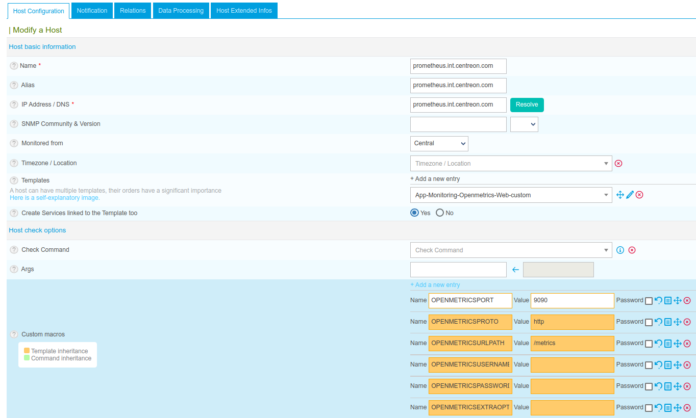
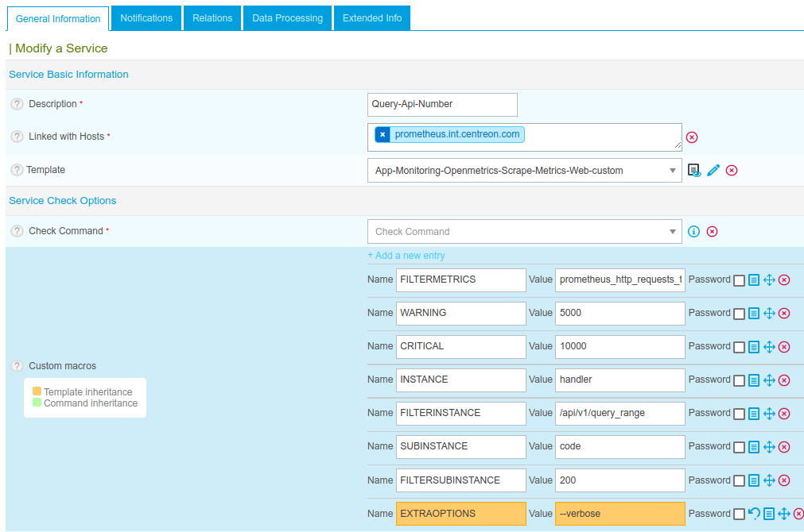
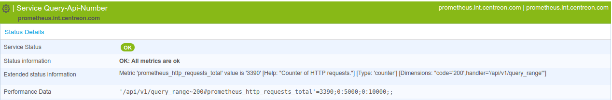

There is an effort to promote Prometheus exposition format into a standard known
as OpenMetrics. Some products adopted the format: InfluxData's suite, InfluxDB
and Google Cloud Platform.

## Installation

<!--DOCUSAURUS_CODE_TABS-->

<!--Online IMP Licence & IT-100 Editions-->

1.  Install the plugin on every poller expected to monitor openmetrics:

    ``` bash
    yum install centreon-plugin-Applications-Monitoring-Openmetrics
    ```

2.  Install the "OpenMetrics" Centreon Plugin Pack from the `Configuration >
    Plugin Packs` page.

<!--Offline IMP License-->

1.  Install the plugin on every poller expected to monitor openmetrics:

    ``` bash
    yum install centreon-plugin-Applications-Monitoring-Openmetrics
    ```

2.  Install the Centreon Plugin Pack RPM on your Central server:

    ``` bash
    yum install centreon-pack-applications-monitoring-openmetrics
    ```

3.  Install the "OpenMetrics" Centreon Plugin Pack from the `Configuration >
    Plugin Packs` page.

<!--END_DOCUSAURUS_CODE_TABS-->

## Configuration

The Plugin Pack "OpenMetrics" provide the collect of openmetrics from file on
the collector (the template will be App-Monitoring-Openmetrics-File-custom) or
from a API providing openmetrics (the template will be
App-Monitoring-Openmetrics-Web-custom). Following the template, several macros
must be configured :

### App-Monitoring-Openmetrics-File-custom

| Mandatory | Name                    | Description                                                                       |
| :-------- | :---------------------- | :-------------------------------------------------------------------------------- |
| X         | OPENMETRICSFILEPATH     | Path of the file that containts openmetrics (eg. /var/data/metrics)               |
|           | OPENMETRICSEXTRAOPTIONS | Any extraoptions you may want to add to every command line (eg. a --verbose flag) |

### App-Monitoring-Openmetrics-Web-custom

| Mandatory | Name                    | Description                                                                       |
| :-------- | :---------------------- | :-------------------------------------------------------------------------------- |
| X         | OPENMETRICSPORT         | Port use by the endpoint (eg '80', '443' or '9000')                               |
| X         | OPENMETRICSPROTO        | Protocol use by the endpoint ('http' or 'https')                                  |
| X         | OPENMETRICSURLPATH      | Path of the url that expose openmetrics (eg. /metrics)                            |
|           | OPENMETRICSUSERNAME     | Username in case of authentication required                                       |
|           | OPENMETRICSPASSWORD     | Password in case of authentication required                                       |
|           | OPENMETRICSEXTRAOPTIONS | Any extraoptions you may want to add to every command line (eg. a --verbose flag) |

Thoses 2 host templates will deploy automatically a service "Scrape-Metrics"
bind to your host. This service can be duplicated as often as necessary
according to the number of metrics to collect.

## How To

### Collect metrics using the command line

We have a server/container Prometheus which expose metrics ? Or a
server/container Cadvisor which also expose metrics ? We are going to see some
examples to collect thoses metrics from thoses endpoints.

#### Prometheus

Our server/container Prometheus expose metrics from this url:
'<http://prometheus.int.centreon.com:9090/metrics>'

```text
# HELP prometheus_http_requests_total Counter of HTTP requests.
# TYPE prometheus_http_requests_total counter
prometheus_http_requests_total{code="200",handler="/alerts"} 1
prometheus_http_requests_total{code="200",handler="/api/v1/label/:name/values"} 24
prometheus_http_requests_total{code="200",handler="/api/v1/labels"} 3
prometheus_http_requests_total{code="200",handler="/api/v1/query"} 5454
prometheus_http_requests_total{code="200",handler="/api/v1/query_range"} 3390
prometheus_http_requests_total{code="200",handler="/api/v1/targets"} 3
prometheus_http_requests_total{code="200",handler="/config"} 2
prometheus_http_requests_total{code="200",handler="/flags"} 2
prometheus_http_requests_total{code="200",handler="/graph"} 17
prometheus_http_requests_total{code="200",handler="/metrics"} 155749
prometheus_http_requests_total{code="200",handler="/new/*filepath"} 6
prometheus_http_requests_total{code="200",handler="/service-discovery"} 2
prometheus_http_requests_total{code="200",handler="/static/*filepath"} 54
prometheus_http_requests_total{code="200",handler="/status"} 5
prometheus_http_requests_total{code="200",handler="/targets"} 11
prometheus_http_requests_total{code="302",handler="/"} 20
prometheus_http_requests_total{code="400",handler="/api/v1/query"} 1
prometheus_http_requests_total{code="400",handler="/api/v1/query_range"} 4
```

We would like here get the number of total requests on handler
'/api/v1/query\_range', first we are going to collect all the mertics named
"prometheus\_http\_requests\_total":

``` bash
/usr/lib/centreon/plugins/centreon_monitoring_openmetrics.pl \
 --plugin apps::monitoring::openmetrics::plugin \
 --custommode web \
 --mode scrape-metrics \
 --hostname='prometheus.int.centreon.com' \
 --port='9090' \
 --proto='http' \
 --urlpath='/metrics' \
 --filter-metrics='prometheus_http_requests_total'
```

Command then returns:

``` bash
OK: All metrics are ok | 'prometheus_http_requests_total'=1;;;; 'prometheus_http_requests_total'=24;;;; 'prometheus_http_requests_total'=3;;;; 'prometheus_http_requests_total'=5454;;;; 'prometheus_http_requests_total'=3390;;;; 'prometheus_http_requests_total'=3;;;; 'prometheus_http_requests_total'=2;;;; 'prometheus_http_requests_total'=2;;;; 'prometheus_http_requests_total'=17;;;; 'prometheus_http_requests_total'=155790;;;; 'prometheus_http_requests_total'=6;;;; 'prometheus_http_requests_total'=2;;;; 'prometheus_http_requests_total'=54;;;; 'prometheus_http_requests_total'=5;;;; 'prometheus_http_requests_total'=11;;;; 'prometheus_http_requests_total'=20;;;; 'prometheus_http_requests_total'=1;;;; 'prometheus_http_requests_total'=4;;;;
```

We used the options: custommode web (`--custommode web`) to request the API
prometheus using HTTP or HTTPS. Then we configured all the informations about
the connections: the hostname (`--hostname='prometheus.int.centreon/com'`), the
port (`--port='9090'`), the protocol (`--proto='http'`) and the path of the URL
where the metrics are accessible (`--urlpath='/metrics'`). Then we fetched only
the metrics 'prometheus\_http\_requests\_totol'
(`--filter-metrics='prometheus_http_requests_total'`).

Now we would like filter the requests on URL '/api/v1/query\_range', we are
going to use the option `--instance` to have the possibility to filter on a
field and then use the option `--filter-instance` to filter on the value of this
fields:

``` bash
/usr/lib/centreon/plugins/centreon_monitoring_openmetrics.pl \
 --plugin apps::monitoring::openmetrics::plugin \
 --custommode web \
 --mode scrape-metrics \
 --hostname='prometheus.int.centreon.com' \
 --port='9090' \
 --proto='http' \
 --urlpath='/metrics' \
 --filter-metrics='prometheus_http_requests_total' \
 --instance='handler' \
 --filter-instance='/api/v1/query_range'
```

Command then returns:

``` bash
OK: All metrics are ok | '/api/v1/query_range#prometheus_http_requests_total'=3390;;;; '/api/v1/query_range#prometheus_http_requests_total'=4;;;;
```

We filtered on the 'handlers' (`--instance='hanlder'`) and so we only get the
metrics where the handler is '/api/v1/query\_range'
(`--filter-instance='/api/v1/query_range'`).

And now to finish, we are going to filter the requests that return a '200' as
the code. And we want to have the possibility to get a graph in Centreon and
alerting.

``` bash
/usr/lib/centreon/plugins/centreon_monitoring_openmetrics.pl \
 --plugin apps::monitoring::openmetrics::plugin \
 --custommode web \
 --mode scrape-metrics \
 --hostname='prometheus.int.centreon.com' \
 --port='9090' \
 --proto='http' \
 --urlpath='/metrics' \
 --filter-metrics='prometheus_http_requests_total' \
 --instance='handler' \
 --filter-instance='/api/v1/query_range' \
 --subinstance='code' \
 --filter-subinstance='200' \
 --warning='5000' \
 --critical='10000'
```

Command then returns:

``` bash
OK: All metrics are ok | '/api/v1/query_range~200#prometheus_http_requests_total'=3390;;;;
```

Here, we added the option `--subinstance='code'` to have a second filter on the
code value, and we filtered on the '200' code value with the opiton
`--filter-subinstance='200'`. For the thresholds, the options `--warning='5000'
--critical='10000'` are set to trigger a WARNING alert if the metric's value is
granter than 5000 and a CRITICAL alert if the value is granter than 10000.

All the options of the different modes can be display using the help (`--help`)

### Add the metrics to our monitoring

We are going to configure the host Prometheus by using the following parameters
:

| Parameter          | Value                                 |
| :----------------- | :------------------------------------ |
| NAME               | prometheus.int.centreon.com           |
| ALIAS              | internal prometheus                   |
| IPADDRESS/FQDN     | prometheus.int.centreon.com           |
| TEMPLATE           | App-Monitoring-Openmetrics-Web-custom |
| OPENMETRICSPORT    | 80                                    |
| OPENMETRICSPROTO   | http                                  |
| OPENMETRICSURLPATH | /metrics                              |



We can edit the service "Scrape-Metrics" which have been created automatically
by using the template "App-Monitoring-Openmetrics-Web-custom" to configure the
macros as the same in CLI :

| Parameter       | Value                             |
| :-------------- | :-------------------------------- |
| FILTERMETRICS   | prometheus\_http\_requests\_total |
| WARNING         | 5000                              |
| CRITICAL        | 10000                             |
| INSTANCE        | handler                           |
| FILTERINSTANCE  | /api/v1/query\_range              |
| SUBINSTANCE     | code                              |
| FILTERSUBINTACE | 200                               |
| EXTRAOPTIONS    | \--verbose                        |



And we rename the service by "Query-Api-Number". This service could be duplicate
and modificate to collect other Openmetrics and get alerting/reporting:


