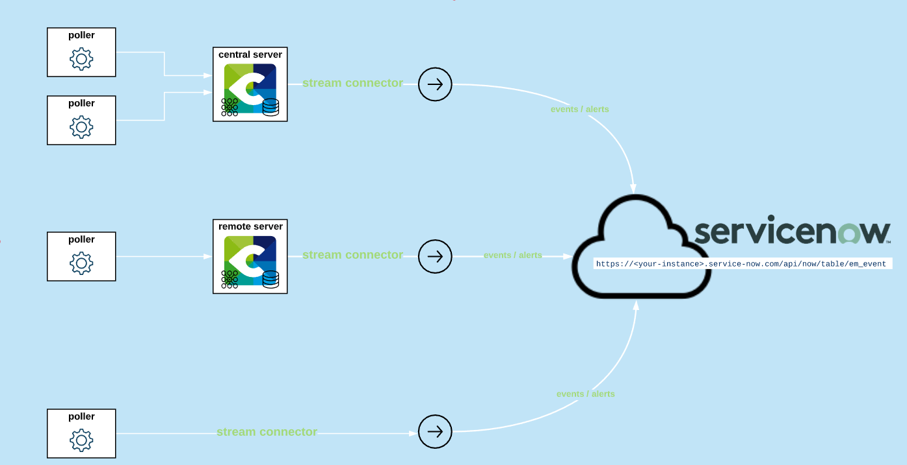

## How it works

### Overview

Servicenow Stream-connector send business activities, hosts and services check results from
centreon-engine to ServiceNow using its REST API and ServiceNow Event Manager

You can send the data you want to your ServiceNow instance, simply pick the implementation which best match your needs: 



### Data

Here is the default data mapping description helping you understand how the data is going
to be processed in Service Now.

**Host event**

| Centreon    | ServiceNow Event Manager field | Description                                   |
| ----------- | ------------------------------ | --------------------------------------------- |
| hostname    | node                           | The hostname                                  |
| output      | description                    | The Centreon Plugin output                    |
| last\_check | time\_of\_event                | The time of the event                         |
| hostname    | resource                       | The hostname                                  |
| status      | severity                       | The severity level depends on the host status |

**Service event**

| Centreon             | ServiceNow Event Manager field | Description                                   |
| -------------------- | ------------------------------ | --------------------------------------------- |
| hostname             | node                           | The hostname                                  |
| output               | description                    | The Centreon Plugin output                    |
| last\_check          | time\_of\_event                | The time of the event                         |
| service\_description | resource                       | The service name                              |
| status               | severity                       | The severity level depends on the host status |

## Compatibility

 - Madrid
 - New York
 - Orlando
 - Quebec

## Requirements

* ServiceNow Event Manager integration requires an **Event Manager License**
* A ServiceNow OAuth account is needed for the stream connector to POST events over the Snow API. Refer to their [official documentation](https://docs.servicenow.com/bundle/orlando-platform-administration/page/administer/security/task/t_CreateEndpointforExternalClients.html).
* The ServiceNow account must have the following privileges: evt_mgmt_integration 
* It is also necessary to use a Centreon account with either **admin privileges** or **Export configuration** and **Broker configuration** menu access in the WUI, as well as a **`root` access in command-line interface**.

## Integration Walkthrough

### Download the Stream-connector source code

Login as `root` on the Centreon central server using your favorite SSH client.

Install the required lua dependencies distributed through Centreon official repositories: 

```bash
yum install -y lua-curl
```

Download the connector source code: 

```bash
wget -O /usr/share/centreon-broker/lua/servicenow.lua https://raw.githubusercontent.com/centreon/centreon-stream-connector-scripts/master/centreon-certified/servicenow/servicenow-apiv1.lua
chmod 644 /usr/share/centreon-broker/lua/servicenow.lua
```

The ServiceNow Stream-connector is now installed on your Centreon central server!

### Configure Centreon-Broker output

1. Login to the Centreon GUI using an administrator account.
2. Navigate to the **Configuration** > **Pollers** menu and select **Broker configuration**.
3. Click on the **central-broker-master** broker configuration object and navigate to the **Output** tab.
4. Add a new **Generic - Stream connector** output.
5. Name it as you want (eg. **ServiceNow**) and set the right path for the LUA script: `/usr/share/centreon-broker/lua/servicenow.lua`.

| Name              | Type   | Value                                          |
| ----------------- | ------ | ---------------------------------------------- |
| `instance`        | String | Instance name: <your-instance>.service-now.com |
| `username`        | String | ServiceNow username                            |
| `password`        | String | ServiceNow password                            |
| `client_id`       | String | ServiceNow OAuth ClientId                      |
| `client_secret`   | String | ServiceNow OAuth ClientSecret                  |

7. Save your configuration, then navigate to the **Configuration** > **Pollers** menu and select **Pollers**.
8. Select the **Central** poller and click on **Export configuration**.
9. Keep **Generate Configuration Files** and **Run monitoring engine debug (-v)** checked and select **Move Export Files** and then click on the **Export** button.
10. Restart the `cbd` service:

```bash
systemctl restart cbd
```

Now your central server has loaded the ServiceNow SC and has started to send data!

To make sure that everything goes fine, you should have a look at `central-broker-master.log` and `connector-servicenow.log`, both located in `/var/log/centreon-broker`.

#### Advanced configuration

**Event filtering** 

To optimize datas passing through the Stream-connector, you can optionnaly select *Neb* in Filter Category.

**Parameters table**

| Name                | Type   | Default value                        | Description                                                                             |
| ------------------- | ------ | ------------------------------------ | --------------------------------------------------------------------------------------- |
| `proxy_address`     | String | ``                                   | If needed, the address of the proxy server (requires proxy_port option)                 |
| `proxy_port`        | String | ``                                   | The port of the proxy server                                                            |
| `proxy_username`    | String | ``                                   | If needed, the proxy user (requires proxy_password option)                              |
| `proxy_password`    | String | ``                                   | the proxy user password                                                                 |
| `logfile`           | String | `/custom/path/to/connector-snow.log` | logfile for the stream connector                                                        |
| `host_status`       | String | `0,1,2`                              | send event for up, down and unreachable hosts                                           |
| `service_status`    | String | `0,1,2,3`                            | send event for ok, warning, critical, unknown services                                  |
| `hard_only`         | Number | `1`                                  | Only send events in hard state                                                          |
| `acknowledged`      | Number | `0`                                  | Only send events that are not acknowledged                                              |
| `element_type`      | String | `host_status,service_status`         | Send host and service centreon status event                                             |
| `category_type`     | String | `Neb`                                | Filter out non Neb events                                                               |
| `in_downtime`       | Number | `0`                                  | Only send events that are not in downtime                                               |
| `max_buffer_size`   | Number | `10`                                 | Send 10 events at a time unless max_buffer age is reached before                        |
| `max_buffer_age`    | Number | `5`                                  | Store events for 5 second before sending them unless max_buffer_size is reached before  |
| `max_stored_events` | Number | `10`                                 | Keep event in cache to avoid sending duplicated events, change with caution             |
| `skip_anon_events`  | Number | `1`                                  | Do not send events from hosts or services that are not found in the broker cache        |
| `skip_nil_id`       | Number | `1`                                  | Do not send events from objects that do not have an ID (meta services most of the time) |

## How to Uninstall

1. Login to the Centreon WUI using an administrator account.
2. Navigate to the **Configuration** > **Pollers** menu and select **Broker configuration**.
3. Click on the **central-broker-master** broker configuration object and navigate to the **Output** tab.
4. Delete the **Generic - Stream connector** output by clicking on the red circled cross at the end of the line.
5. Save your configuration, then navigate to the **Configuration** > **Pollers** menu and select **Pollers**.
6. Select the **Central** poller and click on **Export configuration**.
7. Keep **Generate Configuration Files** and **Run monitoring engine debug (-v)** checked and select **Move Export Files** and then click on the **Export** button.
8. Restart the `cbd` service:

```bash
systemctl restart cbd
```

The Stream Connector is not loaded anymore!

9. Optionally, you can even delete the script file:

```bash
rm -f /usr/share/centreon-broker/lua/servicenow.lua
```
