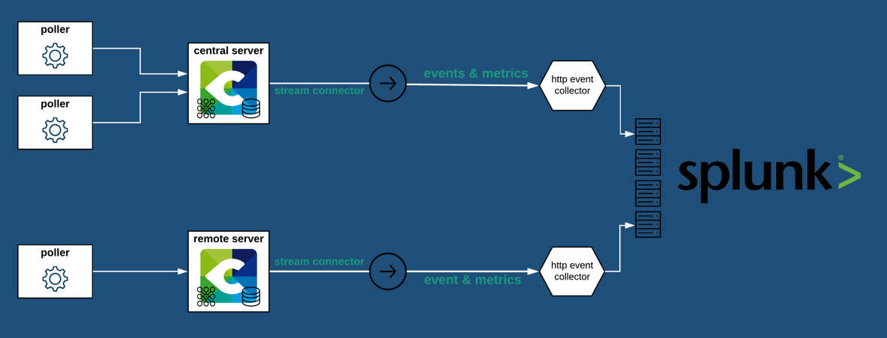

## Splunk + Centreon Integration Benefits

## How it works

* Every time a service or a host's state is checked, the event passes through Centreon Broker, which loads the Stream Connector to send state changes.
* State changes can occur in case of an anomaly detection or metrics falling out of range.



### Filters

Several filters have been set in the Splunk Event Stream Connector:
* Only the change of status about services (BA Included) and hosts are processed
* Only the HARD state type are processed
* If the host or the service is in downtime, it's not processed
* We don't process the PENDING states

### Data format

Here an example of the format POST by the Stream Connector for a service event:

```json
{
    "event": {
        "event_type": "service",
        "hostname": "HQ-FW-Inet",
        "output": "CRITICAL: Domain 'headquarter_inet' Intrusions detected : 120Domain 'headquarter_inet' Intrusions detected : 120, Intrusions blocked : 0, Critical severity intrusions detected : 519, High severity intrusions detected : 456, Medium severity intrusions detected : 394, Low severity intrusions detected : 254, Informational severity intrusions detected : 0, Signature intrusions detected : 8282, Anomaly intrusions detected : 1\\n",
        "service_description": "Ips-Stats-Global",
        "state": 2
    },
    "host": "Centreon",
    "index": "archimede-events",
    "source": "http:archimede-events",
    "sourcetype": "_json"
}
```

## Requirements

* Splunk integrations requires an Splunk Entreprise Edition and a HTTP Event Collector to send the Centreon Data. 
* It is also necessary to use a Centreon account with either **admin privileges** or **Export configuration** and **Broker configuration** menu access in the WUI, as well as a **`root` access in command-line interface**.

## Support

If you need help with this integration, depending on how you are using Centreon, you can:

* **Commercial Edition customers**: please contact the [Centreon Support team](mailto:support@centreon.com).
* **Open Source Edition users** or **Centreon IT-100 users** (free versions): please reach our [Community Slack](https://centreon.github.io) where our users and staff will try to help you.

## Integration Walkthrough

### In Splunk

You'll need to create a specific HTTP Event Collector for Centreon by following the [official documentation of Splunk](https://docs.splunk.com/Documentation/Splunk/latest/Data/UsetheHTTPEventCollector).
You can also use a existing HTTP Event Collector and create a specific **Events Index** for the Centreon Stream Splunk Connector.

### In Centreon

#### Installation 

Login as `root` on the Centreon central server using your favorite SSH client.

In case your Centreon central server must use a proxy server to reach the Internet, you will have to export the `https_proxy` environment variable and configure `yum` to be able to install everything.

```bash
export https_proxy=http://my.proxy.server:3128
echo "proxy=http://my.proxy.server:3128" >> /etc/yum.conf
```

Now that your Centreon central server is able to reach the Internet, you can run:

```bash
yum install -y lua-curl epel-release
yum install -y luarocks
luarocks install luatz
```

These packages are necessary for the script to run. Now let's download the script:

```bash
wget -O /usr/share/centreon-broker/lua/splunk-events-http.lua https://raw.githubusercontent.com/centreon/centreon-stream-connector-scripts/master/splunk/splunk-events-http.lua
chmod 644 /usr/share/centreon-broker/lua/splunk-events-http.lua
```

The Splunk Events StreamConnnector is now installed on your Centreon central server!

#### Broker configuration

1. Login to the Centreon WUI using an administrator account.
2. Navigate to the **Configuration** > **Pollers** menu and select **Broker configuration**.
3. Click on the **central-broker-master** broker configuration object and navigate to the **Output** tab.
4. Add a new **Generic - Stream connector** output.
5. Name it as you want (eg. **Splunk Events**) and set the right path for the LUA script: `/usr/share/centreon-broker/lua/splunk-events-http.lua`.
6. Add at least the following parameters:
| Name              | Type   | Value                                                                                          |
| ----------------- | ------ | ---------------------------------------------------------------------------------------------- |
| `http_server_url` | String | `the URL of splunk service collector (eg. http://splunk.centreon.com:8088/services/collector)` |
| `splunk_token`    | String | `Token link to the HTTP Event Collector`                                                       |
| `splunk_index`    | String | `Index where the events/metrics are stored`                                                    |
| `splunk_source`   | String | `source of the HTTP events collector, must be http:<name_of_index>`                            |
7. Save your configuration, then navigate to the **Configuration** > **Pollers** menu and select **Pollers**.
8. Select the **Central** poller and click on **Export configuration**.
9. Keep **Generate Configuration Files** and **Run monitoring engine debug (-v)** checked and select **Move Export Files** and then click on the **Export** button.
10. Restart the `cbd` service:

```bash
systemctl restart cbd
```

Now your central server has loaded the Splunk Events Stream Connector and has started to send data!

> To make sure that everything goes fine, you should have a look at `central-broker-master.log` and `stream-connector-splunk-events.log`, both located in `/var/log/centreon-broker`.

#### Advanced configuration

**Parameters table**

| Name                | Type   | Value example                                    | Explanation                                                                                  |
| ------------------- | ------ | ------------------------------------------------ | -------------------------------------------------------------------------------------------- |
| `http_proxy_string` | String | `http://your.proxy.server:3128`                  | Proxy string needed to reach the Internet in HTTP/HTTPS                                      |
| `splunk_sourcetype` | String | `_json` (default value)                          | A default field that identifies the data structure of an event.                                                                   |
| `splunk_host`       | String | `Centreon` (default value)                       | A default field that contains the hostname/IP Address of the device that generated an event. |
| `log_level`         | Number | 2 (default value)                                | Verbosity level for logs 0: errors only 1: +warnings, 2: +verbose, 3: +debug                 |
| `log_path`          | String | `/var/log/centreon-broker/my-custom-logfile.log` | Log file full path and name                                                                  |
| `max_buffer_size`   | Number | 1 (default value)                                | Number of events to enqueue in buffer before sending                                         |
| `max_buffer_age`    | Number | 5 (default value)                                | Maximum number of seconds before sending an event when `max_buffer_size` hasn't been reached |

**Remarks**

* The default value of 2 for `log_level` is fine for initial troubleshooting, but can generate a huge amount of logs if you monitor a lot of hosts. In order to get less log messages, you should tune this parameter.
* The default value of 1 for `max_buffer_size` works fine and ensures the best response times. You might want to tune it (*ie.* increase it) if you have an important amount of data to send to Splunk.

---------------

## How to Uninstall

1. Login to the Centreon WUI using an administrator account.
2. Navigate to the **Configuration** > **Pollers** menu and select **Broker configuration**.
3. Click on the **central-broker-master** broker configuration object and navigate to the **Output** tab.
4. Delete the **Generic - Stream connector** output by clicking on the red circled cross at the end of the line.
5. Save your configuration, then navigate to the **Configuration** > **Pollers** menu and select **Pollers**.
6. Select the **Central** poller and click on **Export configuration**.
7. Keep **Generate Configuration Files** and **Run monitoring engine debug (-v)** checked and select **Move Export Files** and then click on the **Export** button.
8. Restart the `cbd` service:

```bash
systemctl restart cbd
```

The Stream Connector is not loaded anymore!

9. Optionally, you can even delete the script file:

```bash
rm -f /usr/share/centreon-broker/lua/splunk-events-http.lua
```
