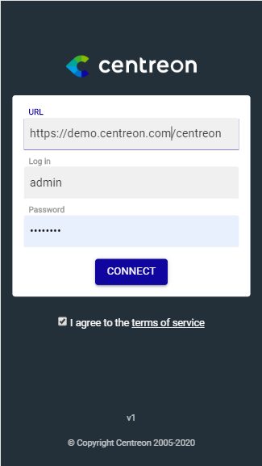

Centreon comes with its mobile App. to let you access resources status on mobility, wether you're on phone or tablet. 

  

The main capabilities of Centreon Mobile App. are :

- See your resources current status: hosts & services
- Filter resources list
- Take actions: acknowledge or set a planned downtime
- See detail information of host or service
- Access metrics history via charts 

  <video width="375" height="812" controls="true" allowfullscreen="true" poster="../assets/mobile/mobile-login.png">
    <source src="../assets/mobile/mobile-demo.mp4" type="video/mp4">
  </video>

## Pre-requisites

To be able to connect your mobile App. to your Centreon platform:

- Run at least iOS >= 13.x and Android >= 8 on your device
- Have a Centreon plateform >= 20.04
- Have a “Direct” connection between your smartphone & the Centreon plateform you want to connect to. You may ofc 
use a VPN
- A valid SSL certificate on your Centreon platform issued from a trusted certificate authority known by your device

## How to install 

The App. installation mechanism depends on your device:

For **Android**, you can:

 - Download the application from the [Google Play store](https://play.google.com/store/apps/details?id=com.centreon.mobileapp) 
 - Install it from [mobile.centreon.com](https://www.mobile.centreon.com/) using the "Add to home screen" feature

    

For **Apple iOS**, go to [mobile.centreon.com](https://www.mobile.centreon.com/) using Safari and use the
"Add to home screen" feature

## How to connect 

When install and launch the application for the first time, you need to fill the following parameters:

- URL: https://yourcentreon.int.com/centreon : do not forget the /centreon if this your current Centreon URL
- User: Type your username to connect to Centreon
- Passowrd: Type the passowrd to connect to Centreon

The application will **locally** store URL & Login.
Your phone may suggest to store the password in the password manager

If you have problem to connect:

-  make sure Centreon platform is accessible via your device. 
- During the installation or upgrade of Centreon, you may have customized your Apache configuration (for HTTPS or URL rewriting purpose), in that case
you may want to double-check that your configuration makes the API accessible [on this page](../administration/accessing-to-centreon-ui). 

