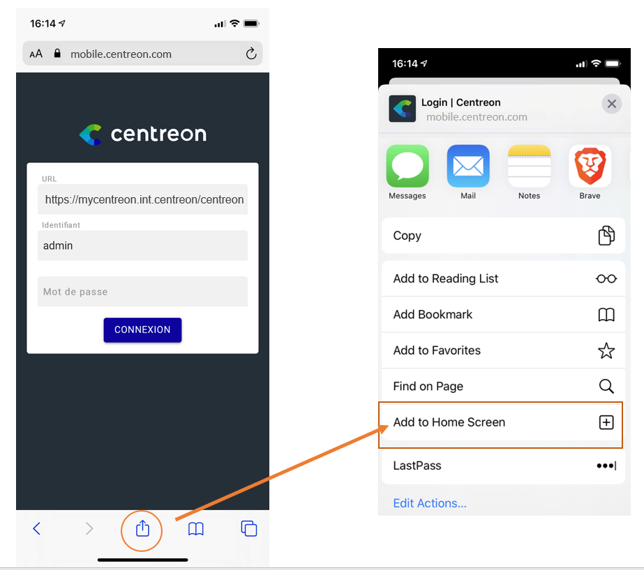

Centreon comes with its application to let you access resources status, whether you're on phone or tablet.

  

The main capabilities of Centreon Mobile application are :

- See your resources current status: hosts & services
- Filter resources list
- Take actions: acknowledge or set a planned downtime
- See detail information of host or service
- Access metrics history via charts

  <video width="375" height="812" controls="true" allowfullscreen="true" poster="../assets/mobile/mobile-login.png">
    <source src="../assets/mobile/mobile-demo.mp4" type="video/mp4">
  </video>

> The mobile application has been developed using the 
> PWA - [Progressive Web App mechanism](https://en.wikipedia.org/wiki/Progressive_web_application).
> It's composed only with html/css/js code, stored & exectued on your phone. It's a modern, flexible & 
> light way of developing mobile application, reducing stores dependencies, facilitating quick updates. 
> More information at [Web.dev](https://web.dev/what-are-pwas/)

## Pre-requisites

To be able to connect your mobile application to your Centreon platform:

- Run at least iOS >= 13.x and Android >= 8 on your device
- Have a Centreon platform >= 20.04
- Have a “Direct” connection between your smartphone & the Centreon platform you want to connect to. You may also use a VPN
- A valid SSL certificate on your Centreon platform issued from a trusted certificate authority known by your device

## How to install

The application installation mechanism depends on your device:

<!--DOCUSAURUS_CODE_TABS-->
<!-- Android -->

For **Android**, you can:

 - Download the application from the [Google Play store](https://play.google.com/store/apps/details?id=com.centreon.mobileapp)
 - Install it from [mobile.centreon.com](https://mobile.centreon.com/) using the "Add to home screen" feature

    

<!-- Apple/iOS -->

For **Apple iOS**, go to [mobile.centreon.com](https://mobile.centreon.com/) using Safari and use the
"Add to home screen" feature

<!--END_DOCUSAURUS_CODE_TABS-->

## How to connect

When install and launch the application for the first time, you need to fill the following parameters:

- URL: URL to connect to your Centreon. Do not forget the /centreon if this your current Centreon URL. Example: `https://yourcentreon.int.com:PORT/centreon`
- User: Type your username to connect to Centreon
- Password: Type the password to connect to Centreon

The application will **locally** store URL & Login.
Your phone may suggest to store the password in the password manager

If you have problem to connect:

- Make sure Centreon platform is accessible from your device
- During the installation or upgrade of Centreon, you may have customized your Apache configuration (for HTTPS or URL rewriting purpose), in that case
you may want to double-check that your configuration makes the API accessible [on this page](../administration/accessing-to-centreon-ui.html)
- Make sure to give realtime API access to the user. You can check it in the menu
`Configuration > Users > Contacts / Users`, parameter **Reach API Realtime** of the second tab
