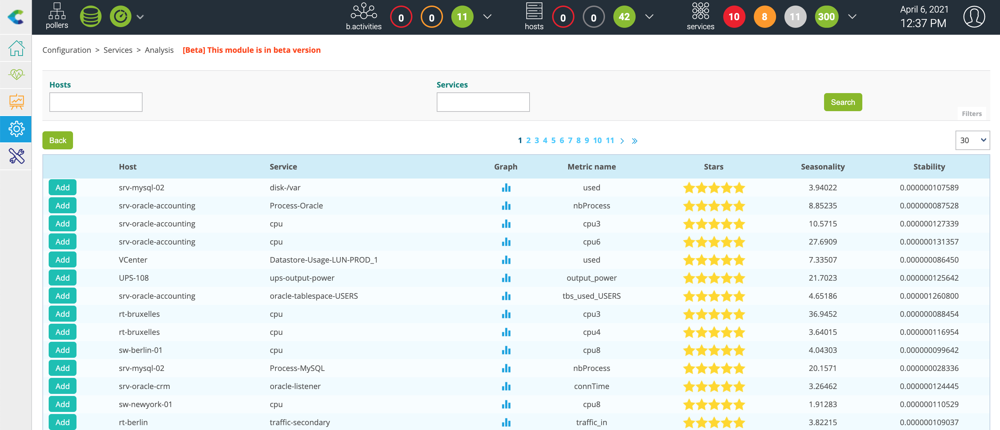

> Centreon Anomaly Detection is currently in **closed-beta phase** and require a
> valid token provided by Centreon. We will soon open the beta phase to the
> public under certain conditions.

## Description

The **Centreon Anomaly Detection** module detects deviations from the regular
service behavior.

Collected data is sent to the Centreon Cloud platform in order to be able to
compute a regular behavior model thanks to the history of this data.

Once the model has been calculated, predictions are then generated and retrieved
on the on-premise Centreon platform.

These predictions will serve as floating thresholds which will then be used by
the monitoring engine to compare the collected value with the predicted
thresholds to highlight deviations and generate alerts.


## Prerequisites

The Centreon Anomaly Detection module requires the following prerequisites:

  - Centreon in minimum version 20.04
  - A token provided by Centreon to access the Centreon Cloud platform
  - An Internet connection from the Centreon Central server
  - Prediction best works with monitored services that present a seasonal
    behaviour as shown below:


## Installation

### Installing packages

Run the following command as a privileged user:

```shell
yum install centreon-anomaly-detection
```

### UI installation

Go to `Administration > Extensions > Manager` and search **anomaly**. Click
on **Install selection**:


Your module is now installed:


### Restart process

Run the following command as a privileged user:

```shell
systemctl restart gorgoned
```

### Add your token

Go to the `Configuration > Services > Anomaly Detection` menu and click on
**Add Centreon Cloud Token** button:


Enter your token and click on **Save**:


> If your Centreon Central server needs a proxy configuration to access the
> Internet, check the **Use proxy** box.

Your Centreon platform is now ready to use Centreon Anomaly Detection.

## Configuration

> In its beta version, the Centreon Anomaly Detection module does not allow you
> to configure services from classic services already supervised by your
> Centreon platform.

Configuration must be done in 3 steps:

1.  [Activate the sending of the collected data to Centreon
    Cloud](#activate-the-sending-of-the-collected-data-to-centreon-cloud) in
    order to start modeling regular behavior then control via the menu
    `Monitoring > Performances > Graphs` the first modeling calculations
    carried out.
2.  Once the model seems right, [activate the generation of
    alerts](#activate-the-generation-of-alerts)
3.  As soon as the alerts generated seem correct to you, [activate the
    notification process](#activate-the-notification-process)

### Activate the sending of the collected data to Centreon Cloud

Go to the `Configuration > Services > Anomaly Detection` menu and click on
**Create manually** button:


#### Configuration fields

  - The **Description** field defined the name of the service.
  - The **Status** field allows us to enable or disable the service.
  - The **Select host - service** field allows to choose the host / service
    couple from which the data will be selected.
  - The **Select metric** field allows to select the metric on which will we
    apply anomaly detection.
  - Select a default contact for the **Implied Contacts** field.
  - Set **0** for the **Notification Interval** field.
  - Select a default period for the **Notification Period** field.
  - Select **None** for the **Notification Type** field.
  - You can select a **Severity level**.

Click on **Save**.

It is now time to [deploy the
monitoring](./monitoring-servers/deploying-a-configuration.html).

Then go to the `Monitoring > Status Details > Services` menu and select
**All** value for the Service Status filter. After a few minutes, the first
results of the monitoring appear.

> The behavior model calculation will start. However, to obtain a model
> representing a regular behavior, it is necessary to wait several weeks (around
> 6 weeks) in order to obtain a stable model.

> If the data on which you apply the anomaly detection has been supervised for a
> certain time, it is possible to [transfer the data
> history](#forward-history-of-data) to obtain a reliable model more quickly.

### Activate the generation of alerts

If, by regularly following the generated model and the data from the
`Monitoring > Performances > Graphs` menu, you think that your model is
stable, you can activate alert generation.

Go to the `Configuration > Services > Anomaly Detection` menu and edit your
anomaly detection service:


You can now enable **Enable change of status** and select the number of
deviations you want before to validate the alert using the **Detect anomalies
after** field.

Click on **Save** and [deploy the monitoring
configuration](./monitoring-servers/deploying-a-configuration).

### Activate the notification process

If the generated alerts seem relevant to you, you can now activate the
notification process.

Go to the `Configuration > Services > Anomaly Detection` menu and edit your
anomaly detection service:


  - Select **Enabled** for the **Enable notification** option.
  - Select the **Implied Contacts** will receive notification.
  - Select the **Implied Contact Groups** will receive notification.
  - Select the **Notification Interval**, by default **0** to receive only one
    notification by status.
  - Select the **Notification Period** on which you will receive notification.
  - Select the **Notification Type** that you want to receive.

Click on **Save** and [deploy the monitoring
configuration](./monitoring-servers/deploying-a-configuration).

### Use the creation wizard

Since version 20.10.1, it is possible to use the creation wizard. Indeed, this
new functionality makes it possible to highlight the services presenting either a
seasonality or a regular stability.

Go to the`Configuration > Services > Anomaly Detection` menu and click on
**Create from analysis** button.

The list of existing services on your Centreon platform is displayed as well as a
score in number of stars: from 5 stars to 0, 5 stars representing high potential
services:



After selecting an interesting service, click on the **ADD** button to the left
of the row. You arrive on the pre-filled creation form:


Modify the name of the service then click on the **Save** button.

> If the list is empty, it means that the calculation to determine the services
> of interest has not yet started.
> 
> This is done every 6 hours via a cron launched by the `gorgoned` process
> (defined in the **/etc/centreon-gorgone/config.d/cron.d/42-anomalydetection.yaml** file).
> 
> It is possible to launch the first calculation manually via the following 
> command from the central Centreon server:
> ```shell
> su - centreon
> perl /usr/share/centreon/bin/anomaly_detection --seasonality
> ```

## View the anomalies detected

Anomaly services are regular services but have floating thresholds that adapt
according to the calculated model. It is therefore possible to view its services
and the alerts detected though:

  - The `Monitoring > Status Details > Services` menu.
  - The `Monitoring > Performances > Graphs` menu.
  - The `Monitoring > Event Logs > vent Logs` menu.
  - The **service-monitoring** widget in the `Home > Custom Views` menu.
  - And all menus where you can operate on services.

## Forward history of data

> Sending data history is a very CPU intensive process. Depending on the number
> of services monitored, the extraction of data from the **centreon\_storage**
> database can take several tens of minutes. This will strongly impact the
> performance of the database and may slow down the overall monitoring platform.

To send the historic of data of an anomaly service, connect to your Centreon
Central server and access to the **centreon** user:

```shell
su - centreon
```

Select the anomaly service using the following command:

```shell
/usr/share/centreon/bin/anomaly_detection --list-services
```

You will see the list of services with their ID:

```shell
List of available anomaly detection services:

- id: 14, hostname: fw-beijing, servicename: anomaly-nbr-connect, metric name: connection
- id: 15, hostname: fw-brasilia, servicename: anomaly-nbr-connect, metric name: connection
- id: 17, hostname: fw-mexico, servicename: anomaly-nbr-connect, metric name: connection
- id: 18, hostname: fw-berlin, servicename: anomaly-nbr-connect, metric name: connection
- id: 22, hostname: fw-brasilia, servicename: anomaly-traffic-in, metric name: traffic_in
```

To send history of data for the anomaly service with ID 14 for the last 4 weeks
execute the following command:

```shell
/usr/share/centreon/bin/anomaly_detection --send-history 14 --history-period 4w
```

Wait until the end of the process:

```shell
Sending data from 2020-03-09T09:32:31 to 2020-03-10T00:00:00
Sending data from 2020-03-10T00:00:00 to 2020-03-11T00:00:00
Sending data from 2020-03-11T00:00:00 to 2020-03-12T00:00:00
Sending data from 2020-03-12T00:00:00 to 2020-03-13T00:00:00
Sending data from 2020-03-13T00:00:00 to 2020-03-14T00:00:00
Sending data from 2020-03-14T00:00:00 to 2020-03-15T00:00:00
Sending data from 2020-03-15T00:00:00 to 2020-03-16T00:00:00
Sending data from 2020-03-16T00:00:00 to 2020-03-17T00:00:00
Sending data from 2020-03-17T00:00:00 to 2020-03-18T00:00:00
Sending data from 2020-03-18T00:00:00 to 2020-03-19T00:00:00
Sending data from 2020-03-19T00:00:00 to 2020-03-20T00:00:00
Sending data from 2020-03-20T00:00:00 to 2020-03-21T00:00:00
Sending data from 2020-03-21T00:00:00 to 2020-03-22T00:00:00
Sending data from 2020-03-22T00:00:00 to 2020-03-23T00:00:00
Sending data from 2020-03-23T00:00:00 to 2020-03-24T00:00:00
Sending data from 2020-03-24T00:00:00 to 2020-03-25T00:00:00
Sending data from 2020-03-25T00:00:00 to 2020-03-26T00:00:00
Sending data from 2020-03-26T00:00:00 to 2020-03-27T00:00:00
Sending data from 2020-03-27T00:00:00 to 2020-03-28T00:00:00
Sending data from 2020-03-28T00:00:00 to 2020-03-29T00:00:00
Sending data from 2020-03-29T00:00:00 to 2020-03-30T00:00:00
Sending data from 2020-03-30T00:00:00 to 2020-03-31T00:00:00
Sending data from 2020-03-31T00:00:00 to 2020-04-01T00:00:00
Sending data from 2020-04-01T00:00:00 to 2020-04-02T00:00:00
Sending data from 2020-04-02T00:00:00 to 2020-04-03T00:00:00
Sending data from 2020-04-03T00:00:00 to 2020-04-04T00:00:00
Sending data from 2020-04-04T00:00:00 to 2020-04-05T00:00:00
Sending data from 2020-04-05T00:00:00 to 2020-04-06T00:00:00
```
## FAQ

### What services are offered and their associated SLA?

The anomaly detection service is currently in closed beta test phase as described in the Centreon documentation. The
purpose of this phase is to test our algorithms and their resulting predictions (floating thresholds).
During this phase, Centreon will improve the anomaly detection feature based on users feedback. No SLA will be available
during this phase.

### What are the selection criteria for the beta test program? for what duration and volume?

A participation form is available to Centreon customers. Based on the answers to the form, Centreon will select the
candidates to participate in the closed beta test phase.

### What is the defined process for the beta test program?

Once the candidates have been selected, Centreon will contact them to indicate the procedure to follow. Regular meetings
will be scheduled to assess the effectiveness of the feature on the customers' platform. Remote handling sessions may be
necessary.
An update of the functionality may also be requested to validate the changes made following the feedback.

### How long is the beta test program?

The closed beta test period will last for about 4 months. This should validate the predictions generated from the calculation of
the models, as well as the generation of alerts in the event console and the triggering of the notification process.

#### When will the feature be available? And for what Centreon Edition?

The Anomaly Detection functionality will be available for Centreon Business Edition in the 21.10 version.

### How long is the data stored?

The data is kept for the entire validity of the license. It will allow to recalculate models if necessary. An
additional period of 3 months will be added at the end of the validity of the license before its deletion.

### What data is hosted by the service?

The data hosted by the anomaly detection service only concerns data linked to the services created by the user. It
includes the date and time of the control, the identifier of the monitored resource, the identifier of the associated
indicator, the name of the performance data on which the computations will be performed as well as the value of the
performance data.

### What is the data used for?

The data is used to compute behavior models. From these models will be generated predictions used as floating
thresholds by the Centreon platform.

### Who has access to the data hosted by the service?

The data is associated with the access token of the anomaly detection offer. They are hosted on the Centreon Cloud
Platform and partitioned by users. Only the user with the token has access to the data.

### How can I request the deletion of data?

The deletion of data may be requested at any time. However, the history of the data is used to create a model to
calculate the floating thresholds. Therefore participation in the program or subscription to the subsequent offer
will be impossible.
A request must be made via the Centreon professional support interface.
