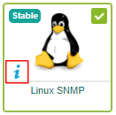

A host is any entity that has an IP address corresponding to a resource of the information system. E.g.: A server, network printer, a NAS server, a temperature sensor, an IP camera, etc.

The list of hosts is shown on page **Configuration > Hosts > Hosts**.

You can:
- [create hosts manually](hosts.html), using [host templates](hosts-templates.html)
- use the [hosts discovery feature](../discovery/introduction.html).

## Monitoring a host

The easiest way to monitor a host is to assign it a [template](hosts-templates.html) from a [Plugin Pack](../pluginpacks.html) : 

1. To know the name of the template for a specific Plugin Pack, go to **Configuration > Plugin Packs**. Search for the Plugin Pack you want, then click on the "i" icon at the bottom left of the pack.

    

    The documentation for the Plugin Pack opens: it will give you the exact name of the template for this Plugin Pack.

2. Create the host:
    - [manually](hosts.html): in the **Templates** field, select the template for the Plugin Pack you want.
    - using the [autodiscovery](../discovery/hosts-discovery.html) module: the Plugin Pack will be filled in automatically.

3. [Deploy](../monitoring-servers/deploying-a-configuration.html) the configuration. The host and its services are now monitored: they are 
displayed on the [Resources status](../../alerts-notifications/resources-status.html) page.