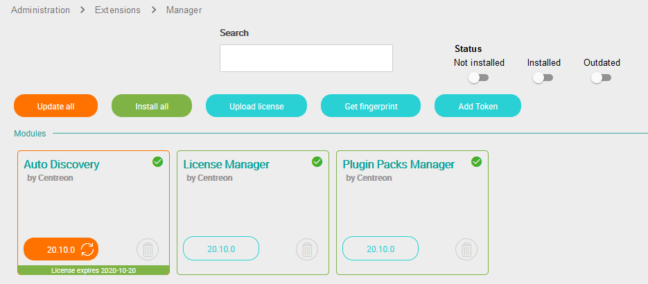
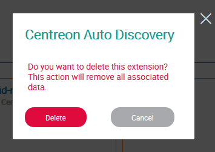

## Update

> When upgrading from a version earlier than version 20.04, all data of 
> **Host Discovery** feature will be lost:
>
> - Discovery tasks,
> - Saved parameters/credentials.
>
> This is due to the new hardened way credentials are stored in this version.
>
> Discovered hosts through those tasks will remain.
>
> Upgrading to 21.04 will keep all data stored since 20.04.

To update the module, run the following command:

``` shell
yum update -y centreon-auto-discovery-server
```

Connect to the Centreon's web interface using an account allowed to administer
products and go to the `Administration > Extensions > Manager` menu.

> Make sure that **License Manager** and **Plugin Packs Manager** modules are
> up-to-date before updating **Auto Discovery** module.

Click on the update icon corresponding to the **Auto Discovery**
module:



The module is now updated:


## Uninstallation

Connect to the Centreon’s web interface using an account allowed to administer
products and go to the `Administration > Extensions > Manager` menu.

Click on the delete icon corresponding to the **Auto Discovery**
module:


A confirmation popup will appear, confirm the action:



The module is now uninstalled:


> Uninstalling the module will also remove all the associated data. Data won't
> be restorable unless a database backup has been made.

## Gorgone module configuration

The **Auto Discovery** module brings a specific configuration for the Gorgone
service on the Central server. The default configuration is
`/etc/centreon-gorgone/config.d/41-autodiscovery.yaml`.

A maximum duration for hosts discovery jobs is set globally. If its necessary to
change it (large subnet SNMP discovery for example), edit the configuration and
add the *global_timeout* directive.

If mail notifications are enabled in service discovery rules, mail parameters
can be defined to choose the sender, subject or mail command.

Example of configuration:

```yaml
gorgone:
  modules:
    - name: autodiscovery
      package: "gorgone::modules::centreon::autodiscovery::hooks"
      enable: true
      # Host Discovery
      check_interval: 15
      global_timeout: 300
      # Service Discovery
      mail_subject: Centreon Auto Discovery
      mail_from: centreon-autodisco
      mail_command: /bin/mail
```

> Be sure to restart Gorgone service after any configuration modification:
>
> ```shell
> systemctl restart gorgoned
> ```

### Distributed architecture

The hosts and services discoveries both rely on Gorgone to perform discoveries
on both Central and Remote Server or Pollers.

> It is necessary to have a ZMQ communication between the Central server and a
> Remote Server to perform a discovery on a Poller attached to this Remote
> Server.
>
> Look at the section presenting the differente [communication
> types](../monitoring-servers/communications.html) to know more.

### Service Discovery scheduled job

All the active discovery rules are periodically executed through a scheduled job
managed by Gorgone's cron module. The **Auto Discovery** module brings a cron
definition in the following file:
`/etc/centreon-gorgone/config.d/cron.d/41-service-discovery.yaml`.

```yaml
- id: service_discovery
  timespec: "30 22 * * *"
  action: LAUNCHSERVICEDISCOVERY
```

The default configuration runs the discovery every day at 10:30 PM.

> If you had changed the legacy *crond* configuration file to adapt the schedule
> you must apply changes to the new configuration file.

It is also possible to run multiple service discoveries with different
parameters:

```yaml
- id: service_discovery_poller_1
  timespec: "15 9 * * *"
  action: LAUNCHSERVICEDISCOVERY
  parameters:
    filter_pollers:
      - Poller-1
- id: service_discovery_poller_2_linux
  timespec: "30 9 * * *"
  action: LAUNCHSERVICEDISCOVERY
  parameters:
    filter_pollers:
      - Poller-2
    filter_rules:
      - OS-Linux-SNMP-Disk-Name
      - OS-Linux-SNMP-Traffic-Name
- id: service_discovery_poller_2_windows
  timespec: "45 9 * * *"
  action: LAUNCHSERVICEDISCOVERY
  parameters:
    filter_pollers:
      - Poller-2
    filter_rules:
      - OS-Windows-SNMP-Disk-Name
      - OS-Windows-SNMP-Traffic-Name
```

Here is the list of all available parameters:

| Key                  | Value                                                                                              |
|----------------------|----------------------------------------------------------------------------------------------------|
| filter\_rules        | Array of rules to use for discovery (empty means all)                                              |
| force\_rule          | Run disabled rules ('0': not forced, '1': forced)                                                  |
| filter\_hosts        | Array of hosts which will run the discovery (empty means all)                                      |
| filter\_pollers      | Array of pollers for which linked hosts will undergo discovery (empty means all)                   |
| dry\_run             | Run discovery without configuration changes ('0': changes, '1': dry run)                           |
| no\_generate\_config | No configuration generation (even if there are some changes) ('0': generation, '1': no generation) |

### API accesses

When installing Gorgone, a default configuration to access the Centreon APIs is
located at `/etc/centreon-gorgone/config.d/31-centreon-api.yaml`.

It defines accesses to both Centreon CLAPI and RestAPI to allow discovery to
communicate with Centreon.

Example of configuration:

```yaml
gorgone:
  tpapi:
    - name: centreonv2
      base_url: "http://127.0.0.1/centreon/api/beta/"
      username: api
      password: bpltc4aY
    - name: clapi
      username: cli
      password: PYNM5kcc
```

Access to RestAPI, represented by *centreonv2*, requires credentials of a
user with *Reach API Configuration* access. It is used for Host Discovery.

Access to CLAPI requires credentials of an *Admin* user. It is used for
Service Discovery.

> One user can be used for both accesses. Furthermore, users don't need
> access to the Centreon UI.
