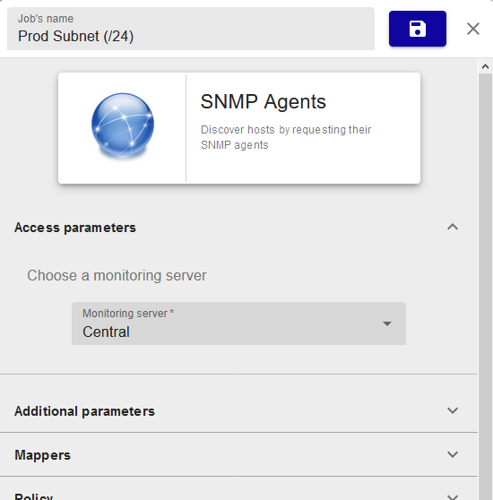
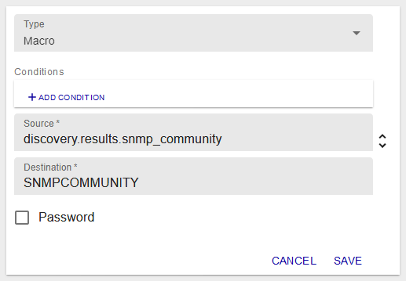
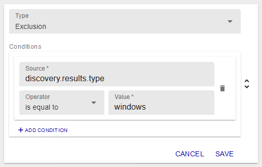

## Create a discovery job

1. [Install](installation.html) the Auto Discovery module.

2. Install the Plugin Pack for the resources you want to discover.
    > The discovery providers are included in Plugin Packs (Azure,
    > Amazon AWS, VMware, etc.). To know the complete list, please go to
    > the [Plugin Packs](../../integrations/plugin-packs/introduction.html)
    > catalog.

3. Create a discovery job for each type of resource you want to discover: go to **Configuration > Hosts > Discovery** and click on **+ADD**. A wizard opens.

## Job discovery wizard

### Step 1: Choose a provider

1. Enter a name for the job (if you don't, the provider's name will be used).

2. Click on the correct provider for the resources you want to discover.

    

    The search bar allows you to search for a specific provider:

    

3. Click on **Next**.

### Step 2: Define access and discovery parameters

Define the monitoring server from which the discovery will be made:

Some providers ask for other parameters such as a proxy if the discovery is made
on an online service, and/or credentials.

### Step 3: Define additional parameters

Some additional parameters might be needed to define the scope of the
discovery:

### Step 4: Set mappers

Mappers define how the discovery results will be processed to create
hosts in the configuration. They can also be used to include/exclude hosts from the list of results. See section
[How to use mappers](#how-to-use-mappers).

In the wizard, a real-time simulation on a set of example data (the table on the right) gives a preview of what the
discovery results could look like:

### Step 5: Define analysis and update policies

- **Manual analysis**: Once the discovery job is executed, in the list of discovered hosts, you will choose manually which 
    hosts should be added to the page **Configuration > Hosts > Hosts** (see [Analyze the results of a discovery job](#analyze-the-results-of-a-discovery-job)).

- **Automatic analysis**: The results will be processed automatically according to the selected policy (you must choose at least one):

  - **Add hosts to configuration when they are discovered for the first time**: all hosts that are detected for the first time are automatically created in the **Configuration > Hosts > Hosts** page.
  - **Disable hosts already added to configuration if the mapping rule excludes them**: ressources that have been added to the configuration will be disabled if they match a new **Exclude** mapper.
      > Note: not discovered hosts (or no longer discovered hosts) will not be
      > disabled in the Centreon configuration. Only hosts that are discovered and at the same
      > time excluded can be disabled in the configuration (see
      > [exclusion](#exclusion) mapper).
  - **Enable hosts already added to configuration if they are discovered but disabled**: hosts that have already been added to the configuration but are in a disabled state will be enabled again.

    

    Read the [example](#dynamically-update-your-configuration) below to better
understand the scope of these policies.

### Step 6: Plan execution

- **Execute immediately**: the discovery will be launched right after the job is created.

- **Schedule execution**: you can schedule the execution of the job in different ways:

  - Every year at defined days of defined months at a defined time

    

  - Every month at defined days of the month at a defined time

    

  - Every week at defined days of the week at a defined time

    

  - Every day at a defined time

    

  - Every x hours (at defined minutes)

    

  - Every x minutes

    

Click on **FINISH** to add and execute or schedule the discovery job. The job appears in the list of discovery jobs.
See section [Analyze the results of a discovery job](#analyze-the-results-of-a-discovery-job).

## Manage discovery jobs

Go to the **Configuration > Hosts > Discovery** page to access the list of
discovery jobs.

The status of a job can be:

  - **Scheduled** 
  - **Running** 
  - **Saving** 
  - **Finished** 
  - **Failed** 

If a job is in a **Failed** status, hover over the icon to know the reason.

If a job is in a **Finished** status, click on the arrow next to its status to analyze the result. See
[Analyze the results of a discovery job](#analyze-the-results-of-a-discovery-job) to know more.

Several actions can be done on jobs:

  - Jobs can be re-executed using the **Force execution** action 
  - They can also be edited  
  - Or even deleted . Only the job will be deleted: the hosts you have added to the configuration will still exist.
  - If the job is scheduled, it can be paused 
  - And resumed 
  - Use the arrow to access the results of the discovery task 

## Analyze the results of a discovery job

1. On the **Configuration > Hosts > Discovery** page, click on the arrow 
next to the status of a **Finished** job to visualize the results.

    

2. If you want, you can edit the mappers linked to this job by clicking the **Edit** icon: 

    The results will be updated automatically.
    
    Warning: editing mappers after a discovery job has been executed only makes sense if
    the hosts have not yet been added to your monitoring configuration (either manually 
    or automatically). Changes made to mappers in the discovery task are not taken into
    account for hosts that have already been created.

3. If your job was set to **Manual analysis** at step 5 of the wizard, select the hosts you want to add to the configuration and click on the **Save**
button: 

    The hosts are created as well as the services linked to their host templates.

4. Go to the **Configuration > Hosts** page: the newly created hosts appear in the list.

    

    If the hosts you selected are not visible in the configuration, go back to the
list of jobs and see if an error occured during the saving task.

5. [Deploy](../monitoring-servers/deploying-a-configuration.html) the configuration. The new hosts are now monitored.

## Edit a discovery job

1. On the **Configuration > Hosts > Discovery** page, click on the discovery job you want. A panel appears on the right.

    

2.  In this panel, edit the settings of the job. If you edit mappers, the results of the job will be updated immediately.

    Warning: editing mappers after a discovery job has been executed only makes sense if
    the hosts have not yet been added to your monitoring configuration (either manually or automatically). Changes made to mappers in the discovery task are not taken into account for hosts that have already been created.

3. Click on the **Save** icon at the top right of the panel: 

## How to use mappers

Mappers allow you to  :

- Define how the future hosts will be configured, by mapping a value discovered on the host (an attribute) to a field in Centreon. The list of attributes depends on the discovery provider. 

- Include/exclude hosts from the list of results.

There are nine types of mappers:

|    Mapper           |              Action                                                                                                             |
|---------------|---------------------------------------------------------------------------------------------------------------------------|
| Property      | Define a label (name, alias, IP address)                                                                                  |
| Macro         | Define a custom macro for the host                                                                                        |
| Template      | Add host templates (the template from the plugin pack is added automatically)                                             |
| Host group    | Link hosts to a host group                                                                                                |
| Host category | Link a host to a category                                                                                                 |
| Host severity | Prioritize the host according to a severity                                                                               |
| Monitoring    | Choose from which monitoring server the host will be monitored                                                            |
| Exclusion     | Exclude a subset of hosts based on their attributes (see the     [example](#dynamically-update-your-configuration) below) |
| Inclusion     | Include a subset of hosts that have been excluded by an exclusion mapper                                                  |

For all those mappers, conditions can be applied to choose whether or not the
mapping will actually occur. Operators can be : *equal*, *not equal*, *contain* and *not
contain*.

From version 21.04, mappers **Property**, **Macro**, **Host group** and **Host category**
 support concatenating either discovery attributes or custom strings.

>Warning: editing mappers after a discovery job has been executed only makes sense
>if the hosts have not yet been added to your monitoring configuration (either manually
>or automatically). Changes made to mappers in the discovery task are not taken into account
>for hosts that have already been created.

### Add a mapper

1. In the job wizard at step four, or on the edition panel in the **Mappers**
section, click on **+ADD MAPPER**.

2. Select the type of mapper from the drop-down list, and fill every required
field.

3. Click on **SAVE** to add the mapper.

### Edit a mapper

1. In the job wizard at step four, or on the edition panel in the **Mappers**
section, click on the **Edit** icon: 

2. Edit the fields you want, or even the type of mapper.

3. Click on **SAVE** to save the mapper.

### Delete a mapper

1. In the job wizard at step four, or on the edition panel in the **Mappers**
section, click on the **Delete** icon: 

    A popin window will ask you to confirm the action.

2. Click on **DELETE** to delete the mapper.

## Types of mappers

### Property

The **Property** mapper is used to set common properties of a host like
its name, alias or IP address. Those three properties are mandatory.

The **Source** list allows you to choose between credentials, parameters or
discovery result attributes.

The **Destination** list allows you to define to which property the value will be
mapped.

### Macro

The **Macro** mapper is used to create custom macros to be defined on the
host.

The **Source** list allows you to choose between credentials, parameters or
discovery result attributes.

The **Destination** is a user defined text field.

The **Password** checkbox defines if the macro will be created as a password
macro or not.

### Template

The **Template** mapper is used to add a template to the host. You can add as many
**Template** mappers as you want (one template per mapper).

As in the example below, you can define a template according to conditions
(here, the OS-Linux-SNMP-custom template is applied to Linux hosts).

The **Host template** list allows you to choose among all host templates defined
in the configuration.

### Host group

From version 21.04, the discovered hosts can be linked to host groups. There
are two ways of doing it.

- Select an existing host group from the dropdown list.

    

- Create host groups on the fly: both custom strings and
discovery attributes can be used and concatenated to compose the host group's
name.
 
  

  In this example, when discovering Linux servers, the `os-linux` host group will
be created.

  If a host group already exists with the same name, it won't be 
created again, the host will simply be linked to it.

### Host category

From version 21.04, the discovered hosts can also be categorized using host 
categories. Again, there are two ways of doing it.

- Select an existing host category from the dropdown list.

  

- Create host categories on the fly: both custom strings
and discovery attributes can be used and concatenated to compose the 
 name of the category.

  

  If a host category already exists with the same name, it won't be 
created again, the host will simply be linked to it.

### Host severity

From version 21.04, discovered hosts can also be prioritized using host
severities. Since severities are not just a simple label but also have a 
numeric level, they can't be created on the fly, and can only be selected from the
dopdown list.

### Monitoring

The **Monitoring** mapper is used to choose from which monitoring server the host will
be monitored.

The **Monitoring instance selector** radio buttons allow you to choose between the
monitoring server defined in the job or from the ones available on the
Centreon platform.

This mapper is mandatory.

### Exclusion

The **Exclusion** mapper is used to exclude a subset of hosts from the results
list. 

The mapper uses hosts attributes as conditions to exclude them. In the example above, Windows hosts 
will be excluded from the results list.

### Inclusion

The **Inclusion** mapper is used to include hosts that would have been excluded by an **Exclusion** mapper.
This means that **Inclusion** and **Exclusion** mappers must be defined in the right order.

In the example below, let's say that all hosts have been excluded from the results list (with an 
 **Exclusion** *not equal 1* mapper, for example). This **Inclusion** mapper will include all Linux hosts in the results list.

The mapper uses hosts attributes as conditions to include them.

## Examples

### Dynamically update your configuration

**Situation**

Having a VMware vCenter with virtual machines dynamically added, started and
stopped.

**Objective**

Update the Centreon configuration according to the states of the virtual
machines.

**Create the right job**

From the Host Discovery main page, add a job starting by selecting the VMware VM
provider.

Define the monitoring instance from which you want to do the discovery. For this
particular provider, it has to work with the discovery parameters on which you
define the information related to the Centreon VMware Connector access
(hostname/ip and port).

In most cases, you will install the Connector on the monitoring instance, so the
access will be *localhost* and default port *5700*.

Let's now define the mappers and the update policies to match our needs:

  - First needs:
    - Add new (or not yet added) virtual machines, (1)
    - Exclude virtual machines that are not started. (2)

  - Second needs:
    - Disable the virtual machines that are stopped, (3)
    - Re-enable the virtual machines that are started (after being stopped). (4)

This will first result in an **Exclusion** mapper with the following
configuration:

This way, all powered off virtual machines will not be part of the processed
result. Those will not be added (2).

In addition to this mapper, choose the automatic analysis with all the update
policies as below:

With the first policy, the virtual machines part of the processed result will be
added (1).

With the second one, virtual machines that were added at some point (because
in a powered on state) will be disabled in the Centreon configuration if they
happen to be powered off (3).

The last one will enable the virtual machines that are once again in a powered
on state (4).

Of course, the last two policies work better if the job is scheduled to run more
than one time.

> Note: if a virtual machine happens to be deleted, it will not be deleted (or
> even disabled) from the Centreon configuration. Only hosts that are discovered and 
> excluded at the same time can be disabled in the configuration (if the policy
> is chosen).
