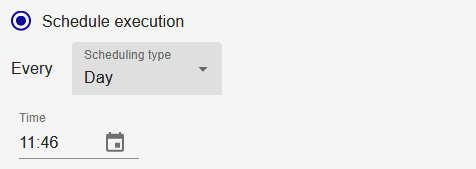
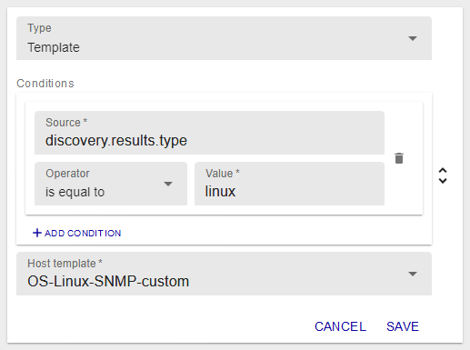

## Add a discovery job

To launch a discovery, you need to add a discovery job.

The job addition wizard is a six steps wizard that will allow you to choose a
provider, define parameters, define mapping rules and update/execution
policies.

Go to `Configuration > Hosts > Discovery` and click on **+ADD**.

### Choose a provider

First, choose a provider by clicking on it:

The search bar allows to search for a specific provider:

> The discovery providers are provided from installation of Plugin Packs (Azure,
> Amazon AWS, VMware, etc.). To know the complete list, please go to
> the [Plugin Packs
> catalog](../../integrations/plugin-packs/introduction.html).

A job name can be defined to identify it. The provider name will be used by
default.

### Define access and discovery parameters

The second step allows to define access parameters, especially the monitoring
server from which the discovery will be made:

Some providers ask for other parameters such as a proxy if the discovery is made
on an online service and/or credentials.

Then, some additional parameters might be needed to define the scope of the
discovery:

### Set mappers

The fourth step defines how the discovery result will be processed to create
hosts in the configuration.

In this step, *mappers* can be added or rearranged to match needs. See the
[How to use the *mappers*](#how-to-use-the-mappers) chapter to know more.

Realtime simulation on a set of example data gives a preview of what the
discovery result could look like:

### Define analysis and update policies

The fifth step allows to choose between two analysis methods and define
configuration update policies.

#### Manual analysis

Manual analysis will need user to choose what to add to the configuration
through the result page after the job successfully finish.

#### Automatic analysis

Automatic analysis will process the result automatically and will use the
choosen policies between the following:

  - Add hosts to configuration when they are discovered for the first time
  - Disable hosts already added to configuration if the mapping rule excludes
    them
  - Enable hosts already added to configuration if they are discovered but
    disabled

> At least one of these policies must be selected.

> Note: not discovered hosts (or no more discovered hosts) will not result to
> disabled hosts in the Centreon configuration. Only discovered and excluded
> hosts can be disabled in the configuration (see [exclusion](#exclusion)
> mapper).

Read the [example](#dynamically-update-your-configuration) below to better
understand the scope of these policies.

### Plan execution

The last step allows to choose between two execution methods.

#### Execute immediately

The immediate execution will launch the discovery right after the job creation.

#### Schedule execution

The scheduled execution allows to choose between several types of scheduling:

  - Every year at defined days of defined months and defined time

  - Every month at defined days of the month and defined time

  - Every week at defined days of the week and defined time

  - Every day at defined time

  - Every x hours (at defined minutes)

  - Every x minutes

Click on **FINISH** to add and execute or schedule the discovery job.

## Manage discovery jobs

Go to the `Configuration > Hosts > Discovery` menu to access to the list of
discovery jobs.

The status of a job can be:

  - Scheduled 
  - Running 
  - Saving 
  - Finished 
  - Failed 

If a job is on a *Failed* status, hover on to the icon to know the reason.

If a job is on a *Finished* status, click on it to analyse the result. See
[Analyse a discovery job result](#analyse-a-discovery-job-result) to know more.

Several actions can be done on jobs:

  - Jobs can be re-executed using the *Force execution* action 
  - They can also be edited  
  - Or even deleted 
  - If the job is scheduled, it can be paused 
  - And resumed 

## Analyse a discovery job result

From the `Configuration > Hosts > Discovery` menu, click on a *Finished* job to
visualize the result.

The mappers linked to this job can be edited and applied directly on the result
by clicking the edit action 

Select the hosts you want to add to the configuration and click on the save
action 

A task will be launched in background to save the hosts and create the services
linked to host templates.

Go to the `Configuration > Hosts` menu to see the newly created hosts.

If the hosts you selected are not visible in the configuration, go back to the
job listing and see if an error occured during the saving task.

## Edit a discovery job

From the `Configuration > Hosts > Discovery` menu, click on the *Edit* action.

On the panel on the right, every parameters of the job can be edited.

Edition of the *mapper* will have a direct effect on the job result.

Click on the *Save* icon 

## How to use the *mappers*

A *mapper* is an object letting you map an attribute's value of a discovered
item to a property of a future host.

There is six types of *mappers*:

  - Association: map an attribute's value to a common host property like name,
    alias or IP,
  - Macro: map an attribute's value to a host custom macro,
  - Template: add a host template,
  - Monitoring: choose from which monitoring server will be monitored the host,
  - Exclusion: exclude a subset of hosts based on their attributes (see the
    [example](#dynamically-update-your-configuration) below),
  - Inclusion: include a subset of hosts that may be excluded.

For all those *mappers*, conditions can be applied to choose whether or not the
mapping will actually occur.

Conditions are also based on attributes value to which a user defined value is
compared using operators. Operators can be : equal, not equal, contain and not
contain.

The list of attributes depends on the provider and are listed as *Source* for
both *mappers* and conditions.

### Add a *mapper*

From the job wizard at step four, or from the edition panel in the *Mappers*
section, click on **+ADD MAPPER**.

Select the type of *mapper* from the drop-down list, and fill every required
fields.

Click on **SAVE** to add the *mapper*.

### Edit a *mapper*

From the job wizard at step four, or from the edition panel in the *Mappers*
section, click on the *Edit* icon 

Change any fields wanted or even the type of *mapper*.

Click on **SAVE** to save the *mapper*.

### Delete a *mapper*

From the job wizard at step four, or from the edition panel in the *Mappers*
section, click on the *Delete* icon 

A popin window will ask you to confirm the action.

Click on **DELETE** to delete the *mapper*.

## *Mappers* types

### Association

The **Association** *mapper* is used to set common properties of a host like
its name, alias or IP address. Those three properties are mandatory.

The *Source* listing allows to choose between credentials, parameters or
discovery result attributes.

The *Destination* listing allows to define to which property the value will be
mapped.

### Macro

The **Macro** *mapper* is used to create custom macros to be defined on the
host.

The *Source* listing allows to choose between credentials, parameters or
discovery result attributes.

The *Destination* is a user defined text field.

The *Password* checkbox defines if the macro will be created as a password
macro or not.

### Template

The **Template** *mapper* is used to add a template to the host. It is not a
replace method.

The *Host template* listing allows to choose among all host templates defined
in the configuration.

### Monitoring

The **Monitoring** *mapper* is used to choose from which monitoring server will
be monitored the host.

The *Monitoring instance selector* radio buttons allow to choose between the
monitoring server defined in the job or from the ones available on the
Centreon platform.

This *mapper* is mandatory.

### Exclusion

The **Exclusion** *mapper* is used to exclude a subset of hosts from the result
listing.

The mapper uses hosts attributes as conditions to exclude them.

### Inclusion

The **Inclusion** *mapper* is used to include a subset of hosts to the result
listing.

The mapper uses hosts attributes as conditions to include them.

## Examples

### Dynamically update your configuration

*Situation*

Having a VMware vCenter with virtual machines dynamically added, started and
stopped.

*Objective*

Update the Centreon configuration accordingly to the states of the virtual
machines.

*Create the right job*

From the Host Discovery main page, add a job starting by selecting the VMware VM
provider.

Define the monitoring instance from which you want to do the discovery. For this
particular provider, it has to work with the discovery parameters on which you
define the information related to the Centreon VMware Connector access
(hostname/ip and port).

In most cases, you will install the Connector on the monitoring instance, so the
access will be *localhost* and default port *5700*.

Let's now define the mappers and the update policies to match our needs:

  - First need:
    - Add new (or not yet added) virtual machines, (1)
    - Exclude virtual machines that are not started. (2)

  - Second need:
    - Disable the virtual machines that are stopped, (3)
    - Re-enable the virtual machines that are started (after being stopped). (4)

This will first result as an *Exclusion* mapper with the following
configuration:

This way, all powered off virtual machines will not be part of the processed
result. Those will not be added (2).

In addition to this mapper, choose the automatic analysis with all the update
policies as below:

With the first policy, the virtual machines part of the processed result will be
added (1).

With the second one, virtual machines that were added at some point (because
in a powered on state) will be disabled in the Centreon configuration if they
happen to be powered off (2).

The last one will enable the virtual machines that are once again in a powered
on state (3).

Of course, the last two policies work well if the job is scheduled to run more
than one time.

> Note: if a virtual machine happens to be deleted, it will not be deleted (or
> even disabled) from the Centreon configuration. Only discovered and excluded
> hosts can be disabled in the configuration (if the policy is chosen).
