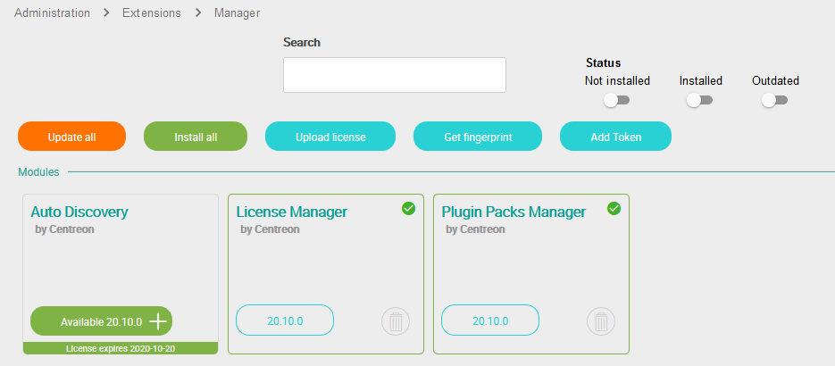
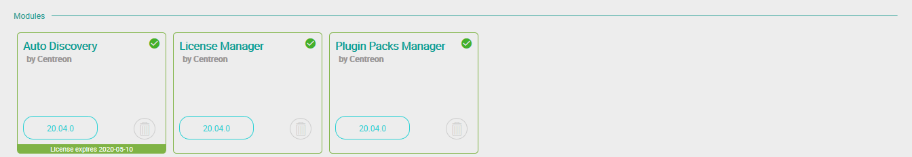

## Installing packages

Execute the following command on the Central server:

``` shell
yum install -y centreon-auto-discovery-server
```

## UI installation

Connect to the Centreon's web interface using an account allowed to administer
products and go to the `Administration > Extensions > Manager` menu.

Click on the installation icon corresponding to the **Auto Discovery** module:



The module is now installed:



## Installing the Plugin Packs

To get discovery rules ready to use, please go to `Configuration > Plugin
Packs` menu and [install your packs](../pluginpacks.html#pack-installation)

## Architecture

### Services discovery

The **Auto Discovery** module for services discovery contains 3 parts:

  - The web UI: rules creation, administration and exploitation of the module,
  - Discovery plugins,
  - Scheduled job (cron) which executes discovery rules.

The discovery plugins look for new elements to monitor, see *[Discovery
plugins](services-discovery.html#discovery-plugins)* for more
detail.

The rules, managed through the web UI, are saved into **Centreon**'s database
and are executed periodically (every night at 10:30 PM) by the *cron* jon. See
[Scheduled job](administration.html#scheduled-job) pour more detail.

The following figure describes the general functioning of this module:


#### Configuring Centreon API access

Edit the **/etc/centreon/centreon\_autodisco.pm** file and configure the
**clapi\_user** and **clapi\_password** parameters, then save modifications and
close the file.
