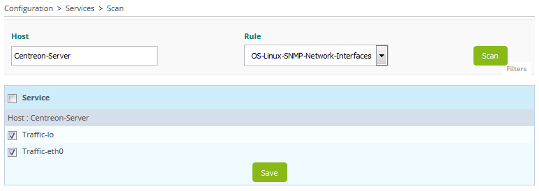

After the discovery rules programmed it is possible to run them from the Centreon web interface.
Go to the **Configuration > Services > Auto Discovery > Scan** menu.

Start to write the name of host and the web interface automatically complete the name:

Select the discovery command to run from the list that has just appeared:

> If the list is empty it means that your host doesn't belong to a group of hosts linked to a discovery rule.

Click on the **Scan** button and wait during the discovery:

The result is displayed. Select items to add to the monitoring and click on the **Save** button:

The items were added and it is no longer possible to select them:

> In the list of result it is possible that some items can't be selected. This indicates that they are already part of
the configuration.

The services were added and can be displayed in the menu **Configuration > Services > Services by host**:

