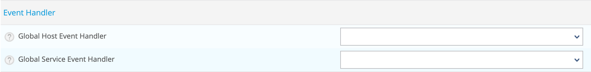

## Introduction

Event handlers or auto remediation are optional system commands (scripts or executables) that are run whenever a host
or service state change occurs.

An obvious use for event handlers is the ability for Centreon to proactively fix problems before anyone is notified.

### When Are Event Handlers Executed?

Event handlers are executed when a service or host:

* Is in a SOFT problem state
* Initially goes into a HARD problem state
* Initially recovers from a SOFT or HARD problem state
* SOFT and HARD states are described [here](../alerts-notifications/concepts.html#status-confirmation)

### Event Handler Types

There are different types of optional event handlers that you can define to handle host and state changes:

* Global host event handler
* Global service event handler
* Host-specific event handlers
* Service-specific event handlers

Global host and service event handlers are run for every host or service state change that occurs, immediately prior to
any host- or service-specific event handler that may be run.

### Enabling Event Handlers

Event handlers can be enabled or disabled on a poller.

Host- and service-specific event handlers can be enabled or disabled  in your host and service definitions. Host- and
service-specific event handlers will not be executed if the global option is disabled on your poller.

### Event Handler Execution Order

As already mentioned, global host and service event handlers are executed immediately before host- or service-specific
event handlers.

Event handlers are executed for HARD problem and recovery states immediately after notifications are sent out.

## Configuration

### Create a command

Event handler commands will likely be shell or perl scripts, but they can be any type of executable that can run from a
command prompt. At a minimum, the scripts should take the following macros as arguments:

* For Services: $SERVICESTATE$, $SERVICESTATETYPE$, $SERVICEATTEMPT$
* For Hosts: $HOSTSTATE$, $HOSTSTATETYPE$, $HOSTATTEMPT$

The scripts should examine the values of the arguments passed to it and take any necessary action based upon those values.

Event handler commands will normally execute with the same permissions as the user under which Centreon Engine
(centreon-engine user) is running on your machine. This can present a problem if you want to write an event handler that
restarts system services, as root privileges are generally required to do these sorts of tasks.

Ideally you should evaluate the types of event handlers you will be implementing and grant just enough permissions to
the Centreon Engine user for executing the necessary system commands. You might want to try using sudo to accomplish this.

Follow [this procédure to create a command](./basic-objects/commands.html#adding-a-command).

> Use **Misc** for the command type to classify your commands.

### Enable Event Handlers on your platform

Go to the **Configuration > Pollers > Engine configuration** menu and edit all your Centreon Engine configuration on
which you want to enable auto remediation.

In the **Check Opyions** tab, enable the **Event Handler Option** option:


### Configure Event Handlers

#### Globally

To configure globally auto remediation for all resources of a poller, go to the **Configuration > Pollers > Engine
configuration** menu and edit all your Centreon Engine configuration on which you want to enable global auto remediation.

In the **Check Options** tab, select a command for hosts and/or services event handler:



Click on **Save**.

#### On selected resources

**For hosts**

Go to the **Configuration > Hosts > Hosts** menu and edit your hosts. In the **Data Processing** tab, select the command:


Click on **Save**.

> You can configure this command on templates.

**For services**

Go to the **Configuration > Services > Services by host** menu and edit your services. In the **Data Processing** tab,
select the command:


Click on **Save**.

> You can configure this command on templates.

### Example

The example below assumes that you are monitoring the HTTP server on the local machine. We will assume that the Max
Check Attempts option for the service to be a value of 4 or greater (i.e. the service is checked 4 times before it is
considered to have a real problem). An abbreviated example service definition might look like this...

The event handler script (this is the /usr/lib/centreon/plugins/eventhandlers/restart-httpd script).

```Shell
#!/bin/sh
#
# Event handler script for restarting the web server on the local machine
#
# Note: This script will only restart the web server if the service is
#       retried 3 times (in a "soft" state) or if the web service somehow
#       manages to fall into a "hard" error state.
#

# What state is the HTTP service in?
case "$1" in
OK)
	# The service just came back up, so don't do anything...
	;;
WARNING)
	# We don't really care about warning states, since the service is probably still running...
	;;
UNKNOWN)
	# We don't know what might be causing an unknown error, so don't do anything...
	;;
CRITICAL)
	# Aha!  The HTTP service appears to have a problem - perhaps we should restart the server...
	# Is this a "soft" or a "hard" state?
	case "$2" in

	# We're in a "soft" state, meaning that Centreon is in the middle of retrying the
	# check before it turns into a "hard" state and contacts get notified...
	SOFT)

		# What check attempt are we on?  We don't want to restart the web server on the first
		# check, because it may just be a fluke!
		case "$3" in

		# Wait until the check has been tried 3 times before restarting the web server.
		# If the check fails on the 4th time (after we restart the web server), the state
		# type will turn to "hard" and contacts will be notified of the problem.
		# Hopefully this will restart the web server successfully, so the 4th check will
		# result in a "soft" recovery.  If that happens no one gets notified because we
		# fixed the problem!
		3)
			echo -n "Restarting HTTP service (3rd soft critical state)..."
			# Call the init script to restart the HTTPD server
			/etc/rc.d/init.d/httpd restart
			;;
			esac
		;;

	# The HTTP service somehow managed to turn into a hard error without getting fixed.
	# It should have been restarted by the code above, but for some reason it didn't.
	# Let's give it one last try, shall we?  
	# Note: Contacts have already been notified of a problem with the service at this
	# point (unless you disabled notifications for this service)
	HARD)
		echo -n "Restarting HTTP service..."
		# Call the init script to restart the HTTPD server
		/etc/rc.d/init.d/httpd restart
		;;
	esac
	;;
esac
exit 0
```

The sample script provided above will attempt to restart the web server on the local machine in two different instances:

* After the service has been rechecked for the 3rd time and is in a SOFT CRITICAL state
* After the service first goes into a HARD CRITICAL state

The script should theoretically restart and web server and fix the problem before the service goes into a HARD problem
state, but we include a fallback case in the event it doesn't work the first time. It should be noted that the event
handler will only be executed the first time that the service falls into a HARD problem state. This prevents Centreon
from continuously executing the script to restart the web server if the service remains in a HARD problem state. You
don't want that.

Then create a command like:

* Command Name: restart-httpd
* Command Type: Misc
* Command Line: $CENTREONPLUGINS$/eventhandlers/restart-httpd  $SERVICESTATE$ $SERVICESTATETYPE$ $SERVICEATTEMPT$

Now in your service definition, select the **restart-httpd** command for your event handler definition.