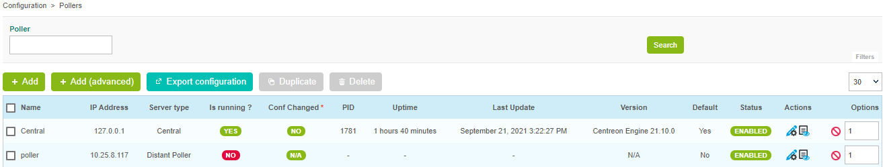
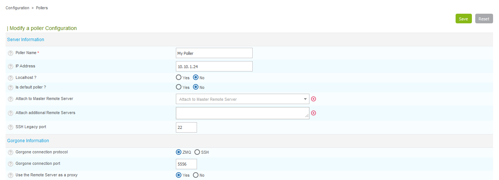
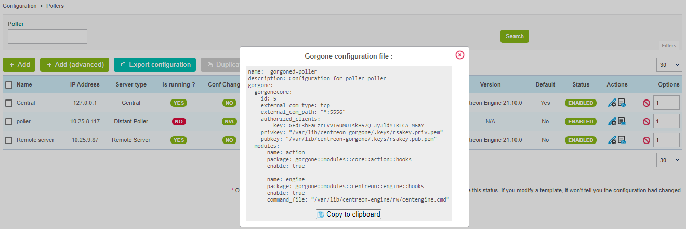
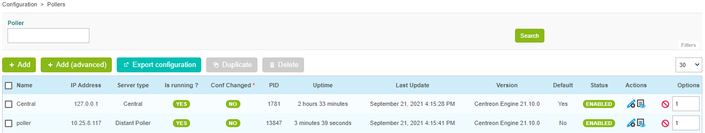

## Prerequisites

Install the poller (either [using the ISO](../../installation/installation-of-a-poller/using-centreon-iso.html), or [using packages](../../installation/installation-of-a-poller/using-packages.html)).

## Step 1: Configure a new Poller

As of Centreon version 18.10, a new wizard has been added for adding a new
poller to the Centreon platform.

1. Go to the **Configuration > Pollers > Pollers** menu and click on **Add** to configure a new poller.

2. Select **Add a Centreon Poller** and click on **Next**:

    

3. Select the option you want:
    - **Create new Poller** if you haven't registered the poller yet on the central or remote server
    - **Select a Poller** if you have already registered the poller on the central or remote server.

4. Type in the name, the IP address of the new poller and IP address of the Central
Server. Click on **Next**:

    

    > The IP address of the Poller is the IP address or the FQDN used to access this
    > poller from the Central server.
    >
    > The IP address of the Central server is the IP address or the FQDN used to
    > access the Central server from the Poller.

5. Link the poller to the central server or to a remote server:

    - If you want to link the poller to the Central Server, click **Apply**:

      

    - If you want to link the poller to an existing Remote Server,
select one from the list, then click **Apply**.

      > If you want to change the direction of the flow between the Central Server
      > (or the Remote Server and the Poller, check the **Advanced: reverse Centreon
      > Broker communication flow** checkbox. In this case, it will be necessary to
      > export the configuration of the poller as well as the server to which it
      > will be attached.

      In a few seconds the wizard will configure your new poller.

      

## Step 2: Enable communication

The communication between the Central server and a Poller is ensured by Gorgone and can
be done using ZMQ (with a Gorgone running on the Poller, recommended) or using
SSH protocol.

<!--DOCUSAURUS_CODE_TABS-->

<!--Using ZMQ (Recommended)-->

1. Select the communication type:

    Edit the newly created Poller configuration, and select **ZMQ** as **Gorgone
    connection protocol**. Define the suitable **port** (port **5556** is
    recommended).

    

    Click on **Save**.

    > Note that the *SSH Legacy port* is not used anymore and will be removed.
    >
    > If you were using it in custom scripts, consider changing to use
    > Gorgone communication system.

2. Copy the Gorgone configuration:

    From the Pollers listing, click on the **Display Gorgone configuration** action
    icon on the line corresponding to your Poller 

    A pop-in will show the configuration to copy into the **Poller terminal**.
    Click on **Copy to clipboard**.

    

    Paste the content of the clipboard directly into the **Poller terminal** as it
    contains the following content, and will fill the right file:

    ``` shell
    cat <<EOF > /etc/centreon-gorgone/config.d/40-gorgoned.yaml
    name:  gorgoned-My Poller
    description: Configuration for poller My Poller
    gorgone:
      gorgonecore:
        id: 2
        external_com_type: tcp
        external_com_path: "*:5556"
        authorized_clients:
          - key: Np1wWwpbFD2I0MdeHWRlFx51FmlYkDRZy9JTFxkrDPI
        privkey: "/var/lib/centreon-gorgone/.keys/rsakey.priv.pem"
        pubkey: "/var/lib/centreon-gorgone/.keys/rsakey.pub.pem"
      modules:
        - name: action
          package: gorgone::modules::core::action::hooks
          enable: true

        - name: engine
          package: gorgone::modules::centreon::engine::hooks
          enable: true
          command_file: "/var/lib/centreon-engine/rw/centengine.cmd"

    EOF
    ```

    Hit the *Enter* key for the command to be applied.

    > You can copy the configuration in a custom file by copying the content from
    > the pop-in.

3. Start the Gorgone daemon:

    From the Poller, run the following command to start Gorgone service:

    ``` shell
    systemctl start gorgoned
    ```

    Make sure it is started by running the following command:

    ``` shell
    systemctl status gorgoned
    ```

    It should result as follow:

    ``` shell
    ● gorgoned.service - Centreon Gorgone
      Loaded: loaded (/etc/systemd/system/gorgoned.service; disabled; vendor preset: disabled)
      Active: active (running) since Mon 2020-03-24 19:45:00 CET; 20h ago
    Main PID: 28583 (perl)
      CGroup: /system.slice/gorgoned.service
              ├─28583 /usr/bin/perl /usr/bin/gorgoned --config=/etc/centreon-gorgone/config.yaml --logfile=/var/log/centreon-gorgone/gorgoned.log --severity=info
              ├─28596 gorgone-dbcleaner
              ├─28597 gorgone-engine
              └─28598 gorgone-action

    Mar 24 19:45:00 localhost.localdomain systemd[1]: Started Centreon Gorgone.
    ```

    Finally, enable the automatic startup of the service with the command:

    ```shell
    systemctl enable gorgoned
    ```

4. **To force the Central's Gorgone daemon to connect to the Poller**, restart it with
the following command from the **Central server**:

    ``` shell
    systemctl restart gorgoned
    ```
<!--Using SSH-->

1. Select the communication type:

    Edit the newly created Poller configuration, and select **SSH** as **Gorgone
    connection protocol**. Define the suitable **port**.

    

2. Click on **Save**.

    > Note that the *SSH Legacy port* is not used anymore and will be removed.
    >
    > If you were using it in custom scripts, consider changing to use
    > Gorgone communication system.

3. Exchange SSH keys:

    If you do not have any private SSH keys on the **Central server** for the
    **centreon-gorgone** user, create one with the following commands:

    ``` shell
    su - centreon-gorgone
    ssh-keygen -t rsa
    ```

    > Hit enter when it prompts for a file to save the key to use the default
    > location, or, create one in a specified directory. **Leave the passphrase
    > blank**. You will receive a key fingerprint and a randomart image.

    Generate a password for the **centreon** user on the **new Poller**:

    ``` shell
    passwd centreon
    ```

    Then, copy this key on to the **new Poller** with the following commands:

    ``` shell
    su - centreon-gorgone
    ssh-copy-id -i .ssh/id_rsa.pub centreon@<IP_POLLER>
    ```

4. **To force the Central's Gorgone daemon to connect to the Poller**, restart it with
the following command from the **Central server**:

    ``` shell
    systemctl restart gorgoned
    ```
<!--END_DOCUSAURUS_CODE_TABS-->

## Step 3: Export the configuration

1. From the Pollers listing, select the Poller and click on **Export
configuration**.

2. Then check the four first boxes, select the **Restart** method and click on
**Export**:

    

    The Poller's engine will then start and connect to the Central Broker.

    

## Getting started

Go to the [Getting Started](../../getting-started/installation-first-steps.html#start-to-monitor-your-first-host)
chapter to configure your first monitoring.
