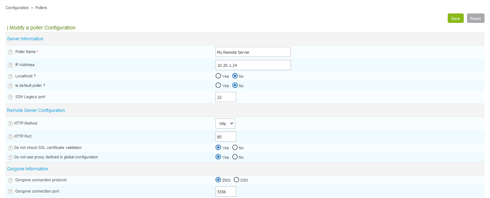
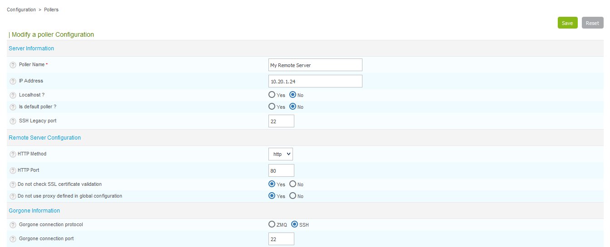
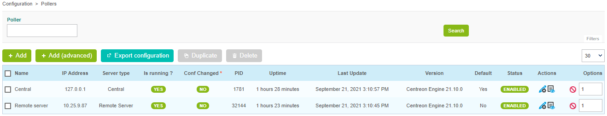

## Configure a new Remote Server

As of Centreon version 18.10, a new wizard has been added for defining a new
Remote Server on the Centreon platform.

Go to the **Configuration \> Pollers \> Pollers** menu and click on **Add
server with wizard** to configure a new Remote Server.

Select **Add a Centreon Remote Server** and click on **Next**:


If you enabled the **Remote Server** option when installing your server, select
the option **Select a Remote Server**, then select your server and fill in the
form:


Otherwise, select the **Manual input** option and fill in the form:


The **Database username** and **Database password** are the credentials defined
during the installation of the Remote Server.

The **Server IP address** field is of the following form:
[(http|https)://]@IP[:(port)]. If your Remote Server is only available on
HTTPS, it is mandatory to define the HTTP method and the TCP port is this
one is not the default one.

The **Do not check SSL certificate validation** option allows to connect to the
Remote Server using self-signed SSL certificate.

The **Do not use configured proxy tp connect to this server** allows to connect
to the Remote Server without using the proxy configuration of the Centreon
Central server.

Click on **Next**.

Select the poller(s) to be linked to this Remote Server, then click on **Apply**:


**TO REMOVE**
    The wizard will configure your new server:

    

The Remote Server is now configured:


## Enable communication

The communication between a Central and a Remote Server  is ensured by Gorgone
and can be done using ZMQ (with a Gorgone running on the Remote Server,
recommended) or using SSH protocol.

<!--DOCUSAURUS_CODE_TABS-->
<!--Using ZMQ (Recommended)-->
#### Select communication type

Edit the newly created Remote Server configuration, and select **ZMQ** as
**Gorgone connection protocol**. Define the suitable **port** (port **5556**
is recommended).



Click on **Save**.

#### Display Gorgone configuration

From the Pollers listing, click on the **Display Gorgone configuration** action
icon.

A popin will show the configuration to copy into the Remote Server terminal.
Click on **Copy to clipboard**.


Paste directly into the terminal as the clipboard contains the following
content, and will fill the right file:

```shell
cat <<EOF > /etc/centreon-gorgone/config.d/40-gorgoned.yaml
name: gorgoned-My Remote Server
description: Configuration for remote server My Remote Server
gorgone:
  gorgonecore:
    id: 3
    external_com_type: tcp
    external_com_path: "*:5556"
    authorized_clients:
      - key: Np1wWwpbFD2I0MdeHWRlFx51FmlYkDRZy9JTFxkrDPI
    privkey: "/var/lib/centreon-gorgone/.keys/rsakey.priv.pem"
    pubkey: "/var/lib/centreon-gorgone/.keys/rsakey.pub.pem"
  modules:
    - name: action
      package: gorgone::modules::core::action::hooks
      enable: true

    - name: nodes
      package: gorgone::modules::centreon::nodes::hooks
      enable: true

    - name: proxy
      package: gorgone::modules::core::proxy::hooks
      enable: true

    - name: legacycmd
      package: gorgone::modules::centreon::legacycmd::hooks
      enable: true
      cmd_file: "/var/lib/centreon/centcore.cmd"
      cache_dir: "/var/cache/centreon/"
      cache_dir_trap: "/etc/snmp/centreon_traps/"
      remote_dir: "/var/cache/centreon/config/remote-data/"

    - name: engine
      package: gorgone::modules::centreon::engine::hooks
      enable: true
      command_file: "/var/lib/centreon-engine/rw/centengine.cmd"

EOF
```

> You can copy the configuration in a custom file by copying the content from
> the popin.

#### Start Gorgone daemon

From the Remote Server, run the following command:

```shell
systemctl restart gorgoned
```

Make sure it is started by running the following command:

```shell
systemctl status gorgoned
```

It should result as follow:

```shell
● gorgoned.service - Centreon Gorgone
   Loaded: loaded (/etc/systemd/system/gorgoned.service; enabled; vendor preset: disabled)
   Active: active (running) since Wed 2020-03-24 19:45:00 CET; 6s ago
 Main PID: 30902 (perl)
   CGroup: /system.slice/gorgoned.service
           ├─30902 /usr/bin/perl /usr/bin/gorgoned --config=/etc/centreon-gorgone/config.yaml --logfile=/var/log/centreon-gorgone/gorgoned.log --severity=info
           ├─30916 gorgone-nodes
           ├─30917 gorgone-dbcleaner
           ├─30924 gorgone-proxy
           ├─30925 gorgone-proxy
           ├─30938 gorgone-proxy
           ├─30944 gorgone-proxy
           ├─30946 gorgone-proxy
           ├─30959 gorgone-engine
           ├─30966 gorgone-action
           └─30967 gorgone-legacycmd

Mar 24 19:45:00 localhost.localdomain systemd[1]: Started Centreon Gorgone.
```
<!--Using SSH-->
#### Select communication type

Edit the newly created Remote Server configuration, and select **SSH** a
**Gorgone connection protocol**. Define the suitable **port** (port **5556** is
recommended).



Click on **Save**.

#### Exchange SSH keys

If you do not have any private SSH keys on the central server for the
**centreon-gorgone** user: :

```shell
su - centreon-gorgone
ssh-keygen -t rsa
```

> Hit enter when it prompts for a file to save the key to use the default
> location, or, create one in a specified directory. **Leave the passphrase
> blank**. You will receive a key fingerprint and a randomart image.

Generate a password for the **centreon** user on the new server: :

```shell
passwd centreon
```

Copy this key on to the new server: :

```shell
su - centreon-gorgone
ssh-copy-id -i .ssh/id_rsa.pub centreon@<IP_POLLER>
```
<!--END_DOCUSAURUS_CODE_TABS-->

To force the Central's Gorgone daemon to connect to the Remote Server, restart
it with the following command:

```shell
systemctl restart gorgoned
```

## Export the configuration

From the Pollers listing, select the Remote Server and click on **Export
configuration**.

Then check the four first boxes, select the **Restart** method and click on
**Export**:


The Remote Server will then connect to the Central Broker.



## Getting started

Go to the *[Getting Started](../../tutorials/first-steps.html)* chapter to configure your first monitoring.
