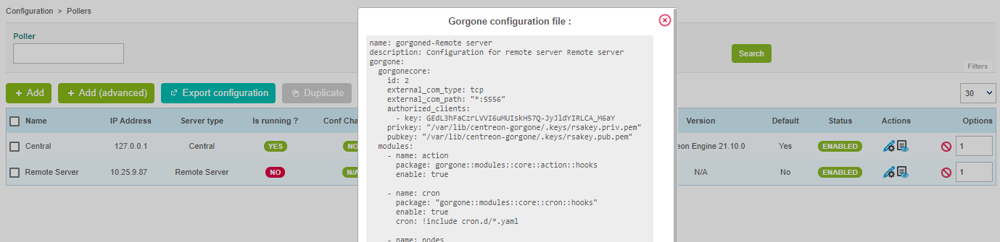

## Communication modes

Even though Gorgone is being installed on Pollers and Remote Servers, it is
allowed to communicate with them (from Central server, or between a Remote
Server and a Poller) using SSH protocol.

Although the SSH communication type is allowed, it must be used for
transitioning from older platform that were using Centcore to a full-ZMQ
platform.

> Pollers or Remote Servers that will not use ZMQ as communication type
> between Central's Gorgone and theirs will not benefit from all Centreon
> and Centreon's extensions features.

Communication modes are listed below:

### Without Remote Server

<!--DOCUSAURUS_CODE_TABS-->

<!--Modern (recommended)-->

| Communications                         | Allowed actions                                                           |
| -------------------------------------- | ------------------------------------------------------------------------- |
| **Central** \<-- *ZMQ* --\> **Poller** | Monitoring actions\*, Engine/Broker statistics collection, Host Discovery |

<!--Legacy (ex-Centcore)-->

| Communications                         | Allowed actions                                                           |
| -------------------------------------- | ------------------------------------------------------------------------- |
| **Central** \<-- *SSH* --\> **Poller** | Monitoring actions\*, Engine/Broker statistics collection, Host Discovery |

<!--END_DOCUSAURUS_CODE_TABS-->

\* Monitoring actions are all actions provided by Centreon UI like downtimes,
acknowledgements, etc and configuration export.

### With Remote Server

<!--DOCUSAURUS_CODE_TABS-->

<!--Modern (recommended)-->

| Communications                                                    | Allowed actions                                                           |
| ----------------------------------------------------------------- | ------------------------------------------------------------------------- |
| **Central** \<-- *ZMQ* --\> **Remote** \<-- *ZMQ* --\> **Poller** | Monitoring actions\*, Engine/Broker statistics collection, Host Discovery |

<!--Mixed-->

| Communications                                                    | Allowed actions                                                           |
| ----------------------------------------------------------------- | ------------------------------------------------------------------------- |
| **Central** \<-- *ZMQ* --\> **Remote** \<-- *SSH* --\> **Poller** | Monitoring actions\*, Engine/Broker statistics collection, Host Discovery |

<!--Legacy (ex-Centcore)-->

| Communications                                                    | Allowed actions                                                                                       |
| ----------------------------------------------------------------- | ----------------------------------------------------------------------------------------------------- |
| **Central** \<-- *SSH* --\> **Remote** \<-- *SSH* --\> **Poller** | Monitoring actions\*, Engine/Broker statistics collection (Remote only), Host Discovery (Remote only) |

<!--Other (not recommended)-->

| Communications                                                    | Allowed actions      |
| ----------------------------------------------------------------- | -------------------- |
| **Central** \<-- *SSH* --\> **Remote** \<-- *ZMQ* --\> **Poller** | Monitoring actions\* |

> This mode does not allow to retrieve Remote's thumbprint therefore it's
> not possible to display Poller's Gorgone configuration from Centreon UI.

<!--END_DOCUSAURUS_CODE_TABS-->

\* Monitoring actions are all actions provided by Centreon UI like downtimes,
acknowledgements, etc and configuration export.

## Change communication from SSH to ZMQ

<!--DOCUSAURUS_CODE_TABS-->

<!--For a Poller-->

#### Select communication type

From **Configuration \> Pollers \> Pollers** menu, edit the Poller
configuration, and select **ZMQ** as **Gorgone connection protocol**.

Define the suitable **port** (port **5556** is recommended).


Click on **Save**.

#### Display Gorgone configuration

From the Pollers listing, click on the **Display Gorgone configuration** action
icon on the line corresponding to your Poller 

A pop-in will show the configuration to copy into the **Poller terminal**.
Click on **Copy to clipboard**.


Paste the content of the clipboard directly into the **Poller terminal** as it
contains the following content, and will fill the right file:

``` shell
cat <<EOF > /etc/centreon-gorgone/config.d/40-gorgoned.yaml
name:  gorgoned-My Poller
description: Configuration for poller My Poller
gorgone:
  gorgonecore:
    id: 2
    external_com_type: tcp
    external_com_path: "*:5556"
    authorized_clients:
      - key: Np1wWwpbFD2I0MdeHWRlFx51FmlYkDRZy9JTFxkrDPI
    privkey: "/var/lib/centreon-gorgone/.keys/rsakey.priv.pem"
    pubkey: "/var/lib/centreon-gorgone/.keys/rsakey.pub.pem"
  modules:
    - name: action
      package: gorgone::modules::core::action::hooks
      enable: true

    - name: engine
      package: gorgone::modules::centreon::engine::hooks
      enable: true
      command_file: "/var/lib/centreon-engine/rw/centengine.cmd"

EOF
```

Hit the enter key for the command to be applied.

> You can copy the configuration in a custom file by copying the content from
> the popin.

#### Start Gorgone daemon

From the Poller, run the following command to start Gorgone service:

``` shell
systemctl start gorgoned
```

Make sure it is started by running the following command:

``` shell
systemctl status gorgoned
```

It should result as follow:

``` shell
● gorgoned.service - Centreon Gorgone
   Loaded: loaded (/etc/systemd/system/gorgoned.service; disabled; vendor preset: disabled)
   Active: active (running) since Mon 2020-03-24 19:45:00 CET; 20h ago
 Main PID: 28583 (perl)
   CGroup: /system.slice/gorgoned.service
           ├─28583 /usr/bin/perl /usr/bin/gorgoned --config=/etc/centreon-gorgone/config.yaml --logfile=/var/log/centreon-gorgone/gorgoned.log --severity=info
           ├─28596 gorgone-dbcleaner
           ├─28597 gorgone-engine
           └─28598 gorgone-action

Mar 24 19:45:00 localhost.localdomain systemd[1]: Started Centreon Gorgone.
```

Finally, enable the automatic startup of the service with the command:

```shell
systemctl enable gorgoned
```

> If there is a Remote Server between the Central and this Poller, make sure to
> export the configuration of the Remote Server.
>
> From the Pollers listing, select the Remote Server and click on **Export
> configuration**.
>
> Then check the three first boxes and click on **Export**.
>
> Finally, restart the Gorgone daemon of this Remote Server by running the
> following command:
>
> ```shell
> systemctl restart gorgoned
> ```

<!--For a Remote Server-->

#### Select communication type

From **Configuration \> Pollers \> Pollers** menu, edit the Remote Server
configuration, and select **ZMQ** as **Gorgone connection protocol**.

Define the suitable **port** (port **5556** is recommended).


Click on **Save**.

#### Display Gorgone configuration

From the Pollers listing, click on the **Display Gorgone configuration** action
icon on the line corresponding to your Remote Server 

A pop-in will show the configuration to copy into the **Remote Server
terminal**.
Click on **Copy to clipboard**.



Paste the content of the clipboard directly into the **Remote Server terminal**
as it contains the following content, and will fill the right file:

```shell
cat <<EOF > /etc/centreon-gorgone/config.d/40-gorgoned.yaml
name: gorgoned-My Remote Server
description: Configuration for remote server My Remote Server
gorgone:
  gorgonecore:
    id: 3
    external_com_type: tcp
    external_com_path: "*:5556"
    authorized_clients:
      - key: Np1wWwpbFD2I0MdeHWRlFx51FmlYkDRZy9JTFxkrDPI
    privkey: "/var/lib/centreon-gorgone/.keys/rsakey.priv.pem"
    pubkey: "/var/lib/centreon-gorgone/.keys/rsakey.pub.pem"
  modules:
    - name: action
      package: gorgone::modules::core::action::hooks
      enable: true

    - name: cron
      package: "gorgone::modules::core::cron::hooks"
      enable: true
      cron: !include cron.d/*.yaml

    - name: nodes
      package: gorgone::modules::centreon::nodes::hooks
      enable: true

    - name: proxy
      package: gorgone::modules::core::proxy::hooks
      enable: true

    - name: legacycmd
      package: gorgone::modules::centreon::legacycmd::hooks
      enable: true
      cmd_file: "/var/lib/centreon/centcore.cmd"
      cache_dir: "/var/cache/centreon/"
      cache_dir_trap: "/etc/snmp/centreon_traps/"
      remote_dir: "/var/cache/centreon/config/remote-data/"

    - name: engine
      package: gorgone::modules::centreon::engine::hooks
      enable: true
      command_file: "/var/lib/centreon-engine/rw/centengine.cmd"

    - name: statistics
      package: "gorgone::modules::centreon::statistics::hooks"
      enable: true
      broker_cache_dir: "/var/cache/centreon/broker-stats/"
      cron:
        - id: broker_stats
          timespec: "*/5 * * * *"
          action: BROKERSTATS
          parameters:
            timeout: 10
        - id: engine_stats
          timespec: "*/5 * * * *"
          action: ENGINESTATS
          parameters:
            timeout: 10

EOF
```

Hit the enter key for the command to be applied.

> You can copy the configuration in a custom file by copying the content from
> the popin.

#### Restart Gorgone daemon

From the Remote Server, run the following command to restart Gorgone service:

```shell
systemctl restart gorgoned
```

Make sure it is started by running the following command:

```shell
systemctl status gorgoned
```

It should result as follow:

```shell
● gorgoned.service - Centreon Gorgone
   Loaded: loaded (/etc/systemd/system/gorgoned.service; enabled; vendor preset: disabled)
   Active: active (running) since Wed 2020-03-24 19:45:00 CET; 6s ago
 Main PID: 30902 (perl)
   CGroup: /system.slice/gorgoned.service
           ├─30902 /usr/bin/perl /usr/bin/gorgoned --config=/etc/centreon-gorgone/config.yaml --logfile=/var/log/centreon-gorgone/gorgoned.log --severity=info
           ├─30916 gorgone-nodes
           ├─30917 gorgone-dbcleaner
           ├─30924 gorgone-proxy
           ├─30925 gorgone-proxy
           ├─30938 gorgone-proxy
           ├─30944 gorgone-proxy
           ├─30946 gorgone-proxy
           ├─30959 gorgone-engine
           ├─30966 gorgone-action
           └─30967 gorgone-legacycmd

Mar 24 19:45:00 localhost.localdomain systemd[1]: Started Centreon Gorgone.
```

<!--END_DOCUSAURUS_CODE_TABS-->

**To force the Central's Gorgone daemon to change the communication type**,
restart it with the following command from the **Central server**:

```shell
systemctl restart gorgoned
```
