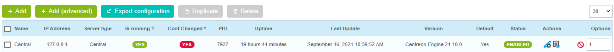

When you create, delete or edit objects in the **Configuration** menu, changes are not applied automatically (neither on the central server on which you have made the change, nor on any remote server or poller linked to it). For the changes to be taken into account, you have to export the configuration.

For changes to remote servers or pollers, you must export the configuration on the central server.

## Exporting the configuration

1.  Go to the **Configuration > Pollers > Pollers** page. The page shows the state of your central
server and of all pollers and remote servers linked to it: changes are shown in the **Conf changed** column.

2.  Select the central server, the remote server or the poller whose configuration has changed. 

    

3.  Click on **Export configuration**.

4.  Check the following boxes (see section [**Export options**](#options-dexport)) :

    - **Generate Configuration Files**
    - **Run monitoring engine debug (-v)**
    - **Move Export Files**
    - **Restart Monitoring Engine**. Use the most appropriate method: 
      - **Reload** : when you have created, deleted or edited supervised objects
      - **Restart** : when you have made changes to the way a poller and the central server communicate, or 
      to the configuration of the engine. Restarting takes more time than reloading.

5.  Click **Export**. A log of the export is displayed.

    

6. Read the log to check that the export has worked normally and that no errors were returned.

## Export options

The options work in the following ways:

  - **Generate Configuration Files**: Generates the scheduler configuration
    files in a temporary directory. This configuration is generated from objects
    configured via the web interface
  - **Run monitoring engine debug (-v)**: Enables the scheduler to check the
    generated configuration
  - **Move Export Files**: Moves the configuration files from the temporary
    directory to the scheduler's directory
  - **Restart Monitoring Engine**: Restarts the scheduler to apply the new
    configuration files
  - **Post generation command**: Executes the post-generation command set at the
    configuration of the scheduler level
