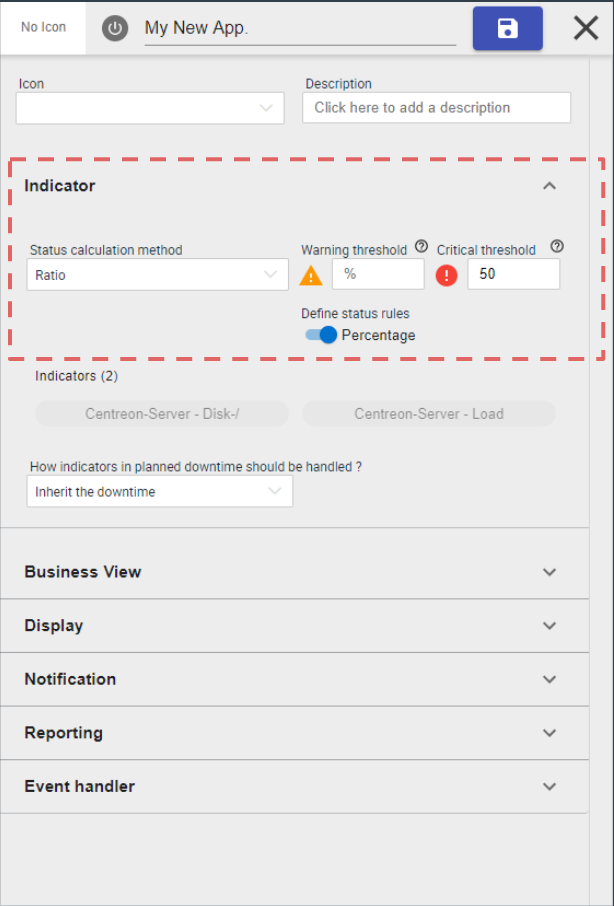
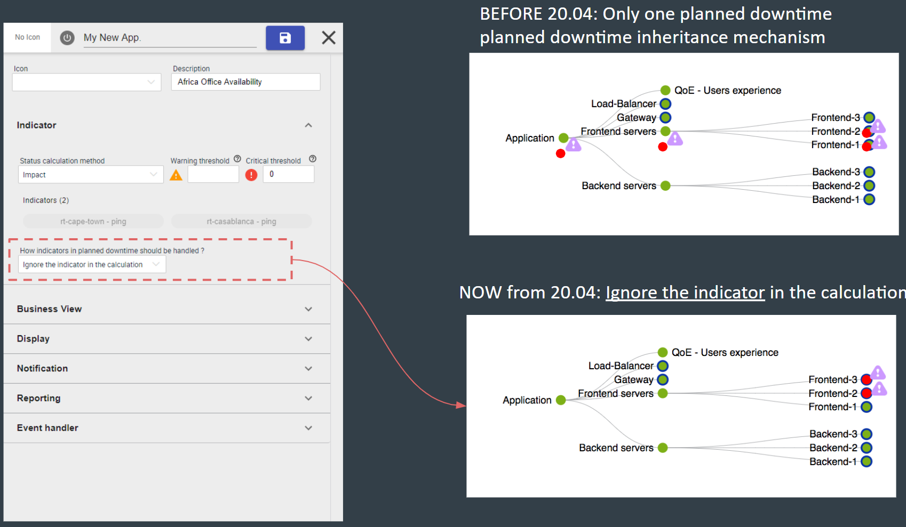

## Introduction

You can find in this chapter all changelogs concerning **Centreon Commercial
Extension**.

> It is very important when you update your system to refer to this section in
> order to learn about behavior changes or major changes that have been made on
> this version. This will let you know the impact of the installation of these
> versions on the features you use or the specific developments that you have
> built on your platform (modules, widgets, plugins).

If you have feature requests or want to report a bug, please contact support.

## Centreon MAP

### 20.04.0

*Released April, 22 2020*

#### New features

**Packaging simplified**

The packaging has been simplified so we don't require Tomcat. Logs are now
accessible in `/var/log/centreon-map/` and the service is now `centreon-map`
(*systemctl restart centreon-map* for instance).

**Silent installation**

It's now possible to install Centreon Map using a silent mode instead of the
only interactive mode.

**License on Central server**

The licensing system has been simplified.

The MAP license resides now on the Centreon **central** server, as any other
commercial extension. No worry, the compatibility with the previous licensing
mecanism (license on the map server) is maintained.

Anyway, if you want to perfectly finish your migration, you may ask the support
team to generate a new Centreon Map license for your Central server
and upload at `Administration > Extensions > Manager`

## Centreon BAM

### 20.04.0

### New calculation methods

We've improve our service mapping capability (Centreon BAM extension) by adding
new status calculation methods.

IT Service or App. modeling was hard to understand mainly because the only
mechanism the user had to determine an App./IT service status was a method based
on an “Impact” mode.

Now you're able to:

- Model simple use cases using **Best** or **Worst** status calculation methods
- Model **cluster** concepts using a new **Ratio** calculation method

Ex: I want 50% of my indicators to be OK > in that case you use the "Ratio"
method and configure it like that

### New planned downtime inheritance management

Business activity (<=> App. & Services) appears “Down” even when a maintenance
(<=> planned downtime) was anticipated by the IT teams. That’s not convenient
because it may be visible by external stakeholders & understandable in the
reporting

We add the possibility to exclude the indicator when it’s in planned downtime
so the Business Activity is not impacted during this planned downtime.

It's configurable at business’ activity level & globally (default behavior)

## Centreon MBI

### 20.04.0

Manage compatibility with Centreon 20.04

## Centreon Auto Discovery

### 20.04.0

Redesign the discovery of the hosts:

- New page to select provider
- New page to define access parameters
- Possibility to select the poller which run the discovery
- New page to select additional  parameters
- Add a page to define mappers and show the result preview

The Mappers is a technology to map discovered items value with a configuration value:

- **association**: Allows you to map the value of a property of a discovered resource with a field in the Centreon configuration (on a condition or not)
- **macro**: Allows you to map the value of a property of a discovered resource with a custom macro (on a condition or not)
- **template**: Allows to selected the template of of to apply (on a condition or not)
- **monitoring**: Allows to select the poller which will monitor the discovered resource (on a condition or not)

## Centreon Plugin Pack Manager

- Improve management of errors during Plugin Packs installation process
- The procedures for installing Plugin Packs are now hosted on the official Centreon documentation

### 20.04.0

## Centreon License Manager

### 20.04.0

Remove "Administration > Extensions > Subscription" menu to manage IT Edition subscription from "Administration >
Extensions > Manager" menu:

- Add a button to add a Centreon IT Edition subscription
- Add a button to view a Centreon IT Edition subscription

Licenses for products linked to Centreon IT and Business Editions online subscriptions are now automatically downloaded.