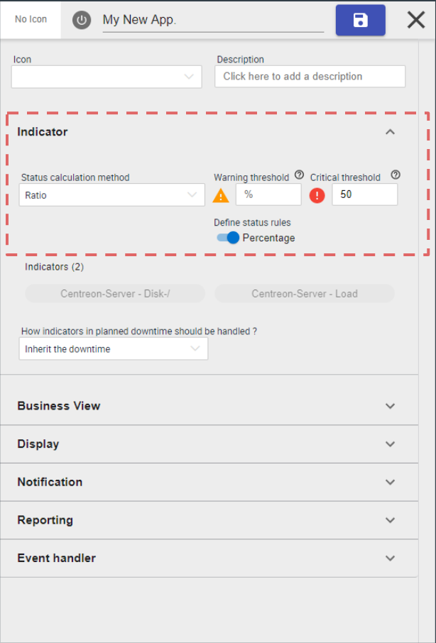

You'll find in this chapter the global **Centreon Plateform 20.04.0** release
note.

To access detailed release note by component, use the following sections:

  - [Core](centreon-core.html)
  - [Commercial extensions](centreon-commercial-extensions.html)
  - [Open Source extensions](centreon-os-extensions.html)

## New Events view (beta)

Centreon Web comes with a brand new events view management experience. This new
view is released as a beta feature becauwe we want to make this new view the
most efficient monitoring view dedicated to operators and system/network
administrator. To get to that point, we'll quicly iterate based on what we
already know and your feedbacks.

This new view is accessible directly from `Home > Events view (beta)"` and
brings the following capabilities:

  - A unified page that regroups host & service resources in one single place
    for a unified events management
  - Regexp search based on multi-criteria and the possibility to force the
    search on a specific criteria (host name, host alias, host address, service
    description)
  - Multi-criteria search based on multi-selects
  - Inline & massive quick actions: acknowledgement, set a planned downtime,
    re-check a resource
  - Detail information just above the listing to quickyl access information and
    not losing what you were currently looking at
  - ... *And more to come in the next weeks/months*

<iframe width="640" height="480" src="https://www.youtube.com/embed/FVjuIbBDuYU" frameborder="0" allowfullscreen></iframe>

To know more about this feature, have a look to [the
documentation](../alerts-notifications/events-view.html)

## Centreon on Mobility

Centreon comes now with a Mobile App. that you can install on your phone to be
able to perform the most common actions on resources:

  - Display resources status
  - Filter resource status
  - Act on any resource: acknowledge or set a downtime
  - Display detail status information and graph when appropriate

<video width="375" height="812" controls="true" allowfullscreen="true" poster="../assets/mobile/mobile-login.png">
    <source src="../assets/mobile/mobile-demo.mp4" type="video/mp4">
</video>

Find more about this mobile application in the [dedicated
section](../mobile/introduction.html)

## A more flexible hosts discovery


The Hosts Discovery feature coming from the Auto Discovery extension has been
totally rewritten to bring a new experience when it comes to add resources to
your configuration.

We've also added new functionalities:

  - Easier and more secure management of credentials,
  - Possibility to discover resources from any monitoring server,
  - New mapping system to link results with Centreon configuration.

Give a look at the [dedicated
section](../monitoring/discovery/hosts-discovery.html) to know how to launch your
first discovery job\!

## A better service mapping

*Easier to configure and more relevant complex IT workflow monitoring*

#### New calculation methods

We've improve our service mapping capability (Centreon BAM extension) by adding
new status calculation methods.

IT Service or App. modeling was hard to understand mainly because the only
mechanism the user had to determine an App./IT service status was a method based
on an “Impact” mode.

Now you're able to:

  - Model simple use cases using **Best** or **Worst** status calculation
    methods
  - Model **cluster** concepts using a new **Ratio** calculation method

Ex: I want 50% of my indicators to be OK \> in that case you use the "Ratio"
method and configure it like that



#### New planned downtime inheritance management

Business activity (\<=\> App. & Services) appears “Down” even when a maintenance
(\<=\> planned downtime) was anticipated by the IT teams. That’s not convenient
because it may be visible by external stakeholders & understandable in the
reporting

We add the possibility to exclude the indicator when it’s in planned downtime so
the Business Activity is not impacted during this planned downtime.


It's configurable at business’ activity level & globally (default behavior)

## Graphical View administration simplified

#### License management simplified

The license is now managed using the same mechanism than the other extensions:
upload & activate it on the Centreon central server.

Don't worry if you come from a \< 20.04 version, your license is still valid.
You'll only have a warning message in the license manager telling you that a
license is required but it has no impact on Centreno Map. You can ask a new one
to our support.

#### Packaging simplified

Centreon Map server package doesn't require tomcat anymore, it only relies on
Java.

When you manipulate the corresponding service, you have to use now

```shell
systemctl restart centreon-map
```

And logs are now in `/var/log/centreon-map/`

Finally, it's now possible to install Centreon Map using an "automatic" (silent)
mode instead of the only interactive mode.

## Architecture & Performance

#### New tasks handler

A new component has entered the Centreon family: Gorgone.

Gorgone comes in replacement of Centcore to ensure tasks handling in
distributed architectures: user's actions from web interface, copy of
Engine and Broker configurations and so on.

It will also be used as a new way to perform any other actions that is not
monitoring. First applications are hosts discovery, new Anomaly Detection module
configurations fetching or platform statistics collection.

Gorgone comes with a legacy mode to handle SSH communication with monitoring
servers, but the new ZMQ communication is recommended to fully benefit from
all the new functionalities.

See [the communication
section](../monitoring/monitoring-servers/communications.html) to know more.

#### Engine: future ready, Broker: multi-thread compatible

In this version, Engine introduces the last stage of the new Anomaly Detection
feature. Its performances have been globally improved.

Broker on his side has been partially rewritten to get ride of QT and bring a
new way to communicate with the SQL backend through multi-threaded connections.

Both now provide a new gRPC API that will tremendously improve the way we can
communicate with them in future versions.

## High Availability for everyone

Centreon opens is High Availability solution to everyone by sharing its
source code and installation procedures.

Give it a try by following the [dedicated
documentation](../administration/centreon-ha/architectures.html).
