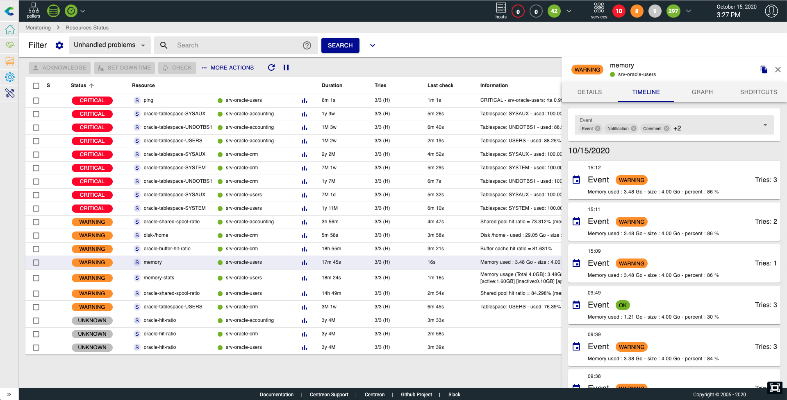
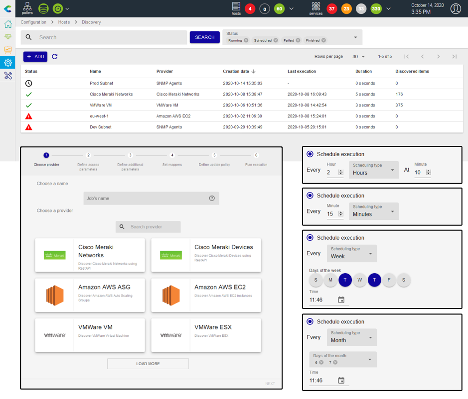

You'll find in this chapter the global **Centreon Plateform 20.10** release
note.

To access detailed release note by component, use the following sections:

- [Core](centreon-core.html)
- [Commercial extensions](centreon-commercial-extensions.html)
- [Open Source extensions](centreon-os-extensions.html)

## New Resources Status (previously Events view)

Thanks to feedback on the previous version 20.04, we added the missing features
before making this view the default.

This view is accessible directly from `Monitoring > Resources Status` and
brings the following capabilities:

- A unified page that regroups host & service resources in one single place for
  a unified events management
- Regexp search based on multi-criteria and the possibility to force the search
  on a specific criteria (host name, host alias, host address, service
  description)
- Multi-criteria search based on multi-selects
- Possibility to save and manage your filters
- Inline & massive quick actions: acknowledgement, set a planned downtime,
  re-check a resource, submit a result, etc.
- Detail information on the side of the listing, to quickly access information
  and not losing what you were currently looking at such as: objects details
  information, events timeline, associated performance graph and shortcuts.

To know more about this feature, have a look to
[the documentation](../alerts-notifications/events-view.html)

## Embedded IT Automation: towards a fully automatic asset discovery

The Hosts Discovery feature coming from the Auto Discovery extension has been
improved to add new capacities:

- Host Discovery wizard now allows to schedule your discoveries using several
  fashion: yearly, monthly, daily, hourly and even every x minutes.
- Scheduled discovery jobs can be paused and resumed at any time.
- Discovery result can also be automatically processed to add, disable and when
  necessary re-enable the hosts in the configuration.
- If you decide to manually add the hosts from the job's result page, the mapping
  rules can now be edited and saved from this page to match your needs by
  applying the rule directly on the result.
- The new *exclusion* and *inclusion* mappers will help you decide which hosts
  are meant to be added in the configuration, and the ones that should be
  disabled or enabled.

Give a look at the [dedicated section](../monitoring/discovery/hosts-discovery.html)
to know how to launch your first discovery job\!

To know everything about changes, have a look to
[the release note](centreon-commercial-extensions.html#centreon-auto-discovery-release-notes)

## A stronger Open Source core framework

### Multi-Factor user Authentication with OpenID Connect

Centreon 20.10 now supports the OAuth 2.0 Authorization Code Grant type, an
open standard for access delegation, along with the OpenID Connect (OIDC)
authentication layer, promoted by the OpenID Foundation. All popular Identity
Providers implementing Multi-Factor Authentication support this architecture. 

Give a look at the
[dedicated section](../administration/parameters/centreon-ui.html#openid-connect).

### SELinux compatibility for strict security policy enforcement

Centreon 20.10 is now compatible with Security-Enhanced Linux (SELinux), the most
popular Linux kernel security module.

### Up-to-date Linux Operating System for up-to-date security patches (coming soon)
Centreon 20.10 runs on the latest version of the CentOS or RedHat Enterprise Linux
(RHEL) operating system: CentOS v8 or RHEL v8.

### Vulnerability Fix Engagement Plan

As usual, Centreon implements an engagement plan to fix reported security
vulnerabilities in a timely manner, based on their CVSS (Common Vulnerability
Scoring System) score. Centreon 20.10 software version includes all such
vulnerability fixes from previous versions.
