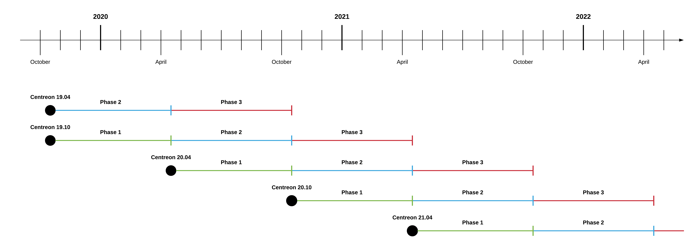

Starting with Centreon version 18.10, Centreon will publish new releases of the
Centreon solution at a regular cadence, enabling the community, businesses and
developers to plan their roadmaps with the guarantee of upstream access to the
latest open source capabilities.

## Version number format: YY.MM

Releases of Centreon are named according to the year and the month of delivery.
For example, Centreon 21.04 was released in April, 2020. All modules and
components of the Centreon software suite use the same versioning.

## Release cadence

Centreon’s action plan is to deliver two major releases per year. The first,
will occur in April while the second, will be in October. Between these two,
Centreon will continuously deliver minor updates, patches, security
vulnerability fixes, bug fixes and enhancements to the software priority/risk
evaluation that fits into the lifecycle phases.

## Maintenance and security updates

The lifecycle of a version is divided into three phases:

1.  First phase: Bugs of all severity levels (minor, major, critical, blocker)
    and security issues are fixed by priority.
2.  Second phase: Major, critical bugs and blockers, or security issues are
    fixed by priority.
3.  Third phase: Blockers or security issues are fixed by priority.

> The severity and prioritization of bugs are the Centreon team's responsibility.

The first phase begins the lifecycle of the release.

The second phase of a version begins when the next major version is available.
For example, the release of Centreon 21.04 starts the second phase of Centreon
20.10.

The third phase of a version begins when the second next major version is
available. For example, the release of Centreon 21.04 starts the third phase of
Centreon 20.04 and the second phase of Centreon 20.10.

This schema shows the Centreon lifecycle:

## Maintenance table for earlier products

> Any other products not described in the following tables are no longer supported
> by Centreon.

### Centreon OSS 3.4

| Product                 | Version  | Release date | End of life    | State         |
| ----------------------- | -------- | ------------ | -------------- | ------------- |
| Centreon Web            | 2.8.x    | 2016/11/14   | Centreon 20.04 | Not supported |
| Centreon Engine         | 1.8.x    | 2017/09/19   | Centreon 20.04 | Not supported |
| Centreon Broker         | 3.0.x    | 2016/11/14   | Centreon 20.04 | Not supported |
| Centreon DSM            | 2.x      | 2014/09/01   | Centreon 20.04 | Not supported |
| Centreon Open Tickets   | 1.2.x    | 2016/06/20   | Centreon 20.04 | Not supported |
| Centreon AWIE           | 1.x      | 2018/04/11   | Centreon 20.04 | Not supported |
| Centreon Poller Display | 1.5.x    | 2018/04/11   | Centreon 20.04 | Not supported |
| Centreon Widgets        | 1.x      | N/A          | Centreon 20.04 | Not supported |
| Centreon Plugins        | YYYYMMDD | N/A          | Centreon 20.04 | Not supported |

### Centreon IMP 3.4

| Product                       | Version | Release date | End of life    | State           |
| ----------------------------- | ------- | ------------ | -------------- | --------------- |
| Centreon OSS                  | 3.4     | 2016/11/14   | Centreon 20.04 | Not supported   |
| Centreon License Manager      | 1.1.x   | 2018/02/23   | Centreon 20.04 | Not supported   |
| Centreon Plugin Packs Manager | 2.4.x   | 2018/05/30   | Centreon 20.04 | Not supported   |
| Plugin Packs                  | 3.x     | N/A          | N/A            | All issues      |

### Centreon EMS 3.4

| Product                 | Version | Release date | End of life    | State                     |
| ----------------------- | ------- | ------------ | -------------- | ------------------------- |
| Centreon IMP            | 3.4     | 2016/11/14   | Centreon 20.04 | Not supported             |
| Centreon BAM            | 3.6.x   | 2018/02/22   | Centreon 20.04 | Not supported             |
| Centreon MAP            | 4.4.x   | 2017/01/02   | Centreon 20.04 | Not supported             |
| Centreon MBI            | 3.2.x   | 2018/07/09   | Centreon 20.04 | Not supported             |
| Centreon Auto Discovery | 2.3.x   | 2017/08/24   | Centreon 20.04 | Not supported             |