We have included a set of generic reports that you can reconfigure for
your environment based on Centreon concepts (e.g., business activities, host groups and
categories, service categories, metrics). 

> You can have a look to our [Reports book](../assets/reporting/Centreon-MBI-Samples-of-Reports.pdf) to find the report you need before consulting this report guide.

Most of these reports have been designed to be perfectly rendered in
PDF. The space reserved for object names (host, services, groups,
categories) in tables or graph legends may sometimes be limited, so
please remember to define objects' names accordingly.

Directly access the area you want to have a look at :

- [Business activity monitoring](#business-activity-monitoring)
- [Availability & Events](#availability--events)
- [Performance](#performance)
- [Storage](#storage)
- [Network](#network)
- [Virtualization](#virtualization)
- [Electric consumption](#electric-consumption)
- [Profiling](#profiling)
- [Inventory & Configuration](#inventory--configuration)
- [Centreon/Reporting Database diagnostic](#centreon-database-diagnostics)

To incorporate your own logos into reports (when adequate space is provided), upload them to Centreon
MBI using the interface. All images, regardless of their size, must have
a 4:4 ratio to fit perfectly into the image areas.

## Business Activity Monitoring

### BV-BA-Availabilities-1 

#### Description

This report displays statistics about application availability and
events for a business view. It is generated using the default reporting
time period for each business activity configured in the Centreon BAM
module.

#### How to interpret the report

The first page presents a focus on the following attributes:

-   Availability

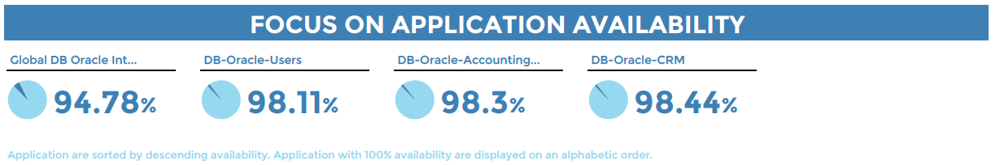

-   Unavailability

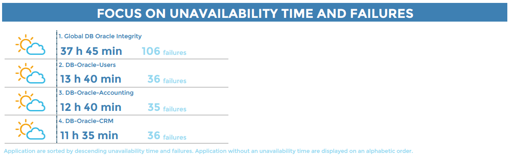

The weather icons change according to the SLAs defined in each business
activity, in terms of minutes.

-   Reliability and Maintenability

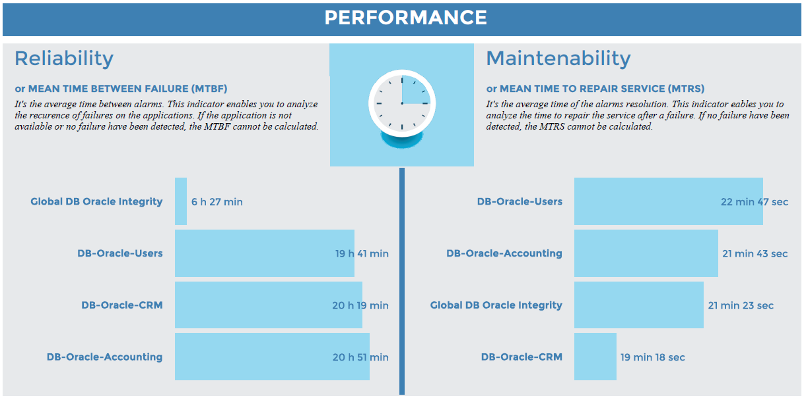

The following pages display additional statistics for each business
activity in the business view:

-   Availability, unavailability, downtime, service performance index
    and number of events that occurred.

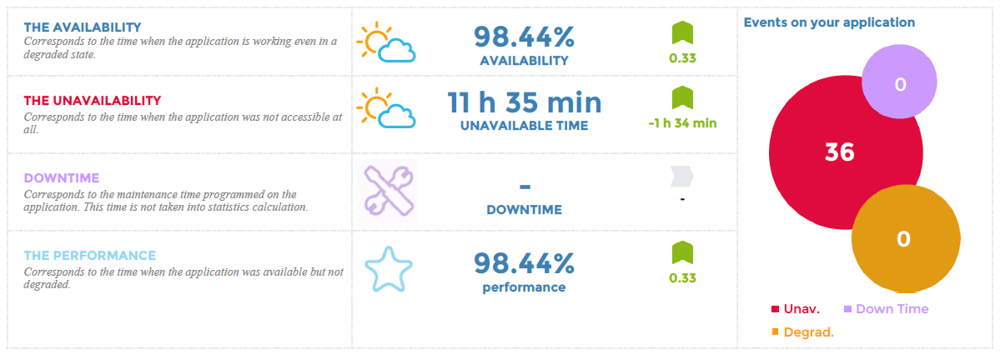

The weather icons change according to the SLAs defined in each business
activity, in terms of percentages and minutes.

-   Change in availability, performance and number of events.

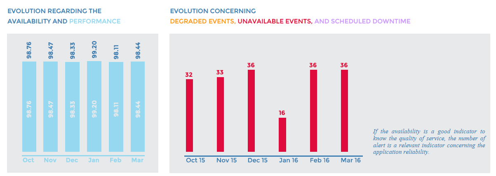

-   An availability calendar displays only days when availability was
    below 100%.
-   For days with 100% availability, the cell background color appears
    in a light grey with no values displayed.
-   If data aren\'t present on a specific day, the cell background color
    appears in white with no values displayed.

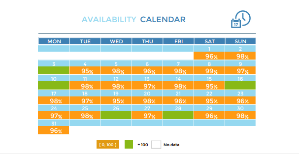

-   As an option, the list of events appears with their respective key
    performance indicators (KPIs).

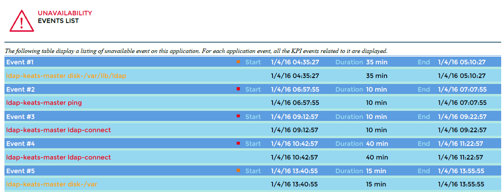

#### Parameters:

Parameters required for the report:

 -   Start date representing the month in which you want to generate
     the report (matching the start date in the Centreon MBI interface)
 -   The following Centreon objects:

  Parameter             | Type              |  Description
  ----------------------|-------------------|---------------------------------------
  logo                  |  Dropdown list    | Select logo to display in header.
  Business View         |  Dropdown list    | Select a Business View for generating the report.
  hide event            |  Radio button     |     Hide events list in the Business activity.
  calendar color        |  Radio button     | Color the calendar in green/orange/red based on SLA.
  title                 |  Text field       | Specify report title.
  time period           |  Dropdown list    |  Specify reporting time period.\*
                               

\* *If different from \"Default\", be sure that the selected time period
is defined as a Default or Extra reporting time period in the BA
configuration or it will not appear in the report.*

#### Prerequisites

-   Monitoring of at least one business activity to be linked to one
    business view
-   One month minimum of data from Centreon BAM module.

### BA-Availability-1 

This report displays statistics about business activity availability and
events.

#### How to interpret the report

The following information is displayed on the report for the selected
business activity:

-   Availability, unavailability, downtime, service performance index
    and number of events.

The weather icons change according to the SLAs defined in each business
activity, in terms of percentages and minutes.

-   Change in the availability, performance and number of events

-   An availability calendar displays only the days when availability
    was below SLA in terms of percentage defined in the business
    activity configuration.

-   As an option, the list of events appears with their respective key
    performance indicators (KPIs).

#### Parameters:

Parameters required for the report:

 -   Start date representing the month in which you want to generate
     the report (matching the start date in the Centreon MBI interface)
-   The following Centreon objects:

  **Parameter**      |   **Type**        |  **Description**
  ------------------ | ----------------  | ---------------------------------
  logo               |   Dropdown list   | Select logo to display in header.
  Business Activity  |   Dropdown list   | Select a Business Activity for generating the report.
  hide event         |   Radio button    | Hide events list in the business activity.
  calendar color     |   Radio  button   | Color the calendar in green/orange/red  based on SLA.               
  title              |   text field      | Specify report title.
  time period        -   Dropdown        | Specify reporting time period.\*

\* *If different from \"Default\", be sure that the selected time period
is defined as a Default or Extra reporting time period in the BA
configuration.*

### BV-BA-Availabilities-List

#### Description

For a business view, this report lists statistics showing availability,
unavailability, degraded service time and business activity alarms.

**How to interpret the report**

The weather icons change according to the SLA percentage defined in each
business activity. If no SLA is defined, 100% availability will be
represented by a sun icon, and all values below 100% by a cloud.

Changes are calcuted in relation to the previous period:

> -   If the reporting period is a full month, the previous period is
>     the previous full month.
> -   In all other cases, the change is calculated by the number of days
>     preceding the number of days of the reporting period.

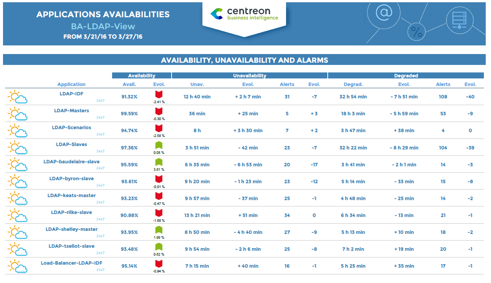

Parameters required for the report:

> -   Start date representing the month in which you want to generate
>     the report (matching the start date in the Centreon MBI interface)
> -   The following Centreon objects:

  Parameter             | Type              |  Description
  ----------------------|-------------------|---------------------------------------
  logo                  |  Dropdown list    | Select logo to display in header.
  Business View         |  Dropdown list    | Select a Business View for generating the report.
  hide event            |  Radio button     |     Hide events list in the Business activity.
  calendar color        |  Radio button     | Color the calendar in green/orange/red based on SLA.
  title                 |  Text field       | Specify report title.
  time period           |  Dropdown list    |  Specify reporting time period.\* 

\* *If different from \"Default\", be sure that the selected time period
is defined as a Default or Extra reporting time period in the BA
configuration or it will not appear in the report.*

#### Prerequisites

-   Monitoring of at least one business activity to be linked to one
    business view

### BA-Event-List 

This report displays a list of events that occurred for a business activity.

#### How to interpret the report

The report displays a list of events for a business activity during a given period and the related KPIs. The time period applied is the default value set in the configuration BA menu.

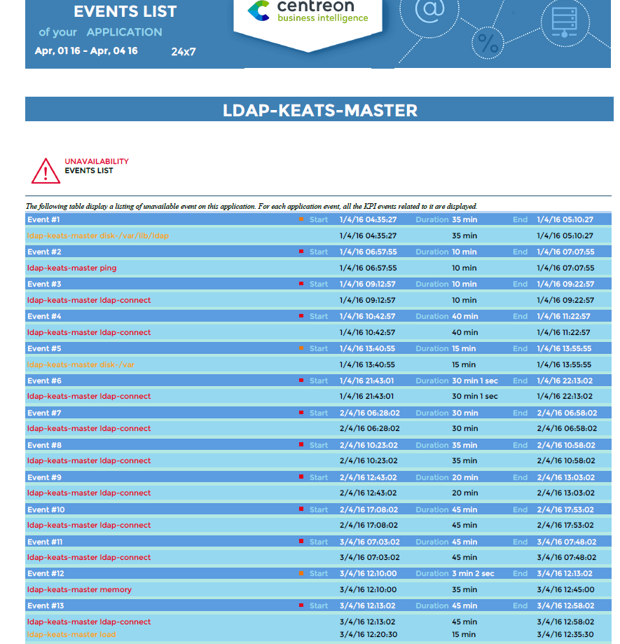

#### Parameters

  **Parameter**      |   **Type**        |  **Description**
  ------------------ | ----------------  | ---------------------------------
  logo               |   Dropdown list   | Select logo to display in header.
  Business Activity  |   Dropdown list   | Select a Business Activity for generating the report.
  hide event         |   Radio button    | Hide events list in the business activity.
  calendar color     |   Radio  button   | Color the calendar in green/orange/red  based on SLA.               
  title              |   text field      | Specify report title.
  time period        -   Dropdown        | Specify reporting time period.\*

\* *If different from \"Default\", be sure that the selected time period
is defined as a Default or Extra reporting time period in the BA
configuration.*

### BV-BA-Current-Health-VS-Past

#### Description

This report displays the current health of business activities at the
time the report is generated. It also displays availability for a
defined period.

#### How to interpret the report

For a given business view, the report displays the real-time health
state of each business application, the hour of latest state change and
duration of the current state. The report also indicates whether the
application has been acknowledged or in downtime. Depending on the
parameter selected, the report displays availability and failures for
each application.

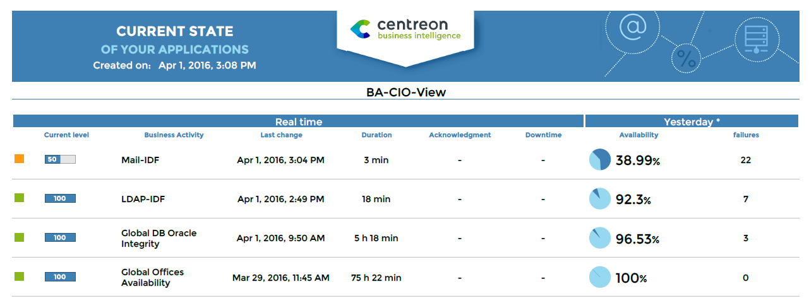

#### Parameters

Parameters required for the report:

  Parameters                    | Type          |  Description
  ------------------------------|---------------|-------------------------------------------
  logo                          | List box      |  Select logo to display in header.
  title                         | Text field    | Specify report title.
  Business View                 | List box      |  Select a Business View for generating the report.
  compare\_with                 | Radio button  |    Display historical data according to specified period.
  show the reporting timeperiod | Radio botton  |    Show or hide the default time period related to the business activity.
  title                         | Text field    | Specify report title.
  time period                   | Dropdown list |  Specify reporting time period or a other.\*
                           

\* *If different from \"Default\", be sure that the selected time period
is defined as a Default or Extra reporting time period in the BA
configuration or it will not appear in the report.*

#### Prerequisites

-   Monitoring of at least one business activity to be linked to one
    business view.

### BV-BA-Availabilities-Calendars

#### Description

This report displays statistics about business activity availability and
events. The statistics appear in calendars, by month and by day. This
report is generated using the default reporting time period configured
in the Centreon BAM module for each business activity.

#### How to interpret the report

The first calendar displays the availability of your business activities
by month. Cells are colored according to the SLA defined for each
business activity in percentages (in the Extended Information tab menu).
If the SLAs are not defined in the BA configuration, values are
displayed in cells if availability is below 100% or if unavailability \>
0 secondes. The time period that applies is the \"Default reporting
period\" selected for each business activity (in the Configuration tab
menu).

The second calendar displays the unavailability and number of events for
your business activities by month. Cells are colored according to the
SLA defined for each business activity in minutes. If the SLAs are not
defined in the BA configuration, values are displayed in cells if
availability is below 100% or if unavailability \> 0 secondes. The time
period that applies is the \"Default reporting period\" selected for
each business activity.

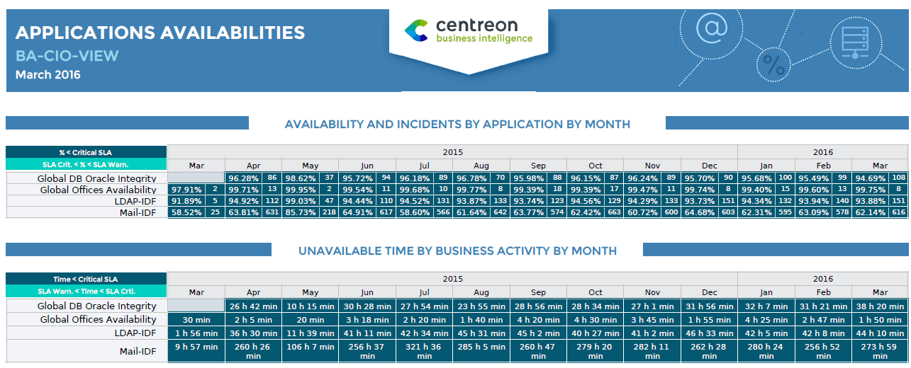

The third calendar displays availability for each business activity by
day. Cells are colored according to time frames (in minutes) of
unavailability, configured for the report. If unavailability is below
100%, availability is displayed for that day.

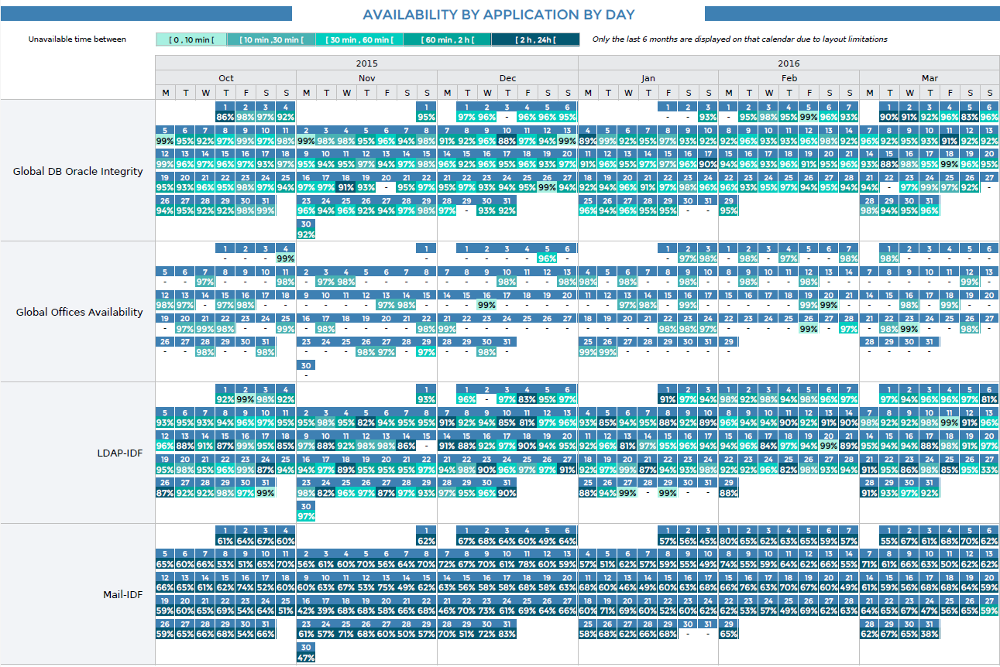

#### Parameters:

Parameters required for the report:

> -   A start date corresponding to the month for which you want to
>     generate the report (corresponding to the start date in the
>     Centreon MBI interface)
> -   The following objects:

  Parameter      | Type          |  Description
  ---------------|---------------|----------------------------------------------------
  logo           | Dropdown list | Select logo to display in header.
  business View  | Dropdown list | Select a Business View for generating the report.
  sla 1\*        | Text field    | Time in minutes corresponding to the high threshold of the first interval \[0 min, **sla1** \[
  sla 2\*        | Text field    | Time in minutes corresponding to the high threshold of the second interval \[sla1, **sla2** \[
  sla 3\*        | Text field    | Time in minutes corresponding to the high threshold of the third interval \[sla2, **sla3** \[
  sla 4\*        | Text field    | Time in minutes corresponding to the high threshold of the fourth interval \[sla3, **sla4** \[
  title          | Text field    | Specify report title.
  time period    | Dropdown list | Specify reporting time period or a specific one.\*\*
                         
\* SLA thresholds appear above the calendar displaying availability by
day.

\* *If different from \"Default\", be sure that the selected time period
is defined as a Default or Extra reporting time period in the BA
configuration or it will not appear in the report.*

#### Prerequisites

-   Monitoring of at least one business activity to be linked to one
    business view
-   One month minimum of data from Centreon BAM extension.

## Availability & Events

### Hostgroups-Incidents-1 

#### Description

This report provides an overview of host exception events and
unavailability.

**How to interpret the report**

On the cover sheet, two pie charts show the number of hosts by host
groups and host categories.

On the first page, the graphs show the evolution of exception events by
day and by month. A radar graph provides the exception event
distribution by host groups.

On the second page, the graph shows the maintainability and reliability
of the host groups, as determined by an index based on MTRS and MTBF
times.

Afterwards, a series of bar charts present information by host group,
showing the evolution of exception events by host type. Finally, there
is a comparison of the least maintainable and reliable host for each
host group.

#### Cover sheet

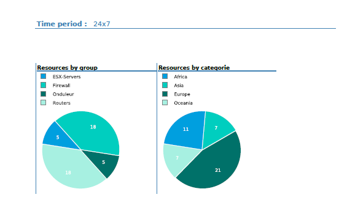

#### First page

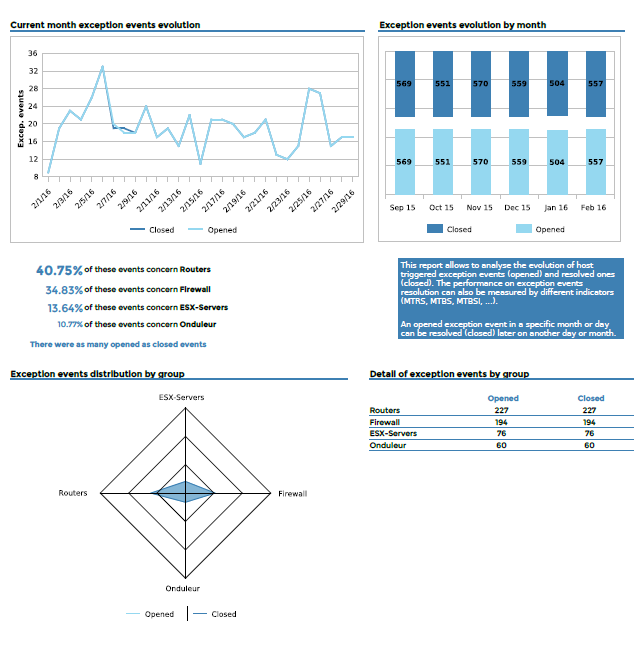

#### Second page

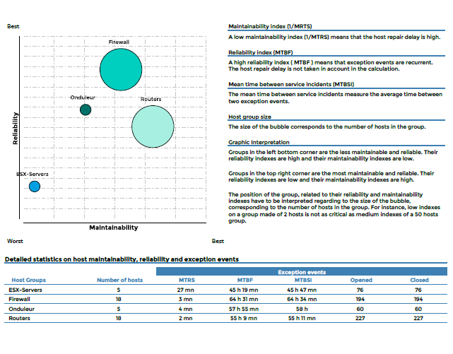

#### For each host group

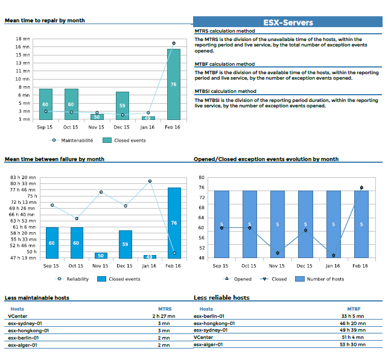

#### Parameters

Parameters required for the report:

-   The reporting period.
-   The following Centreon objects :

  Parameter         | Parameter type  | Description
  ------------------|-----------------|-----------------------------------
  Hostgroups        | Multi selection |  Select host groups.
  Host Categories   | Multi selection |  Select host categories.
  Time period       | Dropdown list   |  Specify time period.
  Interval          | Text field      |  Specify no. of months in trend graphs.
                                      

### Hostgroups-Availability-1

#### Description:

This report shows availability, exception-type events for hosts and
services of multiple host groups. It also shows the evolution of the
hosts for each host group, the evolution of availability and number of
exception events for hosts and services.

**How to interpret the report**

On the first page, the report displays a graph of the hosts and services
availability for hostgroups, exception-events distribution, evolution of
the number of resources, and a cross table detailing the statistics for
all the previous information.

On the following pages, evolution of the unavailability and exception
events is detailed for each host group, sorted by host categories and
services categories.

Finally, hosts and services statistics are displayed with the top-most
unavailability and exception events.

#### First page

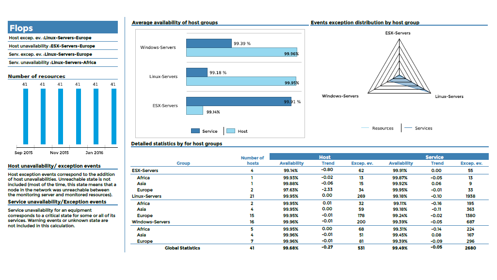

#### For each host group

##### First page

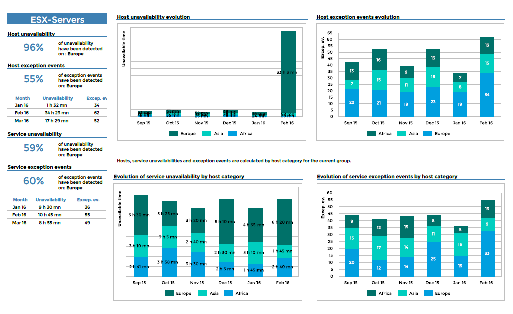

##### Second page

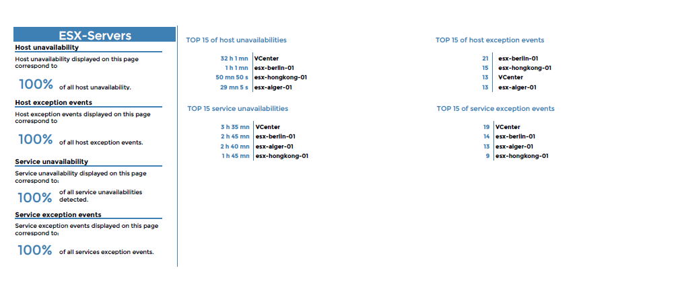

#### Parameters:

Parameters required for the report:

-   The reporting period
-   The following Centreon objects:

  Parameter         | Parameter type  | Description
  ------------------|-----------------|-----------------------------------
  Hostgroups        | Multi selection | Select host groups.
  Host Categories   | Multi selection | Select host categories.
  Service Categories| Multi selection | Select service categories.
  Time period       | Dropdown list   | Specify time period.
  Interval          | Text field      | Specify no. of months in trend graphs.

### Hostgroup-Availability-2 

#### Description

This report displays information about availability and exception events
for a host group.

**How to interpret the report**

On the first page, the evolution of availability and exception events is
displayed for hosts and services. The evolution of host group resources
is also shown.

On the second page, statistics are shown for detailed availability and
exception events on a host according to category. A table lists the
hosts that were least available and that created the largest number of
exception events.

On the two last pages, detailed statistics for indicators on
availability and exception events are shown. The information is
organized by host and service category. The top 15 hosts are listed in
terms of service unavailability and exception events.

#### First page

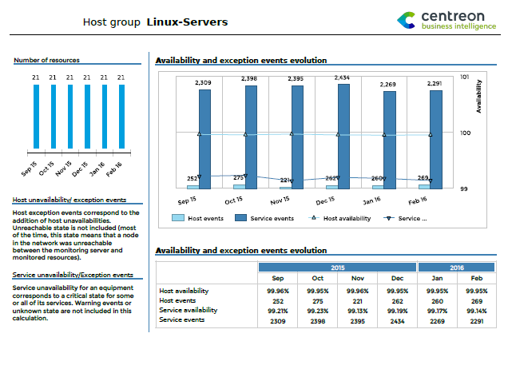

#### Second page

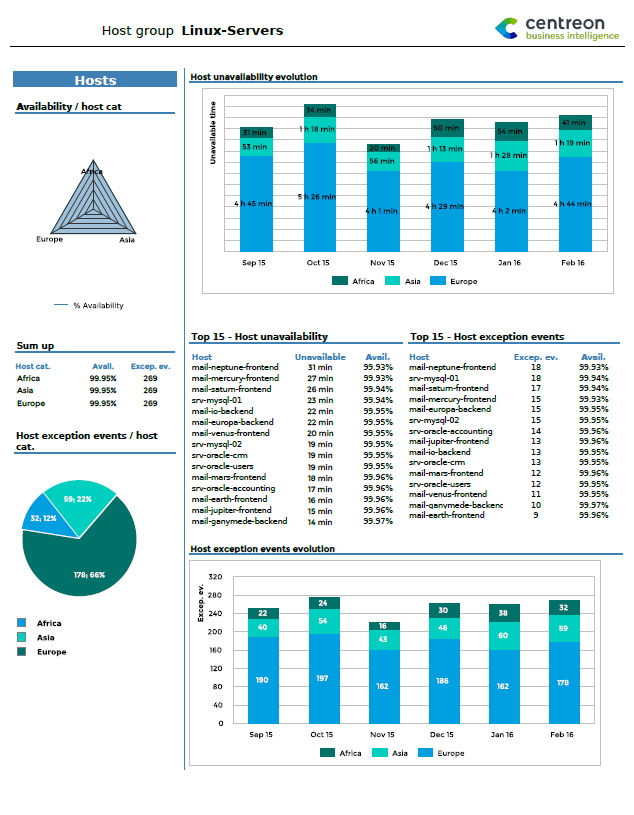

#### Third & Fourth pages

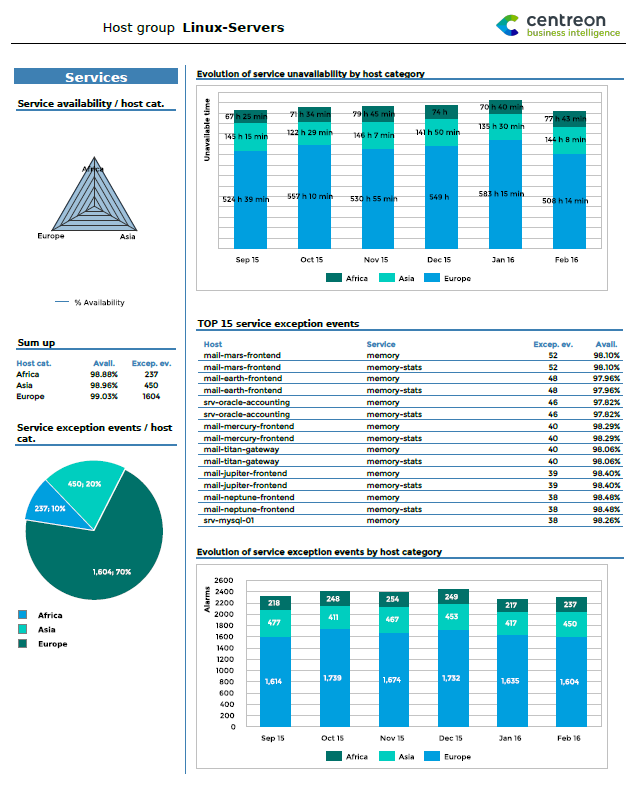

and

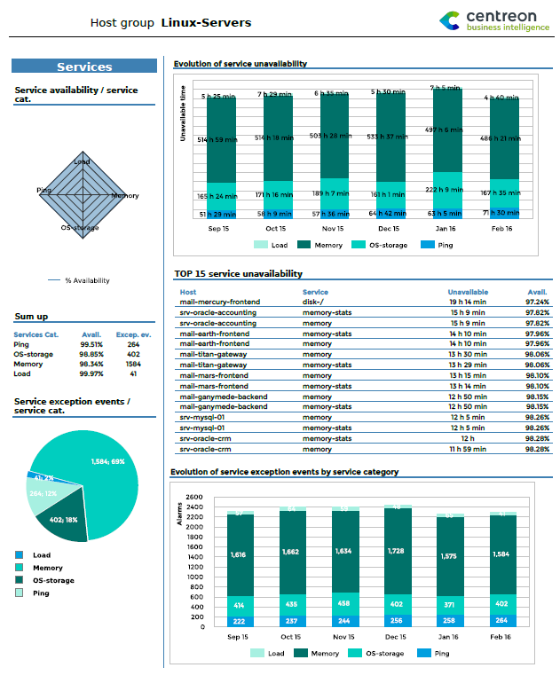

#### Parameters

Parameters required for the report:

> -   Reporting period
> -   The following Centreon objects:

| Parameter           | **Parameter type**   | **Description**                                                                      
| ------------------- | -------------------- | ------------------------------------------------------------------------------------
| Host group          | Drop-downlist | Select host group.                                                                   
| Host Categories     | Multi select         | Select host categories.                                                              
| Services Categories | Multi select         | Select host categories.                                                              
| Time period         | Dropdown list        | Time period to report. Note: Only use the time period from the ETL month properties. 
| Evolution interval  | Text field           | Specify no. of months of history for the evolution graph                             

### Hostgroup-Service-Incident-Resolution-2

#### Description

This report displays the rate of acknowledged and resolved events, the
longest-lasting events, the least reliable indicators, and hosts
generating the most events for a given host group.

**How to interpret the report**

The first graphic displays the rate of acknowledged and resolved events
within a specific time frame.

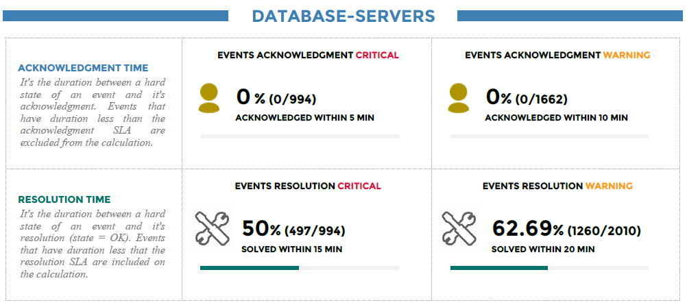

The second graphic displays the top 10 longest events with the start,
end and resolution time.

Indicators in a critical-state appear in red, in a warning-state in
orange, and an unknown state in gray.

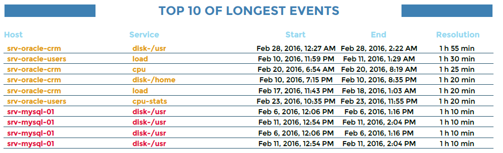

The third graphic in the report displays the top 10 the least reliable
indicators.

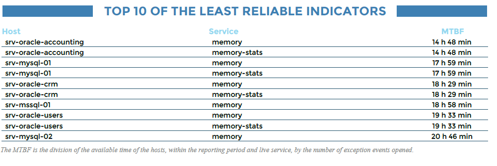

Finally, the top 10 hosts generating the most events.

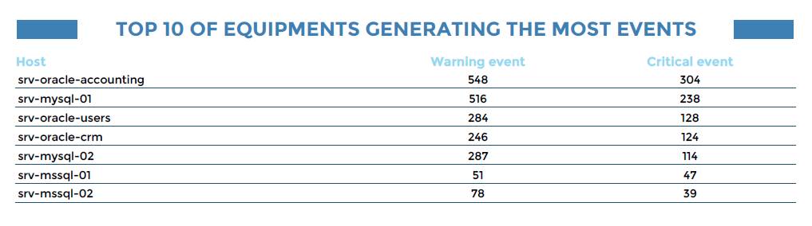

#### Paramètres

Parameters required for the report:

 -   Reporting period
 -   SLA of acknowledgment in minutes
 -   SLA of resolution in minutes
 -   The number of rows to display in top objects
 -   The following Centreon objects:

  Parameter         | Parameter type  | Description
  ------------------|-----------------|-----------------------------------
  Hostgroups        | Multi selection | Select host groups.
  Host Categories   | Multi selection | Select host categories.
  Service Categories| Multi selection | Select service categories.
  Time period       | Dropdown list   | Specify time period.

### Hostgroup-Host-Availability-List

#### Description

This report displays information on availability and exception events
for hosts within a hostgroup.

**How to interpret the report**

For each host, the table lists the percentage of availability,
unavailability and number of exception events and trends.

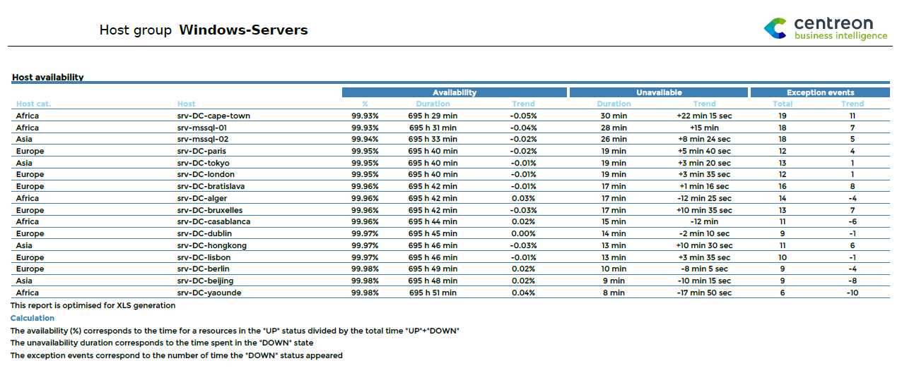

This report is optimized for generating XLS files.

#### Parameters

Parameters required for the report:

-   Reporting period
-   The following Centreon objects:

Parameter         | Parameter type        | Description             
------------------|-----------------------|-----------------------
Host group        | Drop-down list        | Select host group.      
Hosts Categories  | Multi select          | Select host categories. 
Time period       | Drop-down list        | Specifiy time period    

### Hostgroup-Host-Event-List

#### Description

This report provides a list of exception events for hosts.

**How to interpret the report**

The table contains detailed statistics on critical or warning-type
exception events on hosts indicating start, acknowledgement and end
dates. The report also calculates the real and the effective MTRS for
each event.

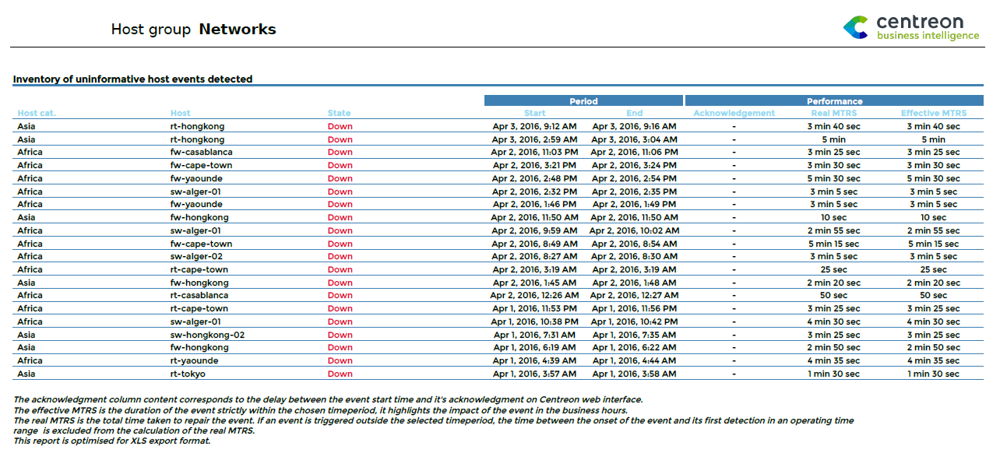

This report is optimized for for generating XLS files.

#### Parameters

Parameters required for the report:

 -   Reporting period
 -   The following Centreon objects:

Parameter         | Parameter type        | Description             
------------------|-----------------------|-----------------------
Host group        | Drop-down list        | Select host group.      
Hosts Categories  | Multi select          | Select host categories. 
Time period       | Drop-down list        | Specifiy time period  

### Hostgroup-Service-Availability-List

#### Description

This report displays events and the availability of services for a host
group.

**How to interpret the report**

For each service, detailed statistics are provided: availability (in
percentage), unavailability, exception and warning events, as well as
the trends for these various indicators.

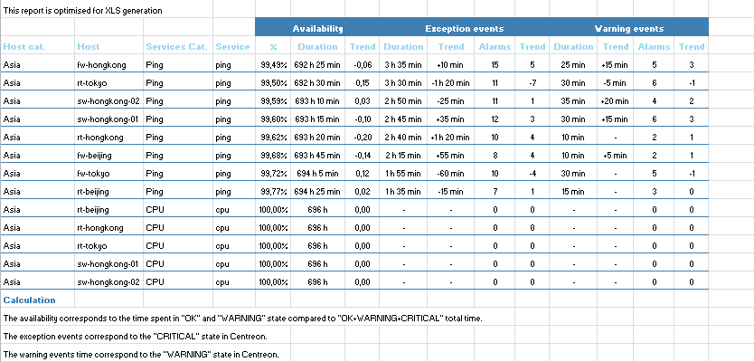

This report is optimized for generating XLS files.

#### Parameters

Parameters required for the report:

-   The reporting period
-   The following Centreon objects:

  Parameter         | Parameter type  | Description
  ------------------|-----------------|-----------------------------------
  Hostgroup         | Drop-down list  | Select host group.
  Host Categories   | Multi selection | Select host categories.
  Service Categories| Multi selection | Select service categories.
  Time period       | Dropdown list   | Specify time period.

### Hostgroup-Service-Event-List 

#### Description

This report displays a table listing critical or warning-type events for
services in a hostgroup.

**How to interpret the report**

 The report also calculates the real and the effective MTRS for each
 alarm. A table contains detailed statistics on events occuring on
 hosts indicating start, acknowledgement and end dates.

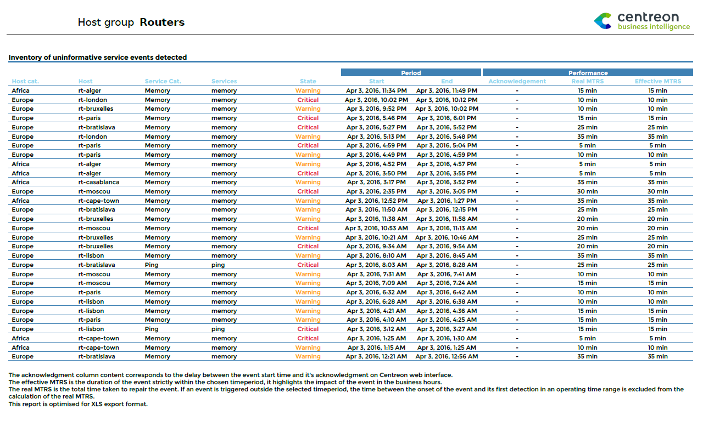

#### Parameters

Parameters required for the report:

-   Reporting period
-   The following Centreon objects:

  Parameter         | Parameter type  | Description
  ------------------|-----------------|-----------------------------------
  Hostgroup         | Drop-down list  | Select host group.
  Host Categories   | Multi selection | Select host categories.
  Service Categories| Multi selection | Select service categories.
  Time period       | Dropdown list   | Specify time period.

### Hostgroup-Host-Pareto

#### Description

This report allows you to identify hosts responsible for the largest
number of exception events in a host group. The data is represented in a
Pareto chart.

**How to interpret the report**

Hosts responsible for 80% of events are highlighted. Hosts are sorted in
descending order in terms of number of generated events. The ratio of
cumulative events is also shown.

This report helps you to focus on the most problematic hosts by applying
the Pareto principle (or 80-20 rule): approximately 80% of the effects
come from 20% of the causes.

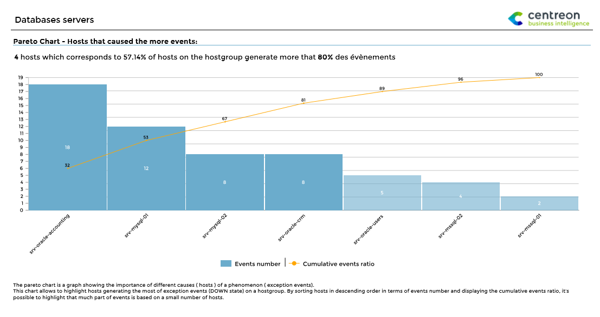

#### Parameters

Parameters required for the report:

 -   Reporting period
 -   The following Centreon objects:

  Parameter         | Parameter type  | Description
  ------------------|-----------------|-----------------------------------
  Hostgroup         | Drop-down list  | Select host group.
  Host Categories   | Multi selection | Select host categories.
  Time period       | Dropdown list   | Specify time period.

### Hostgroups-Host-Current-Events

#### Description

This report displays the events occuring on hosts at the time it is
generated.

**How to interpret the report**

The report consists of four parts. On each part, you can use a filter to
select a restricted perimeter for host groups and host categories. Data
is displayed with real-time results when the report is generated. In
addition:

-   Events can be sorted by state, duration or hostname.
-   You can display and/or filter acknowledged hosts or hosts in
    downtime.
-   Only confirmed events (hard state) are taken in account.
-   A report can have less than four parts by specifying the value -1 in
    its title.

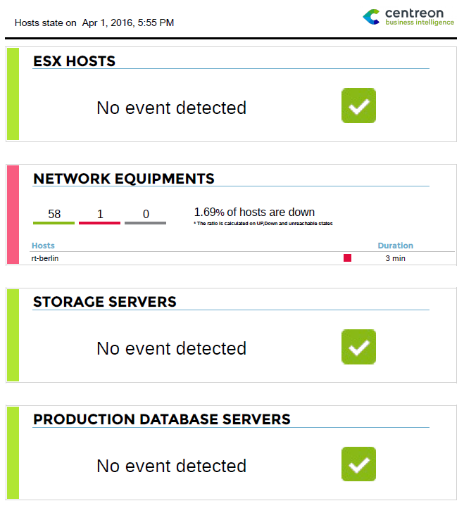

#### Parameters

Parameters required for the report:

|   Parameters    |  Type              |   Description                                   |
| --------------- | ------------------ | ----------------------------------------------- |
| Title           |    Text field      | Specify the title for part 1 of report.         |
| Hostgroups      | Multi select       | Select host groups for part 1 of report.        |
| Host category   | Multi select       | Select host categories for part 2 of report.    |
| Title           |    Text field      | Specify title for part 2 of report.             |
| Hostgroups      | Multi select       | Select host groups for part 2 of report.        |
| Host category   | Multi select       | Specify host categories for part 2 of report.   |
| Title           |    Text field      | Specify title for part 3 of report.             |
| Hostgroups      | Multi Select       | Select host groups to use for part 3 of report. |
| Host category   | Multi select       | Select host categories for part 3 of report.    |
| Title           |    Text field      | Specify title for part 4 of report.             |
| Hostgroups      | Multi select       | Specify host groups for part 4 of report.       |
| Host category   | Multi select       | Select host categories for part 4 of report.    |
| sort_by         |    Radio button    | Sort results by state, duration or host name.   |
| display_ack     |    Radio button    | Display or filter acknowledged hosts.           |
| display_downtime|    Radio button    | Display or filter hosts in downtime.            |

### Hostgroups-Service-Current-Events

#### Description

This report displays the events occuring with services at the time it is
generated.

**How to interpret the report**

This report consists of four parts. On each part, you can use a filter
to select a restricted perimeter for host groups, host categories and
service categories. Data is displayed with real-time results when the
report is generated. In addition:

-   Events can be sorted by state, duration or hostname.
-   You can display and/or filter acknowledged hosts or hosts in
    downtime.
-   Only confirmed events (hard state) are taken in account.
-   A report can have less than four parts by specifying the value -1 in
    its title.

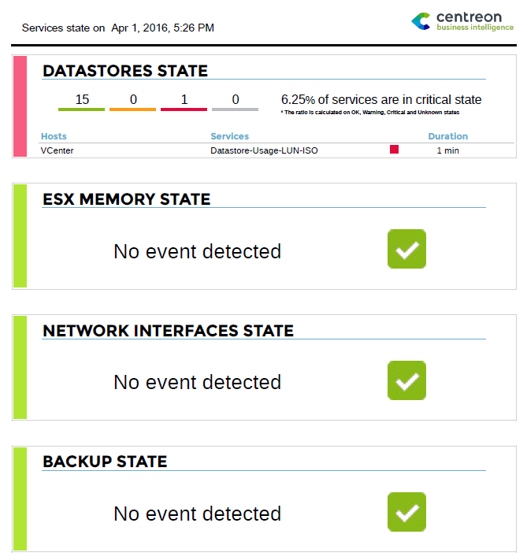

####  Parameters

Parameters needed by the report are :

| **P arameters**           | **Type**           | **Description**                                 |
| ------------------------- | ------------------ | ----------------------------------------------- |
|    title                  |    Text field      | Specify title for part 1 of report.             |
| Hostgroups                | Multi select       | Select host groups for part 1 of report.        |
| Host category             | Multi select       | Select host categories for part 2 of report.    |
| Service category          | Multi select       | Select service categories for part 1 of report. |
|    title                  |    Text field      | Specify title for part 2 of report.             |
| Hostgroups                | Multi select       | Select host groups for part 2 of report.        |
| Host category             | Multi select       | Select host categories for part 2 of report.    |
| Service category          | Multi select       | Select service categories for part 2 of report. |
|    title                  |    Text field      | Specify title for part 3 of report.             |
| Hostgroups                | Multi Select       | Select host groups for part 3 of report.        |
| Host category             | Multi select       | Select host categories for part 3 of report.    |
| Service category          | Multi select       | Select service categories for part 3 of report. |
|    title                  |    Text field      | Specify title for part 4 of report.             |
| Hostgroups                | Multi select       | Select host groups for part 4 of report.        |
| Host category             | Multi select       | Select host categories for part 4 of report.    |
| Service category          | Multi select       | Select service categories for part 4 of report. |
|    sort_by                |    Radio    button | Sort results by state, duration or hostname.    |
| display_ack               |    Radio    button | Display or filter acknowledged hosts.           |
| display_downtimes         |    Radio    button | Display or filter hosts in downtime.            |
| display_only_critical     |    Radio    bouton | Display only services in critical state.        |

## Performance

### Host-Graphs-V2 

#### Description

This report presents round-robin database (RRD) graphs for the evolution
and performance of Centreon services over a defined period.

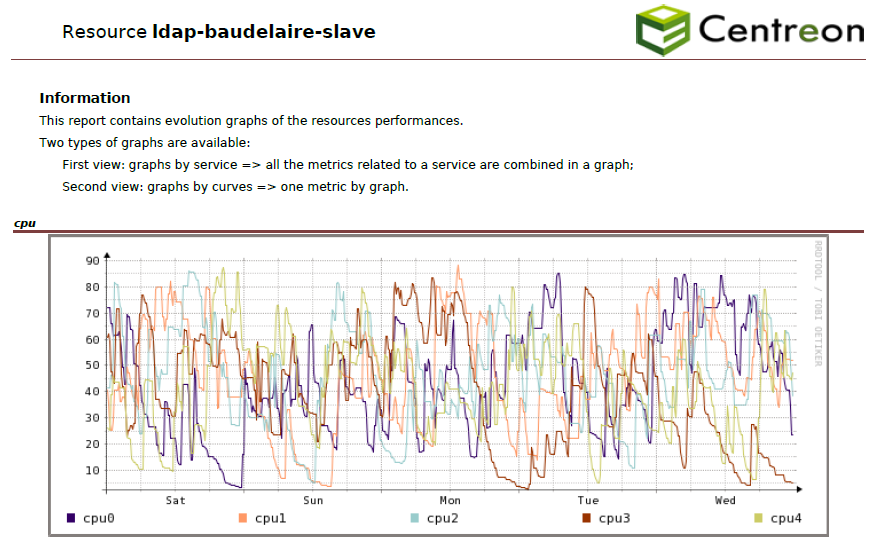

#### Parameters

Parameters required for the report:

 -   Reporting period
 -   The following Centreon objects:

|     Parameter       |   Parameter type   |   Description                                                                                              |
| ------------------- | ------------------ | ---------------------------------------------------------------------------------------------------------- |
|    Host             |    Selection       | Select host.                                                                                               |
| Service Categories  | Multi select       | Select service category.                                                                                   |
| Metrics             | Multi select       | Metrics to use. If no metric is selected, graphs by metric will not displayed.                             |
| Graphs display rule | Check box          | Sets whether you want to see all the metrics on one graph for each service, one graph per metric, or both. |

#### Prerequisites

Go to `Reporting > Business Intelligence > General Options > Scheduler Options` 
and configure the following field:

In order to export RRD graphs using the Centreon API, the reporting
server needs to access it using HTTP or HTTPS protocole. A curl command
sent to the URL of the API should generate an image file.

    curl https://$CENTREON-IP-OR-DNS$//include/views/graphs/generateGraphs/generateImage.php?akey=$AUTH_KEY$&username=$USER$&hostname=$HOSTNAME$&service=$SERVICENAME$&start=$TIMESTAMPSTART$&end=$TIMESTAMPEND$

Replace the \'\$xxxx\$\' by real values.

Example:

    http://centreon.enterprise.com//include/views/graphs/generateGraphs/generateImage.php?akey=af9c583c5f31bd2459c07&username=myUser&hostname=host-1&service=cpu&start=1490997600&end=1493157600 

### Hostgroup-Graphs-v2

####  Description

This report presents round-robin database (RRD) graphs for the evolution
and performance of Centreon services for a given host group over a
defined period.

#### Parameters

Parameters required for the report:

-   Reporting period
-   The following Centreon objects:

|     Parameter       | Parameter type     | Description                                                                                                |
| ------------------- | ------------------ | ---------------------------------------------------------------------------------------------------------- |
| Report title        | Text               | Select title on cover page and report header.                                                              |
| Host group          | Drop-down list     | Select host group.                                                                                         |
| Service Categories  | Multi select       | Select service category.                                                                                   |
| Hosts Categories    | Multi select       | Select host categories.                                                                                    |
| Metrics             | Multi select       | Select metrics. If no metric is selected, graphs by metric will not be displayed.                          |
| Graphs display rule | Check box          | Specify whether you want to see all the metrics on one graph for each service, a graph by metric, or both. |

#### Prerequisites

Go to `Reporting > Business Intelligence > General Options > Scheduler Options` 
and configure the following field:

In order to export RRD graphs using the Centreon API, the reporting
server needs to access it using HTTP or HTTPS protocole. A curl command
sent to the URL of the API should generate an image file.

    curl https://$CENTREON-IP-OR-DNS$//include/views/graphs/generateGraphs/generateImage.php?akey=$AUTH_KEY$&username=$USER$&hostname=$HOSTNAME$&service=$SERVICENAME$&start=$TIMESTAMPSTART$&end=$TIMESTAMPEND$

Replace the \'\$xxxx\$\' by real values.

Example:

    http://centreon.enterprise.com//include/views/graphs/generateGraphs/generateImage.php?akey=af9c583c5f31bd2459c07&username=myUser&hostname=host-1&service=cpu&start=1490997600&end=1493157600 

### Hostgroup-Capacity-Planning-Linear-Regression

#### Description

This report shows the evolution and performance forecasting metrics for
a host group.

**How to interpet the report**

The evolution of the metrics value is represented on a graph and in a
table. Forecasts are calculated from the reporting period metrics value
and projected into the future. An additional table provides information
about critical threshold and days before saturation.

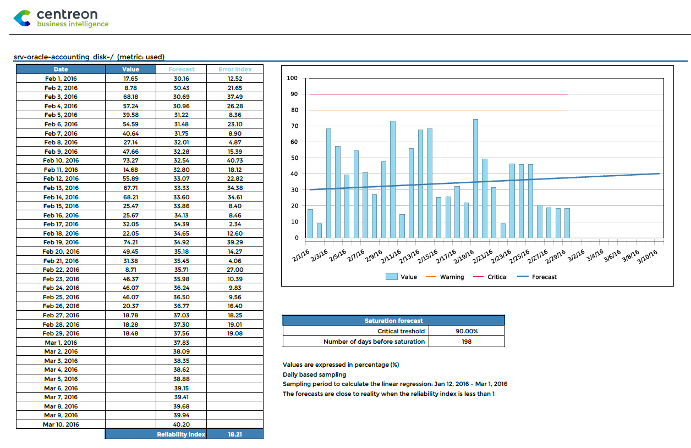

#### Parameters

Parameters required for the report:

-   Reporting period
-   The following Centreon objects:

| Parameter                                                     |   Parameter type   |  Description                                                                  |
| ------------------------------------------------------------- | ------------------ | ----------------------------------------------------------------------------- |
| Host groups                                                   | Multi select       | Select host groups for filter.                                                |
| Host Categories                                               | Multi select       | Select host categories for filter.                                            |
| Services Categories                                           | Multi select       | Select service categories for filter.                                         |
| Time period                                                   | Dropdown list      | Specify time period.                                                          |
| Metrics                                                       | Multi select       | Select metric to **include** in report.                                       |
| Historical period in days in addition to the reporting period | Number             | Specify days used to calcutate the linear regression before reporting period. |
| Forecast period in days                                       | Number             | Specify forecast days calculated by linear regression.                        |

#### Prerequisites:

Metrics must return a maximum value on their performances data. Using
warning and critical thresholds on performances data is highly
recommended.

Performance data returned by a plugin must be formatted as follows,
preceded by a pipe (\|):

    output-plugin | metric1=valeur(unité);seuil_warning;seuil_critique;minimum;maximum metric2=valeur . . . 

### Hostgroups-Rationalization-Of-Resources-1 

#### Description

This report provides an overview of resource usage by host groups and
displays hosts and host groups that are overloaded or underused.

On the first page, this information is displayed for all host groups.

Then, for each host group a separate page is generated showing load
distribution.

#### Summary page

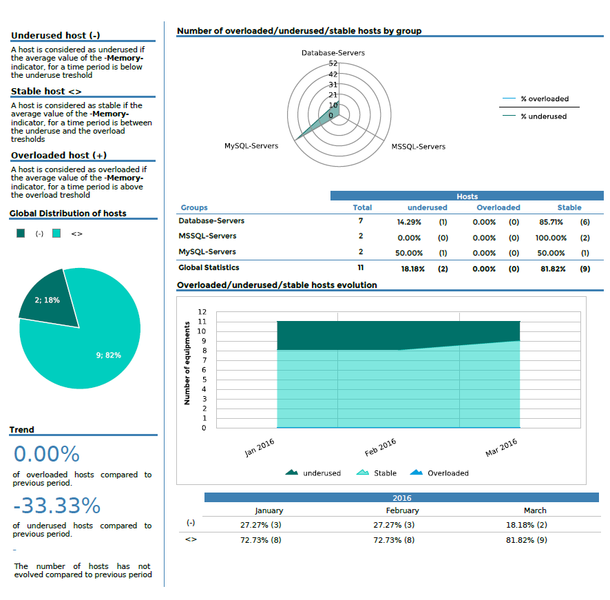

#### For each host group

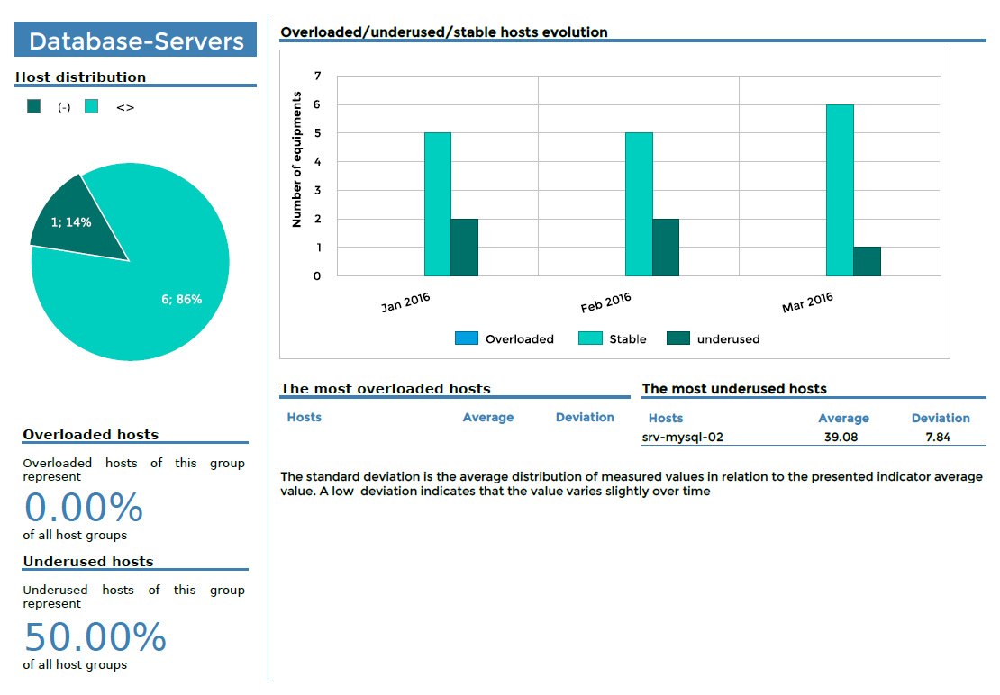

#### Parameters

Parameters required for the report:

-   Reporting period
-   The following Centreon objects:

  
|     Parameter       | Parameter type     | Description                                                                                                |
| ------------------- | ------------------ | ---------------------------------------------------------------------------------------------------------- |
| Host groups         | Multi select       | Select host group.                                                                                           |
| Service Categories  | Multi select       | Select service category.                                                                                   |
| Hosts Categories    | Multi select       | Select host categories.                                                                                    |
| Metrics             | Multi select       | Select metrics. If no metric is selected, graphs by metric will not be displayed.                          |
| Time period         | Dropdown list      | Specify whether you want to see all the metrics on one graph for each service, a graph by metric, or both. |
| Intervalle          | Text field         | Specify no. of months to show in trend graphs.
| overloaded          | number             | Specify threshold determining resource is overloaded. *Unit : see prerequisites*.
| underused           | number             | Specify threshold determining resource is underused. *Unit : see prerequisites*.

#### Prerequisites 

This report can be generated using indicators that return a maximum value or not.

-   If the metric has a maximum value, the threshold must be filled
        with a **percent** value (between 0 et 100).
-   If the metric does not have a maximum value (e.g., counter for
        visitors on a website), the thresholds must be expressed in the
        same unit as the indicator (the counter for visitors).

### Hostgroup-Service-Metric-Performance-List

#### Description

This report displays the average performance data for a list of
services. It also shows the mininimum and maximum values reached over
the time period, the maximum potential value, and warning and critical
thresholds for all service metrics selected.

-   If the maximum value is returned by the plugin, the Average, Max and
    Min columns are displayed in percentage (%). The calculation is:
    value / maximum value.
-   If the maximum value not returned by the plugin, the Average, Max
    and Min columns are displayed in the metric\'s units.

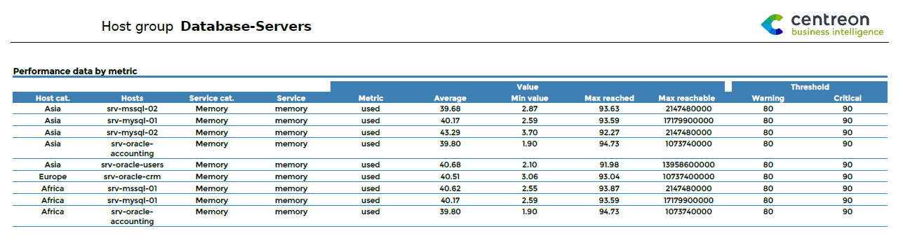

#### Parameters

Parameters required for the report:

-   Reporting period
-   The following Centreon objects:

  Parameter         | Parameter type  | Description
  ------------------|-----------------|-----------------------------------
  Hostgroup         | Drop-down list  | Select host group.
  Host Categories   | Multi selection | Select host categories.
  Service Categories| Multi selection | Select service categories.
  Metrics           |  Mutli select   | Specify metric to INCLUDE.
  Time period       |  Dropdown list  | Specify time period.

### Hostgroups-Categories-Performance-List

#### Description

This report displays the average performance data for a list of host
groups, host categories and service categories. It also shows the
mininimum and maximum value reached over the time period.

-   If the maximum value is returned by the plugin, the Average, Max and
    Min columns are displayed in percentage (%). The calculation is:
    value / maximum value.
-   If the maximum value not returned by the plugin, the Average, Max
    and Min columns are displayed in the metric\'s units.

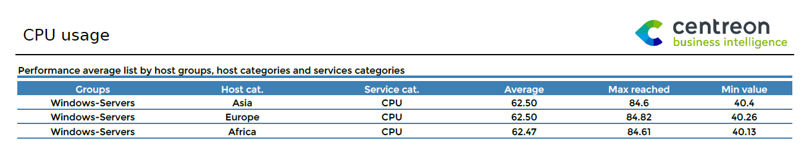

#### Parameters

Parameters required for the report:

-   Reporting period
-   The following Centreon objects:

  Parameter         | Parameter type  | Description
  ------------------|-----------------|-----------------------------------
  Hostgroups        | Multi selection| Select host groups.
  Host Categories   | Multi selection | Select host categories.
  Service Categories| Multi selection | Select service categories.
  Metrics           |  Mutli select   | Specify metric to INCLUDE.
  Time period       |  Dropdown list  | Specify time period.

## Storage 

### Hostgroups-Storage-Capacity-1

#### Description

This report displays statistics on allocated and used storage space for
multiple host groups.

#### How to interpret the report

On the first page, statistics are summarized by host group.

On the second page, statistics are displayed by host category and
service category.

On the following pages, overall statistics are detailed for each host
group, displayed by host categories and service categories.

#### First page

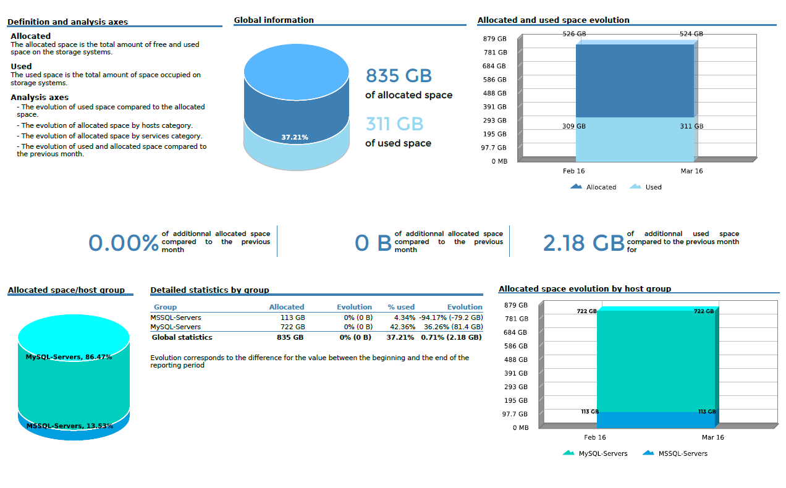

#### Second page

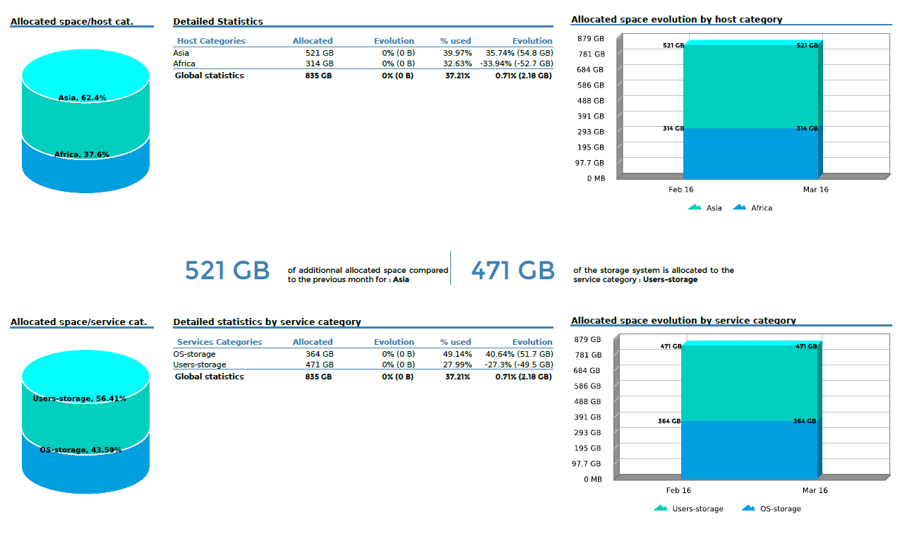

#### For each host group

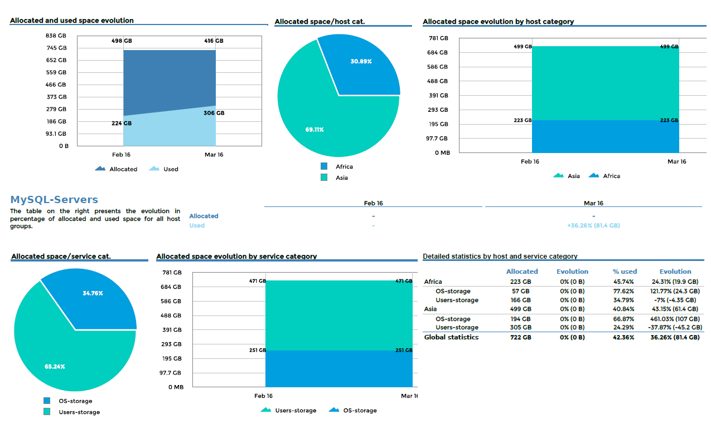

> Statistics displayed in evolution tables and graphs by month correspond
> to values of indicators measured on the last day of the month.
> \"Snapshot\" statistics (versus evolution statistics by month)
> correspond to values of indicators measured the last day of the
> reporting period. Evolution calculations are based on a comparison of
> the values of indicators the last day of the reporting period with the
> values of indicators the day before the first day of the reporting
> period.

##### Parameters

Parameters required for the report:

-   Reporting period
-   The following Centreon objects:

  Parameter         | Parameter type  | Description
  ------------------|-----------------|-----------------------------------
  Hostgroups        | Multi selection| Select host groups.
  Host Categories   | Multi selection | Select host categories.
  Service Categories| Multi selection | Select service categories.
  Metrics           |  Mutli select   | Specify metric to INCLUDE.
  Time period       |  Dropdown list  | Specify time period.
  Evolution interval| Text field      | Specify number of historical months for the evolution graphics.

##### Prerequisites

For consistency in graphs and statistics, certain prerequisites apply to
performance data returned by the storage plugins. This data must be
formatted as follows, preceded by a pipe (\|):

    output-plugin | metric1=valueunit;warning_treshold;critical_treshold;minimum;maximum metric2=value...

Make sure that the plugins return the maximum value, which is required
in order to calculate statistics. The unit must be expressed in bytes.

> **Warning**
>
> - The ETL configuration must include service categories for storage,
>  otherwise the evolution graphics remain empty.
> - This report is compatible with the 24x7 time period only. This time
> period must be configured on the menu \"General options \| Capacity
> statistic aggregated by month \| Live services for capacity statistics
> calculation\".

### Hostgroup-Storage-Capacity-2

#### Description

This report provides detailed storage statistics and the evolution of
the storage space of your IT infrastructure.

#### How to interpret the report

The first page displays overall information about allocated and used
space for host groups. A graph traces the past evolution of these two
parameters. Two tables list the most critical information for hosts in
terms of storage space.

On the second and third pages, statistics for allocated and used space
are organized by service category and host category.

The fourth page shows storage space per host group, with the allocated
and used space for each partition, the evolution over the last month,
and estimated time before saturation.

#### First page

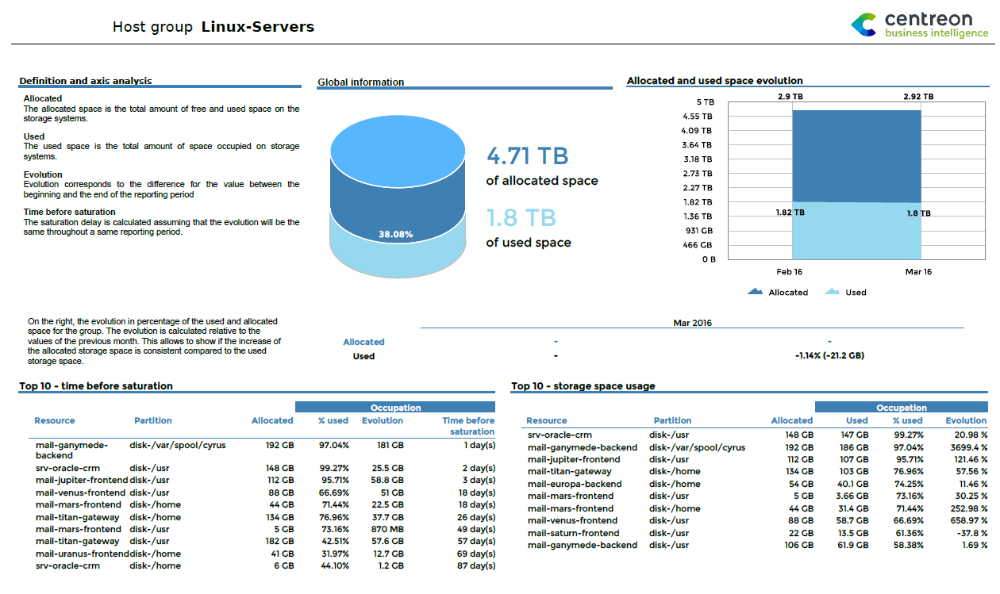

##### Second & third pages

##### By service categories

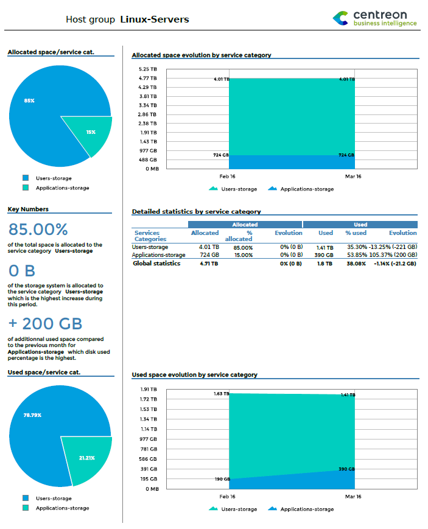

##### By host categories

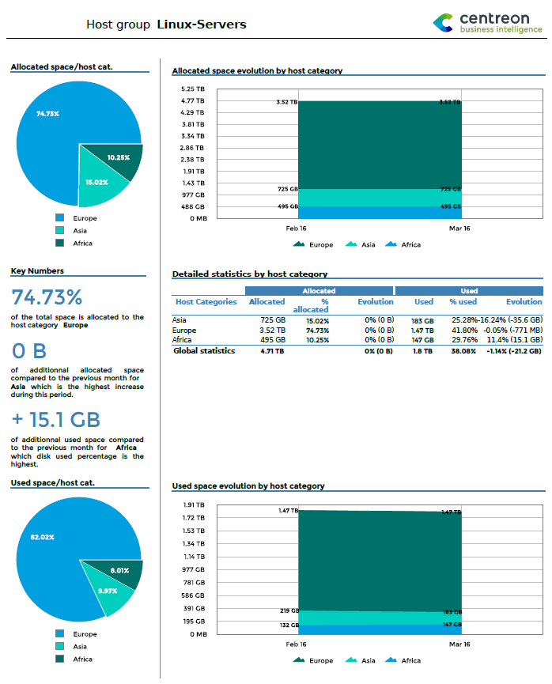

#### Fourth page

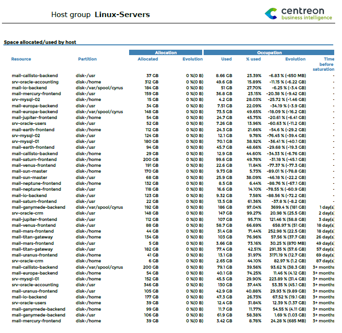

> Statistics displayed in evolution tables and graphs by month correspond
> to values of indicators measured on the last day of the month.
> \"Snapshot\" statistics (versus evolution statistics by month)
> correspond to values of indicators measured the last day of the
> reporting period. Evolution calculations are based on comparing the
> values of indicators the last day of the reporting period with the
> values of indicators the day before the first day of the reporting
> period.

#### Parameters

Parameters required for this report:

-   The reporting period
-   The following Centreon objects:

  Parameter         | Parameter type  | Description
  ------------------|-----------------|-----------------------------------
  Hostgroup         | Dropdown list   | Select host groups.
  Host Categories   | Multi selection | Select host categories.
  Service Categories| Multi selection | Select service categories.
  Metrics           |  Mutli select   | Specify metric to INCLUDE.
  Time period       |  Dropdown list  | Specify time period.
  Evolution interval| Text field      | Specify number of historical months for the evolution graphics.

#### Prerequisites

For consistency in graphs and statistics, certain prerequisites apply to
performance data returned by the storage plugins. This data must be
formatted as follows, preceded by a pipe (\|):

    output-plugin | metric1=valueunit;warning_treshold;critical_treshold;minimum;maximum metric2=value...

Make sure that the plugins return the maximum value, which is required
in order to calculate statistics. The unit must be expressed in bytes.

> **Warning**
>
> - The ETL configuration must include service categories for storage,
>  otherwise the evolution graphics remain empty.
> - This report is compatible with the 24x7 time period only. This time
> period must be configured on the menu \"General options \| Capacity
> statistic aggregated by month \| Live services for capacity statistics
> calculation\".

### Hostgroup-Storage-Capacity-List

#### Description

This report displays storage space usage on hosts within a host group.

**How to interpret the report**

The report presents a table with all available partitions for
hostgroup\'s ressources. Detailed information is provided on the
allocated and used space, the evolution since the last month, and
estimate time before saturation.

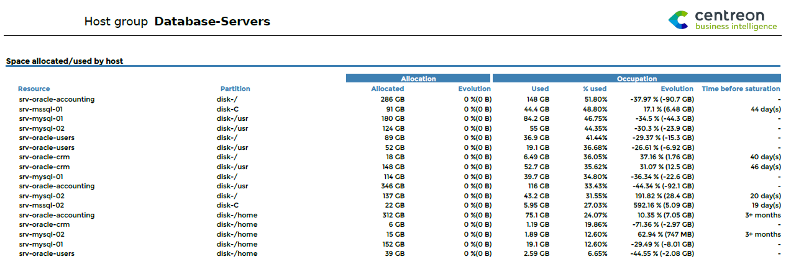

> Statistics displayed in evolution tables and graphs by month correspond
> to values of indicators measured on the last day of the month.
> \"Snapshot\" statistics (versus evolution statistics by month)
> correspond to values of indicators measured the last day of the
> reporting period. Evolution calculations are based on comparing the
> values of indicators the last day of the reporting period with the
> values of indicators the day before the first day of the reporting
> period.

#### Parameters

Parameters required for the report:

-   Reporting period
-   The following Centreon objects:

  Parameter         | Parameter type  | Description
  ------------------|-----------------|-----------------------------------
  Hostgroup         | Dropdown list   | Select host groups.
  Host Categories   | Multi selection | Select host categories.
  Service Categories| Multi selection | Select service categories.
  Metrics           |  Mutli select   | Specify metric to INCLUDE.
  Time period       |  Dropdown list  | Specify time period.

#### Prerequisites

For consistency in graphs and statistics, certain prerequisites apply to
performance data returned by the storage plugins. This data must be
formatted as follows, preceded by a pipe (\|):

    output-plugin | metric1=valueunit;warning_treshold;critical_treshold;minimum;maximum metric2=value...

Make sure that the plugins return the maximum value, which is required
in order to calculate statistics. The unit must be expressed in bytes.

## Network

### Hostgroup-Traffic-By-Interface-And-Bandwith-Ranges

#### Description

This report shows the average inbound and outbound bandwith usage of
network interfaces for a given host group.

#### How to interpret the report**

#### First page

The first page displays the bandwidth usage ranges in percentage by
interval.

Intervals are:

-   Null usage
-   Low usage
-   Average usage
-   High usage
-   Very high usage.

These intervals are configurable.

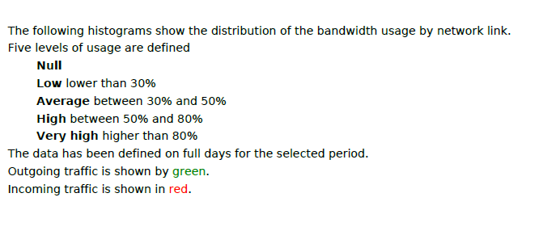

#### Following pages

The following pages are automatically generated for all interfaces of
the selected host group (one page per interface). Each page dispays the
bandwidth usage by interval with distribution by:

-   Hour of the day
-   Day of the week
-   Day of the month.

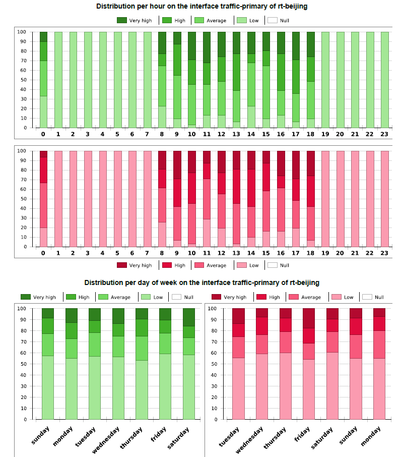

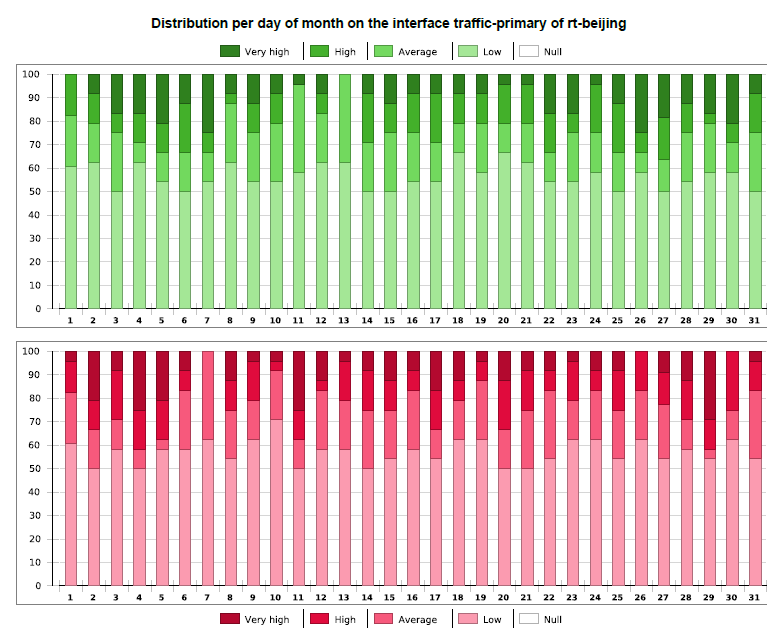

#### Parameters :

Parameters required for the report:

-   Reporting period
-   The following Centreon objects:

  Parameter                     | Parameter type  | Description
  ------------------------------|-----------------|-----------------------------------
  Host Group                    | Dropdown list   | Select host group.
  Host Categories               | Multi select    | Select host categories.
  Service Categories            | Multi select    | Select service categories.
  Low-level treshold (%)        | Number          | Specify low threshold of bandwidth usage (between 0 and 100).
  Average-level threshold (%)   | Number          | Average threshold of bandwidh usage (between 0 and 100)
  High-level threshold (%)      | Number          | Specify high threshold of bandwidth usage (between 0 and 100)
  Inbound traffic metric        | Dropdown list   | Specify metric of inbound traffic.                                           
  Outbound traffic metric       | Dropdown list   | Specify metric of outbound traffic.
                                           

#### Prerequisites :

For consistency in graphs and statistics, certain prerequisites apply to
performance data returned by the storage plugins. This data must be
formatted as follows, preceded by a pipe (\|):

    output-plugin | traffic_in=valueunit;warning_treshold;critical_treshold;minimum;maximum traffic_out=value

Make sure the plugins return the maximum value, which is required in
order to calculate statistics. The storage plugins must return one
metric for **traffic in** and one for **traffic out**. Units must be in
**Bits**/**sec**.

### Hostgroup-Traffic-average-By-Interface

#### Description

This report shows the average inbound and outbound bandwith usage of
network interfaces for a given host group.

#### How to interpret the report

#### First page

On the first page, we can see the distribution of bandwidth usage in
percent per interval.

Intervals are:

-   Null usage
-   Low usage
-   Average usage
-   High usage
-   Very high usage.

These intervals are configurable.

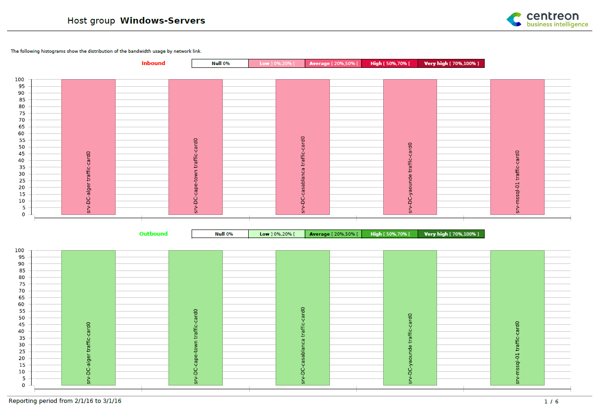

#### Following pages

The following pages are automatically generated for all interfaces of
the selected host group (one page per interface). Each page dispays the
bandwidth distribution by:

**Hour of the day** displaying:

-   The average usage by hour of the day of incoming and outgoing
     traffic for the selected reporting period.
-   The maximum reached of incoming and outgoing traffic per hour of
     the day for the reporting period.

**Day of the week** displaying

-   The average usage by day of the week of incoming and outgoing
    traffic for the selected reporting period.
-   The maximum reached of incoming and outgoing traffic per day of
    the week for the reporting period.

**Day of the month** displaying

-   The average usage by day of the month of incoming and outgoing
    traffic for the selected reporting period.
-   The maximum reached of incoming and outgoing traffic per day of
    the month for the reporting period.

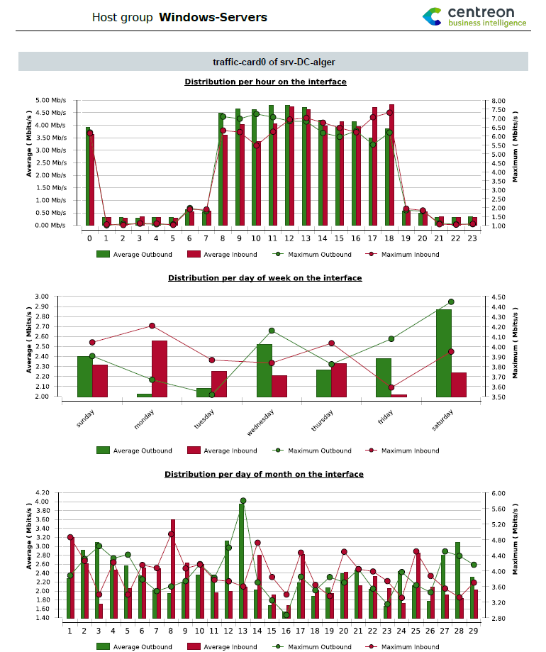

#### Parameters

Parameters required for the report:

-   Reporting period
-   The following Centreon objects:

|   Parameter                |   Parameter type   |   Description                                                  |
| -------------------------- | ------------------ | -------------------------------------------------------------- |
| Hostgroup                  | Dropdown list      | Select host group.                                             |
| Host Categories            | Multi select       | Select host categories.                                        |
| Service Categories         | Multi select       | Select service categories.                                     |
| Low level treshold (%)     | Number             | Specify low threshold of bandwidth usage (between 0 and 100)   |
| Average level treshold (%) | Number             | Average threshold of brandwidh usage (between 0 and 100).      |
| High level treshold (%)    | Number             | Specify high threshold of bandwidth usage (between 0 and 100). |
| Inbound traffic metric     | Dropdown list      | Specify metric of inbound traffic.                             |
| Outbound traffic metric    | Dropdown list      | Specify metric of outbound traffic.                            |

> It is important to make sure that plugins return the maximum value
> because lot of statistics are based on percentage, calculated using
> this maximum value. Be sure that the trafic plugins return thione
> metric for traffic in and one for traffic out. The unit must be
> **Bits**/**sec**.

#### Prerequisites

For consistency in graphs and statistics, certain prerequisites apply to
performance data returned by the storage plugins. This data must be
formatted as follows, preceded by a pipe (\|):

    output-plugin | traffic_in=valueunit;warning_treshold;critical_treshold;minimum;maximum traffic_out=value

Make sure the plugins return the maximum value, which is required in
order to calculate statistics. The storage plugins must return one
metric for **traffic in** and one for **traffic out**. Units must be in
**Bits**/**sec**.

### Hostgroup-monthly-network-percentile

#### Description

This report provides statistics on inbound and outbound traffic by
interface in terms of average and percentile values. This report applies
only to one month.

**How to interpret the report**

The first page displays three types of information:

-   Two graphs representing the 10 interfaces having the maximum centile
    for inbound and outbound traffic
-   10 interface having the maximum average inbound traffic in
    percentage
-   10 interface having the maximum average outbound traffic in
    percentage.

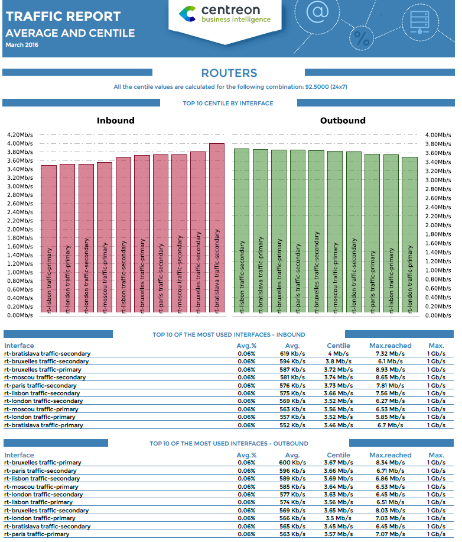

On the following page(s), all interfaces are listed, sorted by host and
service name, each with corresponding inbound and outbound traffic
statistics.

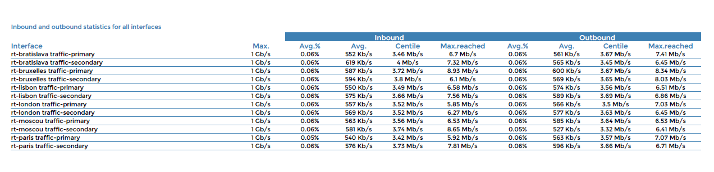

#### Parameters:

Parameters required for the reports:

-   A start date corresponding to the month for generating the report
    (corresponding to the start date on the Centreon MBI interface).
-   The following Centreon objects:

  Parameters                     |Parameter type |  Description
  -------------------------------|---------------|---------------------------------
  Host group                     | Dropdown list | Select host group.
  Host Categories                | Multi select  | Select host categories.
  Traffic service categories     | Dropdown list | Select service category.
  Time period for average usage  | Dropdown list | Specify low threshold of bandwidth usage.
  Centile/Time period            | Dropdown list | Specify combination for centile statistics.
  Inbound traffic metric         | Dropdown list | Specify metric name of inbound traffic.
  Outbound traffic metric        | Dropdown list | Specify metric name of outbound traffic.
                                  

#### Prerequisites

-   Percentile should be correctly configured in the General Options \>
    ETL tab menu.

-   For consistency in graphs and statistics, certain prerequisites
    apply to performance data returned by the storage plugins. This data
    must be formatted as follows, preceded by a pipe (\|):

        output-plugin | traffic_in=valueunit;warning_treshold;critical_treshold;minimum;maximum traffic_out=value

Make sure the plugins return the maximum value, which is required in
order to calculate statistics. The storage plugins must return one
metric for **traffic in** and one for **traffic out**. Units must be in
**Bits**/**sec**.

## Virtualization

### VMWare-Cluster-Performances-1

#### Description

This report displays CPU and memory performance for an ESX cluster
including the use of hosted virtual machines and datastores.

**How to interpret the report**

For a given ESX cluster and a specific reporting period as input, the
report displays the following information:

On the first page, the report shows the total number of datastores
available on the cluster. Included are average usage of space, expressed
in percentage and bytes, the last usage value for the selected period
and allocated space for all datastores. The evoution of these three
values is shown in comparison to the previous period.

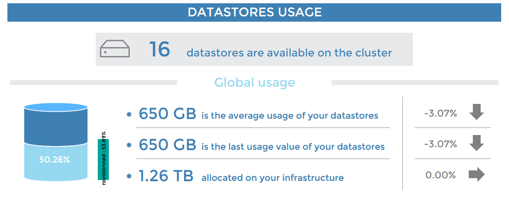

Next, the top five and a bottom five datastores used are presented. For
each datastore, you can see the percentage of usage, the maximum value
reached and allocated space.

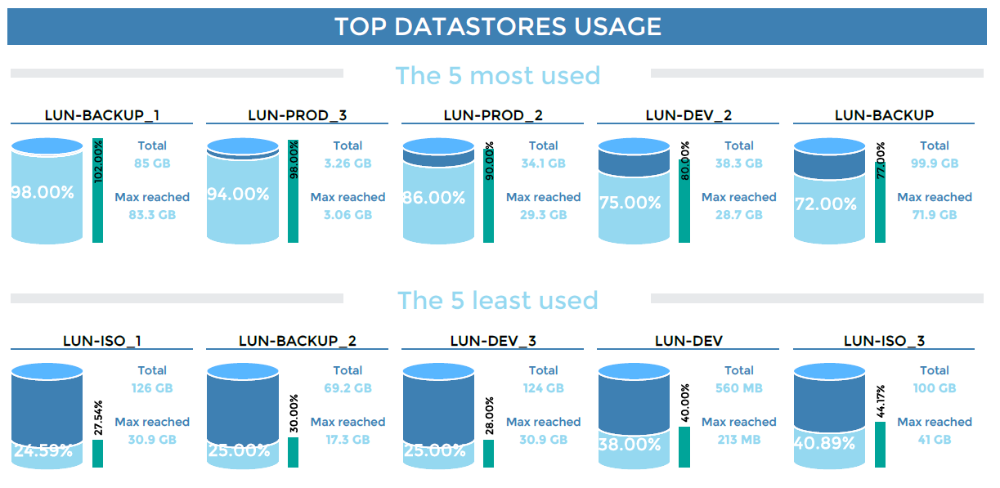

The report then displays the top five and bottom five datastores
generating read and write IOPS (input/output per second).

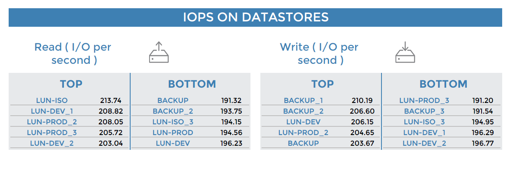

The second page shows average CPU consumption for all ESX clusters and
the evolution from the previous period.

ESXs using the most and the least CPU are highlighted, with the average
consumption and the maximum value reached for each ESX.

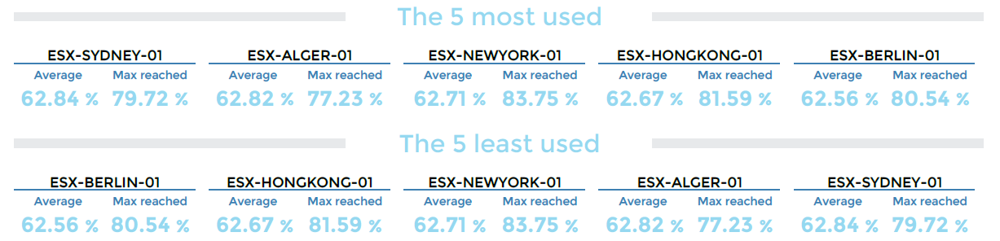

The report shows the average memory usage on all ESX clusters and the
total memory allocated.

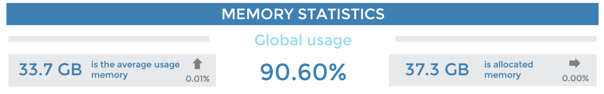

The top and bottom five memory-consuming ESXs are highlighted along with
average usage over time, the total memory available and the maximum
value reached for each ESX.

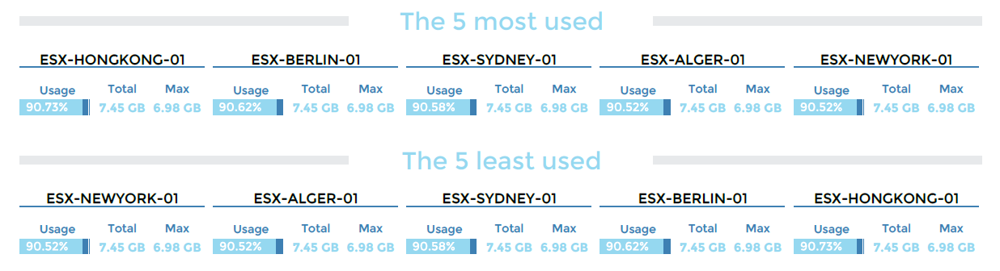

Finally, an overview of the average number of virtual machines on the
cluster that have been powered on and powered off.

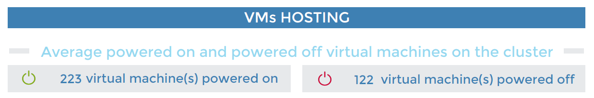

The report provides details on the ESXs hosting the greatest and fewest
number of virtual machines powered on and powered off:

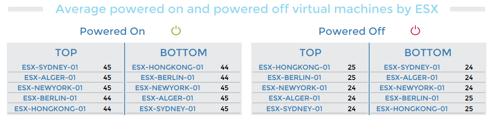

#### Parameters

Parameters required for the report:

> -   The reporting period
> -   The following Centreon objects:

  Parameter                 |    Type         | Description
  --------------------------|-----------------|----------------------------------------
  Time period               | Dropdown list   | Select time period.
  Host group                | Dropdown list   | Select cluster.
  Host category             | Multi selection | Select host categories for filtering on cluster.
  Datastore Service category| Multi selection | Select service categories with datastore usage.
  IOPs Service category     | Multi selection | Select service categories with datastore IOPS.
  CPU Service category      | Multi selection | Select service categories with the ESX CPU usage.
  Memory Service category   | Multi selection | Select service categories with the ESX Memory usage.
  VM Count Service category | Multi selection | Select service categories with the VM count services on ESXs.
  Datastore usage (filter)  | Text field      | Type common part for filter and replacement (% to keep all).
  Datastore iops (filter)   | Text field      | Type common part for filter and replacement (% to keep all).
                         

#### Prerequisites

This report is developed for full compatibility with the plugin pack
Virt-VMware2-ESX and the Centreon-VMWare-2.0 connector. The following
prerequisites for the proper generation of the report shall apply.

Implement monitoring of the following indicators:

-   CPU service, a memory service and a VM Count service for each ESX.
-   Datastore-usage service for each datastore, or for all datastores,
    linked to the VCenter or to only one ESX of the cluster. By
    default, the service will have the following nomenclature:
    Datastore-Usage-xxxx (xxxx is the datastore name).
-   Datastore-IOPS service for each datastore or for all datastores,
    linked to the VCenter or to only on ESX of the cluster. By
    default, the service will have the following nomenclature:
    Datastore-Iops-xxxx (xxxx is the datastore name).

Create host groups that correspond to the clusters. A cluster (host
group) contains:

-   Several ESXs (hosts).
-   The VCenter, only if Datastore-usage and Datastore-IOPS services
    are linked to the VCenter and not to one cluster\'s ESX.

Create at least one host category containing the whole cluster (vCenter
+ ESXs). If there are multiple ESX clusters, you can split them into
several host categories to filter the report on a single cluster.

Create the following service categories:

-   CPU-ESX: combines all CPU indicators on ESXs.
-   Memory-ESX: combines all memory indicators on ESXs.
-   VMcount-ESX: combines all VM Count indicators on ESXs.
-   Datastore-usage: combines all datastore usage indicators.
-   Datastore-IOPS: combines all datastore IOPS indicators.

> If a datastore or an ESX host name contains more than 16 characters,
> only the first 16 will be shown, supplemented by 3 dots.

### VMWare-VM-Performances-List

#### Description

This report displays statistics on usage of the vCPU, memory and IOPS on
virtual machines.

It has been optimized for generating XLSX files to create the desired
filters and perform sorting.

**How to interpret the report**

The first tab shows information on the reporting period, the
live-service period selected and the report generation day and time.

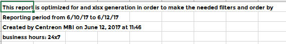

The second tab lists the virtual machines with vCPU usage (average,
average formatted, max, max formatted) and memory usage (average,
average formatted, max, max formatted, % of usage, % of usage
formatted).

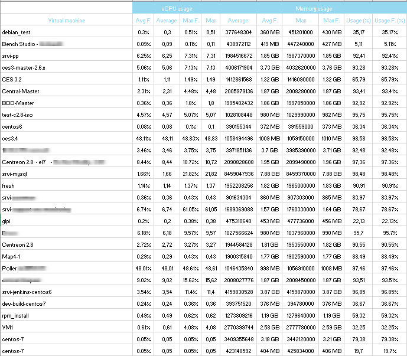

The last tab lists the virtual machines by datastore and their
read/write IOPS usage showing the average and the maximum reached.

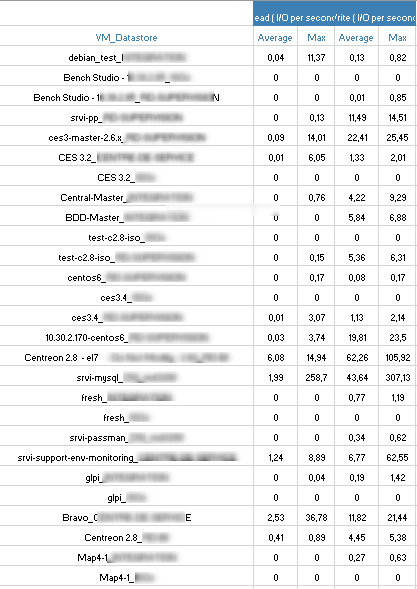

#### Parameters

Parameters required for the report:

-   The reporting period
-   The following Centreon objects:

  Parameters        | Type            | Description
  ------------------|-----------------|----------------------------------
  Time period       | Dropdown list   | Specify the reporting live service.
  Host to report    | Dropdown list   | Select the VCenter for report.                           
  Host category     | Multi selection | Select host category for filter.
  Service category  | Multi selection | Select service category containing the global VM statistics.
                      

#### Prerequisites

This report is developped for full compatibility with the
Virt-VMware2-ESX plugin pack and Centreon-VMWare-2.0 connector. Certain
prerequisites apply to ensure proper report creation:

Monitoring of the following indicators:

-   Vm-Cpu-Global service
-   Vm-Memory-Global service
-   Vm-Datastore-Iops-Global service.

Creation of the following service category:

-   VM-Statistics with these indicators: Vm-Cpu-Global,
    Vm-Memory-Global and Vm-Datastore-Iops-Global.

## Electric consumption

### Hostgroup-Electricity-Consumption-1

#### Description

This report displays statistics on the energy consumption of the hosts
connected to an uninterrupted power supply (UPS).

**How to interpret the report**

For a given host group, reporting period and price per kilowatt-hour,
the first table displays the cost, consumption, average power and
maximum power reached for month N. A reminder of these values for the
previous month is provided along with the evolution over time.

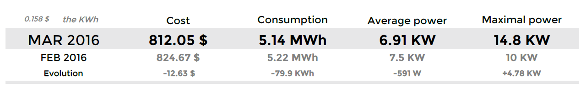

The two next graphs display the average power used per day of the month
and per hour of the day. A comparison with the previous month also
appears.

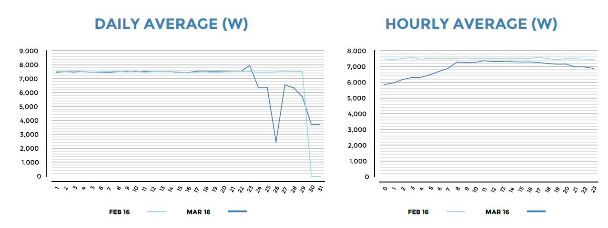

Then, the top five most energy-consuming UPSs are displayed, along with
consumption distribution by UPS, average consumption and cost by UPS.

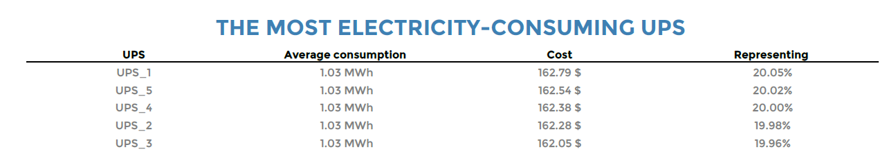

>If the host group contains more that five UPSs, only the four most
> energy-consuming ones will be displayed. A fifth category will include
> the remaining UPSs.

Finally, a graph is shown of the monthly cost year over year (YOY).

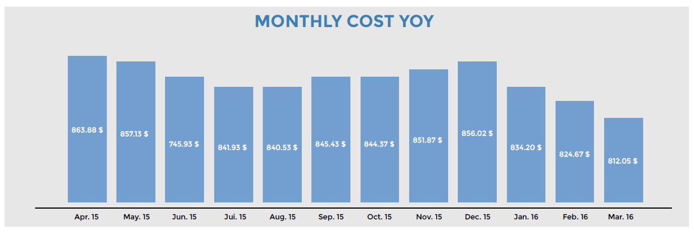

#### Parameters

Parameters required for the report:

-   The reporting period
-   The following Centreon objects:

| Parameters                | type          | Description                                                |
| ------------------------- | ------------- | ---------------------------------------------------------- |
| Time period               | Dropdown list | Select time period.                                        |
| Host group                | Dropdown list | Select the host group.                                     |
| Host category             | Multi select  | Select host categories.                                    |
| Service category          | Multi select  | Select service categories containing the power indicators. |
| Select metrics to include | Multi select  | Select the metric name of the output power.                |
| Price KWh                 | Text          | Enter price of the kilowatt-hour.                          |

#### Prerequisites

The prerequisites for the report are:

-   Monitoring of the output power of the UPSs.
-   Creation of a service category containing all the power-output
    indicators.
-   Sufficient historical data for the evolution graphs.

> UPS consumption corresponds to the consumption by all hosts connected to
> the UPS.

## Profiling

### Host-Detail-2 

#### Description

This report provides detailed statistics on availability, alarms,
storage usage, memory and CPU for a given host.

**How to interpret the report**

The first page displays detailed statistics on a host\'s availability.
The second page shows statistics on the host\'s performance (CPU and
Memory). On the third page, statistics describe storage capacity by
partition.

The final page is an appendix displaying the alarms that occurred on the
host.

#### First page

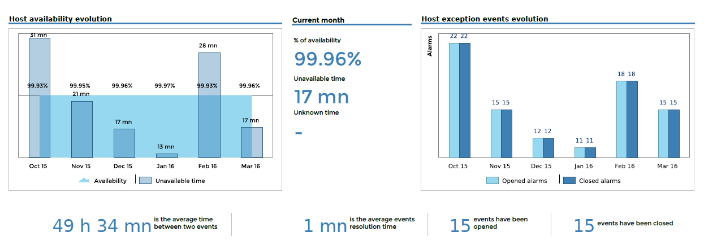

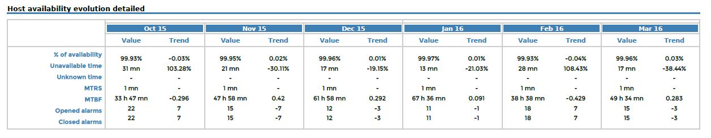

#### Second page

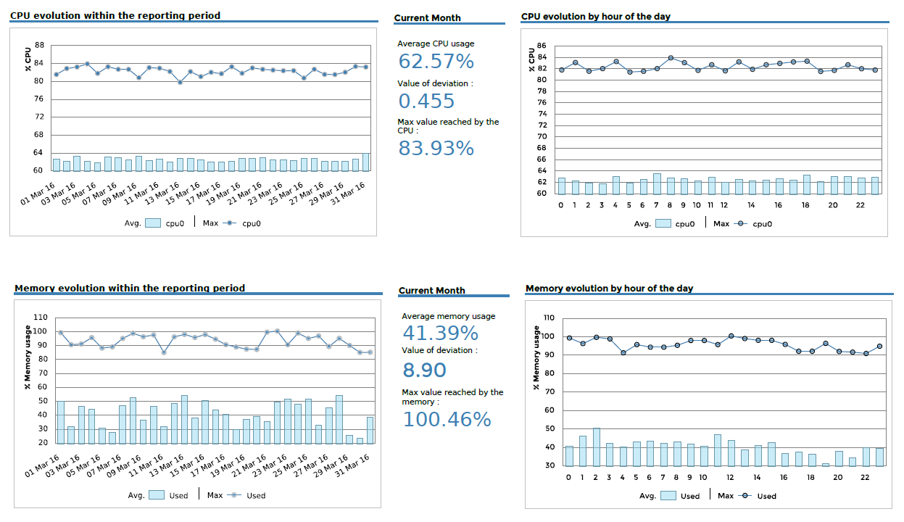

#### Third page

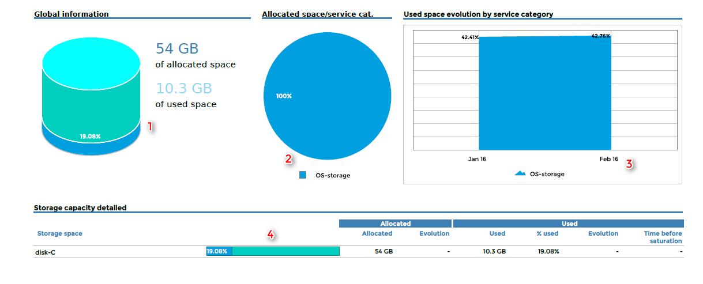

1 - Storage statistics on the last day of the reporting period

2 - Storage statistics on the last day of the reporting period

3 - Storage statistics on the last day of each month

4 - Storage statistics on the last day of the reporting period versus
the last day of the previous period.

#### Appendix

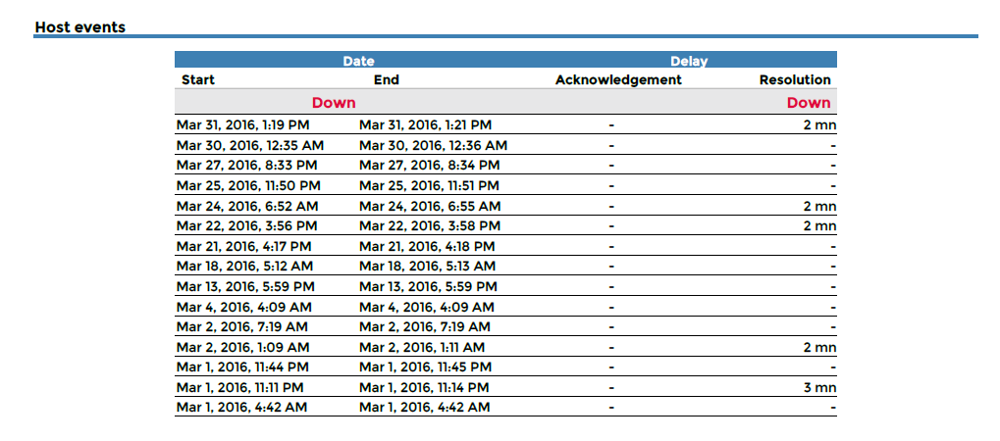

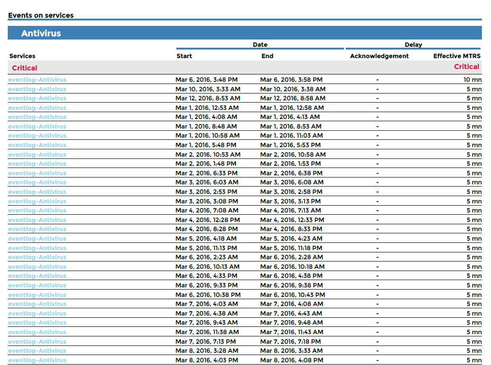

#### Parameters

Parameters required for the report:

 -   The reporting period
 -   The following Centreon objects:

|      Parameter           | **Parameter type**  | **Description**                                                      |
| ------------------------ | ------------------- | -------------------------------------------------------------------- |
| Time period              | Dropdown list       | Select time period.                                                  |
| Interval                 | Text field          | Specify number of months to display in evolution graphs.             |
| Host                     | Dropdown list       | Select host.                                                         |
| CPU service category     | Dropdown list       | Select service category containing CPU service(s).                   |
| CPU metric(s)            | Multi Select        | Select metric(s) for CPU statistics.                                 |
| Storage service category | Multi Select        | Select storage service categories containing the storage service(s). |
| Storage Metric(s)        | Multi Select        | Specify metric to exclude from the storage statistics.               |
| Memory service category  | Dropdown list       | Select service category containing memory service(s).                |
| Memory metric(s)         | Multi select        | Specify metric(s) to use for memory statistics.                      |

#### Prerequisites

For consistency in graphs and statistics, certain prerequisites apply to
performance data returned by the plugins. This data must be formatted as
follows, preceded by a pipe (\|):

    output-plugin | metric1=valueunit;warning_treshold;critical_treshold;minimum;maximum metric2=value...

Make sure that the storage and memory plugins return a maximum value,
which is required in order to calculate statistics. The unit must be
expressed in bytes for storage and memory plugins.

> **Warning**
>
> This report is compatible with the 24x7 time period only. This time
> period must be configured on the menu \"General options \| Capacity
> statistic aggregated by month \| Live services for capacity statistics
> calculation\".

### Host-Detail-3 

#### Description

This report provides detailed statistics on availability, alarms,
storage usage, memory, CPU and traffic for a given host.

**How to interpret the report**

The first page displays detailed statistics on a host\'s availability.

The second page shows statistics on the host\'s performance (CPU and
memory).

The third page shows statistics on storage capacity by partition.

The fourth page displays performance statistics for inbound and outbound
traffic.

Finally, an appendix lists all the alarms occurring on the host.

#### First page

#### Second page

#### Third page

1 - Storage statistics on the last day of the reporting period

2 - Storage statistics on the last day of the reporting period

3 - Storage statistics on the last day of each month

4 - Storage statistics on the last day of the reporting period versus
the last day of the previous period.

#### Fourth page

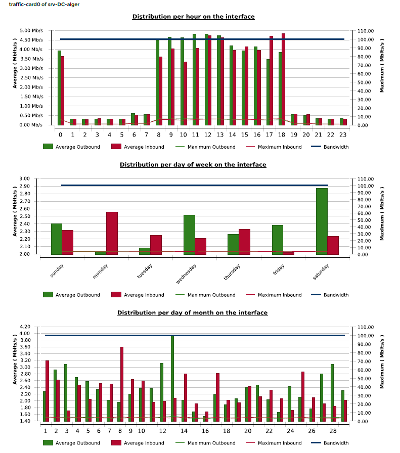

#### Appendix

#### Parameters

Parameters needed by report are:

> -   The reporting period
> -   The following Centreon objects:

|      Parameter           | **Parameter type**  | **Description**                                                      |
| ------------------------ | ------------------- | -------------------------------------------------------------------- |
| Time period              | Dropdown list       | Select time period.                                                  |
| Interval                 | Text field          | Specify number of months to display in evolution graphs.             |
| Host                     | Dropdown list       | Select host.                                                         |
| CPU service category     | Dropdown list       | Select service category containing CPU service(s).                   |
| CPU metric(s)            | Multi Select        | Select metric(s) for CPU statistics.                                 |
| Storage service category | Multi Select        | Select storage service categories containing the storage service(s). |
| Storage Metric(s)        | Multi Select        | Specify metric to exclude from the storage statistics.               |
| Memory service category  | Dropdown list       | Select service category containing memory service(s).                |
| Memory metric(s)         | Multi select        | Specify metric(s) to use for memory statistics.                      |
| Traffic service category | Multi sélection     | Select service category containing traffic service(s).               |
| Traffic In metric        | Dropdown list       | Select inbound traffic metric.                                       |
| Traffic out metric       | Dropdown list       | Select outbound traffic metric.                                      |

#### Prerequisites

For consistency in graphs and statistics, certain prerequisites apply to
performance data returned by the plugins. This data must be formatted as
follows, preceded by a pipe (\|):

    output-plugin | metric1=valueunit;warning_treshold;critical_treshold;minimum;maximum metric2=value...

Make sure that the storage, memory and traffic plugins return a maximum
value, which is required in order to calculate statistics. The unit must
be expressed in bytes for storage and memory plugins and in Kbps for
traffic plugins.

::: {.warning}
::: {.title}
Warning
:::

This report is compatible with the 24x7 time period only. This time
period must be configured on the menu \"General options \| Capacity
statistic aggregated by month \| Live services for capacity statistics
calculation\".
:::

### Hostgroup-Host-Details-1

#### Description

The report provides detailed statistics on availability, alarms, storage
usage, memory and CPU for all hosts within a host group.

**How to interpret the report**

For each host, the report is divided into four parts:

The first part displays detailed statistics on a host\'s availability.

The second part provides statistics on host performance (CPU and
memory).

The third part shows statistics on storage capacity by partition.

The final part displays the distribution of inbound and outbound traffic
of all interfaces of the host.

#### First part

#### Second part

#### Third part

1 - Storage statistics on the last day of the reporting period

2 - Storage statistics on the last day of the reporting period

3 - Storage statistics on the last day of each month

4 - Storage statistics on the last day of the reporting period versus
the last day of the previous period.

#### Fourth part

#### Parameters

Parameters required for the report:

-   The reporting period
-   The following Centreon objects:

| \*\* Parameter\*\*       | **Parameter type**  | **Description**                                                      |
| ------------------------ | ------------------- | -------------------------------------------------------------------- |
| \> Time \> period        | \> Dropdown \> list | Select time period.                                                  |
| Interval                 | Text field          | Select number of months to display in evolution graphs.              |
| Hostgroup                | Dropdown list       | Select host group.                                                   |
| Host Category            | Multi Select        | Select host category.                                                |
| CPU service category     | Dropdown list       | Select service category containing CPU service(s).                   |
| CPU metric(s)            | Multi Select        | Select metric(s) to use for CPU statistics.                          |
| Storage service category | Multi Select        | Select storage service categories containing the storage service(s). |
| Storage Metric(s)        | Multi Select        | Specify metric to exclude from the storage statistics.               |
| Memory service category  | Dropdown list       | Select service category containing memory service(s).                |
| Memory metric(s)         | Multi select        | Select metric(s) for memory statistics.                              |
| Traffic service category | Dropdown list       | Select service category containing traffic service(s).               |
| Traffic In metric        | Dropdown list       | Select inbound metric traffic.                                       |
| Traffic Out metric       | Dropdown list       | Select outbound metric traffic.                                      |

#### Prerequisites

For consistency in graphs and statistics, certain prerequisites apply to
performance data returned by the plugins. This data must be formatted as
follows, preceded by a pipe (\|):

    output-plugin | metric1=valueunit;warning_treshold;critical_treshold;minimum;maximum metric2=value...

Make sure that the storage, memory and traffic plugins return a maximum
value, which is required in order to calculate statistics. The unit must
be expressed in bytes for storage and memory plugins and in Kbps for
traffic plugins.

> **Warning**
> 
> This report is compatible with the 24x7 time period only. This time
> period must be configured on the menu \"General options \| Capacity
> statistic aggregated by month \| Live services for capacity statistics
> calculation\".

## Inventory & Configuration

### Hostgroups-Host-Templates

#### Description

This report displays information on the hosts in the reporting
datawarehouse, their parent template, relation to groups and categories
and creation date. You can filter on host groups and categories.

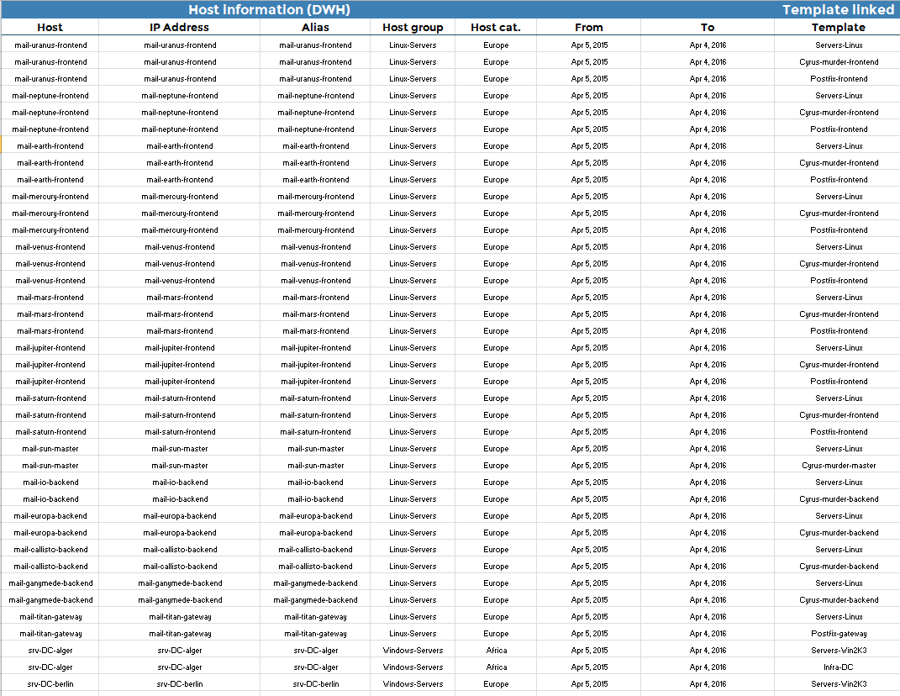

The table below shows the links between host templates:

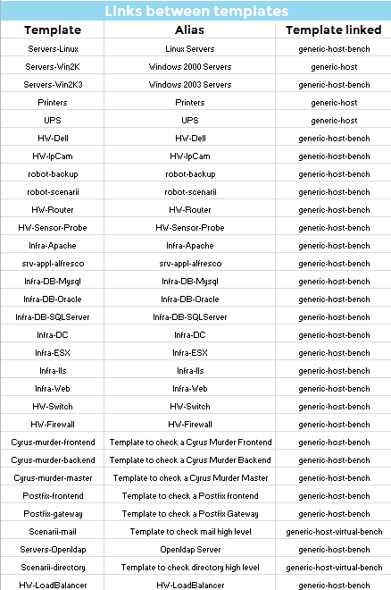

The following table shows the link between service and host templates:

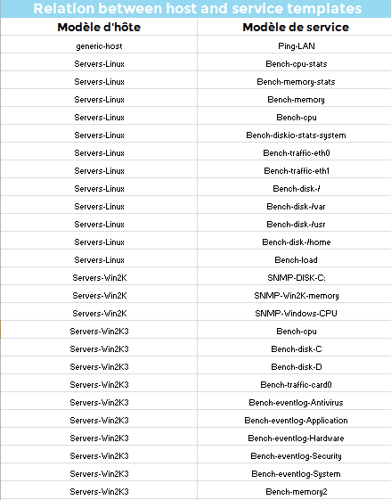

The following table presents an overview of the host templates and their
check and notification properties:

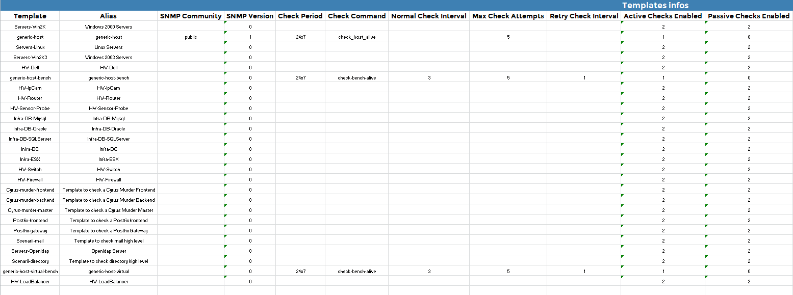

#### Parameters

Parameters required for the report:

 -   The reporting period
 -   The following Centreon objects:

 Parameter         | Parameter type     | Description
-------------------|--------------------|-------------------------
 Hostgroups        | Multi select       | Select host groups. 
 Host Categories   | Multi select       | Select host categories.

### Hostgroups-Service-Templates

#### Description

This report displays information on the services in the reporting
datawarehouse, their parent template, their relationship with groups and
categories, and creation date. You can filter on host groups, host
categories and service categories.

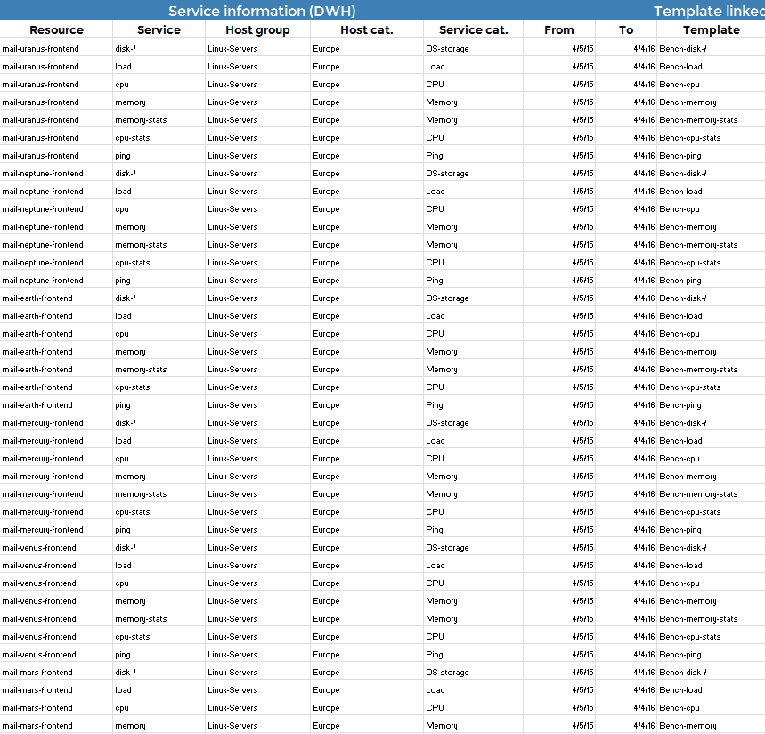

The table below shows the links between host templates:

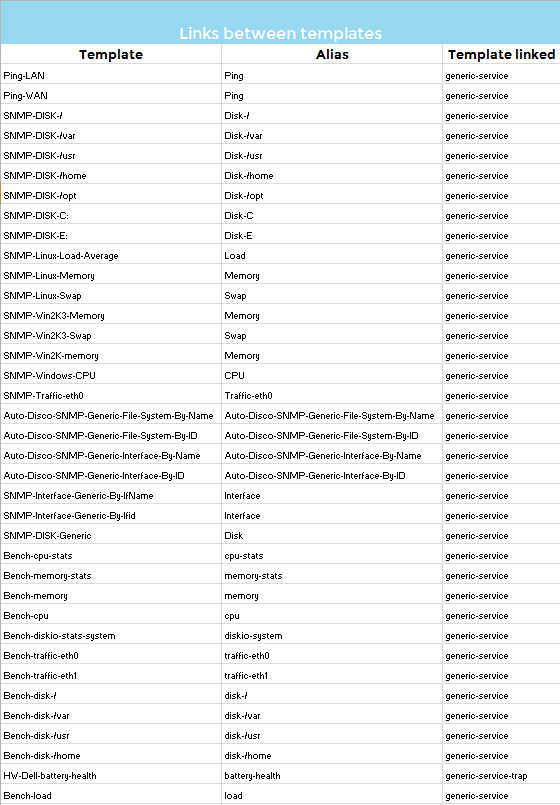

The following table shows the link between host and service templates:

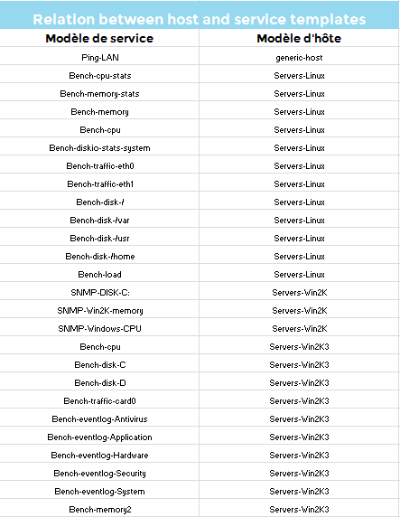

The following table presents an overview of the service templates and
their check and notification properties:

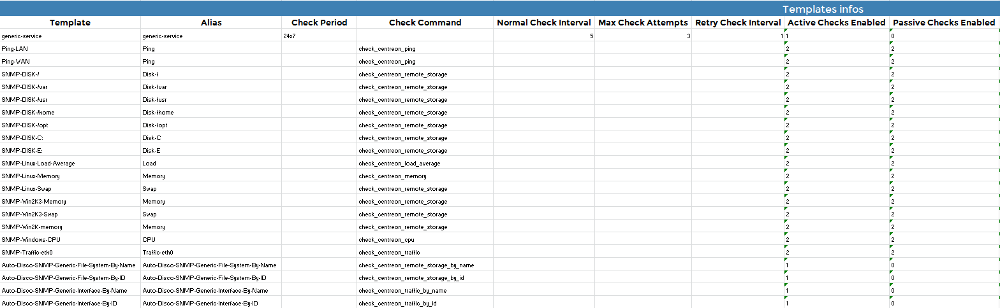

#### Parameters

Parameters expected by the report are:
 
 -   The reporting period
 -   The following Centreon objects:

 Parameter         | Parameter type     | Description
-------------------|--------------------|-------------------------
 Hostgroups        | Multi select       | Select host groups. 
 Host Categories   | Multi select       | Select host categories.
 Service Categories| Multi select       | Select service categories.

### Poller-Performances

#### Description

This report displays information on the configuration and performance of
the Centreon Engine running on a poller.

**How to interpret the report**

The poller name, IP address, version number and state of the engine, and
date of the last restart are displayed in the first part of the report.

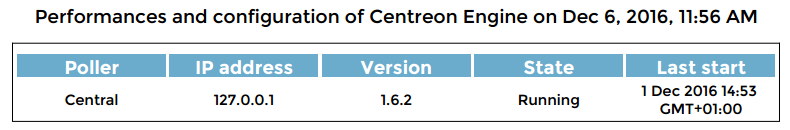

The report then shows the status of the hosts and services monitored by
the poller.

Statistics on latencies and execution times are presented along with the
hosts and services that exceed tolerated thresholds.

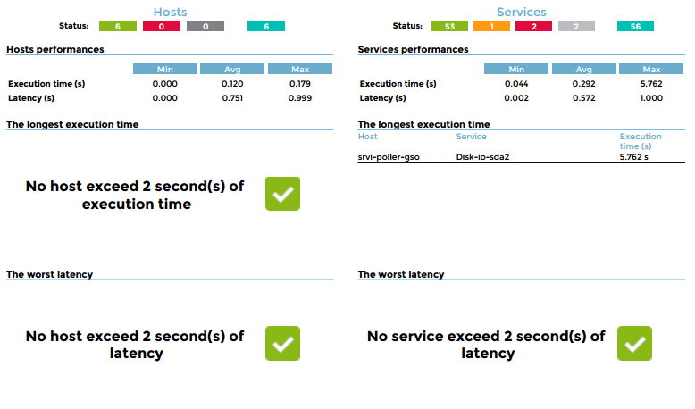

Finally, the report displays the current configuration of the Centreon
Engine and offers tips to optimize it (in case of performance issues).

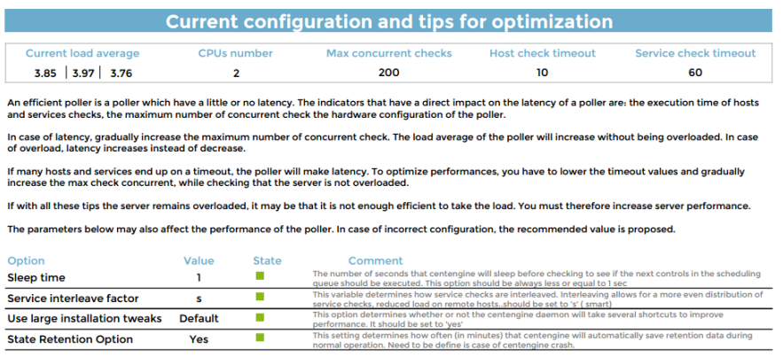

#### Parameters

The data appearing in the report is real-time data.

Parameters required for the report:

 -   The following Centreon objects:

|       Parameter                 |   Type             |   Description                                                                          |
| ------------------------------- | ------------------ | -------------------------------------------------------------------------------------- |
| Select poller(s) for the report | Radio bouton       | Generate the report on the central poller, the remote pollers, or all pollers.         |
| Limit latency (sec)             | Text field         | Specify latency threshold. Hosts / services exceeding the threshold are listed.        |
| Limit exceution time (sec)      | Text field         | Specify execution time threshold. Hosts / services exceeding the threshold are listed. |

#### Prerequisites

The prerequisites for this report are:

-   Monitoring of the load average on the pollers ( metric names should
    be: load1, load5 and load15)
-   Monitoring of the CPU on the poller ( metric names should contain
    *cpu* string with the core number. Example: for a 4 core CPU,
    metrics can be cpu0,cpu1,\...or cpu\_0,cpu\_1,\...

### Hosts-not-classified 

#### Description

This report displays all unclassified hosts. Information is represented
in two tables:

-   One displays all hosts without a host group.
-   The second displays all hosts without a host category.

A host without either a host group or a host category will appear in
both tables.

Any changes to host classification will be appear the day after the
change is made.

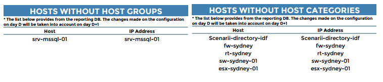

#### Parameters

This report requires no parameters.

#### Prerequisites

None.

### Services-not-classified

#### Description

This report displays all unclassified services. Information is
represented in a table.

Any changes to service classification will be appear the day after the
change is made.

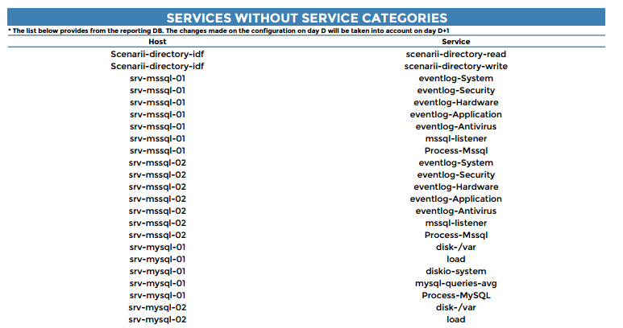

#### Parameters

This report requires no parameters.

#### Prerequisites

None.

## Database diagnostics

### Content-diagnostic

#### Description

This report enables you to check whether availability and performance
data aggregated by days and months are present in the database.

Color coding is used to display data by host group, host category and
time period.

-   Green = a value is available
-   Red = no value is available

> This report does not describe data quality, only data availability.

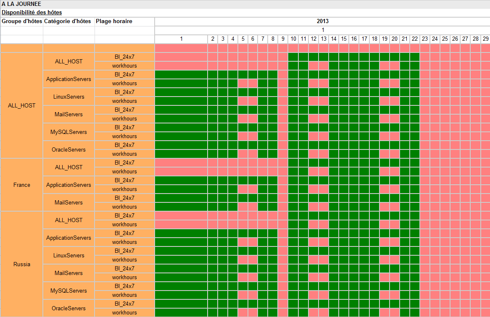

#### Parameters

Parameters required for the report:

-   The reporting period
-   The following Centreon objects:

|  Parameter         |   Parameter type   |   Description                  |
| ------------------ | ------------------ | ------------------------------ |
| Host group         | Multi select       | Select host group.             |
| Service Categories | Multi select       | Select service category.       |
| Host Categories    | Multi select       | Select host category.          |
| Metrics            | Multi select       | Specify metrics for filtering. |

### Content-diagnostic-availability

#### Description

This report provides a calendar view of host availability, displaying
the following information: availability of each host by day,
unavailability and unreachability. This data is shown for each time
period and organized by group and category.

#### Parameters

Parameters required for the report:

-   The reporting period
-   The following Centreon objects:

Parameter           | Parameter type  |     Description  
--------------------|-----------------|----------------------------------------
Host group          | Drop-down list  | Select host group.
Hosts Categories    | Multi select    | Select host categories.

### Content-diagnostic-service-availability

#### Description

This report provides a calendard view of service availability,
displaying the following information: availability for each service by
day, warning time and critical time. This data is shown for each time
period and organized by group, host category and service category.

#### Parameters

Parameters required for the report:

-   The reporting period
-   The following Centreon objects:

Parameter           | Parameter type  |     Description  
--------------------|-----------------|----------------------------------------
Host group          | Drop-down list  | Select host group.
Hosts Categories    | Multi select    | Select host categories.
Service Categories  | Multi select    | Select service categories.

### Content-diagnostic-performance

#### Description

This report provides a calendar view of average values by metrics and
time periods. It also indicates the maximum value reachable for each
metric. Data is organized by group, host and service categories.

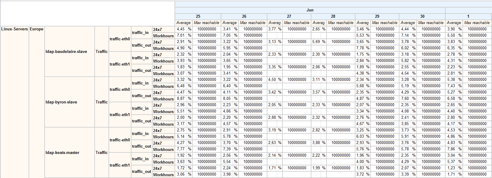

#### Parameters

Parameters required for the report:

> -   The reporting period
> -   The following Centreon objects:

    Parameter       | Parameter type  |     Description  
  ------------------|-----------------|----------------------------------------
  Host group        | Drop-down list  | Select host group.
  Hosts Categories  | Multi select    | Select host categories.
  Service Categories| Multi select    | Select service categories.
  Metrics           | Multi select    | Select metrics to include

### Metric-integrity-check

#### Description

This report checks the compatibility between the plugins/metrics and the
MBI performance reports. It allows you to quickly identify incompatible
services and to update the plugins.

**How to interpret the report**

If a warning is displayed on a line:

-   Warning and Critical thresholds are not set.
-   The maximum value was not returned by the plugin.

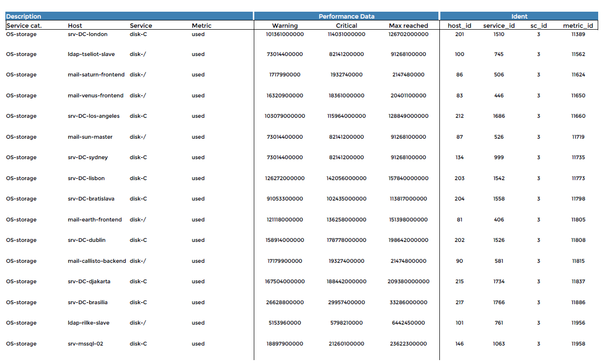

#### Parameters :

Parameters required for the report:

-   The reporting period
-   The following Centreon objects:

Parameter           | Parameter type  |     Description  
--------------------|-----------------|----------------------------------------
Service Categories  | Multi select    | Select service categories.
Metrics             | Multi select    | Select metrics to include

## Report translation

Centreon MBI can generate reports in two languages: English and French.
Other target languages are possible if you create the appropriate
translation files.

Translation files require a .properties extension. They are stored in
the */usr/share/centreon-bi/Resources/translation* directory and
classified by type in subdirectories.

The English-language files are named *xxx.properties* and the French,
*xxx_fr_FR.properties*.

If you need to generate reports in a language other than English or
French, you should make a copy of all *xxx.properties*, giving the files
a suffix corresponding to the locale of your target language.

For example, a German translation requires the file with the suffix
*xxx_de_DE.properties*; for a Spanish translation it would be
*xxx_es_ES.properties*.

Then, translate all the English content in these new files into the
appropriate target language.

> Even if you want to translate only a few reports, you still have to
>translate the global translation files using the method described above.
> These files are:
>
> -   units.properties
> -   calendar.properties
> -   common.properties
> -   master-page.properties

Then translate the file or files for the report family you require.
These files are stored in
`/usr/share/centreon-bi/Resources/translation/component/`.

When the new *xxx.properties* files have been translated, go to your Centreon MBI interface, edit a job then click on the refresh button next to the language selection. The new language should appear in the list.

Select the desired language and generate the report.

> **Warning**
>
> 
> Because certain languages are more verbose than others, translated text
> strings that are excessively long may affect the formatting (design) of
> the report.
