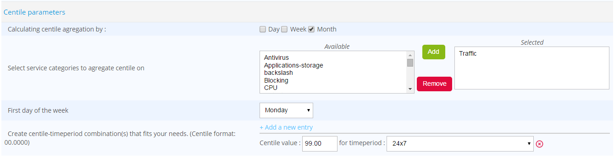

## Availability & events

Availability and event data relate to changes in the state of hosts and
services. These data are used in report designs and by the event and
availability widgets included in Centreon MBI.

There are no special system prerequisites for creating the reports that
use this information, other than a plugin that returns the state. This
section describes basic concepts and calculations needed for using and
analyzing Centreon MBI reports.

### Availability

#### Hosts

A host is considered available when its state is "Up".

To calculate the availability rate the formula is: "Up" duration /
("Up" + "Down" durations)

Additional rules:

-   Time spent in the "Unreachable" state is not considered in the
    calculation of availability.
-   Time spent in "Planned Downtime" is not considered in the
    calculation of availability.

Example: For a report covering one day, if a host is available 23 hours
and unavailable 1 hour out of a 24 hour-period, its availability will be
23 hours / (23 + 1) ~ 95.8%.

#### Services

A service is considered available when its state is "OK" or
"Warning".

To calculate the availability rate the formula is: ("OK" + "Warning"
durations) / ("OK" + "Warning" + "Critical" durations)

Additional rules :

-   Time spent in the "Unknown" state is not considered in the
    calculation of the availability.
-   Time spent in "Planned Downtime" is not considered in the
    calculation of availability.

### Events

Only **validated** events are considered in the calculation of events.
This corresponds to the "HARD" state in Centreon.

In the reports, several message types correspond to different states:

-   Exception: Denotes a "Down" state for a host and a "Critical"
    state for a service.
-   Warning: Denotes a "Warning" state for the services, but there is
    no equivalent for hosts.
-   Information: Any other state.

An event on a host or service is characterized by three values:

-   A start date
-   A end date
-   A state.

### Additional indicators

-   MTRS (Mean Time To Restore Service) pertains to maintainability:
    Average duration of the failure. This indicator should be as low as
    possible.
-   MTBF (Mean Time Between Failure) pertains to reliability: Average
    time between the end of an incident and the beginning of the next.
    This indicator should be as high as possible.
-   MTBSI (Mean Time Between Service Incident): Average time between the
    beginning of two incidents. This indicator should be as high as
    possible.

The diagram below shows the scope of these indicators:

## Extract, Transform, Load (ETL)

### Change history

Centreon MBI logs every change affecting the relationships between,
hosts, services, groups and categories.

Example:

-   Host "H1" is related to host group "G1" in January.
-   Host "H1" no longer belongs to group "G1" as of February 1.
-   After this change, if a report is generated for group "G1" over
    the reporting period of January, the statistics of host "H1" will
    be considered in the statistics of group "G1".
-   The statistics of host "H1" will not be considered for group
    "G1" if the reporting period selected is February.
-   If the reporting periods starts on January 15 and end on February
    15, the statistics of host "H1" will be considered for the
    statistics of group "G1" only from January 15 to January 31.

**The initial Centreon setup and the relationship between objects must
be clearly defined before installing Centreon MBI on a production
platform. Any change to the configuration of a host, group or category
is considered to be a normal part of their lifecycle.**

### Execution modes

The Centreon MBI reporting database or "data warehouse" is updated every
day with aggregated data calculated by the ETL, processing potentially
millions of lines of data on your platform. For this reason the ETL and
data warehouse play a critical role that should be understood.

The ETL operates in **two modes**:

-   **Daily mode**: When up and running, Centreon MBI reporting platform
    normally functions in this mode. Centreon data is imported daily
    into the reporting database, but incrementally. More specifically:

    - data_bin is imported incrementally and aggregations are
    calculated only for the previous day.
    - the entire hoststatevents and servicestatevents tables are
    imported but events are calculated incrementally.

    The update process can take a matter of seconds up to several minutes
    depending on the size of your monitored environment.
    The daily mode is configured in a crontab file located in
    `/etc/cron.d/centreon-bi-engine`:

        30 4 * * * root /usr/share/centreon-bi/bin/centreonBIETL --daily >> /var/log/centreon-bi/centreonBIETL.log 2>&1

> **Warning**
>
> Executing this script multiple times on the same day will cause
> duplication problems.

-   **Rebuild mode**: After installation of the Centreon MBI platform,
    this mode if often used in case of data corruption. You can import
    and calculate statistics over a defined period, or by using the
    **retention parameters**.

    Example:

    /usr/share/centreon-bi/bin/centreonBIETL -r

    To obtain acceptable execution times and manage all the data generated
    by your Centreon platform, the hardware configuration, storage
    capacity and MySQL optimizations are three important points to
    consider when installing Centreon MBI. For recommendations, consult
    the online documentation in the Architecture & Pre-requisites
    chapters.

> We advise you to monitor the reporting database using the procedure
> available in the [Monitoring and procedure](#TODO) chapter. If the ETL does
> not function for several days or the raw data is not up to date, you
> must perform a rebuild for the missing days. The ETL **does not
> automatically** reimport and calculate the missing days. Do not hesitate
> to contact the Centreon support team for assistance.

#### Execution Options

Various parameter options can be passed to the script to execute
specific actions:

    -c  Create the reporting database model.
    -d  Daily execution to calculate statistics on yesterday.
    -r  Rebuild mode to calculate statitics on a historical period. Can be used with:
        Extra arguments for options -d and -r (if none of the following is specified, these one are selected by default: -IDEP):
    -I  Extract data from the monitoring server.
        Extra arguments for option -I:
        -C  Extract only Centreon configuration database only. Works with option -I.
        -i  Ignore perfdata extraction from monitoring server.
        -o  Extract only perfdata from monitoring server.

    -D  Calculate dimensions.
    -E  Calculate event and availability statistics.
    -P  Calculate perfdata statistics.
        Common options for -rIDEP:
        -s  Start date in format YYYY-MM-DD.
            By default, the program uses the data retention period from Centreon MBI configuration.
        -e  End date in format YYYY-MM-DD.
            By default, the program uses the data retention period from Centreon MBI configuration.
        -p  Do not empty statistic tables, delete only entries for the processed period.
            Does not work on raw data tables, only on Centreon MBI statistics tables.

If no "start" or "end" date is given to the ETL script, the start
and end date are automatically calculated using the retention parameters
configured on the interface in General Option > Data retention
Parameter.

#### Performance

If ETL processing seems too long in daily or rebuild mode, you should
consider optimizing your reporting server by:

-   Optimizing the MySQL configuration.
-   Storing the database on a high-performance disk (e.g., with no i/o
    wait time).
-   Adding more physical memory (+ optimize configuration).
-   Not sharing storage or the database with other applications.

### Purge

Data purging can be activated in Centreon MBI General Options to ensure
that the database complies with the retention configuration. You
activate this function through the interface AND in the following cron
on the reporting server: `/etc/cron.d/centreon-bi-purge`.

Reporting dimensions (combination of groups/host
categories/services/metrics) with no relating data are automatically
deleted from the reporting database.

### Centile statistics

To use the "Monthly Network Percentile" report you must activate
centile calculation and storage. Go to the *Reporting > Business
Intelligence > General Options | ETL Tab* page and configure the
subsection "Centile parameters" as described below to create a
relevant centile/timeperiod combination(s). If this report is not
required, simple leave the default values.

  Parameter                                                | Value
  ---------------------------------------------------------|--------------------------
  Calculate centile aggregation                            | Monthly (minimum)
  Select service categories to aggregate centile on        | Select at least one traffic service category
  Set first day of the week                                | Monday (default)
  Create the required centile-time period combination(s)   | Create at least one combination, e.g. 99.0000 - 24x7

See example in the screenshot below:

Only service categories selected in "Reporting perimeter selection"
will appear in the list of service categories available for centile
statistics.

You can create as many centile-time period combinations as you like, but
be advised that this may increase calculation time. Start with a small
number of parameter combinations to determine the impact on calculation
time.

> To generate the centile traffic report on historical data, run the
> following commands. To generate future centile reports (calculated from
> now on), proceed to the next chapter.

On the **reporting** server, run the following command to import the
configuration data:

    /usr/share/centreon-bi/bin/centreonBIETL -rIC

Then, run the following command to update the centile configuration in
the datawarehouse:

    /usr/share/centreon-bi/etl/dimensionsBuilder.pl -d

Finally, run the following command to calculate only the centile
statistics:

    /usr/share/centreon-bi/etl/perfdataStatisticsBuilder.pl -r --centile-only

### How to apply a new configuration to historical data

> This procedure deletes all previously calculated data (and links between
> objects) and recalculates data based on the retention period in the
> latest Centreon configuration.

When implementing Centreon reporting, you may expect to re-execute your
statistical calculations a number of times if the Centreon configuration
changes. When you have finished making changes to groups and categories,
you can run the commands below on the REPORTING server, preferably in
the morning (due to several hours of potential processing time). This
procedure does not include the importing of logs or raw data. Make sure
all data imported from Centreon is up to date on your reporting server
by running the following command:

    #/usr/share/centreon-bi/etl/centreonbiMonitoring.pl --db-content

And make sure "ETL OK - Database is up to date" appears OR that the
following tables are not listed:

-   data_bin
-   hoststatevents
-   servicestateevents

If you run the following set of ETL commands without any start and end
parameters, the calculations will be based on the retention parameter
defined in the Centreon MBI > General Option > Data retention tab
menu. If you are currently installing or testing the product, you may
consider reducing the retention time BEFORE processing and restore the
default value (365 days) AFTER processing. This will help speed up
calculation time.

#### Import the latest Centreon configuration

    #/usr/share/centreon-bi/etl/importData.pl -r --centreon-only

#### Calculate reporting dimensions

This command will erase all previous changes tracked by the reporting
mecanism and include only the latest. If you want to include former
changes, replace the **-r** by **-d**::

    #/usr/share/centreon-bi/etl/dimensionsBuilder.pl -r

#### Aggregate events and availability

    #nohup /usr/share/centreon-bi/etl/eventStatisticsBuilder.pl -r > /var/log/centreon-bi/rebuildAllEvents.log &

#### Aggreggate performance data (storage, traffic, etc.)

    #nohup /usr/share/centreon-bi/etl/perfdataStatisticsBuilder.pl -r > /var/log/centreon-bi/rebuildAllPerf.log &

### How to rebuild missing reporting data

You may require this procedure when the monitoring plugin of your
reporting server returns a state other than "OK". This may appear
during daily processing (e.g., data is not up to date, there is
insufficient space on the reporting server, or processing was manually
interrupted).

The plugin may return a message that your database is not up to date, as
in the following example: :

    # /usr/share/centreon-bi/etl/centreonbiMonitoring.pl --db-content
    [Table mod_bam_reporting, last entry: 2020-07-01 00:00:00] [Table mod_bi_ba_incidents, last entry: 2020-07-01 00:00:00] [Table hoststateevents, last entry: 2020-07-01 00:00:00]
    [Table servicestateevents, last entry: 2020-07-01 00:00:00] [Table mod_bi_hoststateevents, last entry: 2020-07-01 00:00:00]
    [Table mod_bi_servicestateevents, last entry: 2020-07-01 00:00:00] [Table mod_bi_hostavailability, last entry: 2020-07-01 00:00:00]
    [Table mod_bi_serviceavailability, last entry: 2020-07-01 00:00:00] [Table data_bin, last entry: 2020-08-01 00:00:00] [Table mod_bi_metricdailyvalue, last entry: 2020-08-01 00:00:00]
    [Table mod_bi_metrichourlyvalue, last entry: 2020-08-01 23:00:00]

-   When only the **mod_bi_*** tables appear, there is an incident
    with aggregated data and not the Centreon data.

    In this case, **skip the "Import Missing data" section** below.

-   If the following tables appear, a problem has occurred with the raw
    data imported from Centreon:

-   hoststatevents
-   servicestateevents
-   All the mod_bam_reporting* tables
-   data_bin.

First resolve any incidents on the Centreon side before executing the
procedure below.

### Prerequisites

Before running the commands in the procedure below, check that:

-   The Centreon platform is up and running, and data is up to date.
-   The daily cron centreonBIETL is not enabled (it should be commented
    out) on the reporting server in the file
    /etc/cron.d/centreon-bi-engine. It must be enabled at the end of the
    procedure.
-   The script dataRetentionManager.pl is not enabled (also commented
    out) on the reporting server in the file
    /etc/cron.d/centreon-bi-purge. It must be enabled at the end of the
    procedure.
-   Retention is enabled on the interface.
-   Retention is configured for no more than 1024 days.
-   The scripts in /etc/cron.d/centreon-bi-backup-engine are not enabled
    (commented out). They must be enabled at the end of the procedure.

> For the following commands, we advise you to use "screen" or "nohup" to
> prevent disconnection due to timeout.

In the following commands: 

- $date_start$ should be replaced according to the data you want to retrieve (based on retention or starting point of missing data)
- $date_end$ most of the time corresponds to the "today" date 

### Import the missing data

-   Import the data, without the performance data (data_bin table),
    from a specific date according to the Availability retention period
    you defined in `Centreon MBI > Generation Option > Data Retention
    Parameters` :

        #nohup /usr/share/centreon-bi/etl/importData.pl -r -s $date_start$-e $date_end$ --ignore-databin > /var/log/centreon-bi/rebuild_importDataEvents.log &

    *Execution time: fast (minutes)*

-   Import the data from data_bin, starting from the date the last data
    was present in the database. You will find that date next to the
    data_bin table, returned by the plugin: :

        #nohup /usr/share/centreon-bi/etl/importData.pl -r --no-purge --databin-only -s $date_start$ -e $date_end$ > /var/log/centreon-bi/rebuild_importDataBin.log &

    *Execution time: fast (minutes), depending on the number of days imported.*

### Update reporting dimensions

-   Update the dimensions. Using the **"-d"** option keeps the history
    of changes made in the configuration. Avoid using the "-r" option
    or you will have to rebuild all statistics: :

        #nohup /usr/share/centreon-bi/etl/dimensionsBuilder.pl -d > /var/log/centreon-bi/rebuild_dimensions.log &

    *Execution time: fast (seconds or minutes)*

### Rebuild missing events and availability data

-   Rebuild events from a specific date according to the retention
    period defined in Centreon MBI > Generation Option > Data
    Retention Parameters: :

        #nohup /usr/share/centreon-bi/etl/eventStatisticsBuilder.pl -r --events-only > /var/log/centreon-bi/rebuild_events.log &

    *Execution time: Depending on the monitoring perimeter and the
    number of events: several hours but normally not be longer than 24
    hours. In excess of this limit, please contact the Centreon support
    team.*

-   Rebuild the availability tables, starting from the day where the
    last data was present. Check the mod_bi_hostavailability and
    mod_bi_serviceavailability date returned by the plugin for the
    lastest build data:

        #nohup /usr/share/centreon-bi/etl/eventStatisticsBuilder.pl -r --no-purge --availability-only -s $date_start$ -e $date_end$ > /var/log/centreon-bi/rebuild_availability.log &

    *Execution time: From a few minutes to several hours, depending on
    the number of days of rebuild*.

### Rebuild the missing performance data

-   Rebuild the missing performance statistics. Check the earliest date
    next to the mod_bi_metrichourlyvalue and mod_bi_metricdailyvalue
    tables returned by the plugin for the last data calculated: :

        #nohup /usr/share/centreon-bi/etl/perfdataStatisticsBuilder.pl -r --no-purge -s $date_start$ -e $date_end$ > /var/log/centreon-bi/rebuild_perfData.log &

    *Execution time: From a few minutes to several hours, depending on
    the number of days to calculate. If the number of days of rebuild is
    greater than the hourly retention setting, the amount of data
    generated may be voluminous and the rebuild time long.*

### What to do after executing the scripts

-   Case 1 : **The rebuild is performed on the same day**

    Uncomment the lines in `/etc/cron.d/centreon-bi-engine` and
    `/etc/cron.d/centreon-bi-purge` and restart the cron service:

        systemctl restart crond restart

-   Case 2 : **The rebuild finishes the next day**

    -   Uncomment the lines in `/etc/cron.d/centreon-bi-engine` and
     `/etc/cron.d/centreon-bi-purge` and restart the cron service:

            systemctl restart crond restart

    -   Manually execute the daily script:

            /usr/share/centreon-bi/bin/centreonBIETL -d 

-   Case 3 : **In other cases**: Follow the procedure of partial rebuild for the missing days.

    Example:
    The rebuild took 4 days, from January 1 to January 4: You need to follow the procedure from the beginning and use date_start = 01-01 and date_end = 04/01
    The procedure is over, the output of the BI monitoring plugin should be “ETL execution OK, database is up-to-date”.

### Centreon BAM statistics

If you recently updated your Centreon BAM module to 3.0 or rebuilt the
Centreon BAM statistics, you must reimport the BAM data on the reporting
server by running the following command:

    /usr/share/centreon-bi/etl/importData.pl -r --bam-only

This will import all Centreon BAM reporting tables.

If statistics are not up to date, first execute the following command to rebuild statistics & 
then import them using the previous command

    /usr/share/centreon/www/modules/centreon-bam-server/engine/centreon-bam-rebuild-events --all

