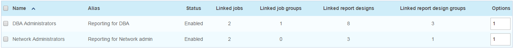
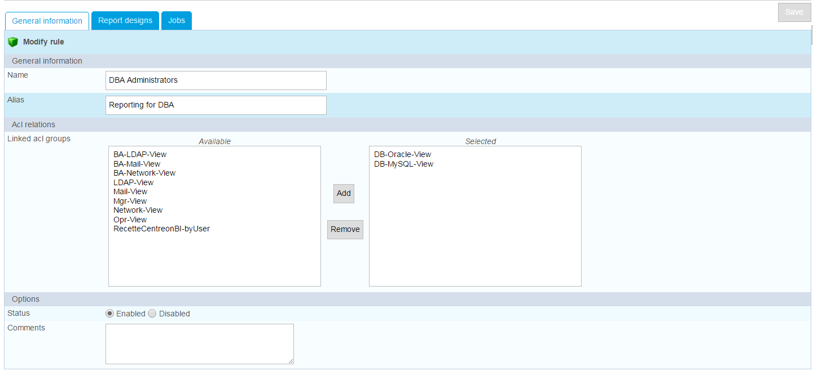
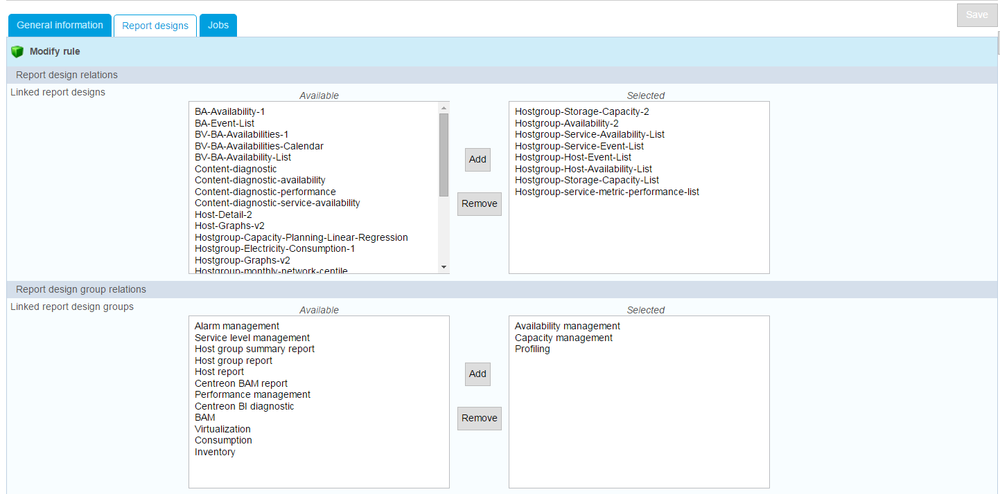
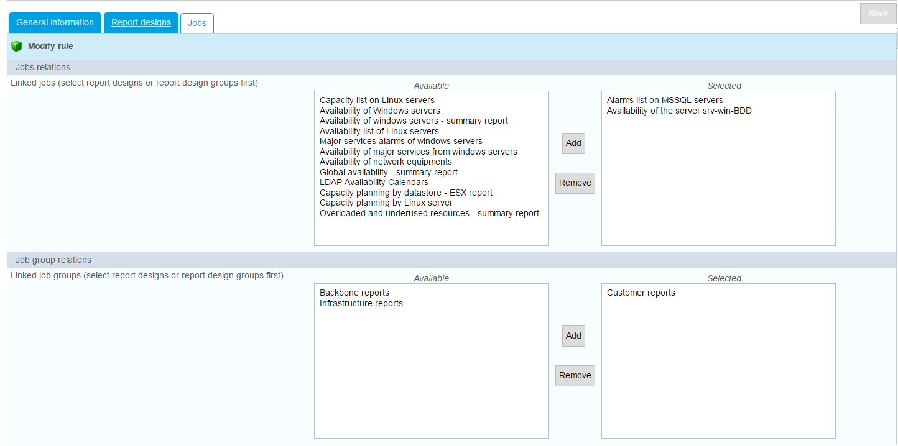
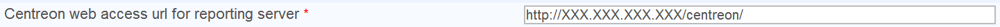
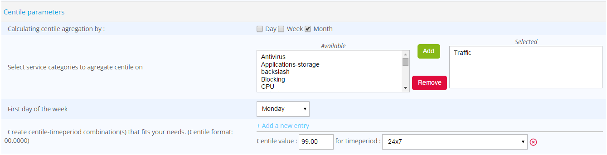

## Jobs & reports access restrictions (ACL)

You can restrict access for generating or viewing reports to specific
groups by configuring the Access Control List (ACL).

The report design filter enables you to:

- Allow access to report design templates when creating a new job.

The job filter enables you to enable a user to:

-   View generated reports ("Report View" page).
-   View jobs, and create and modify them ("Jobs" page).
-   Receive generated reports by e-mail.

To manage Centreon MBI rules, go to the following page: `Administration > ACL > Centreon MBI > ACL Rules

To modify or add a new rule, use this menu, which has three menu tabs:

The "General information" menu shows the pre-defined access groups
that can be linked to a rule.

The "report designs" menu shows the report designs and report design
groups that can be linked to a rule.

The final menu under the "Jobs" tab shows the scheduled jobs that can
be linked to a rule. If no report design has been selected in the
previous menu, no scheduled task will appear here.

> **Important**
> 
> Non-administrator users cannot receive notification for
> reports they are not authorized to view even if they are associated with
> a contact group eligible for notification.
> 
> You can assign read-only access to users on the ACL for viewing the
> content of other Centreon menus. These include:
> 
> - Job groups
> - Report designs
> - Report design groups
> - Logos
> - Publication rules.

We strongly advise against giving a limited user access to the "General
options" page, which would allow him or her to modify the
configuration.

## General Options

Centreon MBI general options are used to configure:

-  Scheduling options for jobs that generate reports
-  Communication between Centreon & the reporting server
-  Notification parameters for Centreon MBI administrators
-  Data to agregate & retention (ETL) 

### Notification options

The reporting engine can notify Centreon MBI administrators by e-mail
after each report generation. The e-mail includes:

-   The direct download links to the reports
-   Log file pertaining to the job that generated the reports.

Centreon MBI administrators can thus be informed if any job fails. This
notification, however, is different from publication by e-mail of the
actual reports sent to specific users. The notification option sends an
e-mail to Centreon MBI administrators containing only the logs of the
job that generated the report.

The notification option parameters can be modified in the menu: 
`Reporting > Business Intelligence > General Options | Notification Options`

Description:

  Row                                           |  Description
  ----------------------------------------------|-------------------------------------------------
  Enable job notification for administrators    |  Enables the default notification system. This option can be disabled for scheduled jobs.
  E-mail from                                   | E-mail sender
  SMTP server                                   | SMTP server address (IP/DNS)
  SMTP port                                     | SMTP port
  Use credential                                | Uses an authentication (yes/no)
  Use SSL                                       | Uses an SSL authentification (yes/no)
  SMTP user                                     | SMTP user account
  SMTP password                                 | Password for SMTP user (*Set this parameter only if you need to update the password*)
  E-mail default title                          | Default subject line for notification e-mail, if no other is specified
  Default E-mail body                           | Default body of notification e-mail, if no other is specified
  Default E-mail footer                         | Default footer of notification e-mail, if no other is specified               
  Centreon main server web protocol             | The protocol used by Centreon web interface (http / https)
  Centreon web URL extension                    |  The Centreon server URL extension (e.g.: /centreon)
  Centreon main server                          | Centreon server address
  Contact groups                                | Centreon MBI administrators contact groups. Leave empty if you do not want to receive a notification after each report is generated.
  Testing notification                          | Enter an e-mail address into this field, then click on "test" to send an e-mail validating your configuration.

### Scheduler options

The following menu allows you to modify the scheduling options of the
reporting engine:

`Reporting > Business Intelligence > General Options | Scheduler options`

#### CBIS properties

The Centreon MBI interface can instantly communicate with the CBIS
reporting engine. It opens a connection on the CBIS listening port to:

-   Alert about the modification or creation of a job.
-   Update the available languages for translation of the reports.
-   Test publication rule configurations.
-   Test the configuration of notifications.

Parameters description:

  Option                    | Description
  --------------------------|--------------------------------------------------------
  CBIS host                 | IP address of server hosting the reporting engine
  CBIS port                 | TCP listening port for CBIS engine
  CBIS connection timeout   | Time limit (in seconds) for connection to the reporting engine          

Any modification of these parameters requires restarting the CBIS daemon

    systemctl restart cbis

#### Report generation scheduling properties

> Description of parameters:

  Option                                                        | Description
  --------------------------------------------------------------|----------------------------------
  All cyclic reports generation hour                            | Hour for generating daily/weekly/monthly reports
  Day of month for the generation of monthly reports            | Day of month for generating monthly reports
  Day of week for the generation of weekly reports              | Day of week for generating weekly reports
  Maximum load allowed to the scheduler for the jobs execution  | Maximum load authorized for running simultaneous jobs

#### Custom report properties

Two reports require access to the Centreon main server to generate RRD
graphs. These reports are:

-   Host-graph-v2
-   Hostgroup-graph-v2.

Fill in the following field specifying the server address:

Any modification of these parameters requires restarting the CBIS
daemon.

The default theme can also be defined in this menu, using the option
"Default report color theme".

### ETL options

*ETL stands for **E**xtract **T**ransform **L**oad*

The ETL integrated in Centreon is used to

-   Synchronize monitoring raw data with the reporting server
-   Calculate availability and performance statistics on the reporting
    server
-   Manage data retention on the reporting server.

It configured at installation and will probably not need any modification later.

Before proceding, you should have read [the best practice parts](#TODO)` to ensure 
that the objects (e.g., groups, categories) are configured according to Centreon MBI requirements.

In the Centreon menu `Reporting > Business Intelligence > General Options > ETL options`, 
specify the following options:

| **Options**                                                                               |   **Values**                           
|-------------------------------------------------------------------------------------------|----------------------------------------
| **General options**                                                                       |                                        |
  Reporting engine uses a dedicated dedicated MariaDB server                                | Yes. You **must** use a reporting server 
  Compatibility mode to use report templates from version of Centreon MBI prior to 1.5.0    | No (deprecated)	
  Temporary file storage directory on reporting server                                      | 	Folder where dumps will be stored on the reporting server
  Type of statistics to build	                                                            | <ul><li>Select “Availability only” if you only use availability reports.</li><li>Select “Performance and capacity only” if you only want to use capacity and performance reports.</li><li>Select “All” to calculate the statistics for both types of reports.</li></ul> |
  Use large memory tweaks (store MariaDB temporary tables in memory)	                      | Activated only if your MariaDB configuration and allocated physical memory on the server permit.
| **Reporting perimeter selection**                                                         |                                         |
  Hostgroups                                                                                | Select only host groups for which you want to aggregate data.
  Hostcategories	                                                                        | Select only host categories for which you want to aggregate data.
  Service categories	                                                                    | Select only service categories for which you want to aggregate data.
|**Availability statistic calculation**                                                     |                                         |
 Live services for availability statistics calculation                                      |   Select required time periods.
| **Performance and capacity statistic calculation**	                                    |                                         | 
 Granularity required for performance data statistics                                       | Select level of granularity required to run the desired performance reports (1).
 Live services for performance data statistics calculation		                            | Select required time periods.
| **Capacity statistic aggregated by month**                                                |                                         |
  Live services for capacity statistics calculation	                                        | Select the “24x7” time period.
  Service categories related to capacity data monitoring	                                | Select the service categories that have been associated with capacity-type services.
  Exclude metrics from service categories that do not return capacity USAGE information	    | Concerns the metrics linked to services which return capacity data. Select the metrics that do not return capacity usage information. but a maximum or total value. (e.g., the metric “size”).
| **Centile parameters (2)**                                                                    |                                         |
 Calculating centile aggregation by	                                                        | Select the desired aggregation level. The standard percentile report provided with BI 2.1 uses Month data.
 Select service categories to aggregate centile on	                                        | Filter on relevant service categories for centile statistics (e.g., Traffic).
 First day of the week	                                                                    | Select the first day of the week for Week aggregation.
 Centile / Timeperiod combination	                                                        | Create a new centile/timeperiod combination on which to perform the calculation.

**(1)** Reports requiring a precise value per hour of performance data
are listed below. If you do not use the following reports, disable the
statistics calculation per hour:

-   Hostgroup-Host-details-1
-   Host-detail-v2
-   Hostgroup-traffic-Average-Usage-By-Interface
-   Hostgroup-traffic-by-Interface-And-Bandwith-Ranges.

**(2)** Centile statistics: To use the "Monthly Network Percentile" report you must activate
centile calculation. Here is an example: 

Only service categories selected in "Reporting perimeter selection"
will appear in the list of service categories available for centile
statistics.

You can create as many centile-time period combinations as you like, **but
we strongly recommand** not having more than 2 or 3 combination* on a small number of metrics 
contained in the category.

### Data retention options

The reporting server contains statistics tables specific to Centreon MBI
in the database "centreon_storage". The storage space used by these
tables increases every day. It is possible to control the size of these
tables by setting data retention rules.

Under *Reporting > Monitoring Business Intelligence > General options > Data retention*, 
data retention can be managed by:

-   Type of data (availability, performance).
-   Precision of data (raw data, hourly, daily or monthly values).

> Before enabling the data retention options, check that the **Reporting
> engine uses a dedicated MariaDB server** option is correctly set to
> "Yes" in the *Reporting > Business Intelligence > General options ETL options* menu.

Enable data retention management by selecting "Yes", then set the
options in the configuration (example below).

To activate automatic purge of old data, edit the cron file
`/etc/cron.d/centreon-bi-purge` on the reporting server, then uncomment the following line:

    #0 20 * * * root @CENTREON_BI_HOME@/*etl*/dataRetentionManager.pl >> @CENTREON_BI_LOG@/dataRetentionManager.log 2>&1

Avoid periods scheduled for statistical calculations with Centreon MBI
ETL and report generations.

You can run this cron daily or weekly, depending on the execution time of the batch and the load generated on the server.

Then restart the service cron:

    systemctl restart crond

**BEST PRACTICE**: Select different retention periods according to the
granularity of the statistical data:

-   Hourly aggregated values are used to analyze a metric over a short period, they take a 
    lot of space on the disk. You may not need to keep these statistics more that two or three months.
-   Beyond five or six months, you may only need to view the trend for
    availability or performance statistics. You could then keep the
    daily aggregated data for a maximum of six months, for example, and
    configure the retention of monthly aggregated data for a period of
    several dozen months.

Please go to the next chapter to continue the installation.

### Report Parameter

This tab enables you to display the dimensions available for a given
user based on ACL restrictions and what was calculated in the data
warehouse.

When updating the groups and categories configuration, make sure to
update the ACL by clicking on "Update ACL resources". This will update
available objects when configuring jobs.

### Reporting Widgets

This menu is used to verify the connection to the reporting database and
edit the connection parameters, which are used to populate the widgets
with data.
