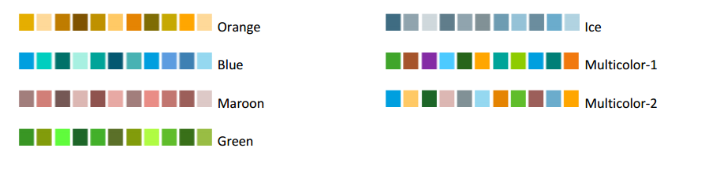

This chapters describes features you need to manipulate to be able to generate & manage reports.

## Jobs

A job is an entity that you configure to be able to generate a report and should be configured in terms of:

- A report design to use 
- Centreon objects (hosts, services, host groups, service groups, business activities, etc.)
- A specific period (last month, current month, yesterday etc.. )

### Job list

The following menu lists jobs according to their state: running,
scheduled, failed, stopped or finished:
`Reporting > Business Intelligence > Configuration > Jobs`

Description of columns:

  Column          |  Description
  ----------------|--------------------------------------------------------------
  Name            | Name of scheduled job
  Report design   | Design to be used for report
  Period          | Period covered for generated report
  Output  format  | Export formats of generated report (PDF, Excel, Powerpoint,CSV, DOC)
  Execution time  | Execution date and time of scheduled job
  Options         | Number of job duplications if the duplication option is selected in the menu "More Actions"

In the "Name" column on the table, an icon is displayed according on
the job state:
  Icon                                                  | Status 
  ------------------------------------------------------|------------------------------------
   | Job stopped
           | Job scheduled
   | Job being executed
         | Job ended (only for a single-use job)
          | Job failed or canceled

#### Search filters

Search filters are available for quick access to jobs:

The "Search" field allows to filter by job name and "Job state" filters by job state.

Description of the different states:

  State       | Description
  ------------|------------------------------------------------------------------
  Scheduled   | Job planned, will be executed
  Running     | Job running, the report is being generated
  Failed      | Job failed
  Stopped     | Job stopped, will not be executed
  Finished    | Job is completed, report has been generated. This state appears only for single jobs. Cyclic jobs return to the "Scheduled" state once the report is generated
  All         | All states displayed

#### Refreshing the job list

The following icons allow you to dynamically update the job list:

 Icon                                                                                                          | Description 
---------------------------------------------------------------------------------------------------------------|-----------------------------------------------------
                                                                | Manually refresh the list and state of  each job. 
     | Start or stop the automatic refresh of the page                               

#### More action menu

The action menu allows you to perform a variety of tasks on one or more
jobs in the list.

The following table describes the different options:

  Action      | Description
  ------------|-------------------------------------------------------------
  Trash       | Sends the selected jobs to the trash.
  Stop        | Stops the selected jobs.
  Reschedule  | Schedules/Runs the selected jobs.
  Duplicate   | Duplicates the selected jobs. All settings and relations will also be duplicated.

### Adding / Editing a job

To generate a report, you need to create a job by clicking on "Add" in the job listing page. The job configuration 
is done in two main steps (tabs):

- Select the report design you want to use (see all the designs available [here](../assets/reporting/Centreon-MBI-Samples-of-Reports.pdf))
- Select the perimeter on which to generate the report 

Two optionals steps (tabs) can be done to :

- Publish the report
- Tune the job  

The following menu is used for adding a new scheduled job:

<!--DOCUSAURUS_CODE_TABS-->

<!--1. Configuration-->

A report generation job *must* be linked to a report design ("Report design").

Several report ouput formats are available:

 - Acrobat PDF
 - Microsoft Excel
 - Microsoft Word
 - Microsoft Powerpoint
 - CSV: Only the first BIRT Data Set of the report can be exported in CSV format. Usually, 
 this format requires a specially designed BIRT report.

Reports can be generated in other languages. Currently available
languages are:

 - French
 - US English

The icon on the right of the selection menu allows you to refresh the
list of available report languages in the case you want to add translation by yourself

#### Scheduling

A job can be executed in 3 different ways: immediately, scheduled for later or in a cyclic way.

**Immediate execution** 

The job will start when saving the form.

**SCHEDULED > One shot** 

**CYCLIC**

This parameter causes the job to run on a daily, weekly or monthly
basis.

For cyclic jobs, the period is calculated automatically according to job
frequency:

 - Daily reports cover the previous day.
 - Weekly reports cover the previous week.
 - Monthly reports cover the previous month.

<!--2. Report parameters-->

The "Report Parameters" menu is used to set the specific parameters for the report design.

This part of the menu changes according to the report design selected
under the "Configuration" tab of the scheduled job.

There are three types of fields in this form:

- Text fields
- Radio buttons
- Selection and multi-selection menus for the following resources:

    - Hosts
    - Metrics
    - Host groups
    - Service groups
    - Service categories
    - Time periods
    - Business groups (Centreon BAM module is required)
    - Business activities (Centreon BAM module is required)
    - Images that will be inserted in the reports (logo for example).

**Note**: A value must be specified for each field in this menu except for the multi-selection 
parameter when metrics are excluded.

By defaut, all metrics will be applied.

<!--3. Report publication (Optional) -->

 Once a report is generated, it can be automatically published using pre-defined rules. When creating
 a job, you can create several rules under the tab "Publication" (refer to 
 the [publication rules section](#TODO) chapter for more information on 
 the various report publication protocols).

<!--4. Tunning (Optional)-->

The "Tuning" menu contains three parameters:

-   **Report color theme:** Color theme management has been implemented,
    allowing you to choose a color palette. Seven default themes are
    available: Maroon, Orange, Blue, Ice, Green, Multicolor-1 and
    Multicolor-2. 

    > Theme color doesn't apply to business activity report

    Available color palettes are:

    

    The default color theme can be changed through the Centreon MBI General
    options menu. For more information, see the General options chapter
    [General options](general_options)

-   **Multiplier coefficient of the scheduled task**: Each report design
    has a weight. A scheduled task can multiply this weight according to
    the parameters used to run the report design. The sum of the weight
    of the running tasks can not exceed the maximum load the reporting
    engine can handle (defined in General Options).
-   **Administrator e-mail notification**: Enable or disable
    notification when scheduled job is generated.

<!--END_DOCUSAURUS_CODE_TABS-->

## Accessing generated reports

After a scheduled job is executed, a new report is generated and then
stored on the **Centreon** server. You can then view or download it
using the following menu `Reporting > Monitoring Business Intelligence > Archives`

The following table lists the reports generated:

  Column                |          Description
  ----------------------|----------------------------------------------------
  Name                  | Name of the report
  Period                | Period in which data was selected to build the statistics
  Date of generation    | Date the report was generated
  Download              | Link for downloading the file

#### Search filters

You can search in any of these criteria:

-   Period: on what period was choosen to generate the report 
-   Date of generation: when was the report generated
-   Frequency (daily, monthly, etc.)
-   Search by job name (applies to the "Name" column)
-   Search by report design

#### Action menu

Use the action menu to move the reports that are no longer needed to the
trash:

## Job groups

Job groups are used to manage user access to reports & mail publication

### Job group list

The following menu lists all job groups available on Centreon MBI: 
`Reporting > Monitoring Business Intelligence > Configuration | Job
groups`

#### More action menu

  Action        |  Description
  --------------|---------------
  - Delete      | Delete group
  - Duplicate   | Duplicate group

### Add / Edit

A job group can be added or modified through the following menu:

Description of menu fields:

  Column      |  Description
  ------------|-------------------------
  Name        |  Job group name
  Description |  Job group description
  Linked job  |  Jobs linked to group

## Report design 

The design of the reports you generate with **Centreon MBI** originate
from ".rptdesign" files, which are created with the open-source tool
Business Intelligence Reporting Tool (BIRT).

For generating a report, a report design should be configured in terms
of:

-   **Centreon** objects (hosts, services, host groups, service groups,
    business activities, etc.)
-   A specific period (monthly report, weekly report, etc.).

Each report design can have a several parameters, which must be defined
in the **Centreon** interface.

### Report design list

The following menu lists the report designs available in Centreon MBI 
`Reporting > Monitoring Business Intelligence > Configuration > Report Design`

Description of the above table:

  Column        | Description
  --------------|---------------------------------------------------------
  Name          | Name of report design
  Description   |  Short description of report design
  State         | Status of report design (Enabled/Disabled)
  Weight        | Report weight: report generation work load index.

### Add / edit

A report design can be edited or a new one can be added if you develop your own reports (using BIRT)

Description of the menu fields:

  Fields                | Description
  ----------------------|--------------------------------------------------------------
  Name                  | Name of report design
  Report Source file    | Name of the ". rptdesign" BIRT file corresponding to the report design. This file is stored in "reports/" directory of "Centreon MBI" installation directory.
  Description           | Short description of report design.
  XML parameters file   | Each report can have several specific parameters. This .xml file defines those parameters.
  Weight                | Report weight: report generation work load index.
  Report design groups  | Report design group linked to report design for ACL management.

> Only Centreon administrators are authorised to edit report designs or
> add a new one. Users without privileges only have read-only access to
> existing report designs.

#### Action menu

The menu "More actions" allows you to perform certain actions on
report designs:

  Action        | Description
  --------------|---------------------------------------------------------
  Trash         |  Move file to trash.
  Activate      | Enable a report design for report generation.
  Deactivate    | Disable a report design for report generation.

## Report design groups 

### Report design group list

The following menu lists all report design groups available on Centreon
MBI `Reporting > Monitoring Business Intelligence > Configuration > Report design groups`

### Add / Edit

The following menu is used for adding or editing a report design group:

  Column                 | Description
  -----------------------|------------------------------------------------
  Name                   | Name of report design group
  Description            | Short description of report design group
  Linked report designs  | Report designs linked to the group

## Logo 

You can store images in the Centreon MBI configuration for reuse in
future reports to be generated. Use the selection menu to incorporate an
image (or logo) into the desired report design.

Regardless of the size of the image (or logo) it must have an aspect
ratio of 4:4 to fit into the required space.

### Image list

The following menu lists all the images available:

Reporting > Business Intelligence > Configuration > Logo

Description of columns:

  Column      | Description
  ------------|-------------------------------------------------
  Name        | Image name
  Preview     | Display loaded image
  Type        | Image format: PNG, JPEG or GIF
  Size        | Image size (width x height)

### Add/Edit images

To add a new image, click on "Add" then fill in the following menu
fields:

Description of fields:

  Column | Description
  -------|----------------------------------------------------
  Name   |      Name of image. No special characters allowed
  Image  |      Image source file

#### Action menu

Use the following menu to delete images from the list. You cannot,
however, delete images already linked to jobs generating reports.

## Trash 

All deleted report designs or scheduled jobs are first sent to the
trash, as a security measure, before being permanently deleted. Use the
following menu to access the trash:

`Reporting > Monitoring Business Intelligence > Administration > Trash`

Properties of the trash:

-   Once in the trash, an element will not appear in any other menu.
-   Scheduling is stopped for all jobs in the trash.
-   Deleting a report design or scheduled job does not cause any linked
    PDF reports to be deleted.

Items can be restored or definitively deleted through this menu:

#### Search filters

The following search filters allow you to search for an item in the
trash:

-   "Search", filter by element name
-   "Object type", filter by element type

